<!-- from: https://www.frozentux.net/iptables-tutorial/iptables-tutorial.html -->

# Iptables Tutorial 1.2.2

### Oskar Andreasson <a id="oskar-andreasson" ></a>

`<[oan@frozentux.net](mailto:oan@frozentux.net)>`

Copyright © 2001-2006 Oskar Andreasson

Permission is granted to copy, distribute and/or modify this document under the terms of the GNU Free Documentation License, Version 1.1; with the Invariant Sections being "Introduction" and all sub-sections, with the Front-Cover Texts being "Original Author: Oskar Andreasson", and with no Back-Cover Texts. A copy of the license is included in the section entitled "GNU Free Documentation License".

All scripts in this tutorial are covered by the GNU General Public License. The scripts are free source; you can redistribute them and/or modify them under the terms of the GNU General Public License as published by the Free Software Foundation, version 2 of the License.

These scripts are distributed in the hope that they will be useful, but WITHOUT ANY WARRANTY; without even the implied warranty of MERCHANTABILITY or FITNESS FOR A PARTICULAR PURPOSE. See the GNU General Public License for more details.

You should have received a copy of the GNU General Public License within this tutorial, under the section entitled "GNU General Public License"; if not, write to the Free Software Foundation, Inc., 59 Temple Place, Suite 330, Boston, MA 02111-1307 USA

# Dedications

I would like to dedicate this document to my wonderful sister, niece and brother-in-law for giving me inspiration and feedback. They are a source of joy and a ray of light when I have need of it. Thank you!

A special word should also be extended to Ninel for always encouraging my writing and for taking care of me when I needed it the most. Thank you!

Second of all, I would like to dedicate this work to all of the incredibly hard working Linux developers and maintainers. It is people like those who make this wonderful operating system possible.

# About the author

The author of the iptables tutorial was born in...

No, jokes aside. At age 8 I got my first computer for christmas present, a Commodore 64 with a C-1541 diskdrive, 8 needle printer and some games etc. It took me several days to even bother. My father managed to put it together and after 2 days he finally learned himself how to load a game and showed how to do it for myself. A life immersed in computers was born this day I guess. I played mostly games at this stage, but did venture into the C-64 basic programming language a couple of times on and off. After some years, I got my hands on an Amiga 500, which was mainly used for games and some school work and fiddling around. Amiga 1200 was next.

Back in 1993-94 My father was clearsighted enough to understand that Amiga was, unfortunately, not the way of the future. PC and i386 computers was. Despite my screams in vain he bought me a PC, 486 50MHz with 16 MB of ram, Compaq computer. This was actually one of the worst computer designs I have ever seen, everything was integrated, including speakers and CRT screen. I guess they where trying to mimic the Apple designs of the day, but failing miserably to do so. It should be noted though, that this was the computer that got me really into computers. I started coding for real, started using the Internet and actually installed Linux on this machine.

I have for a long time been an avid Linux user and administrator. My Linux experience started in 1994 with a slackware installation from borrowed CD's. This first installation was mostly a trial installation. I had no previous experience and it took me quite some time to get modems running et cetera, and I kept running a dual boot system. The second installation, circa 1996, I had no media around so I winded up downloading the whole slackware A, AP, D and N disksets via FTP on a 28k8 modem. Since I realized I would never learn anything from using graphical interfaces, I went back to basics. Nothing but console, no X11 or graphics except for svgalib. In the end, I believe this has helped me a lot. I believe there is nothing to teach you how to use something as to actually forcing yourself to do it, as I did at this time. I had no choice but to learn. I continued running like this for close to 2 years. After this, I finally installed XFree86 from scratch. After an 24 hour compilation, I realized that I had totally misconfigured the compilation and had to restart the compilation from scratch. As a human, you are always bound to do errors. It simply happens and you better get used to it. Also, this kind of build process teaches you to be patient. Let things have its time and don't force it.

In 2000-2001 I was part of a small group of people who ran a newssite mainly focusing on Amiga related news, but also some Linux and general computer news. The site was called BoingWorld, located at www.boingworld.com (no long available unfortunately). The Linux 2.3 kernels where reaching their end of line and the 2.4 kernels where starting to pop up. At this point, I realized there was a half-new concept of firewalling inside of it. Sure I had run into ipfwadm and ipchains before and used it to some extent, but never truly gone heads first into it. I also realized there was embaerassingly little documentation and I felt it might be an interesting idea to write an iptables tutorial for boingworld. Said and done, I wrote the first 5-10 pages of what you are currently reading. Becoming a smashing hit, I continued to add material to the tutorial. The original pages are no longer anywhere to be found in this tutorial/documentation, but the concept lives on.

I have worked several different companies during this time with Linux/network administration, writing documentation and course material, helped several hundred, if not thousand, people emailing questions regarding iptables and netfilter and general networking questions. I have attended two CERTconf's and held three presentations at the same conference, and also the Netfilter workshop 2003. It has been an hectic and sometimes very ungrateful job to maintain and update this work, but in the end I am very happy for it and this is something I am very proud of having done. At the time of writing this in end of 2006, the project has been close to dead for several years, and I regret this. I hope to change this in the coming years, and that a lot of people will find this work to be of future use, possibly adding to the family of documents with other interesting documentation that might be needed.

# How to read

This document could either be read as a reference or from start to end. It was originally written as a small introduction to iptables and to some extent netfilter, but this focus has changed over the years. It aims at being an as complete reference as possibly to iptables and netfilter and to at least give a basic and fast primer or repetition to the areas that you might need to understand. It should be noted that this document will not, nor will it be able to, deal with specific bugs inside or outside the scope of iptables and netfilter, nor does it really deal with how to get around bugs like this.

If you find peculiar bugs or behaviors in iptables or any of the subcomponents, you should contact the Netfilter mailing lists and tell them about the problem and they can tell you if this is a real bug or if it has already been fixed. There are security related bugs found in iptables and Netfilter, one or two do slip by once in a while, it's inevitable. These are properly shown on the front page of the [Netfilter main page](http://www.netfilter.org), and that is where you should go to get information on such topics.

The above also implies that the rule-sets available with this tutorial are not written to deal with actual bugs inside Netfilter. The main goal of them is to simply show how to set up rules in a nice simple fashion that deals with all problems we may run into. For example, this tutorial will not cover how we would close down the HTTP port for the simple reason that Apache happens to be vulnerable in version 1.2.12 (This is covered really, though not for that reason).

This document was written to give everyone a good and simple primer at how to get started with iptables, but at the same time it was created to be as complete as possible. It does not contain any targets or matches that are in patch-o-matic for the simple reason that it would require too much effort to keep such a list updated. If you need information about the patch-o-matic updates, you should read the info that comes with it in patch-o-matic as well as the other documentations available on the [Netfilter main page](http://www.netfilter.org).

If you have any suggestions on additions or if you think you find any problems around the area of iptables and netfilter not covered in this document feel free to contact me about this. I will be more than happy to take a look at it and possibly add what might be missing.

# Prerequisites

This document requires some previous knowledge about Linux/Unix, shell scripting, as well as how to compile your own kernel, and some simple knowledge about the kernel internals.

I have tried as much as possible to eradicate all prerequisites needed before fully grasping this document, but to some extent it is simply impossible to not need some previous knowledge.

# Conventions used in this document

The following conventions are used in this document when it comes to commands, files and other specific information.

- Long code excerpts and command-outputs are printed like shown below. This includes screendumps and larger examples taken from the console.

```console
$ ls
default  eth0  lo
$
```

- All commands and program names in the tutorial are shown in bold typeface. This includes all the commands that you might type, or part of the command that you type.

- All system items such as hardware, and also kernel internals or abstract system items such as the loopback interface are all shown in an italic typeface.

- computer output is formatted in this way in the text. Computer output could be summed up as all the output that the computer will give you on the console.

- filenames and paths in the file-system are shown like `/usr/local/bin/iptables`.

# Chapter 1. Introduction

## Why this document was written <a id="why-this-document-was-written" ></a>

Well, I found a big empty space in the HOWTO's out there lacking in information about the iptables and Netfilter functions in the new Linux 2.4.x kernels. Among other things, I'm going to try to answer questions that some might have about the new possibilities like state matching. Most of this will be illustrated with an example _rc.firewall.txt_ file that you can use in your `/etc/rc.d/` scripts. Yes, this file was originally based upon the masquerading HOWTO for those of you who recognize it.

Also, there's a small script that I wrote just in case you screw up as much as I did during the configuration available as _rc.flush-iptables.txt_.

## How it was written <a id="how-it-was-written" ></a>

I originally wrote this as a very small tutorial for boingworld.com, which was an Amiga/Linux/General newssite that a small group of people, including me, ran a couple of years back. Due to the fantastic amount of readers and comments that I got from it, I continued to write on it. The original version was approximately 10-15 A4 pages in printed version and has since been growing slowly but steadily. A huge amount of people has helped me out, spellchecking, bug corrections, etc. At the time of writing this, the https://www.frozentux.net/iptables-tutorial/ site has had over 600.000 unique hits alone.

This document was written to guide you through the setup process step by step and hopefully help you to understand some more about the iptables package. I have based most of the stuff here on the example rc.firewall file, since I found that example to be a good way to learn how to use iptables. I decided to just follow the basic chain structure and from there walk through each and one of the chains traversed and explain how the script works. That way the tutorial is a little bit harder to follow, though this way is more logical. Whenever you find something that's hard to understand, just come back to this tutorial.

## Terms used in this document <a id="terms-used-in-this-document" ></a>

This document contains a few terms that may need more detailed explanations before you read them. This section will try to cover the most obvious ones and how I have chosen to use them within this document.

- **Connection** - This is generally referred to in this document as a series of packets relating to each other. These packets refer to each other as an established kind of connection. A connection is in another word a series of exchanged packets. In TCP, this mainly means establishing a connection via the 3-way handshake, and then this is considered a connection until the release handshake.

- **DNAT** - Destination Network Address Translation. DNAT refers to the technique of translating the Destination IP address of a packet, or to change it simply put. This is used together with SNAT to allow several hosts to share a single Internet routable IP address, and to still provide Server Services. This is normally done by assigning different ports with an Internet routable IP address, and then tell the Linux router where to send the traffic.

- **IPSEC** - Internet Protocol Security is a protocol used to encrypt IPv4 packets and sending them securely over the Internet. For more information on IPSEC, look in the _Other resources and links_ appendix for other resources on the topic.

- **Kernel space** - This is more or less the opposite of User space. This implies the actions that take place within the kernel, and not outside of the kernel.

- **Packet** - A singular unit sent over a network, containing a header and a data portion. For example, an IP packet or an TCP packet. In Request For Comments (RFC's) a packet isn't so generalized, instead IP packets are called datagrams, while TCP packets are called segments. I have chosen to call pretty much everything packets in this document for simplicity.

- **QoS** - Quality of Service is a way of specifying how a packet should be handled and what kind of service quality it should receive while sending it. For more information on this topic, take a look in the _TCP/IP repetition_ chapter as well as the _Other resources and links_ appendix for external resources on the subject.

- **Segment** - A TCP segment is pretty much the same as an packet, but a formalized word for a TCP packet.

- **Stream** - This term refers to a connection that sends and receives packets that are related to each other in some fashion. Basically, I have used this term for any kind of connection that sends two or more packets in both directions. In TCP this may mean a connection that sends a SYN and then replies with an SYN/ACK, but it may also mean a connection that sends a SYN and then replies with an ICMP Host unreachable. In other words, I use this term very loosely.

- **SNAT** - Source Network Address Translation. This refers to the techniques used to translate one source address to another in a packet. This is used to make it possible for several hosts to share a single Internet routable IP address, since there is currently a shortage of available IP addresses in IPv4 (IPv6 will solve this).

- **State** - This term refers to which state the packet is in, either according to _RFC 793 - Transmission Control Protocol_ or according to userside states used in Netfilter/iptables. Note that the used states internally, and externally, do not follow the RFC 793 specification fully. The main reason is that Netfilter has to make several assumptions about the connections and packets.

- **User space** - With this term I mean everything and anything that takes place outside the kernel. For example, invoking `iptables -h` takes place outside the kernel, while `iptables -A FORWARD -p tcp -j ACCEPT` takes place (partially) within the kernel, since a new rule is added to the ruleset.

- **Userland** - See User space.

- **VPN** - Virtual Private Network is a technique used to create virtually private networks over non-private networks, such as the Internet. IPSEC is one technique used to create VPN connections. OpenVPN is another.

## What's next? <a id="whats-next" ></a>

This chapter has given some small insight into why this document was written and how it was written. It also explained some common terms used throughout the document.

The next chapter will bring up a rather lengthy introduction and repetition to TCP/IP. Basically this means the IP protocol and some of its sub-protocols that are commonly used with iptables and netfilter. These are TCP, UDP, ICMP and SCTP. SCTP is a rather new standard in comparison to the other protocols, hence quite a lot of space and time has gone into describing this protocol for all of those who are still not quite familiar with it. The next chapter will also discuss some basic and more advanced routing techniques used today.

# Chapter 2. TCP/IP repetition

Iptables is an extremely knowledge intensive tool. This means that iptables takes quite a bit of knowledge to be able to use iptables to it's full extent. Among other things, you must have a very good understanding of the TCP/IP protocol.

This chapter aims at explaining the pure "must understands" of TCP/IP before you can go on and work with iptables. Among the things we will go through are the IP, TCP, UDP and ICMP protocols and their headers, and general usages of each of these protocols and how they correlate to each other. Iptables works inside Internet and Transport layers, and because of that, this chapter will focus mainly on those layers as well.

Iptables is also able to work on higher layers, such as the Application layer. However, it was not built for this task, and should not be used for that kind of usage. I will explain more about this in the _IP filtering introduction_ chapter.

## TCP/IP Layers <a id="tcp-ip-layers" ></a>

TCP/IP is, as already stated, multi-layered. This means that we have one functionality running at one depth, and another one at another level, etcetera. The reason that we have all of these layers is actually very simple.

The biggest reason is that the whole architecture is very extensible. We can add new functionality to the application layers, for example, without having to reimplement the whole TCP/IP stack code, or to include a complete TCP/IP stack into the actual application. Just the same way as we don't need to rewrite every single program, every time that we make a new network interface card. Each layer should need to know as little as possible about each other, to keep them separated.

  <js-ext-div class="" data-type="note">
  
When we are talking about the programming code of TCP/IP which resides inside the kernel, we are often talking about the TCP/IP stack. The TCP/IP stack simply means all of the sublayers used, from the Network access layer and all the way up to the Application layer.

  </js-ext-div>

There are two basic architectures to follow when talking about layers. One of them is the OSI (Open Systems Interconnect) Reference Model and consists of 7 layers. We will only look at it superficially here since we are more interested in the TCP/IP layers. However, from an historical point, this is interesting to know about, especially if you are working with lots of different types of networks. The layers are as follows in the [OSI Reference Model](#OSIREFERENCE) list.

<js-ext-div class="" data-type="note">

There is some discussion as to which of these reference models is mostly used, but it seems that the OSI reference model still is the prevalent reference model. This might also depend on where you live, however, in most US and EU countries it seems as you can default to OSI reference model while speaking to technicians and salespeople.

However, throughout the rest of this document, we will mainly refer to the TCP/IP reference model, unless otherwise noted.

</js-ext-div>

1. Application layer

2. Presentation layer

3. Session layer

4. Transport layer

5. Network layer

6. Data Link layer

7. Physical layer

A packet that is sent by us, goes from the top and to the bottom of this list, each layer adding its own set of _headers_ to the packet in what we call the encapsulation phase. When the packet finally reaches it's destination the packet goes backwards through the list and the headers are stripped out of the packet, one by one, each header giving the destination host all of the needed information for the packet data to finally reach the application or program that it was destined for.

The second and more interesting layering standard that we are more interested in is the TCP/IP protocol architecture, as shown in the [TCP/IP architecture](#TCPIPLAYERS.LIST) list. There is no universal agreement among people on just how many layers there are in the TCP/IP architecture. However, it is generally considered that there are 3 through 5 layers available, and in most pictures and explanations, there will be 4 layers discussed. We will, for simplicities sake, only consider those four layers that are generally discussed.

1. Application layer

2. Transport layer

3. Internet layer

4. Network Access layer

As you can see, the architecture of the TCP/IP protocol set is very much like the OSI Reference Model, but yet not. Just the same as with the OSI Reference Model, we add and subtract headers for each layer that we enter or leave.

For example, lets use one of the most common analogies to modern computer networking, the snail-mail letter. Everything is done in steps, just as is everything in TCP/IP.

You want to send a letter to someone asking how they are, and what they are doing. To do this, you must first create the data, or questions. The actual data would be located inside the Application layer.

After this we would put the data written on a sheet of paper inside an envelope and write on it to whom the letter is destined for within a specific company or household. Perhaps something like the example below:

Attn: John Doe

This is equivalent to the the Transport layer, as it is known in TCP/IP. In the Transport layer, if we were dealing with TCP, this would have been equivalent to some port (e.g., port 25).

At this point we write the address on the envelope of the recipient, such as this:

V. Andersgardsgatan 2 41715 Gothenburg

This would in the analogy be the same as the Internet layer. The internet layer contains information telling us where to reach the recipient, or host, in a TCP/IP network. Just the same way as the recipient on an envelope. This would be the equivalent of the IP address in other words (e.g., IP 192.168.0.4).

The final step is to put the whole letter in a postbox. Doing this would approximately equal to putting a packet into the Network Access Layer. The network access layer contains the functions and routines for accessing the actual physical network that the packet should be transported over.

When the receiver finally receives the letter, he will open the whole letter from the envelope and address etc (decapsulate it). The letter he receives may either require a reply or not. In either case, the letter may be replied upon by the receiver, by reversing the receiver and transmitter addresses on the original letter he received, so that receiver becomes transmitter, and transmitter becomes receiver.

  <js-ext-div class="" data-type="note">
  
It is very important to understand that iptables was and is specifically built to work on the headers of the Internet and the Transport layers. It is possible to do some very basic filtering with iptables in the Application and Network access layers as well, but it was not designed for this, nor is it very suitable for those purposes.

For example, if we use a string match and match for a specific string inside the packet, lets say get /index.html. Will that work? Normally, yes. However, if the packet size is very small, it will not. The reason is that iptables is built to work on a _per packet_ basis, which means that if the string is split into several separate packets, iptables will not see that whole string. For this reason, you are much, much better off using a proxy of some sort for filtering in the application layer. We will discuss these problems in more detail later on in the _IP filtering introduction_.

  </js-ext-div>

As iptables and netfilter mainly operate in the Internet and Transport layers, that is the layers that we will put our main focus in, in the upcoming sections of this chapter. Under the Internet layer, we will almost exclusively see the IP protocol. There are a few additions to this, such as, for example, the GRE protocol, but they are very rare on the internet. Also, iptables is (as the name implies) not focused around these protocols very well either. Because of all these factors we will mainly focus around the IP protocol of the Internet layer, and TCP, UDP and ICMP of the Transport layer.

  <js-ext-div class="" data-type="note">
  
The ICMP protocol is actually sort of a mix between the two layers. It runs in the Internet layer, but it has the exact same headers as the IP protocol, but also a few extra headers, and then directly inside that encapsulation, the data. We will discuss this in more detail further on, in the _ICMP characteristics_.

  </js-ext-div>

## IP characteristics <a id="ip-characteristics" ></a>

The IP protocol resides in the Internet layer, as we have already said. The IP protocol is the protocol in the TCP/IP stack that is responsible for letting your machine, routers, switches and etcetera, know where a specific packet is going. This protocol is the very heart of the whole TCP/IP stack, and makes up the very foundation of everything in the Internet.

The IP protocol encapsulates the Transport layer packet with information about which Transport layer protocol it came from, what host it is going to, and where it came from, and a little bit of other useful information. All of this is, of course, extremely precisely standardized, down to every single bit. The same applies to every single protocol that we will discuss in this chapter.

The IP protocol has a couple of basic functionalities that it must be able to handle. It must be able to define the datagram, which is the next building block created by the transport layer (this may in other words be TCP, UDP or ICMP for example). The IP protocol also defines the Internet addressing system that we use today. This means that the IP protocol is what defines how to reach between hosts, and this also affects how we are able to route packets, of course.

The addresses we are talking about are what we generally call an IP address. Usually when we talk about IP addresses, we talk about dotted quad numbers (e.g., _`127.0.0.1`_). This is mostly to make the IP addresses more readable for the human eye, since the IP address is actually just a 32 bit field of 1's and 0's (_`127.0.0.1`_ would hence be read as _`01111111000000000000000000000001`_ within the actual IP header).

The IP protocol has even more magic it must perform up it's sleeve. It must also be able to decapsulate and encapsulate the IP datagram (IP data) and send or receive the datagram from either the Network access layer, or the transport layer. This may seem obvious, but sometimes it is not. On top of all this, it has two big functions it must perform as well, that will be of quite interest for the firewalling and routing community.

The IP protocol is responsible for routing packets from one host to another, as well as packets that we may receive from one host destined for another. Most of the time on single network access host, this is a very simple process. You have two different options, either the packet is destined for our locally attached network, or possibly through a default gateway. but once you start working with firewalls or security policies together with multiple network interfaces and different routes, it may cause quite some headache for many network administrators.

The last of the responsibilities for the IP protocol is that it must fragment and reassemble any datagram that has previously been fragmented, or that needs to be fragmented to fit in to the packetsize of this specific network hardware topology that we are connected to. If these packet fragments are sufficiently small, they may cause a horribly annoying headache for firewall administrators as well. The problem is, that once they are fragmented to small enough chunks, we will start having problems to read even the headers of the packet, not to mention the actual data.

<js-ext-div class="" data-type="note">

As of Linux kernel 2.4 series, and iptables, this should no longer be a problem for most linux firewalls. The connection tracking system used by iptables for state matching and NAT'ing etc must be able to read the packet defragmented. Because of this, conntrack automatically defragments all packets before they reach the netfilter/iptables structure in the kernel.

</js-ext-div>

The IP protocol is also a connectionless protocol, which in turn means that IP does not "negotiate" a connection. a connection-oriented protocol on the other hand negotiates a connection (called a _handshake_) and then when all data has been sent, tears it down. TCP is an example of this kind of protocol, however, it is implemented on top of the IP protocol. The reason for not being connection-oriented just yet are several, but among others, a handshake is not required at this time yet since there are other protocols that this would add an unnecessarily high overhead to, and that is made up in such a way that if we don't get a reply, we know the packet was lost somewhere in transit anyways, and resend the original request. As you can see, sending the request and then waiting for a specified amount of time for the reply in this case, is much preferred over first sending one packet to say that we want to open a connection, then receive a packet letting us know it was opened, and finally acknowledge that we know that the whole connection is actually open, and _then_ actually send the request, and after that send another packet to tear the connection down and wait for another reply.

IP is also known as an _unreliable protocol_, or simply put it does not know if a packet was received or not. It simply receives a packet from the transport layer and does its thing, and then passes it on to the network access layer, and then nothing more to it. It may receive a return packet, which traverses from network access layer to the IP protocol which does it's thing again, and then passes it on upwards to the Transport layer. However, it doesn't care if it gets a reply packet, or if the packet was received at the other end. Same thing applies for the unreliability of IP as for the connectionless-ness, since unreliability would require adding an extra reply packet to each packet that is sent. For example, let us consider a DNS lookup. As it is, we send a DNS request for servername.com. If we never receive a reply, we know something went wrong and re-request the lookup, but during normal use we would send out one request, and get one reply back. Adding reliability to this protocol would mean that the request would require two packets (one request, and one confirmation that the packet was received) and then two packets for the reply (one reply, and one reply to acknowledge the reply was received). In other words, we just doubled the amount of packets needed to send, and almost doubled the amount of data needed to be transmitted.

## IP headers <a id="ip-headers" ></a>

The IP packet contains several different parts in the header as you have understood from the previous introduction to the IP protocol. The whole header is meticuluously divided into different parts, and each part of the header is allocated as small of a piece as possible to do it's work, just to give the protocol as little overhead as possible. You will see the exact configuration of the IP headers in the _IP headers_ image.

  <js-ext-div class="" data-type="note">
  
Understand that the explanations of the different headers are very brief and that we will only discuss the absolute basics of them. For each type of header that we discuss, we will also list the proper RFC's that you should read for further understanding and technical explanations of the protocol in question.

As a sidenote to this note, RFC stands for Request For Comments, but these days, they have a totally different meaning to the Internet community. They are what defines and standardises the whole Internet, compared to what they were when the researchers started writing RFC's to each other. Back then, they were simply requests for comments and a way of asking other researchers about their opinions.

  </js-ext-div>

The IP protocol is mainly described in _RFC 791 - Internet Protocol_. However, this RFC is also updated by _RFC 1349 - Type of Service in the Internet Protocol Suite_, which was obsoleted by _RFC 2474 - Definition of the Differentiated Services Field (DS Field) in the IPv4 and IPv6 Headers_, and which was updated by _RFC 3168 - The Addition of Explicit Congestion Notification (ECN) to IP_ and _RFC 3260 - New Terminology and Clarifications for Diffserv_.

  <js-ext-div class="" data-type="note">

As you can see, all of these standards can get a little bit hard to follow at times. One tip for finding the different RFC's that are related to each other is to use the search functions available at _RFC-editor.org_. In the case of IP, consider that the RFC 791 is the basic RFC, and all of the other are simply updates and changes to that standard. We will discuss these more in detail when we get to the specific headers that are changed by these newer RFC's.

One thing to remember is, that sometimes, an RFC can be obsoleted (not used at all). Normally this means that the RFC has been so drastically updated and that it is better to simply replace the whole thing. It may also become obsolete for other reasons as well. When an RFC becomes obsoleted, a field is added to the original RFC that points to the new RFC instead.

  </js-ext-div>

<js-ext-figure class="js-illustration">

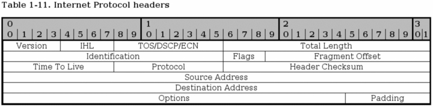
<js-ext-figcaption></js-ext-figcaption>

</js-ext-figure>

- **Version** - bits 0-3. This is a version number of the IP protocol in binary. IPv4 iscalled 0100, while IPv6 is called 0110. This field is generally not used for filtering very much. The version described in RFC 791 is IPv4.

- **IHL (Internet Header Length)** - bits 4-7. This field tells us how long the IP header is in 32 bit words. As you can see, we have split the header up in this way (32 bits per line) in the image as well. Since the Options field is of optional length, we can never be absolutely sure of how long the whole header is, without this field. The minimum length of this of the header is 5 words.

- **Type of Service, DSCP, ECN** - bits 8-15. This is one of the most complex areas of the IP header for the simple reason that it has been updated 3 times. It has always had the same basic usage, but the implementation has changed several times. First the field was called the Type of Service field. Bit [0-2] of the field was called the Precedence field. Bit [3] was Normal/Low delay, Bit [4] was Normal/High throughput, Bit [5] was Normal/High reliability and bit [6-7] was reserved for future usage.

      This is still used in a lot of places with older hardware, and it still causes some problems for the Internet. Among other things, bit [6-7] are specified to be set to 0. In the ECN updates (RFC 3168, we start using these reserved bits and hence set other values than 0 to these bits. But a lot of old firewalls and routers have built in checks looking if these bits are set to 1, and if the packets do, the packet is discarded. Today, this is clearly a violation of RFC's, but there is not much you can do about it, except to complain.

      The second iteration of this field was when the field was changed into the DS field as defined in RFC 2474. DS stands for Differentiated Services. According to this standard bits [0-5] is Differentiated Services Code Point (DSCP) and the remaining two bits [6-7] are still unused. The DSCP field is pretty much used the same as in how the ToS field was used before, to mark what kind of service this packet should be treated like if the router in question makes any difference between them. One big change is that a device must ignore the unused bits to be fully RFC 2474 compliant, which means we get rid of the previous hassle as explained previously, as long as the device creators follow this RFC.

      The third, and almost last, change of the ToS field was when the two, previously, unused bits were used for ECN (Explicit Congestion Notification), as defined in RFC 3168. ECN is used to let the end nodes know about a routers congestion, before it actually starts dropping packets, so that the end nodes will be able to slow down their data transmissions, before the router actually needs to start dropping data. Previously, dropping data was the only way that a router had to tell that it was overloaded, and the end nodes had to do a slow restart for each dropped packet, and then slowly gather up speed again. The two bits are named ECT (ECN Capable Transport) and CE (Congestion Experienced) codepoints.

      The final iteration of the whole mess is RFC 3260 which gives some new terminology and clarifications to the usage of the DiffServ system. It doesn't involve too many new updates or changes, except in the terminology. The RFC is also used to clarify some points that were discussed between developers.

- **Total Length** - bits 16 - 31. This field tells us how large the packet is in octets, including headers and everything. The maximum size is 65535 octets, or bytes, for a single packet. The minimum packet size is 576 bytes, not caring if the packet arrives in fragments or not. It is only recommended to send larger packets than this limit if it can be guaranteed that the host can receive it, according to RFC 791. However, these days most networks runs at 1500 byte packet size. This includes almost all ethernet connections, and most Internet connections.

- **Identification** - bits 32 - 46. This field is used in aiding the reassembly of fragmented packets.

- **Flags** - bits 47 - 49. This field contains a few miscellaneous flags pertaining to fragmentation. The first bit is reserved, but still not used, and must be set to 0. The second bit is set to 0 if the packet may be fragmented, and to 1 if it may not be fragmented. The third and last bit can be set to 0 if this was the last fragment, and 1 if there are more fragments of this same packet.

- **Fragment Offset** - bits 50 - 63. The fragment offset field shows where in the datagram that this packet belongs. The fragments are calculated in 64 bits, and the first fragment has offset zero.

- **Time to live** - bits 64 - 72. The TTL field tells us how long the packet may live, or rather how many "hops" it may take over the Internet. Every process that touches the packet must remove one point from the TTL field, and if the TTL reaches zero, the whole packet must be destroyed and discarded. This is basically used as a safety trigger so that a packet may not end up in an uncontrollable loop between one or several hosts. Upon destruction the host should return an ICMP Time exceeded message to the sender.

- **Protocol** - bits 73 - 80. In this field the protocol of the next level layer is indicated. For example, this may be TCP, UDP or ICMP among others. All of these numbers are defined by the _Internet Assigned Numbers Authority_. All numbers can befound on their homepage _Internet Assigned Numbers Authority_.

- **Header checksum** - bits 81 - 96. This is a checksum of the IP header of the packet.This field is recomputed at every host that changes the header, which means pretty much every host that the packet traverses over, since they most often change the packets TTL field or some other.

- **Source address** - bits 97 - 128. This is the source address field. It is generally written in 4 octets, translated from binary to decimal numbers with dots in between. That is for example, 127.0.0.1. The field lets the receiver know where the packet came from.

- **Destination address** - bits 129 - 160. The destination address field contains the destination address, and what a surprise, it is formatted the same way as the source address.

- **Options** - bits 161 - 192 <> 478. The options field is not optional, as it may sound. Actually, this is one of the more complex fields in the IP header. The options field contains different optional settings within the header, such as Internet timestamps, SACK or record route route options. Since these options are all optional, the Options field can have different lengths, and hence the whole IP header. However, since we always calculate the IP header in 32 bit words, we must always end the header on an even number, that is the multiple of 32. The field may contain zero or more options.

The options field starts with a brief 8 bit field that lets us know which options are used in the packet. The options are all listed in the _TCP Options_ table, in the _TCP options_ appendix. For more information about the different options, read the proper RFC's. For an updated listing of the IP options, check at _Internet Assigned Numbers Authority_.

- **Padding** - bits variable. This is a padding field that is used to make the header end at an even 32 bit boundary. The field must always be set to zeroes straight through to the end.

## TCP characteristics <a id="tcp-characteristics" ></a>

The TCP protocol resides on top of the IP protocol. It is a stateful protocol and has built-in functions to see that the data was received properly by the other end host. The main goals of the TCP protocol is to see that data is reliably received and sent, that the data is transported between the Internet layer and Application layer correctly, and that the packet data reaches the proper program in the application layer, and that the data reaches the program in the right order. All of this is possible through the TCP headers of the packet.

The TCP protocol looks at data as an continuous data stream with a start and a stop signal. The signal that indicates that a new stream is waiting to be opened is called a SYN three-way handshake in TCP, and consists of one packet sent with the SYN bit set. The other end then either answers with SYN/ACK or SYN/RST to let the client know if the connection was accepted or denied, respectively. If the client receives an SYN/ACK packet, it once again replies, this time with an ACK packet. At this point, the whole connection is established and data can be sent. During this initial handshake, all of the specific options that will be used throughout the rest of the TCP connection is also negotiated, such as ECN, SACK, etcetera.

While the datastream is alive, we have further mechanisms to see that the packets are actually received properly by the other end. This is the reliability part of TCP. This is done in a simple way, using a Sequence number in the packet. Every time we send a packet, we give a new value to the Sequence number, and when the other end receives the packet, it sends an ACK packet back to the data sender. The ACK packet acknowledges that the packet was received properly. The sequence number also sees to it that the packet is inserted into the data stream in a good order.

Once the connection is closed, this is done by sending a FIN packet from either end-point. The other end then responds by sending a FIN/ACK packet. The FIN sending end can then no longer send any data, but the other end-point can still finish sending data. Once the second end-point wishes to close the connection totally, it sends a FIN packet back to the originally closing end-point, and the other end-point replies with a FIN/ACK packet. Once this whole procedure is done, the connection is torn down properly.

As you will also later see, the TCP headers contain a checksum as well. The checksum consists of a simple hash of the packet. With this hash, we can with rather high accuracy see if a packet has been corrupted in any way during transit between the hosts.

## TCP headers <a id="tcp-headers" ></a>

The TCP headers must be able to perform all of the tasks above. We have already explained when and where some of the headers are used, but there are still other areas that we haven't touched very deeply at. Below you see an image of the complete set of TCP headers. It is formatted in 32 bit words per row, as you can see.

<js-ext-figure class="js-illustration">

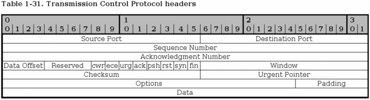
<js-ext-figcaption></js-ext-figcaption>

</js-ext-figure>

- **Source port** - bit 0 - 15. This is the source port of the packet. The source port was originally bound directly to a process on the sending system. Today, we use a hash between the IP addresses, and both the destination and source ports to achieve this uniqueness that we can bind to a single application or program.

- **Destination port** - bit 16 - 31. This is the destination port of the TCP packet. Just as with the source port, this was originally bound directly to a process on the receiving system. Today, a hash is used instead, which allows us to have more open connections at the same time. When a packet is received, the destination and source ports are reversed in the reply back to the originally sending host, so that destination port is now source port, and source port is destination port.

- **Sequence Number** - bit 32 - 63. The sequence number field is used to set a number on each TCP packet so that the TCP stream can be properly sequenced (e.g., the packets winds up in the correct order). The Sequence number is then returned in the ACK field to ackonowledge that the packet was properly received.

- **Acknowledgment Number** - bit 64 - 95. This field is used when we acknowledge a specific packet a host has received. For example, we receive a packet with one Sequence number set, and if everything is okey with the packet, we reply with an ACK packet with the Acknowledgment number set to the same as the original Sequence number.

- **Data Offset** - bit 96 - 99. This field indicates how long the TCP header is, and where the Data part of the packet actually starts. It is set with 4 bits, and measures the TCP header in 32 bit words. The header should always end at an even 32 bit boundary, even with different options set. This is possible thanks to the Padding field at the very end of the TCP header.

- **Reserved** - bit 100 - 103. These bits are reserved for future usage. In RFC 793 this also included the CWR and ECE bits. According to RFC 793 bit 100-105 (i.e., this and the CWR and ECE fields) must be set to zero to be fully compliant. Later on, when we started introducing ECN, this caused a lot of troubles because a lot of Internet appliances such as firewalls and routers dropped packets with them set. This is still true as of writing this.

- **CWR** - bit 104. This bit was added in RFC 3268 and is used by ECN. CWR stands for Congestion Window Reduced, and is used by the data sending part to inform the receiving part that the congestion window has been reduced. When the congestion window is reduced, we send less data per timeunit, to be able to cope with the total network load.

- **ECE** - bit 105. This bit was also added with RFC 3268 and is used by ECN. ECE stands for ECN Echo. It is used by the TCP/IP stack on the receiver host to let the sending host know that it has received an CE packet. The same thing applies here, as for the CWR bit, it was originally a part of the reserved field and because of this, some networking appliances will simply drop the packet if these fields contain anything else than zeroes. This is actually still true for a lot of appliances unfortunately.

- **URG** - bit 106. This field tells us if we should use the Urgent Pointer field or not. If set to 0, do not use Urgent Pointer, if set to 1, do use Urgent pointer.

- **ACK** - bit 107. This bit is set to a packet to indicate that this is in reply to another packet that we received, and that contained data. An Acknowledgment packet is always sent to indicate that we have actually received a packet, and that it contained no errors. If this bit is set, the original data sender will check the Acknowledgment Number to see which packet is actually acknowledged, and then dump it from the buffers.

- **PSH** - bit 108. The PUSH flag is used to tell the TCP protocol on any intermediate hosts to send the data on to the actual user, including the TCP implementation on the receiving host. This will push all data through, unregardless of where or how much of the TCP Window that has been pushed through yet.

- **RST** - bit 109. The RESET flag is set to tell the other end to tear down the TCP connection. This is done in a couple of different scenarios, the main reasons being that the connection has crashed for some reason, if the connection does not exist, or if the packet is wrong in some way.

- **SYN** - bit 110. The SYN (or Synchronize sequence numbers) is used during the initial establishment of a connection. It is set in two instances of the connection, the initial packet that opens the connection, and the reply SYN/ACK packet. It should never be used outside of those instances.

- **FIN** - bit 111. The FIN bit indicates that the host that sent the FIN bit has no more data to send. When the other end sees the FIN bit, it will reply with a FIN/ACK. Once this is done, the host that originally sent the FIN bit can no longer send any data. However, the other end can continue to send data until it is finished, and will then send a FIN packet back, and wait for the final FIN/ACK, after which the connection is sent to a CLOSED state.

- **Window** - bit 112 - 127. The Window field is used by the receiving host to tell the sender how much data the receiver permits at the moment. This is done by sending an ACK back, which contains the Sequence number that we want to acknowledge, and the Window field then contains the maximum accepted sequence numbers that the sending host can use before he receives the next ACK packet. The next ACK packet will update accepted Window which the sender may use.

- **Checksum** - bit 128 - 143. This field contains the checksum of the whole TCP header. It is a one's complement of the one's complement sum of each 16 bit word in the header. If the header does not end on a 16 bit boundary, the additional bits are set to zero. While the checksum is calculated, the checksum field is set to zero. The checksum also covers a 96 bit pseudoheader containing the Destination-, Source-address, protocol, and TCP length. This is for extra security.

- **Urgent Pointer** - bit 144 - 159. This is a pointer that points to the end of the data which is considered urgent. If the connection has important data that should be processed as soon as possible by the receiving end, the sender can set the URG flag and set the Urgent pointer to indicate where the urgent data ends.

- **Options** - bit 160 - \*\*. The Options field is a variable length field and contains optional headers that we may want to use. Basically, this field contains 3 subfields at all times. An initial field tells us the length of the Options field, a second field tells us which options are used, and then we have the actual options. A complete listing of all the TCP Options can be found in _TCP options_.

- **Padding** - bit \*\*. The padding field pads the TCP header until the whole header ends at a 32-bit boundary. This ensures that the data part of the packet begins on a 32-bit boundary, and no data is lost in the packet. The padding always consists of only zeros.

## UDP characteristics <a id="udp-characteristics" ></a>

The User Datagram Protocol (UDP) is a very basic and simple protocol on top of the IP protocol. It was developed to allow for very simple data transmission without any error detection of any kind, and it is stateless. However, it is very well fit for query/response kind of applications, such as for example DNS, et cetera, since we know that unless we get a reply from the DNS server, the query was lost somewhere.

Sometimes it may also be worth using the UDP protocol instead of TCP, such as when we want only error/loss detection but don't care about sequencing of the packets. This removes some overhead that comes from the TCP protocol. We may also do the other thing around, make our own protocol on top of UDP that only contains sequencing, but no error or loss detection.

The UDP protocol is specified in _RFC 768 - User Datagram Protocol_. It is a very short and brief RFC, which fits a simple protocol like this very well.

## UDP headers <a id="udp-headers" ></a>

The UDP header can be said to contain a very basic and simplified TCP header. It contains destination-, source-ports, header length and a checksum as seen in the image below.

<js-ext-figure class="js-illustration">

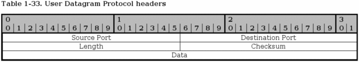
<js-ext-figcaption></js-ext-figcaption>

</js-ext-figure>

- **Source port** - bit 0-15. This is the source port of the packet, describing where a reply packet should be sent. This can actually be set to zero if it doesn't apply. For example, sometimes we don't require a reply packet, and the packet can then be set to source port zero. In most implementations, it is set to some port number.

- **Destination port** - bit 16-31. The destination port of the packet. This is required for all packets, as opposed to the source port of a packet.

- **Length** - bit 32-47. The length field specifies the length of the whole packet in octets, including header and data portions. The shortest possible packet can be 8 octets long.

- **Checksum** - bit 48-63. The checksum is the same kind of checksum as used in the TCP header, except that it contains a different set of data. In other words, it is a one's complement of the one's complement sum of parts of the IP header, the whole UDP header, theUDP data and padded with zeroes at the end when necessary.

## ICMP characteristics <a id="icmp-characteristics" ></a>

ICMP messages are used for a basic kind of error reporting between host to host, or host to gateway. Between gateway to gateway, a protocol called Gateway to Gateway protocol (GGP) should normally be used for error reporting. As we have already discussed, the IP protocol is not designed for perfect error handling, but ICMP messages solves some parts of these problems. The big problem from one standpoint is that the headers of the ICMP messages are rather complicated, and differ a little bit from message to message. However, this will not be a big problem from a filtering standpoint most of the time.

The basic form is that the message contains the standard IP header, type, code and a checksum. All ICMP messages contains these fields. The type specifies what kind of error or reply message this packet is, such as for example destination unreachable, echo, echo reply, or redirect message. The code field specifies more information, if necessary. If the packet is of type destination unreachable, there are several possible values on this code field such as network unreachable, host unreachable, or port unreachable. The checksum is simply a checksum for the whole packet.

As you may have noticed, I mentioned the IP header explicitly for the ICMP packet. This was done since the actual IP header is an integral part of the ICMP packet, and the ICMP protocol lives on the same level as the IP protocol in a sense. ICMP does use the IP protocol as if it where a higher level protocol, but at the same time not. ICMP is an integral part of IP, and ICMP must be implemented in every IP implementation.

## ICMP headers <a id="icmp-headers" ></a>

As already explained, the headers differs a little bit from ICMP type to ICMP type. Most of the ICMP types are possible to group by their headers. Because of this, we will discuss the basic header form first, and then look at the specifics for each group of types that should be discussed.

<js-ext-figure class="js-illustration">

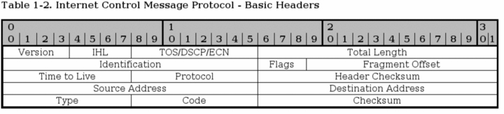
<js-ext-figcaption></js-ext-figcaption>

</js-ext-figure>

All packets contain some basic values from the IP headers discussed previously in this chapter. The headers have previously been discussed at some length, so this is just a short listing of the headers, with a few notes about them.

- **Version** - This should always be set to 4.

- **Internet Header Length** - The length of the header in 32 bit words.

- **Type of Service** - See above. This should be set to 0, as this is the only legit setting according to _RFC 792 - Internet Control Message Protocol_.

- **Total Length** - Total length of the header and data portion of the packet, counted in octets.

- **Identification , Flags and Fragment offsets** - Ripped from the IP protocol.

- **Time To Live** - How many hops this packet will survive.

- **Protocol** - which version of ICMP is being used (should always be 1).

- **Header Checksum** - See the IP explanation.

- **Source Address** - The source address from whom the packet was sent. This is not entirely true, since the packet can have another source address, than that which is located on the machine in question. The ICMP types that can have this effect will be noted if so.

- **Destination Address** - The destination address of the packet.

There are also a couple of new headers that are used by all of the ICMP types. The new headers are as follows, this time with a few more notes about them:

- **Type** - The type field contains the ICMP type of the packet. This is always different from ICMP type to type. For example ICMP Destination Unreachable packets will have a type 3 set to it. For a complete listing of the different ICMP types, see the _ICMP types_ appendix. This field contains 8 bits total.

- **Code** - All ICMP types can contain different codes as well. Some types only have a single code, while others have several codes that they can use. For example, the ICMP Destination Unreachable (type 3) can have at least code 0, 1, 2, 3, 4 or 5 set. Each code has a different meaning in that context then. For a complete listing of the different codes, see the _ICMP types_ appendix. This field is 8 bits in length, total. We will discuss the different codes a little bit more in detail for each type later on in this section.

- **Checksum** - The Checksum is a 16 bit field containing a one's complement of the ones complement of the headers starting with the ICMP type and down. While calculating the checksum, the checksum field should be set to zero.

At this point the headers for the different packets start to look different also. We will describe the most common ICMP Types one by one, with a brief discussion of its headers and different codes.

### ICMP Echo Request/Reply <a id="icmp-echo-request-reply" ></a>

<js-ext-figure class="js-illustration">

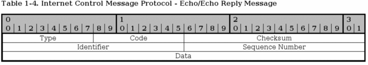
<js-ext-figcaption></js-ext-figcaption>

</js-ext-figure>

I have chosen to speak about both the reply and the request of the ICMP echo packets here since they are so closely related to each other. The first difference is that the echo request is type 8, while echo reply is type 0. When a host receives a type 8, it replies with a type 0.

When the reply is sent, the source and destination addresses switch places as well. After both of those changes has been done, the checksum is recomputed, and the reply is sent. There is only one code for both of these types, they are always set to 0.

- **Identifier** - This is set in the request packet, and echoed back in the reply, to be able to keep different ping requests and replies together.

- **Sequence number** - The sequence number for each host, generally this starts at 1 and is incremented by 1 for each packet.

The packets also contains a data part. Per default, the data part is generally empty, but it can contain a userspecified amount of random data.

### ICMP Destination Unreachable <a id="icmp-destination-unreachable" ></a>

<js-ext-figure class="js-illustration">

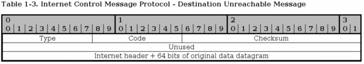
<js-ext-figcaption></js-ext-figcaption>

</js-ext-figure>

The first three fields seen in the image are the same as previously described. The Destination Unreachable type has 16 basic codes that can be used, as seen below in the list.

- **Code 0 - Network unreachable** - Tells you if a specific network is currently unreachable.

- **Code 1 - Host unreachable** - Tells you if a specific host is currently unreachable.

- **Code 2 - Protocol unreachable** - This code tells you if a specific protocol (tcp, udp, etc) can not be reached at the moment.

- **Code 3 - Port unreachable** - If a port (ssh, http, ftp-data, etc) is not reachable, you will get this message.

- **Code 4 - Fragmentation needed and DF set** - If a packet needs to be fragmented to be delivered, but the Do not fragment bit is set in the packet, the gateway will return this message.

- **Code 5 - Source route failed** - If a source route failed for some reason, this message is returned.

- **Code 6 - Destination network unknown** - If there is no route to a specific network, this message is returned.

- **Code 7 - Destination host unknown** - If there is no route to a specific host, this message is returned.

- **Code 8 - Source host isolated (obsolete)** - If a host is isolated, this message should be returned. This code is obsoleted today.

- **Code 9 - Destination network administratively prohibited** - If a network was blocked at a gateway and your packet was unable to reach it because of this, you should get this ICMP code back.

- **Code 10 - Destination host administratively prohibited** - If you where unable to reach a host because it was administratively prohibited (e.g., routing administration), you will get this message back.

- **Code 11 - Network unreachable for TOS** - If a network was unreachable because of a _bad_ TOS setting in your packet, this code will be generated as a return packet.

- **Code 12 - Host unreachable for TOS** - If your packet was unable to reach a host because of the TOS of the packet, this is the message you get back.

- **Code 13 - Communication administratively prohibited by filtering** - If the packet was prohibited by some kind of filtering (e.g., firewalling), we get a code 13 back.

- **Code 14 - Host precedence violation** - This is sent by the first hop router to notify a connected host, to notify the host that the used precedence is not permitted for a specific destination/source combination.

- **Code 15 - Precedence cutoff in effect** - The first hop router may send this message to a host if the datagram it received had a too low precedence level set in it.

On top of this, it also contains a small "data" part, which should be the whole Internet header (IP header) and 64 bits of the original IP datagram. If the next level protocol contains any ports, etc, it is assumed that the ports should be available in the extra 64 bits.

### Source Quench <a id="source-quench" ></a>

<js-ext-figure class="js-illustration">


<js-ext-figcaption></js-ext-figcaption>

</js-ext-figure>

A source quench packet can be sent to tell the originating source of a packet or stream of packets to slow down when continuing to send data. Note that gateway or destination host that the packets traverses can also be quiet and silently discard the packets, instead of sending any source quench packets.

This packet contains no extra header except the data portion, which contains the internet header plus 64 bits of the original data datagram. This is used to match the source quench message to the correct process, which is currently sending data through the gateway or to the destination host.

All source quench packets have their ICMP types set to 4. They have no codes except 0.

<js-ext-div class="" data-type="note">

Today, there are a couple of new possible ways of notifying the sending and receiving host that a gateway or destination host is overloaded. One way for example is the ECN (Explicit Congestion Notification) system.

</js-ext-div>

### Redirect <a id="redirect" ></a>

<js-ext-figure class="js-illustration">

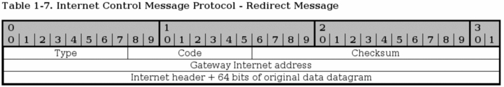
<js-ext-figcaption></js-ext-figcaption>

</js-ext-figure>

The ICMP Redirect type is sent in a single case. Consider this, you have a network (192.168.0.0/24) with several clients and hosts on it, and two gateways. One gateway to a 10.0.0.0/24 network, and a default gateway to the rest of the Internet. Now consider if one of the hosts on the 192.168.0.0/24 network has no route set to 10.0.0.0/24, but it has the default gateway set. It sends a packet to the default gateway, which of course knows about the 10.0.0.0/24 network. The default gateway can deduce that it is faster to send the packet directly to the 10.0.0.0/24 gateway since the packet will enter and leave the gateway on the same interface. The default gateway will hence send out a single ICMP Redirect packet to the host, telling it about the real gateway, and then sending the packet on to the 10.0.0.0/24 gateway. The host will now know about the closest 10.0.0.0/24 gateway, and hopefully use it in the future.

The main header of the Redirect type is the Gateway Internet Address field. This field tells the host about the proper gateway, which should really be used. The packet also contains the IP header of the original packet, and the 64 first bits of data in the original packet, which is used to connect it to the proper process sending the data.

The Redirect type has 4 different codes as well, these are the following.

- **Code 0 - Redirect for network** - Only used for redirects for a whole network (e.g., the example above).

- **Code 1 - Redirect for host** - Only used for redirects of a specific host (e.g., a host route).

- **Code 2 - Redirect for TOS and network** - Only used for redirects of a specific Type of Service and to a whole network. Used as code 0, but also based on the TOS.

- **Code 3 - Redirect for TOS and host** - Only used for redirects of a specific Type of Service and to a specific host. Used as code 1, but also based on the TOS in other words.

### TTL equals 0 <a id="ttl-equals-0" ></a>

<js-ext-figure class="js-illustration">

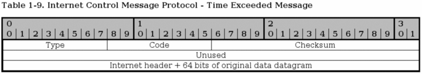
<js-ext-figcaption></js-ext-figcaption>

</js-ext-figure>

The TTL equals 0 ICMP type is also known as Time Exceeded Message and has type 11 set to it, and has 2 ICMP codes available. If the TTL field reaches 0 during transit through a gateway or fragment reassembly on the destination host, the packet must be discarded. To notify the sending host of this problem, we can send a TTL equals 0 ICMP packet. The sender can then raise the TTL of outgoing packets to this destination if necessary.

The packet only contains the extra data portion of the packet. The data field contains the Internet header plus 64 bits of the data of the IP packet, so that the other end may match the packet to the proper process. As previously mentioned, the TTL equals 0 type can have two codes.

- **Code 0 - TTL equals 0 during transit** - This is sent to the sending host if the original packet TTL reached 0 when it was forwarded by a gateway.

- **Code 1 - TTL equals 0 during reassembly** - This is sent if the original packet was fragmented, and TTL reached 0 during reassembly of the fragments. This code should only be sent from the destination host.

### Parameter problem <a id="parameter-problem" ></a>

<js-ext-figure class="js-illustration">

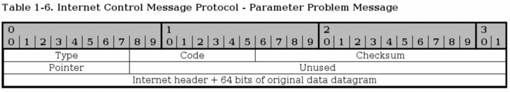
<js-ext-figcaption></js-ext-figcaption>

</js-ext-figure>

The parameter problem ICMP uses type 12 and it has 2 codes that it uses as well. Parameter problem messages are used to tell the sending host that the gateway or receiving host had problems understanding parts of the IP headers such as errors, or that some required options where missing.

The parameter problem type contains one special header, which is a pointer to the field that caused the error in the original packet, if the code is 0 that is. The following codes are available:

- **Code 0 - IP header bad (catchall error)** - This is a catchall error message as discussed just above. Together with the pointer, this code is used to point to which part of the IP header contained an error.

- **Code 1 - Required options missing** - If an IP option that is required is missing, this code is used to tell about it.

### Timestamp request/reply <a id="timestamp-request-reply" ></a>

<js-ext-figure class="js-illustration">

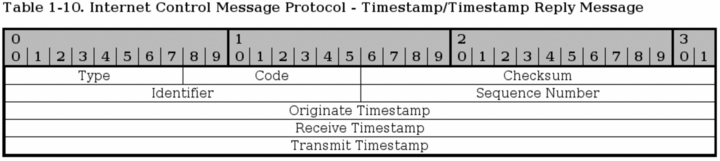
<js-ext-figcaption></js-ext-figcaption>

</js-ext-figure>

The timestamp type is obsolete these days, but we bring it up briefly here. Both the reply and the request has a single code (0). The request is type 13 while the reply is type 14. The timestamp packets contains 3 32-bit timestamps counting the milliseconds since midnight UT (Universal Time).

The first timestamp is the Originate timestamp, which contains the last time the sender touched the packet. The receive timestamp is the time that the echoing host first touched the packet and the transmit timestamp is the last timestamp set just previous to sending the packet.

Each timestamp message also contains the same identifiers and sequence numbers as the ICMP echo packets.

### Information request/reply <a id="information-request-reply" ></a>

<js-ext-figure class="js-illustration">

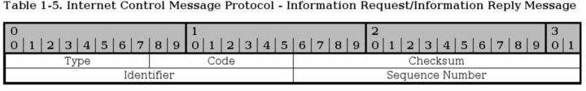
<js-ext-figcaption></js-ext-figcaption>

</js-ext-figure>

The information request and reply types are obsolete since there are protocols on top of the IP protocol that can now take care of this when necessary (DHCP, etc). The information request generates a reply from any answering host on the network that we are attached to.

The host that wishes to receive information creates a packet with the source address set to the network we are attached to (for example, 192.168.0.0), and the destination network set to 0. The reply will contain information about our numbers (netmask and ip address).

The information request is run through ICMP type 15 while the reply is sent via type 16.

## SCTP Characteristics <a id="sctp-characteristics" ></a>

Stream Control Transmission Protocol (SCTP) is a relatively new protocol in the game, but since it is growing in usage and complements the TCP and UDP protocols, I have chosen to add this section about it. It has an even higher reliability than TCP, and at the same time a lower overhead from protocol headers.

SCTP has a couple of very interesting features that can be interesting. For those who wish to learn more about this, read the _RFC 3286 - An Introduction to the Stream Control Transmission Protocol_ and _RFC 2960 - Stream Control Transmission Protocol_ document. The first document is an introduction to SCTP and should be very interesting to people who are still in need of more information. The second document is the actual specification for the protocol, which might be less interesting unless you are developing for the protocol or are really interested.

The protocol was originally developed for Telephony over IP, or Voice over IP (VoIP), and has some very interesting attributes due to this. Industry grade VoIP requires very high reliability for one, and this means that a lot of resilience has to be built into the system to handle different kind of problems. The following is a list of the basic features of SCTP.

- **Unicast with Multicast properties**. This means it is a point-to-point protocol but with the ability to use several addresses at the same end host. It can in other words use different paths to reach the end host. TCP in comparison breaks if the transport path breaks, unless the IP protocol corrects it.

- **Reliable transmission**. It uses checksums and SACK to detect corrupted, damaged, discarded, duplicated and reordered data. It can then retransmit data as necessary. This is pretty much the same as TCP, but SCTP is more resilient when it comes to reordered data and allows for faster pickups.

- Message oriented. Each message can be framed and hence you can keep tabs on the structure and order of the datastream. TCP is byte oriented and all you get is a stream of bytes without any order between different data inside. You need an extra layer of abstraction in TCP in other words.

- **Rate adaptive**. It is developed to cooperate and co-exist with TCP for bandwidth. It scales up and down based on network load conditions just the same as TCP. It also has the same algorithms for slow starting when packets where lost. ECN is also supported.

- **Multi-homing**. As previously mentioned, it is able to set up different end nodes directly in the protocol, and hence doesn't have to rely on the IP layer for resilience.

- **Multi-streaming**. This allows for multiple simultaneous streams inside the same stream. Hence the name Stream Control Transmission Protocol. A single stream can for example be opened to download a single webpage, and all the images and html documents can then be downloaded within the same stream simultaneously. Or why not a database protocol which can create a separate control stream and then use several streams to receive the output from the different queries simultaneously.

- **Initiation**. 4 packet initiation of connections where packet 3 and 4 can be used to send data. The equivalent of syncookies is implemented by default to avoid DoS attacks. INIT collision resolution to avoid several simultaneous SCTP connections.

This list could be made even longer, but I will not. Most of this information is gathered from the _RFC 3286 - An Introduction to the Stream Control Transmission Protocol_ document, so read on there for more information.

<js-ext-div class="" data-type="note">

In SCTP we talk about chunks, not packets or windows anymore. An SCTP frame can contain several different chunks since the protocol is message oriented. A chunk can either be a control or a data chunk. Control chunks is used to control the session, and data chunks are used to send actual data.

</js-ext-div>

### Initialization and association <a id="initialization-and-association" ></a>

Each connection is initialized by creating an association between the two hosts that wants to talk to each other. This association is initialized when a user needs it. It is later used as needed.

The initialization is done through 4 packets. First an INIT chunk is sent, which is replied to with an INIT ACK containing a cookie, after this the connection can start sending data. However, two more packets are sent in the initialization. The cookie is replied to with a COOKIE ECHO chunk, which is finally replied to with a COOKIE ACK chunk.

### Data sending and control session <a id="data-sending-and-control-session" ></a>

SCTP can at this point send data. In SCTP there are control chunks and data chunks, as previously stated. Data chunks are sent using DATA chunks, and DATA chunks are acknowledged by sending a SACK chunk. This works practically the same as a TCP SACK. SACK chunks are control chunks.

On top of this, there are some other control chunks that can be seen. HEARTBEAT and HEARTBEAT ACK chunks for one, and ERROR chunks for another. HEARTBEATs are used to keep the connection alive, and ERROR is used to inform of different problems or errors in the connection, such as invalid stream id's or missing mandatory parameters et cetera.

### Shutdown and abort <a id="shutdown-and-abort" ></a>

The SCTP connection is finally closed by either an ABORT chunk or by a graceful SHUTDOWN chunk. SCTP doesn't have a half-closed state as TCP, in other words one side can not continue sending data while the other end has closed its sending socket.

When the user/application wants to close the SCTP socket gracefully, it tells the protocol to SHUTDOWN. SCTP then sends all the data still in its buffers, and then sends a SHUTDOWN chunk. When the other end receives the SHUTDOWN, it will stop accepting data from the application and finish sending all the data. Once it has gotten all the SACK's for the data, it will send a SHUTDOWN ACK chunk and once the closing side has received this chunk, it will finally reply with a SHUTDOWN COMPLETE chunk. The whole session is now closed.

Another way of closing a session is to ABORT it. This is an ungraceful way of removing an SCTP association. When a connecting party wants to remove an SCTP association instantaneously, it sends an ABORT chunk with all the right values signed. All data in the buffers et cetera will be discarded and the association will then be removed. The receiving end will do the same after verifying the ABORT chunk.

## SCTP Headers <a id="sctp-headers" ></a>

This will be a very brief introduction to the SCTP headers. SCTP has a lot of different types of packets, and hence I will try to follow the RFC's as close as possible and how they depict the different headers, starting with a general overview of the headers applicable to all SCTP packets.

### SCTP Generic header format <a id="sctp-generic-header-format" ></a>

<js-ext-figure class="js-illustration">

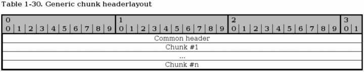
<js-ext-figcaption></js-ext-figcaption>

</js-ext-figure>

This is a generic overview of how a SCTP packet is laid out. Basically, you have a common header first with information describing the whole packet, and the source and destination ports etc. See more below for information on the common header.

After the common header a variable number of chunks are sent, up to the maximum possible in the MTU. All chunks can be bundled except for INIT, INIT ACK and SHUTDOWN COMPLETE, which must not be bundled. DATA chunks may be broken down to fit inside the MTU of the packets.

### SCTP Common and generic headers <a id="sctp-common-and-generic-headers" ></a>

<js-ext-figure class="js-illustration">

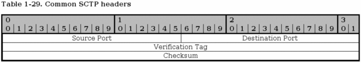
<js-ext-figcaption></js-ext-figcaption>

</js-ext-figure>

Every SCTP packet contains the Common header as seen above. The header contains four different fields and is set for every SCTP packet.

- **Source port** - bit 0-15. This field gives the source port of the packet, which port it was sent from. The same as for TCP and UDP source port.

- **Destination port** - bit 16-31. This is the destination port of the packet, ie., the port that the packet is going to. It is the same as for the TCP and UDP destination port.

- **Verification Tag** - bit 32-63. The verification tag is used to verify that the packet comes from the correct sender. It is always set to the same value as the value received by the other peer in the Initiate Tag during the association initialization, with a few exceptions:

- An SCTP packet containing an INIT chunk must have the Verification tag set to 0.

- A SHUTDOWN COMPLETE chunk with the T-bit set must have the verification tag copied from the verification tag of the SHUTDOWN-ACK chunk.

- Packets containing ABORT chunk may have the verification tag set to the same verification tag as the packet causing the ABORT.

- **Checksum** - bit 64-95. A checksum calculated for the whole SCTP packet based on the Adler-32 algorithm. Read _RFC 2960 - Stream Control Transmission Protocol_, appendix B for more information about this algorithm.

<js-ext-figure class="js-illustration">

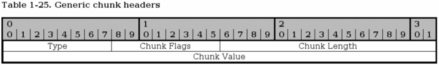
<js-ext-figcaption></js-ext-figcaption>

</js-ext-figure>

All SCTP chunks has a special layout that they all adhere to as can be seen above. This isn't an actual header, but rather a formalized way of how they do look.

- **Type** - bit 0-7. This field specifies the chunk type of the packet, for example is it an INIT or SHUTDOWN chunk or what? Each chunk type has a specific number, and is specified in the image below. Here is a complete list of Chunk types:

**Table 2-1. SCTP Types**

| Chunk Number | Chunk Name                                                |
| :----------- | :-------------------------------------------------------- |
| 0            | Payload Data (DATA)                                       |
| 1            | Initiation (INIT)                                         |
| 2            | Initiation Acknowledgement (INIT ACK)                     |
| 3            | Selective Acknowledgement (SACK)                          |
| 4            | Heartbeat Request (HEARTBEAT)                             |
| 5            | Heartbeat Acknowledgement (HEARTBEAT ACK)                 |
| 6            | Abort (ABORT)                                             |
| 7            | Shutdown (SHUTDOWN)                                       |
| 8            | Shutdown Acknowledgement (SHUTDOWN ACK)                   |
| 9            | Operation Error (ERROR)                                   |
| 10           | State Cookie (COOKIE ECHO)                                |
| 11           | Cookie Acknowledgement (COOKIE ACK)                       |
| 12           | Reserved for Explicit Congestion Notification Echo (ECNE) |
| 13           | Reserved for Congestion Window Reduced (CWR)              |
| 14           | Shutdown Complete (SHUTDOWN COMPLETE)                     |
| 15-62        | Reserved for IETF                                         |
| 63           | IETF-defined chunk extensions                             |
| 64-126       | reserved to IETF                                          |
| 127          | IETF-defined chunk extensions                             |
| 128-190      | reserved to IETF                                          |
| 191          | IETF-defined chunk extensions                             |
| 192-254      | reserved to IETF                                          |
| 255          | IETF-defined chunk extensions                             |

- **Chunk Flags** - bit 8-15. The chunk flags are generally not used but are set up for future usage if nothing else. They are chunk specific flags or bits of information that might be needed for the other peer. According to specifications, flags are only used in DATA, ABORT and SHUTDOWN COMPLETE packets at this moment. This may change however.

<js-ext-div class="" data-type="important">

A lot of times when you read an RFC, you might run into some old proven problems. The _RFC 2960 - Stream Control Transmission Protocol_ document is one example of this, where they specifically specify that the Chunk flags should always be set to 0 and ignored unless used for something.

This is written all over the place, and it begs for problems in the future. If you do firewalling or routing, watch out very carefully for this, since specifications for fields like this may change in the future and hence break at your firewall without any legit reason. This happened before with the implementation of ECN in the IP headers for example. See more in the _IP headers_ section of this chapter.

</js-ext-div>

- **Chunk Length** - bit 16-31. This is the chunk length calculated in bytes. It includes all headers, including the chunk type, chunk flags, chunk length and chunk value. If there is no chunk value, the chunk length will be set to 4 (bytes).

- **Chunk Value** - bit 32-n. This is specific to each chunk and may contain more flags and data pertaining to the chunk type. Sometimes it might be empty, in which case the chunk length will be set to 4.

### SCTP ABORT chunk <a id="sctp-abort-chunk" ></a>

<js-ext-figure class="js-illustration">

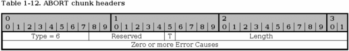
<js-ext-figcaption></js-ext-figcaption>

</js-ext-figure>

The ABORT chunk is used to abort an association as previously described in the _Shutdown and abort_ section of this chapter. ABORT is issued upon unrecoverable errors in the association such as bad headers or data.

- **Type** - bit 0-7. Always set to 6 for this chunk type.

- **Reserved** - bit 8-14. Reserved for future chunk flags but not used as of writing this. See the _SCTP Common and generic headers_ for more information about the chunk flags field.

- **T-bit** - bit 15. If this bit is set to 0, the sender had a TCB associated with this packet that it has destroyed. If the sender had no TCB the T-bit should be set to 1.

- **Length** - bit 16-31. Sets the length of the chunk in bytes including error causes.

### SCTP COOKIE ACK chunk <a id="sctp-cookie-ack-chunk" ></a>

<js-ext-figure class="js-illustration">

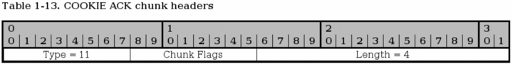
<js-ext-figcaption></js-ext-figcaption>

</js-ext-figure>

The COOKIE ACK chunk is used during the initialization of the connection and never anywhere else in the connection. It must precede all DATA and SACK chunks but may be sent in the same packet as the first of these packets.

- **Type** - bit 0-7. Always set to 11 for this type.

- **Chunk flags** - bit 8-15. Not used so far. Should always be set to 0 according to _RFC 2960 - Stream Control Transmission Protocol_. You should always watch out for this kind of specific behaviour stated by RFC's since it might change in the future, and hence break your firewalls etc. Just the same as happened with IP and ECN. See the _SCTP Common and generic headers_ section for more information.

- **Length** - bit 16-31. Should always be 4 (bytes) for this chunk.

### SCTP COOKIE ECHO chunk <a id="sctp-cookie-echo-chunk" ></a>

<js-ext-figure class="js-illustration">

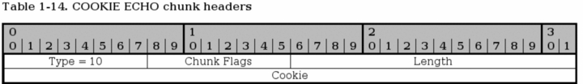
<js-ext-figcaption></js-ext-figcaption>

</js-ext-figure>

The COOKIE ECHO chunk is used during the initialization of the SCTP connection by the initiating party to reply to the cookie sent by the responding party in the State cookie field in the INIT ACK packet. It may be sent together with DATA chunks in the same packet, but must precede the DATA chunks in such case.

- **Type** - bit 0-7. The chunk type is always set to 10 for this chunk.

- **Chunk flags** - bit 8-15. This field is not used today. The RFC specifies that the flags should always be set to 0, but this might cause trouble as can be seen in the _SCTP Common and generic headers_ section above, specifically the Chunk flags explanation.

- **Length** - bit 16-31. Specifies the length of the chunk, including type, chunk flags, length and cookie fields in bytes.

- **Cookie** - bit 32-n. This field contains the cookie as sent in the previous INIT ACK chunk. It must be the exact same as the cookie sent by the responding party for the other end to actually open the connection. The _RFC 2960 - Stream Control Transmission Protocol_ specifies that the cookie should be as small as possible to insure interoperability, which is very vague and doesn't say much.

### SCTP DATA chunk <a id="sctp-data-chunk" ></a>

<js-ext-figure class="js-illustration">

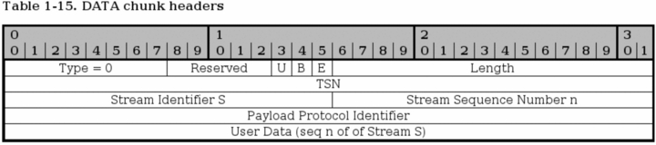
<js-ext-figcaption></js-ext-figcaption>

</js-ext-figure>

DATA chunks are used to send actual data through the stream and have rather complex headers in some ways, but not really worse than TCP headers in general. Each DATA chunk may be part of a different stream, since each SCTP connection can handle several different streams.

- **Type** - bit 0-7. The Type field should always be set to 0 for DATA chunks.

- **Reserved** - bit 8-12. Not used today. Might be applicable for change. See _SCTP Common and generic headers_ for more information.

- **U-bit** - bit 13. The U-bit is used to indicate if this is an unordered DATA chunk. If it is, the Stream Sequence Number must be ignored by the receiving host and send it on to the upper layer without delay or tries to re-order the DATA chunks.

- **B-bit** - bit 14. The B-bit is used to indicate the beginning of a fragmented DATA chunk. If this bit is set and the E (ending) bit is not set, it indicates that this is the first fragment of a chunk that has been fragmented into several DATA chunks.

- **E-bit** - bit 15. The E-bit is used to indicate the ending of a fragmented DATA chunk. If this flag is set on a chunk, it signals to the SCTP receiver that it can start reassembling the fragments and pass them on to the upper layer. If a packet has both the BE-bits set to set to 0, it signals that the chunk is a middle part of a fragmented chunk. If both BE-bits are set to 1 it signals that the packet is unfragmented and requires no reassembly et cetera.

- **Length** - bit 16-31. The length of the whole DATA chunk calculated in bytes,including the chunk type field and on until the end of the chunk.

- **TSN** - bit 32-63. The Transmission Sequence Number (TSN) is sent in the DATA chunk, and the receiving host uses the TSN to acknowledge that the chunk got through properly by replying with a SACK chunk. This is an overall value for the whole SCTP association.

- **Stream Identifier** - bit 64-79. The Stream Identifier is sent along with the DATA chunk to identify which stream the DATA chunk is associated with. This is used since SCTP can transport several streams within a single association.

- **Stream Sequence Number** - bit 80-95. This is the sequence number of the chunk for the specific stream identified by the Stream Identifier. This sequence number is specific for each stream identifier. If a chunk has been fragmented, the Stream Sequence Number must be the same for all fragments of the original chunk.

- **Payload Protocol Identifier** - bit 96-127. This value is filled in by the upper layers, or applications using the SCTP protocol as a way to identify to each other the content of the DATA chunk. The field must always be sent, including in fragments since routers and firewalls, et cetera, on the way might need the information. If the value was set to 0, the value was not set by the upper layers.

- **User data** - bit 128-n. This is the actual data that the chunk is transporting. It can be of variable length, ending on an even octet. It is the data in the stream as specified by the stream sequence number n in the stream S.

### SCTP ERROR chunk <a id="sctp-error-chunk" ></a>

<js-ext-figure class="js-illustration">

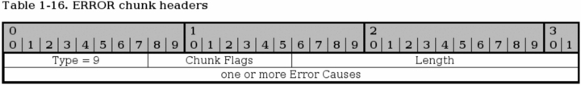
<js-ext-figcaption></js-ext-figcaption>

</js-ext-figure>

The ERROR chunk is sent to inform the other peer of any problems within the current stream. Each ERROR chunk can contain one or more Error Causes, which are more specifically detailed in the _RFC 2960 - Stream Control Transmission Protocol_ document. I will not go into further details here than the basic ERROR chunk, since it would be too much information. The ERROR chunk is not fatal in and of itself, but rather details an error that has happened. It may however be used together with an ABORT chunk to inform the peer of the error before killing the connection.

- **Type** - bit 0-7. This value is always set to 9 for ERROR chunks.

- **Chunk flags** - bit 8-15. Not used today. Might be applicable for change. See _SCTP Common and generic headers_ for more information.

- **Length** - bit 16-31. Specifies the length of the chunk in bytes, including all the Error Causes.

- **Error causes** - bit 32-n. Each ERROR chunk may contain one or more Error Causes, which notifies the opposite peer of a problem with the connection. Each Error Cause follows a specific format, as described in the _RFC 2960 - Stream Control Transmission Protocol_ document. We will not go into them here more than to say that they all contain an Cause Code, cause length and cause specific information field. The following Error Causes are possible:

**Table 2-2. Error Causes**

| Cause Value | Chunk Code                          |
| :---------- | :---------------------------------- |
| 1           | Invalid Stream Identifier           |
| 2           | Missing Mandatory Parameter         |
| 3           | Stale Cookie Error                  |
| 4           | Out of Resource                     |
| 5           | Unresolvable Address                |
| 6           | Unrecognized Chunk Type             |
| 7           | Invalid Mandatory Parameter         |
| 8           | Unrecognized Parameters             |
| 9           | No User Data                        |
| 10          | Cookie Received While Shutting Down |

### SCTP HEARTBEAT chunk <a id="sctp-heartbeat-chunk" ></a>

<js-ext-figure class="js-illustration">

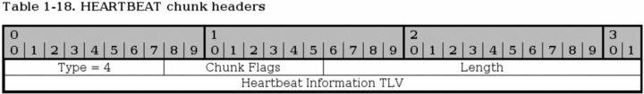
<js-ext-figcaption></js-ext-figcaption>

</js-ext-figure>

The HEARTBEAT chunk is sent by one of the peers to probe and find out if a specific SCTP endpoint address is up. This is sent to the different addresses that was negotiated during the initialization of the association to find out if they are all up.

- **Type** - bit 0-7. The type is always set to 4 for HEARTBEAT chunks.

- **Chunk flags** - bit 8-15. Not used today. Might be applicable for change. See _SCTP Common and generic headers_ for more information.

- **Length** - bit 16-31. The length of the whole chunk, including the Heartbeat Information TLV.

- **Heartbeat Information TLV** - bit 32-n. This is a variable-length parameter as defined inside the _RFC 2960 - Stream Control Transmission Protocol_ document. This is a mandatory parameter for the HEARTBEAT chunks that contains 3 fields, info type = 1, info length and a sender-specific Heartbeat Information parameter. The last field should be a sender-specific information field of some kind, for example a timestamp when the heartbeat was sent and a destination IP address. This is then returned in the HEARTBEAT ACK chunk.

### SCTP HEARTBEAT ACK chunk <a id="sctp-heartbeat-ack-chunk" ></a>

<js-ext-figure class="js-illustration">

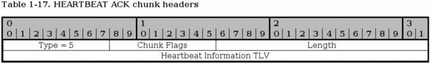
<js-ext-figcaption></js-ext-figcaption>

</js-ext-figure>

The HEARTBEAT ACK is used to acknowledge that a HEARTBEAT was received and that the connection is working properly. The chunk is always sent to the same IP address as the request was sent from.

- **Type** - bit 0-7. Always set to 5 for HEARTBEAT ACK chunks.

- **Chunk flags** - bit 8-15. Not used today. Might be applicable for change. See _SCTP Common and generic headers_ for more information.

- **Chunk length** - bit 16-31. The length of the HEARTBEAT ACK chunk including the Heartbeat Information TLV, calculated in bytes.

- **Heartbeat Information TLV** - bit 32-n. This field must contain the Heartbeat Information parameter that was sent in the original HEARTBEAT chunk.

### SCTP INIT chunk <a id="sctp-init-chunk" ></a>

<js-ext-figure class="js-illustration">

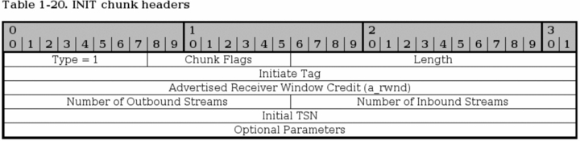
<js-ext-figcaption></js-ext-figcaption>

</js-ext-figure>

The INIT chunk is used to initiate a new association with a destination host, and is the first chunk to be sent by the connecting host. The INIT chunk contains several mandatory fixed length parameters, and some optional variable length parameters. The fixed length mandatory parameters are already in the above headers, and are the Initiate Tag, Advertised Receiver Window Credit, Number of Outbound Streams, Number of Inbound Streams and the Initial TSN parameters. After this comes a couple of optional parameters, they will be listed with the optional parameters paragraph below.

- **Type** - bit 0-7. The type field is always set to 1 for INIT chunks.

- **Chunk flags** - bit 8-15. Not used today. Might be applicable for change. See _SCTP Common and generic headers_ for more information.

- **Chunk Length** - bit 16-31. The chunk length is the length of the whole packet, including everything in the headers, including the optional parameters.

- **Initiate Tag** - bit 32-63. The Initiate Tag is set within the INIT chunk and must be used by the receiver to acknowledge all packets henceforth, within the Verification Tag of the established association. The Initiate Tag may take any value except 0. If the value is 0 anyways, the receiver must react with an ABORT.

**Advertised Receiver Window Credit (`a_rwnd`)**- bit 64-95. This is the minimum receiving buffer that the sender of the INIT chunk will allocate for this association, in bytes. This can then be used by the receiver of the `a_rwnd`, to know how much data it can send out without being SACK'ed. This window should not be lessened, but it might by sending the new `a_rwnd` in a SACK chunk.

- **Number of Outbound Streams** - bit 96-111. This specifies the maximum number of outbound streams that the connecting host wishes to create to the receiving host. The value must not be 0, and if it is, the receiving host should ABORT the association immediately. There is no negotiation of the minimum number of outbound or inbound streams, it is simply set to the lowest that either host has set in the header.

- **Number of Inbound Streams** - bit 112-127. Specifies the maximum number of inbound connections that the sending peer will allow the receiving host to create in this association. This must not be set to 0, or the receiving host should ABORT the connection. There is no negotiation of the minimum number of outbound or inbound streams, it is simply set to the lowest that either host has set in the header.

- **Initial TSN** - bit 128-159. This value sets the initial Transmit Sequence Number (TSN) that the sender will use when sending data. The field may be set to the same value as the Initiate Tag.

On top of the above mandatory fixed length headers, there are also some optional variable length parameters that might be set, and at least one of the IPv4, IPv6 or Hostname parameters must be set. Only one Hostname may be set, and if a Hostname is set, no IPv4 or IPv6 parameters may be set. Multiple IPv4 and IPv6 parameters may also be set in the same INIT chunk. Also, none of these parameters needs to be set in case the sender only has one address that can be reached, which is where the chunk should be coming from. These parameters are used to set up which addresses may be used to connect to the other end of the association. This is a full list of all the parameters available in the INIT chunk:

**Table 2-3. INIT Variable Parameters**

| Parameter Name           | Status   | Type Value |
| :----------------------- | :------- | :--------- |
| IPv4 Address             | Optional | 5          |
| IPv6 Address             | Optional | 6          |
| Cookie Preservative      | Optional | 9          |
| Host Name Address        | Optional | 11         |
| Supported Address Types  | Optional | 12         |
| Reserved for ECN Capable | Optional | 32768      |

Below we describe the three most common Parameters used in the INIT chunk.

<js-ext-figure class="js-illustration">

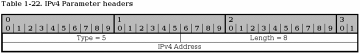
<js-ext-figcaption></js-ext-figcaption>

</js-ext-figure>

The IPv4 parameter is used to send an IPv4 address in the INIT chunk. The IPv4 address can be used to send data through the association. Multiple IPv4 and IPv6 addresses can be specified for a single SCTP association.

- **Parameter Type** - bit 0-15. This is always set to 5 for IPv4 address parameters.

- **Length** - bit 16-31. This is always set to 8 for IPv4 address parameters.

- **IPv4 Address** - bit 32-63. This is an IPv4 address of the sending endpoint.

<js-ext-figure class="js-illustration">

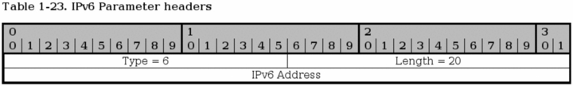
<js-ext-figcaption></js-ext-figcaption>

</js-ext-figure>

This parameter is used to send IPv6 addresses in the INIT chunk. This address can then be used to contact the sending endpoint with this association.

- **Type** - bit 0-15. Always set to 6 for the IPv6 parameters.

- **Length** - bit 16-31. Always set to 20 for IPv6 parameters.

- **IPv6 address** - bit 32-159. This is an IPv6 address of the sending endpoint that can be used to connect to by the receiving endpoint.

<js-ext-figure class="js-illustration">

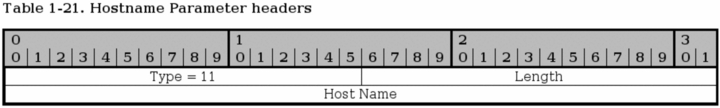
<js-ext-figcaption></js-ext-figcaption>

</js-ext-figure>

The Hostname parameter is used to send a single hostname as an address. Thea receiving host must then look up the hostname and use any and/or all of the addresses it receives from there. If a hostname parameter is sent, no other IPv4, IPv6 or Hostname parameters may be sent.

- **Type** - bit 0-15. This is always set to 11 for Hostname Parameters.

- **Length** - bit 16-31. The length of the whole parameter, including type, length and hostname field. The Hostname field is variable length. The length is counted in bytes.

- **Hostname** - bit 32-n. A variable length parameter containing a hostname. The hostname is resolved by the receiving end to get the addresses that can be used to contact the sending endpoint.

### SCTP INIT ACK chunk <a id="sctp-init-ack-chunk" ></a>

<js-ext-figure class="js-illustration">

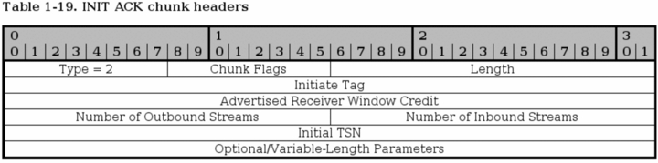
<js-ext-figcaption></js-ext-figcaption>

</js-ext-figure>

The INIT ACK chunk is sent in response to a INIT chunk and contains basically the same headers, but with values from the recipient of the original INIT chunk. In addition, it has two extra variable length parameters, the State Cookie and the Unrecognized Parameter parameters.

- **Type** - bit 0-7. This header is always set to 2 for INIT ACK chunks.

- **Chunk flags** - bit 8-15. Not used today. Might be applicable for change. See _SCTP Common and generic headers_ for more information.

- **Chunk Length** - bit 16-31. The chunk length is the length of the whole packet, including everything in the headers, and the optional parameters.

- **Initiate Tag** - bit 32-63. The receiver of the Initiate Tag of the INIT ACK chunk must save this value and copy it into the Verification Tag field of every packet that it sends to the sender of the INIT ACK chunk. The Initiate Tag must not be 0, and if it is, the receiver of the INIT ACK chunk must close the connection with an ABORT.

- **Advertised Receiver Window Credit (`a_rwnd`)** - bit 64-95. The dedicated buffers that the sender of this chunk has located for traffic, counted in bytes. The dedicated buffers should never be lowered to below this value.

- **Number of Outbound Streams** - bit 96-111. How many outbound streams that the sending host wishes to create. Must not be 0, or the receiver of the INIT ACK should ABORT the association. There is no negotiation of the minimum number of outbound or inbound streams, it is simply set to the lowest that either host has set in the header.

- **Number of Inbound Streams** - bit 112-127. How many inbound streams that the sending endpoint is willing to accept. Must not be 0, or the receiver of the INIT ACK should ABORT the association. There is no negotiation of the minimum number of outbound or inbound streams, it is simply set to the lowest that either host has set in the header.

- **Initial TSN** - bit 128-159. This is set to the Initial Transmission Sequence Number (I-TSN) which will be used by the sending party in the association to start with.

After this point, the INIT ACK chunk continues with optional variable-length parameters. The parameters are exactly the same as for the INIT chunk, with the exception of the addition of the State Cookie and the Unrecognized Parameters parameter, and the deletion of the Supported Address Types parameter. The list in other words look like this:

**Table 2-4. INIT ACK Variable Parameters**

| Parameter Name           | Status    | Type Value |
| :----------------------- | :-------- | :--------- |
| IPv4 Address             | Optional  | 5          |
| IPv6 Address             | Optional  | 6          |
| State Cookie             | Mandatory | 7          |
| Unrecognized Parameters  | Optional  | 8          |
| Cookie Preservative      | Optional  | 9          |
| Host Name Address        | Optional  | 11         |
| Reserved for ECN Capable | Optional  | 32768      |

<js-ext-figure class="js-illustration">

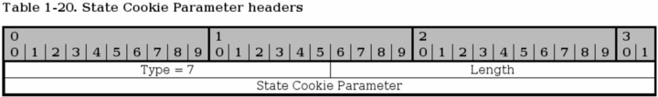
<js-ext-figcaption></js-ext-figcaption>

</js-ext-figure>

The State Cookie is used in INIT ACK to send a cookie to the other host, and until the receiving host has replied with a COOKIE ECHO chunk, the association is not guaranteed. This is to prevent basically the same as a SYN attack in TCP protocol.

- **Type** - bit 0-15. Always set to 7 for all State Cookie parameters.

- **Length** - bit 16-31. The size of the whole parameter, including the type, length and State Cookie field in bytes.

- **State Cookie** - bit 31-n. This parameter contains a cookie of variable length. For a description on how this cookie is created, see the _RFC 2960 - Stream Control Transmission Protocol_ document.

### SCTP SACK chunk <a id="sctp-sack-chunk" ></a>

<js-ext-figure class="js-illustration">

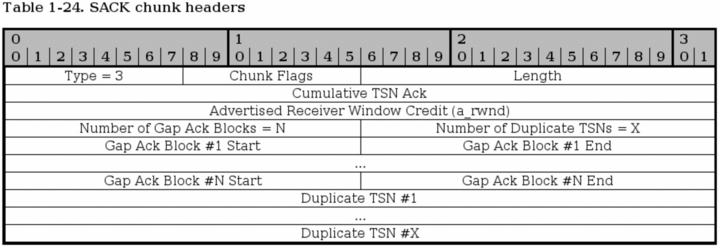
<js-ext-figcaption></js-ext-figcaption>

</js-ext-figure>

The SACK chunk is used to tell the sender of DATA chunks which chunks has been received and where there has been a gap in the stream, based on the received TSN's. Basically, the SACK chunk acknowledges that it has received data up to a certain point (the Cumulative TSN Ack parameter), and then adds Gap Ack Blocks for all of the data that it has received after the Cumulative TSN Ack point. A SACK chunk must not be sent more than once for every DATA chunk that is received.

- **Type** - bit 0-7. This header is always set to 3 for SACK chunks.

- **Chunk flags** - bit 8-15. Not used today. Might be applicable for change. See _SCTP Common and generic headers_ for more information.

- **Chunk Length** - bit 16-31. The chunk length is the length of the whole chunk, including everything in the headers and all the parameters.

- **Cumulative TSN Ack** - bit 32-63. This is the Cumulative TSN Ack parameter, which is used to acknowledge data. The DATA chunk receiver will use this field to tell the sending host that it has received all data up to this point of the association. After this point, all data that has not been specifically acknowledged by the Gap Ack Blocks will, basically, be considered unaccounted for.

- **Advertised Receiver Window Credit (`a_rwnd`)** - bit 64-95. The `a_rwnd` field is basically the same as the `a_rwnd` in the INIT and INIT ACK chunks, but can be used to raise or lower the `a_rwnd` value. Please read more in the _RFC 2960 - Stream Control Transmission Protocol_ document about this.

- **Number of Gap Ack Blocks** - bit 96-111. The number of Gap Ack Blocks listed in this chunk. Each Gap Ack Block takes up 32 bits in the chunk.

- **Number of Duplicate TSNs** - bit 112-127. The number of DATA chunks that has been duplicated. Each duplicated TSN is listed after the Gap Ack Blocks in the chunk, and each TSN takes 32 bits to send.

- **Gap Ack Block #1 Start** - bit 128-143. This is the first Gap Ack Block in the SACK chunk. If there are no gaps in the received DATA chunk TSN numbers, there will be no Gap Ack Blocks at all. However, if DATA chunks are received out of order or some DATA chunks where lost during transit to the host, there will be gaps. The gaps that has been seen will be reported with Gap Ack Blocks. The Gap Ack Block start point is calculated by adding the Gap Ack Block Start parameter to the Cumulative TSN value. The calculated value is the start of the block.

- **Gap Ack Block #1 End** - bit 144-159. This value reports the end of the first Gap Ack Block in the stream. All the DATA chunks with the TSN between the Gap Ack Block Start and the Gap Ack Block End has been received. The Gap Ack Block End value is added to the Cumulative TSN, just as the Start parameter, to get the actual last TSN of the block chunks to be Acknowledged.

- **Gap Ack Block #N Start** - bits variable. For every Gap Ack Block counted in the Number of Gap Ack Blocks parameter, one Gap Ack Block is added, until the final N block. Ie, if Number of Gap Ack Blocks = 2, then there will be two Gap Ack Blocks in the SACK chunk. This is the last one simply, and contains the same type of value as the Gap Ack Block #1 Start.

- **Gap Ack Block #N End** - bits variable. Same as for the Gap Ack Block #N End, but for the end of the gap.

- **Duplicate TSN #1** - bits variable. These fields report a duplicate TSN, in which case we have already received a specific chunk, but receive the same TSN several times more. This can either be router glitches (retransmitting already sent data) or a case of retransmission from the sending endpoint, or a score of other possibilities. Each instance of a duplicate TSN should be reported once. For example, if 2 duplicate TSN's has been received after acknowledging the first one, each of these duplicate TSN's should be sent sent in the next SACK message that is being sent. If even more duplicate TSN's should appear after this second SACK is sent, the new duplicates should be added in the next SACK, and so on.

- **Duplicate TSN #X** - bits variable. This is the last duplicate TSN parameter, containing the same type of information as the first parameter.

### SCTP SHUTDOWN chunk <a id="sctp-shutdown-chunk" ></a>

<js-ext-figure class="js-illustration">

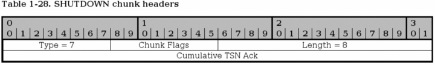
<js-ext-figcaption></js-ext-figcaption>

</js-ext-figure>

The SHUTDOWN chunk is issued when one of the endpoints of a connection wants to close the current association. The sending party must empty all of its sending buffers before sending the SHUTDOWN chunk, and must not send any more DATA chunks afterwards. The receiver must also empty its sending buffers and must then send the responding SHUTDOWN ACK chunk.

- **Type** - bit 0-7. This header is always set to 7 for SHUTDOWN chunks.

- **Chunk flags** - bit 8-15. Not used today. Might be applicable for change. See _SCTP Common and generic headers_ for more information.

- **Chunk Length** - bit 16-31. The chunk length is the length of the whole packet, including the Cumulative TSN Ack parameter. The length of the SHUTDOWN chunk should always be 8.

- **Cumulative TSN Ack** - bit 32-63. This is a Cumulative TSN Ack field, just the same as in the SACK chunk. The Cumulative TSN Ack acknowledges the last TSN received in sequence from the opposite endpoint. This parameter does not, nor can the rest of the SHUTDOWN chunk either, acknowledge Gap Ack Blocks. The lack of a Gap Ack Block in the SHUTDOWN chunk that was acknowledged before should not be interpreted as if the previously acknowledged block was lost again.

### SCTP SHUTDOWN ACK chunk <a id="sctp-shutdown-ack-chunk" ></a>

<js-ext-figure class="js-illustration">

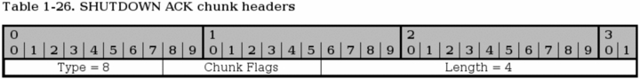
<js-ext-figcaption></js-ext-figcaption>

</js-ext-figure>

The SHUTDOWN ACK chunk is used to acknowledge a SHUTDOWN chunk that has been received. Before the SHUTDOWN ACK chunk is sent, all data in the sending buffers should be sent, but the buffers must not accept any new data from the application. SCTP does not support half-open connections as TCP does.

- **Type** - bit 0-7. This header is always set to 8 for SHUTDOWN ACK chunks.

- **Chunk flags** - bit 8-15. Not used today. Might be applicable for change. See _SCTP Common and generic headers_ for more information.

- **Chunk Length** - bit 16-31. The chunk length is the length of the whole chunk. The length of the SHUTDOWN ACK chunk should always be 4.

### SCTP SHUTDOWN COMPLETE chunk <a id="sctp-shutdown-complete-chunk" ></a>

<js-ext-figure class="js-illustration">

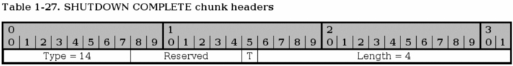
<js-ext-figcaption></js-ext-figcaption>

</js-ext-figure>

The SHUTDOWN COMPLETE chunk is sent, by the originating host of the SHUTDOWN, in response to the SHUTDOWN ACK chunk. It is sent to acknowledge that the association is finally closed.

- **Type** - bit 0-7. Always set to 14 for SHUTDOWN COMPLETE chunks.

- **Reserved** - bit 8-14. Not used today. Might be applicable for change. See _SCTP Common and generic headers_ for more information.

- **T-bit** - bit 15. The T-bit is not set to signal that the sending host had a Transmission Control Block (TCB) associated with this connection and that it destroyed. If the T-bit was set, it had no TCB to destroy.

- **Length** - bit 16-31. This is always set to 4 for SHUTDOWN COMPLETE chunks, since the chunk should never be any larger, as long as no updates to the standards are made.

## TCP/IP destination driven routing <a id="tcp-ip-destination-driven-routing" ></a>

TCP/IP has grown in complexity quite a lot when it comes to the routing part. In the beginning, most people thought it would be enough with destination driven routing. The last few years, this has become more and more complex however. Today, Linux can route on basically every single field or bit in the IP header, and even based on TCP, UDP or ICMP headers as well. This is called policy based routing, or advanced routing.

This is simply a brief discussion on how the destination driven routing is performed. When we send a packet from a sending host, the packet is created. After this, the computer looks at the packet destination address and compares it to the routing table that it has. If the destination address is local, the packet is sent directly to that address via its hardware MAC address. If the packet is on the other side of a gateway, the packet is sent to the MAC address of the gateway. The gateway will then look at the IP headers and see the destination address of the packet. The destination address is looked up in the routing table again, and the packet is sent to the next gateway, et cetera, until the packet finally reaches the local network of the destination.

As you can see, this routing is very basic and simple. With the advanced routing and policy based routing, this gets quite a bit more complex. We can route packets differently based on their source address for example, or their TOS value, et cetera.

## What's next? <a id="whats-next" ></a>

This chapter has brought you up to date to fully understand the subsequent chapters. The following has been gone through thoroughly:

- TCP/IP structure

- IP protocol functionality and headers.

- TCP protocol functionality and headers.

- UDP protocol functionality and headers.

- ICMP protocol functionality and headers.

- TCP/IP destination driven routing.

All of this will come in very handy later on when you start to work with the actual firewall rulesets. All of this information are pieces that fit together, and will lead to a better firewall design.

# Chapter 3. IP filtering introduction

This chapter will discuss the theoretical details about an IP filter, what it is, how it works and basic things such as where to place firewalls, policies, etcetera.

Questions for this chapter may be, where to actually put the firewall? In most cases, this is a simple question, but in large corporate environments it may get trickier. What should the policies be? Who should have access where? What is actually an IP filter? All of these questions should be fairly well answered later on in this chapter.

## What is an IP filter <a id="what-is-an-ip-filter" ></a>

It is important to fully understand what an IP filter is. Iptables is an IP filter, and if you don't fully understand this, you will get serious problems when designing your firewalls in the future.

An IP filter operates mainly in layer 2, of the TCP/IP reference stack. Iptables however has the ability to also work in layer 3, which actually most IP filters of today have. But per definition an IP filter works in the second layer.

If the IP filter implementation is strictly following the definition, it would in other words only be able to filter packets based on their IP headers (Source and Destionation address, TOS/DSCP/ECN, TTL, Protocol, etc. Things that are actually in the IP header.) However, since the Iptables implementation is not perfectly strict around this definition, it is also able to filter packets based on other headers that lie deeper into the packet (TCP, UDP, etc), and shallower (MAC source address).

There is one thing however, that iptables is rather strict about these days. It does not "follow" streams or puzzle data together. This would simply be too processor- and memoryconsuming . The implications of this will be discussed a little bit more further on. It does keep track of packets and see if they are of the same stream (via sequence numbers, port numbers, etc.) almost exactly the same way as the real TCP/IP stack. This is called connection tracking, and thanks to this we can do things such as Destination and Source Network Address Translation (generally called DNAT and SNAT), as well as state matching of packets.

As I implied above, iptables can not connect data from different packets to each other (per default), and hence you can never be fully certain that you will see the complete data at all times. I am specifically mentioning this since there are constantly at least a couple of questions about this on the different mailing lists pertaining to netfilter and iptables and how to do things that are generally considered a really bad idea. For example, every time there is a new windows based virus, there are a couple of different persons asking how to drop all streams containing a specific string. The bad idea about this is that it is so easily circumvented. For example if we match for something like this:

```console
cmd.exe
```

Now, what happens if the virus/exploit writer is smart enough to make the packet size so small that cmd winds up in one packet, and .exe winds up in the next packet? Or what if the packet has to travel through a network that has this small a packet size on its own? Yes, since these string matching functions is unable to work across packet boundaries, the packet will get through anyway.

Some of you may now be asking yourself, why don't we simply make it possible for the string matches, etcetera to read across packet boundaries? It is actually fairly simple. It would be too costly on processor time. Connection tracking is already taking way to much processor time to be totally comforting. To add another extra layer of complexity to connection tracking, such as this, would probably kill more firewalls than anyone of us could expect. Not to think of how much memory would be used for this simple task on each machine.

There is also a second reason for this functionality not being developed. There is a technology called proxies. Proxies were developed to handle traffic in the higher layers, and are hence much better at fullfilling these requirements. Proxies were originally developed to handle downloads and often used pages and to help you get the most out of slow Internet connections. For example, _`Squid`_ is a webproxy. A person who wants to download a page sends the request, the proxy either grabs the request or receives the request and opens the connection to the web browser, and then connects to the webserver and downloads the file, and when it has downloaded the file or page, it sends it to the client. Now, if a second browser wants to read the same page again, the file or page is already downloaded to the proxy, and can be sent directly, and saves bandwidth for us.

As you may understand, proxies also have quite a lot of functionality to go in and look at the actual content of the files that it downloads. Because of this, they are much better at looking inside the whole streams, files, pages etc.

Now, after warning you about the inherent problems of doing level 7 filtering in iptables and netfilter, there is actually a set of patches that has attacked these problems. This is called [l7-filter](http://l7-filter.sourceforge.net/). It can be used to match on a lot of layer 7 protocols but is mainly to be used together with QoS and traffic accounting, even though it can be used for pure filtering as well. The l7-filter is still experimental and developed outside the kernel and netfilter coreteam, and hence you will not hear more about it here.

## IP filtering terms and expressions <a id="ip-filtering-terms-and-expressions" ></a>

To fully understand the upcoming chapters there are a few general terms and expressions that one must understand, including a lot of details regarding the TCP/IP chapter. This is a listing of the most common terms used in IP filtering.

- **Drop/Deny** - When a packet is dropped or denied, it is simply deleted, and no further actions are taken. No reply to tell the host it was dropped, nor is the receiving host of the packet notified in any way. The packet simply disappears.

- **Reject** - This is basically the same as a drop or deny target or policy, except that we also send a reply to the host sending the packet that was dropped. The reply may be specified, or automatically calculated to some value. (To this date, there is unfortunately no iptables functionality to also send a packet notifying the receiving host of the rejected packet what happened (ie, doing the reverse of the Reject target). This would be very good in certain circumstances, since the receiving host has no ability to stop Denial of Service attacks from happening.)

- **State** - A specific state of a packet in comparison to a whole stream of packets. For example, if the packet is the first that the firewall sees or knows about, it is considered new (the SYN packet in a TCP connection), or if it is part of an already established connection that the firewall knows about, it is considered to be established. States are known through the connection tracking system, which keeps track of all the sessions.

- **Chain** - A chain contains a ruleset of rules that are applied on packets that traverses the chain. Each chain has a specific purpose (e.g., which table it is connected to, which specifies what this chain is able to do), as well as a specific application area (e.g., only forwarded packets, or only packets destined for this host). In iptables, there are several different chains, which will be discussed in depth in later chapters.

- **Table** - Each table has a specific purpose, and in iptables there are 4 tables. The raw, nat, mangle and filter tables. For example, the filter table is specifically designed to filter packets, while the nat table is specifically designed to NAT (Network Address Translation) packets.

- **Match** - This word can have two different meanings when it comes to IP filtering. The first meaning would be a single match that tells a rule that this header must contain this and this information. For example, the --source match tells us that the source address must be a specific network range or host address. The second meaning is if a whole rule is a match. If the packet matches the whole rule, the jump or target instructions will be carried out (e.g., the packet will be dropped.)

- **Target** - There is generally a target set for each rule in a ruleset. If the rule has matched fully, the target specification tells us what to do with the packet. For example, if we should drop or accept it, or NAT it, etc. There is also something called a jump specification, for more information see the jump description in this list. As a last note, there might not be a target or jump for each rule, but there may be.

- **Rule** - A rule is a set of a match or several matches together with a single target in most implementations of IP filters, including the iptables implementation. There are some implementations which let you use several targets/actions per rule.

- **Ruleset** - A ruleset is the complete set of rules that are put into a whole IP filter implementation. In the case of iptables, this includes all of the rules set in the filter, nat, raw and mangle tables, and in all of the subsequent chains. Most of the time, they are written down in a configuration file of some sort.

- **Jump** - The jump instruction is closely related to a target. A jump instruction is written exactly the same as a target in iptables, with the exception that instead of writing a target name, you write the name of another chain. If the rule matches, the packet will hence be sent to this second chain and be processed as usual in that chain.

- **Connection tracking** - A firewall which implements connection tracking is able to track connections/streams simply put. The ability to do so is often done at the impact of lots of processor and memory usage. This is unfortunately true in iptables as well, but much work has been done to work on this. However, the good side is that the firewall will be much more secure with connection tracking properly used by the implementer of the firewall policies.

- **Accept** - To accept a packet and to let it through the firewall rules. This is the opposite of the drop or deny targets, as well as the reject target.

- **Policy** - There are two kinds of policies that we speak about most of the time when implementing a firewall. First we have the chain policies, which tells the firewall implementation the default behaviour to take on a packet if there was no rule that matched it. This is the main usage of the word that we will use in this book. The second type of policy is the security policy that we may have written documentation on, for example for the whole company or for this specific network segment. Security policies are very good documents to have thought through properly and to study properly before starting to actually implement the firewall.

## How to plan an IP filter <a id="how-to-plan-an-ip-filter" ></a>

One of the first steps to think about when planning the firewall is their placement. This should be a fairly simple step since mostly your networks should be fairly well segmented anyway. One of the first places that comes to mind is the gateway between your local network(s) and the Internet. This is a place where there should be fairly tight security.

Also, in larger networks it may be a good idea to separate different divisions from each other via firewalls. For example, why should the development team have access to the human resources network, or why not protect the economic department from other networks? Simply put, you don't want an angry employee with the pink slip tampering with the salary databases.

Simply put, the above means that you should plan your networks as well as possible, and plan them to be segregated. Especially if the network is medium- to big-sized (100 workstations or more, based on different aspects of the network). In between these smaller networks, try to put firewalls that will only allow the kind of traffic that you would like.

It may also be a good idea to create a De-Militarized Zone (DMZ) in your network in case you have servers that are reached from the Internet. A DMZ is a small physical network with servers, which is closed down to the extreme. This lessens the risk of anyone actually getting in to the machines in the DMZ, and it lessens the risk of anyone actually getting in and downloading any trojans etc. from the outside. The reason that they are called de-militarized zones is that they must be reachable from both the inside and the outside, and hence they are a kind of grey zone (DMZ simply put).

There are a couple of ways to set up the policies and default behaviours in a firewall, and this section will discuss the actual theory that you should think about before actually starting to implement your firewall, and helping you to think through your decisions to the fullest extent.

Before we start, you should understand that most firewalls have default behaviours. For example, if no rule in a specific chain matches, it can be either dropped or accepted per default. Unfortunately, there is only one policy per chain, but this is often easy to get around if we want to have different policies per network interface etc.

There are two basic policies that we normally use. Either we drop everything except that which we specify, or we accept everything except that which we specifically drop. Most of the time, we are mostly interested in the drop policy, and then accepting everything that we want to allow specifically. This means that the firewall is more secure per default, but it may also mean that you will have much more work in front of you to simply get the firewall to operate properly.

Your first decision to make is to simply figure out which type of firewall you should use. How big are the security concerns? What kind of applications must be able to get through the firewall? Certain applications are horrible to firewalls for the simple reason that they negotiate ports to use for data streams inside a control session. This makes it extremely hard for the firewall to know which ports to open up. The most common applications works with iptables, but the more rare ones do not work to this day, unfortunately.

<js-ext-div class="" data-type="note">

There are also some applications that work partially, such as ICQ. Normal ICQ usage works perfectly, but not the chat or file sending functions, since they require specific code to handle the protocol. Since the ICQ protocols are not standardized (they are proprietary and may be changed at any time) most IP filters have chosen to either keep the ICQ protocol handlers out, or as patches that can be applied to the firewalls. Iptables have chosen to keep them as separate patches.

</js-ext-div>

It may also be a good idea to apply layered security measures, which we have actually already discussed partially so far. What we mean with this, is that you should use as many security measures as possible at the same time, and don't rely on any one single security concept. Having this as a basic concept for your security will increase security tenfold at least. For an example, let's look at this.

<js-ext-figure class="js-illustration">

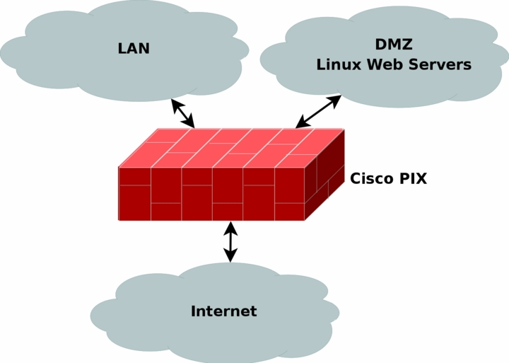
<js-ext-figcaption></js-ext-figcaption>

</js-ext-figure>

As you can see, in this example I have in this example chosen to place a Cisco PIX firewall at the perimeter of all three network connections. It may NAT the internal LAN, as well as the DMZ if necessary. It may also block all outgoing traffic except http return traffic as well as ftp and ssh traffic. It can allow incoming http traffic from both the LAN and the Internet, and ftp and ssh traffic from the LAN. On top of this, we note that each webserver is based on Linux, and can hence throw iptables and netfilter on each of the machines as well and add the same basic policies on these. This way, if someone manages to break the Cisco PIX, we can still rely on the netfilter firewalls locally on each machine, and vice versa. This allows for so called layered security.

On top of this, we may add _Snort_ on each of the machines. Snort is an excellent open source network intrusion detection system (NIDS) which looks for signatures in the packets that it sees, and if it sees a signature of some kind of attack or breakin it can either e-mail the administrator and notify him about it, or even make active responses to the attack such as blocking the IP from which the attack originated. It should be noted that active responses should not be used lightly since snort has a bad behaviour of reporting lots of false positives (e.g., reporting an attack which is not really an attack).

It could also be a good idea to throw in an proxy in front of the webservers to catch some of the bad packets as well, which could also be a possibility to throw in for all of the locally generated webconnections. With a webproxy you can narrow down on traffic used by webtraffic from your employees, as well as restrict their webusage to some extent. As for a webproxy to your own webservers, you can use it to block some of the most obvious connections to get through. A good proxy that may be worth using is the _Squid_.

Another precaution that one can take is to install _Tripwire_. This is an excellent last line of defense kind of application, it is generally considered to be a Host Intrusion Detection System. What it does is to make checksums of all the files specified in a configuration file, and then it is run from cron once in a while to see that all of the specified files are the same as before, or have not changed in an illegit way. This program will in other words be able to find out if anyone has actually been able to get through and tampered with the system. A suggestion is to run this on all of the webservers.

One last thing to note is that it is always a good thing to follow standards, as we know. As you have already seen with the ICQ example, if you don't use standardized systems, things can go terribly wrong. For your own environments, this can be ignored to some extent, but if you are running a broadband service or modempool, it gets all the more important. People who connect through you must always be able to rely on your standardization, and you can't expect everyone to run the specific operating system of your choice. Some people want to run Windows, some want to run Linux or even VMS and so on. If you base your security on proprietary systems, you are in for some trouble.

A good example of this is certain broadband services that have popped up in Sweden who base lots of security on Microsoft network logon. This may sound like a great idea to begin with, but once we start considering other operating systems and so on, this is no longer such a good idea. How will someone running Linux get online? Or VAX/VMS? Or HP/UX? With Linux it can be done of course, if it wasn't for the fact that the network administrator refuses anyone to use the broadband service if they are running linux by simply blocking them in such case. However, this book is not a theological discussion of what is best, so let's leave it as an example of why it is a bad idea to use non-standards.

## What's next? <a id="whats-next" ></a>

This chapter has gone through several of the basic IP filtering and security measures that you can take to secure your networks, workstations and servers. The following subjects have been brought up:

- IP filtering usage

- IP filtering policies

- Network planning

- Firewall planning

- Layered security techniques

- Network segmentation

In the next chapter we will take a quick look at what Network Address Translation (NAT) is, and after that we will start looking closer at Iptables and it's functionality and actually start getting hands on with the beast.

# Chapter 4. Network Address Translation Introduction

NAT is one of the biggestattractions of Linux and Iptables to this day it seems. Instead of using fairly expensive third party solutions such as Cisco PIX etc, a lot of smaller companies and personal users have chosen to go with these solutions instead. One of the main reasons is that it is cheap, and secure. It requires an old computer, a fairly new Linux distribution which you can download for free from the Internet, a spare network card or two and cabling.

This chapter will describe a little bit of the basic theory about NAT, what it can be used for, how it works and what you should think about before starting to work on these subjects.

## What NAT is used for and basic terms and expressions <a id="what-nat-is-used-for-and-basic-terms-and-expressions" ></a>

Basically, NAT allows a host or several hosts to share the same IP address in a way. For example, let's say we have a local network consisting of 5-10 clients. We set their default gateways to point through the NAT server. Normally the packet would simply be forwarded by the gateway machine, but in the case of an NAT server it is a little bit different.

NAT servers translates the source and destination addresses of packets as we already said to different addresses. The NAT server receives the packet, rewrites the source and/or destination address and then recalculates the checksum of the packet.

One of the most common usages of NAT is the SNAT (Source Network Address Translation) function. Basically, this is used in the above example if we can't afford or see any real idea in having a real public IP for each and every one of the clients. In that case, we use one of the private IP ranges for our local network (for example, 192.168.1.0/24), and then we turn on SNAT for our local network. SNAT will then turn all 192.168.1.0 addresses into it's own public IP (for example, 217.115.95.34). This way, there will be 5-10 clients or many many more using the same shared IP address.

There is also something called DNAT, which can be extremely helpful when it comes to setting up servers etc. First of all, you can help the greater good when it comes to saving IP space, second, you can get an more or less totally impenetrable firewall in between your server and the real server in an easy fashion, or simply share an IP for several servers that are separated into several physically different servers.

For example, we may run a small company server farm containing a webserver and ftp server on the same machine, while there is a physically separated machine containing a couple of different chat services that the employees working from home or on the road can use to keep in touch with the employees that are on-site. We may then run all of these services on the same IP from the outside via DNAT.

The above example is also based on separate port NAT'ing, or often called PNAT. We don't refer to this very often throughout this book, since it is covered by the DNAT and SNAT functionality in netfilter.

In Linux, there are actually two separate types of NAT that can be used, either Fast-NAT or Netfilter-NAT. Fast-NAT is implemented inside the IP routing code of the Linux kernel, while Netfilter-NAT is also implemented in the Linux kernel, but inside the netfilter code. Since this book won't touch the IP routing code too closely, we will pretty much leave it here, except for a few notes.

Fast-NAT is generally called by this name since it is much faster than the netfilter NAT code. It doesn't keep track of connections, and this is both its main pro and con. Connection tracking takes a lot of processor power, and hence it is slower, which is one of the main reasons that the Fast-NAT is faster than Netfilter-NAT. As we also said, the bad thing about Fast-NAT doesn't track connections, which means it will not be able to do SNAT very well for whole networks, neither will it be able to NAT complex protocols such as FTP, IRC and other protocols that Netfilter-NAT is able to handle very well. It is possible, but it will take much, much more work than would be expected from the Netfilter implementation.

There is also a final word that is basically a synonym to SNAT, which is the Masquerade word. In Netfilter, masquerade is pretty much the same as SNAT with the exception that masquerading will automatically set the new source IP to the default IP address of the outgoing network interface.

## Caveats using NAT <a id="caveats-using-nat" ></a>

As we have already explained to some extent, there are quite a lot of minor caveats with using NAT. The main problem is certain protocols and applications which may not work at all. Hopefully, these applications are not too common in the networks that you administer, and in such case, it should cause no huge problems.

The second and smaller problem is applications and protocols which will only work partially. These protocols are more common than the ones that will not work at all, which is quite unfortunate, but there isn't very much we can do about it as it seems. If complex protocols continue to be built, this is a problem we will have to continue living with. Especially if the protocols aren't standardized.

The third, and largest problem, in my point of view, is the fact that the user who sits behind a NAT server to get out on the internet will not be able to run his own server. It could be done, of course, but it takes a lot more time and work to set this up. In companies, this is probably preferred over having tons of servers run by different employees that are reachable from the Internet, without any supervision.

However, when it comes to home users, this should be avoided to the very last. You should never as an Internet service provider NAT your customers from a private IP range to a public IP. It will cause you more trouble than it is worth having to deal with, and there will always be one or another client which will want this or that protocol to work flawlessly. When it doesn't, you will be called down upon.

As one last note on the caveats of NAT, it should be mentioned that NAT is actually just a hack more or less. NAT was a solution that was worked out while the _IANA_ and other organisations noted that the Internet grew exponentially, and that the IP addresses would soon be in shortage. NAT was and is a short term solution to the problem of the IPv4 (Yes, IP which we have talked about before is a short version of IPv4 which stands for Internet Protocol version 4).

The long term solution to the IPv4 address shortage is the IPv6 protocol, which also solves a ton of other problems. IPv6 has 128 bits assigned to their addresses, while IPv4 only have 32 bits used for IP addresses. This is an incredible increase in address space. It may seem like ridiculous to have enough IP addresses to set one IP address for every atom in our planet, but on the other hand, noone expected the IPv4 address range to be too small either.

## Example NAT machine in theory <a id="example-nat-machine-in-theory" ></a>

This is a small theoretical scenario where we want a NAT server between 2 different networks and an Internet connection. What we want to do is to connect 2 networks to each other, and both networks should have access to each other and the Internet. We will discuss the hardware questions you should take into consideration, as well as other theory you should think about before actually starting to implement the NAT machine.

### What is needed to build a NAT machine <a id="what-is-needed-to-build-a-nat-machine" ></a>

Before we discuss anything further, we should start by looking at what kind of hardware is needed to build a Linux machine doing NAT. For most smaller networks, this should be no problem, but if you are starting to look at larger networks, it can actually become one. The biggest problem with NAT is that it eats resources quite fast. For a small private network with possibly 1-10 users, a _486_ with _32 MB_ of ram will do more than enough.

However, if you are starting to get up around 100 or more users, you should start considering what kind of hardware you should look at. Of course, it is also a good idea to consider bandwidth usage, and how many connections will be open at the same time. Generally, spare computers will do very well however, and this is one of the big pros of using a Linux based firewall. You can use old scrap hardware that you have left over, and hence the firewall will be very cheap in comparison to other firewalls.

You will also need to consider network cards. How many separate networks will connect to your NAT/filter machine? Most of the time it is simply enough to connect one network to an Internet connection. If you connect to the Internet via ethernet, you should generally have 2 ethernet cards, etcetera. It can be a good idea to choose 10/100 mbit/s network cards of relatively good brands for this for scalability, but most any kinds of cards will do as long as they have drivers in the Linux kernel.

A note on this matter: avoid using or getting network cards that don't have drivers actually in the Linux kernel distribution. I have on several occasions found network cards/brands that have separately distributed drivers on discs that work dismally. They are generally not very well maintained, and if you get them to work on your kernel of choice to begin with, the chance that they will actually work on the next major Linux kernel upgrade is very small. This will most of the time mean that you may have to get a little bit more costly network cards, but in the end it is worth it.

As a note, if you are going to build your firewall on really old hardware, it is suggested that you at least try to use PCI buses or better as far as possible. First of all, the network cards will hopefully be possible to use in the future when you upgrade. Also, ISA buses are extremely slow and heavy on the CPU usage. This means that putting a lot of load onto ISA network cards can next to kill your machine.

Finally, one thing more to consider is how much memory you put into the NAT/firewall machine. It is a good idea to put in at least more than _64 MB_ of memory if possible, even if it is possible run it on _32MB_ of memory. NAT isn't extremely huge on memory consumption, but it may be wise to add as much as possible just in case you will get more traffic than expected.

As you can see, there is quite a lot to think about when it comes to hardware. But, to be completely honest, in most cases you don't need to think about these points at all, unless you are building a NAT machine for a large network or company. Most home users need not think about this, but may more or less use whatever hardware they have handy. There are no complete comparisons and tests on this topic, but you should fare rather well with just a little bit of common sense.

### Placement of NAT machines <a id="placement-of-nat-machines" ></a>

This should look fairly simple, however, it may be harder than you originally thought in large networks. In general, the NAT machine should be placed on the perimeter of the network, just like any filtering machine out there. This, most of the time, means that the NAT and filtering machines are the same machine, of course. Also worth a thought, if you have very large networks, it may be worth splitting the network into smaller networks and assign a NAT/filtering machine for each of these networks. Since NAT takes quite a lot of processing power, this will definitely help keep round trip time (RTT, the time it takes for a packet to reach a destination and the return packet to get back) down.

In our example network as we described above, with two networks and an Internet connection we should, in other words, look at how large the two networks are. If we can consider them to be small and depending on what requirements the clients have, a couple of hundred clients should be no problem on a decent NAT machine. Otherwise, we could have split up the load over several machines by setting public IP's on smaller NAT machines, each handling their own smaller segment of the network and then let the traffic congregate over a specific routing only machine. This of course takes into consideration that you must have enough public IP's for all of your NAT machines, and that they are routed through your routing machine.

### How to place proxies <a id="how-to-place-proxies" ></a>

Proxies are a general problem when it comes to NAT in most cases unfortunately, especially transparent proxies. Normal proxies should not cause too much trouble, but creating a transparent proxy is a dog to get to work, especially on larger networks. The first problem is that proxies take quite a lot of processing power, just the same as NAT does. To put both of these on the same machine is not advisable if you are going to handle large network traffic. The second problem is that if you NAT the source IP as well as the destination IP, the proxy will not be able to know what hosts to contact. E.g., which server is the client trying to contact?

Since all that information is lost during the NAT translation since the packets can't contain that information as well if they are NAT'ed, it's a problem. Locally, this has been solved by adding the information in the internal data structures that are created for the packets, and hence proxies such as squid can get the information.

As you can see, the problem is that you don't have much of a choice if you are going to run a transparent proxy. There are, of course, possibilities, but they are not advisable really. One possibility is to create a proxy outside the firewall and create a routing entry that routes all web traffic through that machine, and then locally on the proxy machine NAT the packets to the proper ports for the proxy. This way, the information is preserved all the way to the proxy machine and is still available on it.

The second possibility is to simply create a proxy outside the firewall, and then block all webtraffic except the traffic going to the proxy. This way, you will force all users to actually use the proxy. It's a crude way of doing it, but it will hopefully work.

### The final stage of our NAT machine <a id="the-final-stage-of-our-nat-machine" ></a>

As a final step, we should bring all of this information together, and see how we would solve the NAT machine then. Let's take a look at a picture of the networks and how it looks. We have decided to put a proxy just outside the NAT/filtering machine as described above, but inside counting from the router. This area could be counted upon as an DMZ in a sense, with the NAT/filter machine being a router between the DMZ and the two company networks. You can see the exact layout we are discussing in the image below.

<js-ext-figure class="js-illustration">

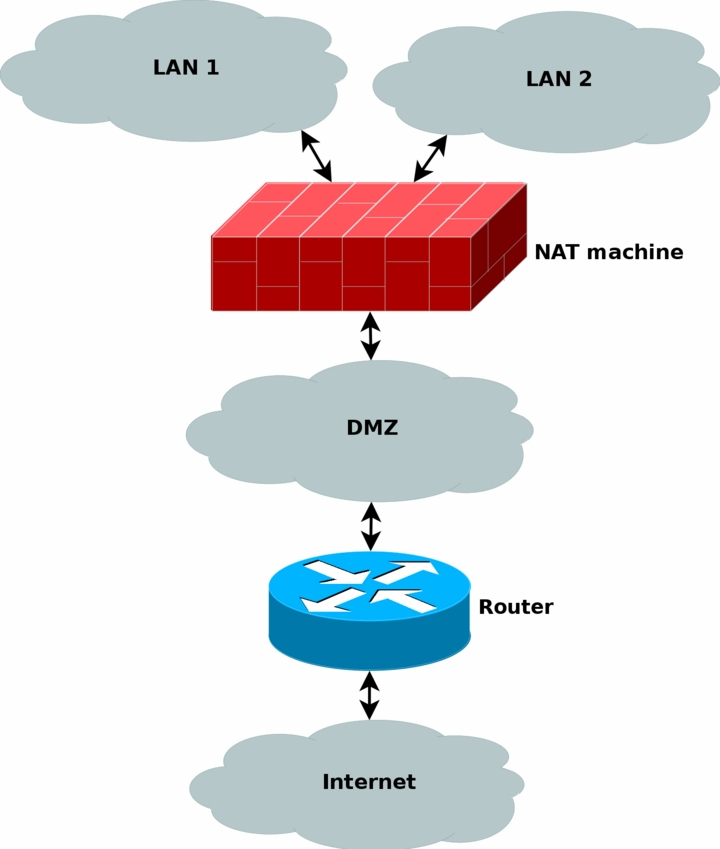
<js-ext-figcaption></js-ext-figcaption>

</js-ext-figure>

All the normal traffic from the NAT'ed networks will be sent through the DMZ directly to the router, which will send the traffic on out to the internet. Except, yes, you guessed it, webtraffic which is instead marked inside the netfilter part of the NAT machine, and then routed based on the mark and to the proxy machine. Let's take a look at what I am talking about. Say a http packet is seen by the NAT machine. The mangle table can then be used to mark the packet with a netfilter mark (also known as nfmark).

Even later when we should route the packets to our router, we will be able to check for the nfmark within the routing tables, and based on this mark, we can choose to route the http packets to the proxy server. The proxy server will then do it's work on the packets. We will touch these subjects to some extent later on in the document, even though much of the routing based part is happening inside the advanced routing topics.

The NAT machine has a public IP available over the internet, as well as the router and any other machines that may be available on the Internet. All of the machines inside the NAT'ed networks will be using private IP's, hence saving both a lot of cash, and the Internet address space.

## What's next? <a id="whats-next" ></a>

We have in this chapter in detail explained NAT and the theory around it. In special we have discussed a couple of different angles to use, and some of the normal problems that may arise from using NAT together with proxies. This chapter has covered the following areas in detail.

- NAT usage

- NAT components

- NAT history

- Terms and words used about NAT

- Hardware discussions regarding NAT

- Problems with NAT

All of this will always be of use when you are working with netfilter and iptables. NAT is very widely used in today's networks, even though it is only an intermediary solution for a very unfortunate and unexpected problem. NAT will of course be discussed more in depth later on when we start looking at the Linux netfilter and iptables implementations in more depth.

# Chapter 5. Preparations

This chapter is aimed at getting you started and to help you understand the role Netfilter and iptables play in Linux today. This chapter should hopefully get you set up and finished to go with your experimentation, and installation of your firewall. Given time and perseverance, you'll then get it to perform exactly as you want it to.

## Where to get iptables <a id="where-to-get-iptables" ></a>

The iptables user-space package can be downloaded from the _http://www.netfilter.org/_. The iptables package also makes use of kernel space facilities which can be configured into the kernel during make configure. The necessary steps will be discussed a bit further down in this document.

## Kernel setup <a id="kernel-setup" ></a>

To run the pure basics of iptables you need to configure the following options into the kernel while doing make config or one of its related commands:

- **`CONFIG_PACKET`** - This option allows applications and utilities that need to work directly with various network devices. Examples of such utilities are tcpdump or snort.

<js-ext-div class="" data-type="note">

`CONFIG_PACKET` is strictly speaking not needed for iptables to work, but since it contains so many uses, I have chosen to include it here. If you do not want it, don't include it.

</js-ext-div>

- **`CONFIG_NETFILTER`** - This option is required if you're going to use your computer as a firewall or gateway to the Internet. In other words, this is most definitely required for anything in this tutorial to work at all. I assume you will want this, since you are reading this.

And of course you need to add the proper drivers for your interfaces to work properly, i.e. Ethernet adapter, PPP and SLIP interfaces. The above will only add some of the pure basics in iptables. You won't be able to do anything productive to be honest, it just adds the framework to the kernel. If you want to use the more advanced options in Iptables, you need to set up the proper configuration options in your kernel. Here we will show you the options available in a basic 2.4.9 kernel and a brief explanation:

- **`CONFIG_IP_NF_CONNTRACK`** - This module is needed to make connection tracking. Connection tracking is used by, among other things, NAT and Masquerading. If you need to firewall machines on a LAN you most definitely should mark this option. For example, this module is required by the _rc.firewall.txt_ script to work.

- **`CONFIG_IP_NF_FTP`** - This module is required if you want to do connection tracking on FTP connections. Since FTP connections are quite hard to do connection tracking on in normal cases, conntrack needs a so called helper; this option compiles the helper. If you do not add this module you won't be able to FTP through a firewall or gateway properly.

- **`CONFIG_IP_NF_IPTABLES`** - This option is required if you want do any kind of filtering, masquerading or NAT. It adds the whole iptables identification framework to the kernel. Without this you won't be able to do anything at all with iptables.

- **`CONFIG_IP_NF_MATCH_LIMIT`** - This module isn't exactly required but it's used in the example _rc.firewall.txt_. This option provides the LIMIT match, that adds the possibility to control how many packets per minute that are to be matched, governed by an appropriate rule. For example, `-m limit` --limit 3/minute would match a maximum of 3 packets per minute. This module can also be used to avoid certain Denial of Service attacks.

- **`CONFIG_IP_NF_MATCH_MAC`** - This allows us to match packets based on MAC addresses. Every Ethernet adapter has its own MAC address. We could for instance block packets based on what MAC address is used and block a certain computer pretty well since the MAC address very seldom changes. We don't use this option in the _rc.firewall.txt_ example or anywhere else.

- **`CONFIG_IP_NF_MATCH_MARK`** - This allows us to use a MARK match. For example, if we use the target MARK we could mark a packet and then depending on if this packet is marked further on in the table, we can match based on this mark. This option is the actual match MARK, and further down we will describe the actual target MARK.

- **`CONFIG_IP_NF_MATCH_MULTIPORT`** - This module allows us to match packets with a whole range of destination ports or source ports. Normally this wouldn't be possible, but with this match it is.

- **`CONFIG_IP_NF_MATCH_TOS`** - With this match we can match packets based on their TOS field. TOS stands for _Type Of Service_. TOS can also be set by certain rules in the mangle table and via the ip/tc commands.

- **`CONFIG_IP_NF_MATCH_TCPMSS`** - This option adds the possibility for us to match TCP packets based on their MSS field.

- **`CONFIG_IP_NF_MATCH_STATE`** - This is one of the biggest news in comparison to ipchains. With this module we can do stateful matching on packets. For example, if we have already seen traffic in two directions in a TCP connection, this packet will be counted as ESTABLISHED. This module is used extensively in the _rc.firewall.txt_ example.

- **`CONFIG_IP_NF_MATCH_UNCLEAN`** - This module will add the possibility for us to match IP, TCP, UDP and ICMP packets that don't conform to type or are invalid. We could for example drop these packets, but we never know if they are legitimate or not. Note that this match is still experimental and might not work perfectly in all cases.

- **`CONFIG_IP_NF_MATCH_OWNER`** - This option will add the possibility for us to do matching based on the owner of a socket. For example, we can allow only the user root to have Internet access. This module was originally just written as an example on what could be done with the new iptables. Note that this match is still experimental and might not work for everyone.

- **`CONFIG_IP_NF_FILTER`** - This module will add the basic filter table which will enable you to do IP filtering at all. In the filter table you'll find the INPUT, FORWARD and OUTPUT chains. This module is required if you plan to do any kind of filtering on packets that you receive and send.

- **`CONFIG_IP_NF_TARGET_REJECT`** - This target allows us to specify that an ICMP error message should be sent in reply to incoming packets, instead of plainly dropping them dead to the floor. Keep in mind that TCP connections, as opposed to ICMP and UDP, are always reset or refused with a TCP RST packet.

- **`CONFIG_IP_NF_TARGET_MIRROR`** - This allows packets to be bounced back to the sender of the packet. For example, if we set up a MIRROR target on destination port HTTP on our INPUT chain and someone tries to access this port, we would bounce his packets back to him and finally he would probably see his own homepage.

<js-ext-div class="" data-type="warning">

The MIRROR target is not to be used lightly. It was originally built as a test and example module, and will most probably be very dangerous to the person setting it up (resulting in serious DDoS if among other things).

</js-ext-div>

- **`CONFIG_IP_NF_NAT`** - This module allows network address translation, or NAT, in its different forms. This option gives us access to the nat table in iptables. This option is required if we want to do port forwarding, masquerading, etc. Note that this option is not required for firewalling and masquerading of a LAN, but you should have it present unless you are able to provide unique IP addresses for all hosts. Hence, this option is required for the example _rc.firewall.txt_ script to work properly, and most definitely on your network if you do not have the ability to add unique IP addresses as specified above.

- **`CONFIG_IP_NF_TARGET_MASQUERADE`** - This module adds the MASQUERADE target. For instance if we don't know what IP we have to the Internet this would be the preferred way of getting the IP instead of using DNAT or SNAT. In other words, if we use DHCP, PPP, SLIP or some other connection that assigns us an IP, we need to use this target instead of SNAT. Masquerading gives a slightly higher load on the computer than NAT, but will work without us knowing the IP address in advance.

- **`CONFIG_IP_NF_TARGET_REDIRECT`** - This target is useful together with application proxies, for example. Instead of letting a packet pass right through, we remap them to go to our local box instead. In other words, we have the possibility to make a transparent proxy this way.

- **`CONFIG_IP_NF_TARGET_LOG`** - This adds the LOG target and its functionality to iptables. We can use this module to log certain packets to syslogd and hence see what is happening to the packet. This is invaluable for security audits, forensics or debugging a script you are writing.

- **`CONFIG_IP_NF_TARGET_TCPMSS`** - This option can be used to counter Internet Service Providers and servers who block ICMP Fragmentation Needed packets. This can result in web-pages not getting through, small mails getting through while larger mails don't, ssh works but scp dies after handshake, etc. We can then use the TCPMSS target to overcome this by clamping our MSS (Maximum Segment Size) to the PMTU (Path Maximum Transmit Unit).

- **`CONFIG_IP_NF_COMPAT_IPCHAINS`** - Adds a compatibility mode with the obsolete ipchains. Do not look to this as any real long term solution for solving migration from Linux 2.2 kernels to 2.4 kernels, since it may well be gone with kernel 2.6.

- **`CONFIG_IP_NF_COMPAT_IPFWADM`** - Compatibility mode with obsolescent ipfwadm. Definitely don't look to this as a real long term solution.

As you can see, there is a heap of options. I have briefly explained here what kind of extra behaviors you can expect from each module. These are only the options available in a vanilla Linux 2.4.9 kernel. If you would like to take a look at more options, I suggest you look at the patch-o-matic (POM) functions in Netfilter user-land which will add heaps of other options in the kernel.

POM fixes are additions that are supposed to be added in the kernel in the future but have not quite reached the kernel yet. This may be for various reasons - such as the patch not being stable yet, to Linus Torvalds being unable to keep up, or not wanting to let the patch in to the mainstream kernel yet since it is still experimental.

You will need the following options compiled into your kernel, or as modules, for the _rc.firewall.txt_ script to work. If you need help with the options that the other scripts need, look at the example firewall scripts section.

- `CONFIG_PACKET`

- `CONFIG_NETFILTER`

- `CONFIG_IP_NF_CONNTRACK`

- `CONFIG_IP_NF_FTP`

- `CONFIG_IP_NF_IRC`

- `CONFIG_IP_NF_IPTABLES`

- `CONFIG_IP_NF_FILTER`

- `CONFIG_IP_NF_NAT`

- `CONFIG_IP_NF_MATCH_STATE`

- `CONFIG_IP_NF_TARGET_LOG`

- `CONFIG_IP_NF_MATCH_LIMIT`

- `CONFIG_IP_NF_TARGET_MASQUERADE`

At the very least the above will be required for the _rc.firewall.txt_ script. In the other example scripts I will explain what requirements they have in their respective sections. For now, let's try to stay focused on the main script which you should be studying now.

## User-land setup <a id="user-land-setup" ></a>

First of all, let's look at how we compile the iptables package. It's important to realize that for the most part configuration and compilation of iptables goes hand in hand with the kernel configuration and compilation. Certain distributions come with the iptables package preinstalled, one of these is Red Hat. However, in old Red Hat it is disabled per default. We will check closer on how to enable it and take a look at other distributions further on in this chapter.

### Compiling the user-land applications <a id="compiling-the-user-land-applications" ></a>

First of all unpack the iptables package. Here, we have used the _iptables 1.2.6a_ package and a vanilla 2.4 kernel. Unpack as usual, using `bzip2 -cd iptables-1.2.6a.tar.bz2 | tar -xvf -` (this can also be accomplished with the `tar -xjvf iptables-1.2.6a.tar.bz2`, which should do pretty much the same as the first command. However, this may not work with older versions of tar). The package should now be unpacked properly into a directory named iptables-1.2.6a. For more information read the `iptables-1.2.6a/INSTALL` file which contains pretty good information on compiling and getting the program to run.

After this, there you have the option of configuring and installing extra modules and options etcetera for the kernel.The step described here will only check and install standard patches that are pending for inclusion to the kernel, there are some even more experimental patches further along, which may only be available when you carry out other steps.

<js-ext-div class="" data-type="note">

Some of these patches are highly experimental and may not be such a good idea to install them. However, there are heaps of extremely interesting matches and targets in this installation step so don't be afraid of at least looking at them.

</js-ext-div>

To carry out this step we do something like this from the root of the iptables package:

```console
$ make pending-patches KERNEL_DIR=/usr/src/linux/
```

The variable `KERNEL_DIR` should point to the actual place that your kernel source is located at. Normally this should be `/usr/src/linux/` but this may vary, and most probably you will know yourself where the kernel source is available.

The above command only asks about certain patches that are just about to enter the kernel anyway. There might be more patches and additions that the developers of Netfilter are about to add to the kernel, but is a bit further away from actually getting there. One way to install these is by doing the following:

```console
$ make most-of-pom KERNEL_DIR=/usr/src/linux/
```

The above command would ask about installing parts of what in Netfilter world is called patch-o-matic, but still skip the most extreme patches that might cause havoc in your kernel. Note that we say ask, because that's what these commands actually do. They ask you before anything is changed in the kernel source. To be able to install _all_ of the patch-o-matic stuff you will need to run the following command:

```console
$ make patch-o-matic KERNEL_DIR=/usr/src/linux/
```

Don't forget to read the help for each patch thoroughly before doing anything. Some patches will destroy other patches while others may destroy your kernel if used together with some patches from patch-o-matic etc.

<js-ext-div class="" data-type="note">

You may totally ignore the above steps if you don't want to patch your kernel, it is in other words not necessary to do the above. However, there are some really interesting things in the patch-o-matic that you may want to look at so there's nothing bad in just running the commands and see what they contain.

</js-ext-div>

After this you are finished doing the patch-o-matic parts of installation, you may now compile a new kernel making use of the new patches that you have added to the source. Don't forget to configure the kernel again since the new patches probably are not added to the configured options. You may wait with the kernel compilation until after the compilation of the user-land program iptables if you feel like it, though.

Continue by compiling the iptables user-land application. To compile iptables you issue a simple command that looks like this:

```console
$ make KERNEL_DIR=/usr/src/linux/
```

The user-land application should now compile properly. If not, you are on your own, or you could subscribe to the _Netfilter mailing list_, where you have the chance of asking for help with your problems. There are a few things that might go wrong with the installation of iptables, so don't panic if it won't work. Try to think logically about it and find out what's wrong, or get someone to help you.

If everything has worked smoothly, you're ready to install the binaries by now. To do this, you would issue the following command to install them:

```console
$ make install KERNEL_DIR=/usr/src/linux/
```

Hopefully everything should work in the program now. To use any of the changes in the iptables user-land applications you should now recompile and reinstall your kernel and modules, if you hadn't done so before. For more information about installing the user-land applications from source, check the `INSTALL` file in the source which contains excellent information on the subject of installation.

## What's next? <a id="whats-next" ></a>

This chapter has discussed how to get and how to install iptables and netfilter on some common platforms. In most modern Linux distributions iptables will come with the default installation, but sometimes it might be necessary to compile your own kernel and iptables binaries to get the absolutely latest updates. This chapter should have been a small help managing this.

The next chapter will discuss how tables and chains are traversed, and in what order this happens and so forth. This is very important to comprehend to be able to build your own working rulesets in the future. All the different tables will be discussed in some depth also since they are created for different purposes.

# Chapter 6. Traversing of tables and chains

In this chapter we'll discuss how packets traverse the different chains, and in which order. We will also discuss the order in which the tables are traversed. We'll see how valuable this is later on, when we write our own specific rules. We will also look at the points which certain other components, that also are kernel dependent, enter into the picture. Which is to say the different routing decisions and so on. This is especially necessary if we want to write iptables rules that could change routing patterns/rules for packets; i.e. why and how the packets get routed, good examples of this are DNAT and SNAT. Not to be forgotten are, of course, the TOS bits.

## General <a id="general" ></a>

When a packet first enters the firewall, it hits the hardware and then gets passed on to the proper device driver in the kernel. Then the packet starts to go through a series of steps in the kernel, before it is either sent to the correct application (locally), or forwarded to another host - or whatever happens to it.

First, let us have a look at a packet that is destined for our own local host. It would pass through the following steps before actually being delivered to our application that receives it:

**Table 6-1. Destination local host (our own machine)**

| Step | Table  | Chain      | Comment                                                                                                                                                                                                                           |
| :--- | :----- | :--------- | :-------------------------------------------------------------------------------------------------------------------------------------------------------------------------------------------------------------------------------- |
| 1    | NA     | NA         | On the wire (e.g., Internet)                                                                                                                                                                                                      |
| 2    | NA     | NA         | Comes in on the interface (e.g., eth0)                                                                                                                                                                                            |
| 3    | raw    | PREROUTING | This chain is used to handle packets before the connection tracking takes place. It can be used to set a specific connection not to be handled by the connection tracking code for example.                                       |
| 4    | NA     | NA         | This is when the connection tracking code takes place as discussed in the _The state machine_ chapter.                                                                                                                            |
| 5    | mangle | PREROUTING | This chain is normally used for mangling packets, i.e., changing TOS and so on.                                                                                                                                                   |
| 6    | nat    | PREROUTING | This chain is used for DNAT mainly. Avoid filtering in this chain since it will be bypassed in certain cases.                                                                                                                     |
| 7    | NA     | NA         | Routing decision, i.e., is the packet destined for our local host or to be forwarded and where.                                                                                                                                   |
| 8    | mangle | INPUT      | At this point, the mangle INPUT chain is hit. We use this chain to mangle packets, after they have been routed, but before they are actually sent to the process on the machine.                                                  |
| 9    | filter | INPUT      | This is where we do filtering for all incoming traffic destined for our local host. Note that all incoming packets destined for this host pass through this chain, no matter what interface or in which direction they came from. |
| 10   | NA     | NA         | Local process or application (i.e., server or client program).                                                                                                                                                                    |

Note that this time the packet was passed through the INPUT chain instead of the FORWARD chain. Quite logical. Most probably the only thing that's really logical about the traversing of tables and chains in your eyes in the beginning, but if you continue to think about it, you'll find it will get clearer in time.

Now we look at the outgoing packets from our own local host and what steps they go through.

**Table 6-2. Source local host (our own machine)**

| Step | Table  | Chain       | Comment                                                                                                                                                                                                                                                                                     |
| :--- | :----- | :---------- | :------------------------------------------------------------------------------------------------------------------------------------------------------------------------------------------------------------------------------------------------------------------------------------------ |
| 1    | NA     | NA          | Local process/application (i.e., server/client program)                                                                                                                                                                                                                                     |
| 2    | NA     | NA          | Routing decision. What source address to use, what outgoing interface to use, and other necessary information that needs to be gathered.                                                                                                                                                    |
| 3    | raw    | OUTPUT      | This is where you do work before the connection tracking has taken place for locally generated packets. You can mark connections so that they will not be tracked for example.                                                                                                              |
| 4    | NA     | NA          | This is where the connection tracking takes place for locally generated packets, for example state changes et cetera. This is discussed in more detail in the _The state machine_ chapter.                                                                                                  |
| 5    | mangle | OUTPUT      | This is where we mangle packets, it is suggested that you do not filter in this chain since it can have side effects.                                                                                                                                                                       |
| 6    | nat    | OUTPUT      | This chain can be used to NAT outgoing packets from the firewall itself.                                                                                                                                                                                                                    |
| 7    | NA     | NA          | Routing decision, since the previous mangle and nat changes may have changed how the packet should be routed.                                                                                                                                                                               |
| 8    | filter | OUTPUT      | This is where we filter packets going out from the local host.                                                                                                                                                                                                                              |
| 9    | mangle | POSTROUTING | The POSTROUTING chain in the mangle table is mainly used when we want to do mangling on packets before they leave our host, but after the actual routing decisions. This chain will be hit by both packets just traversing the firewall, as well as packets created by the firewall itself. |
| 10   | nat    | POSTROUTING | This is where we do SNAT as described earlier. It is suggested that you don't do filtering here since it can have side effects, and certain packets might slip through even though you set a default policy of DROP.                                                                        |
| 11   | NA     | NA          | Goes out on some interface (e.g., eth0)                                                                                                                                                                                                                                                     |
| 12   | NA     | NA          | On the wire (e.g., Internet)                                                                                                                                                                                                                                                                |

In this example, we're assuming that the packet is destined for another host on another network. The packet goes through the different steps in the following fashion:

**Table 6-3. Forwarded packets**

| Step | Table  | Chain       | Comment                                                                                                                                                                                                                                                                  |
| :--- | :----- | :---------- | :----------------------------------------------------------------------------------------------------------------------------------------------------------------------------------------------------------------------------------------------------------------------- |
| 1    | NA     | NA          | On the wire (i.e., Internet)                                                                                                                                                                                                                                             |
| 2    | NA     | NA          | Comes in on the interface (i.e., eth0)                                                                                                                                                                                                                                   |
| 3    | raw    | PREROUTING  | Here you can set a connection to not be handled by the connection tracking system.                                                                                                                                                                                       |
| 4    | NA     | NA          | This is where the non-locally generated connection tracking takes place, and is also discussed more in detail in the _The state machine_ chapter.                                                                                                                        |
| 5    | mangle | PREROUTING  | This chain is normally used for mangling packets, i.e., changing TOS and so on.                                                                                                                                                                                          |
| 6    | nat    | PREROUTING  | This chain is used for DNAT mainly. SNAT is done further on. Avoid filtering in this chain since it will be bypassed in certain cases.                                                                                                                                   |
| 7    | NA     | NA          | Routing decision, i.e., is the packet destined for our local host or to be forwarded and where.                                                                                                                                                                          |
| 8    | mangle | FORWARD     | The packet is then sent on to the FORWARD chain of the mangle table. This can be used for very specific needs, where we want to mangle the packets after the initial routing decision, but before the last routing decision made just before the packet is sent out.     |
| 9    | filter | FORWARD     | The packet gets routed onto the FORWARD chain. Only forwarded packets go through here, and here we do all the filtering. Note that all traffic that's forwarded goes through here (not only in one direction), so you need to think about it when writing your rule-set. |
| 10   | mangle | POSTROUTING | This chain is used for specific types of packet mangling that we wish to take place after all kinds of routing decisions have been done, but still on this machine.                                                                                                      |
| 11   | nat    | POSTROUTING | This chain should first and foremost be used for SNAT. Avoid doing filtering here, since certain packets might pass this chain without ever hitting it. This is also where Masquerading is done.                                                                         |
| 12   | NA     | NA          | Goes out on the outgoing interface (i.e., eth1).                                                                                                                                                                                                                         |
| 13   | NA     | NA          | Out on the wire again (i.e., LAN).                                                                                                                                                                                                                                       |

As you can see, there are quite a lot of steps to pass through. The packet can be stopped at any of the iptables chains, or anywhere else if it is malformed; however, we are mainly interested in the iptables aspect of this lot. Do note that there are no specific chains or tables for different interfaces or anything like that. FORWARD is always passed by all packets that are forwarded over this firewall/router.

<js-ext-div class="" data-type="note">

Do not use the INPUT chain to filter on in the previous scenario! INPUT is meant solely for packets to our local host that do not get routed to any other destination.

</js-ext-div>

We have now seen how the different chains are traversed in three separate scenarios. If we were to figure out a good map of all this, it would look something like this:

<js-ext-figure class="js-illustration">


<js-ext-figcaption></js-ext-figcaption>

</js-ext-figure>

To clarify this image, consider this. If we get a packet into the first routing decision that is not destined for the local machine itself, it will be routed through the FORWARD chain. If the packet is, on the other hand, destined for an IP address that the local machine is listening to, we would send the packet through the INPUT chain and to the local machine.

Also worth a note, is the fact that packets may be destined for the local machine, but the destination address may be changed within the PREROUTING chain by doing NAT. Since this takes place before the first routing decision, the packet will be looked upon after this change. Because of this, the routing may be changed before the routing decision is done. Do note, that _all_ packets will be going through one or the other path in this image. If you DNAT a packet back to the same network that it came from, it will still travel through the rest of the chains until it is back out on the network.

<js-ext-div class="" data-type="note">

If you feel that you want more information, you could use the _rc.test-iptables.txt_ script. This test script should give you the necessary rules to test how the tables and chains are traversed.

</js-ext-div>

## Mangle table <a id="mangle-table" ></a>

This table should as we've already noted mainly be used for mangling packets. In other words, you may freely use the mangle targets within this table, to change TOS (Type Of Service) fields and the like.

<js-ext-div class="" data-type="note">

You are strongly advised not to use this table for any filtering; nor will any DNAT, SNAT or Masquerading work in this table.

</js-ext-div>

The following targets are only valid in the mangle table. They can not be used outside the mangle table.

- TOS

- TTL

- MARK

- SECMARK

- CONNSECMARK

The TOS target is used to set and/or change the Type of Service field in the packet. This could be used for setting up policies on the network regarding how a packet should be routed and so on. Note that this has not been perfected and is not really implemented on the Internet and most of the routers don't care about the value in this field, and sometimes, they act faulty on what they get. Don't set this in other words for packets going to the Internet unless you want to make routing decisions on it, with iproute2.

The TTL target is used to change the TTL (Time To Live) field of the packet. We could tell packets to only have a specific TTL and so on. One good reason for this could be that we don't want to give ourself away to nosy Internet Service Providers.

Some Internet Service Providers do not like users running multiple computers on one single connection, and there are some Internet Service Providers known to look for a single host generating different TTL values, and take this as one of many signs of multiple computers connected to a single connection.

The MARK target is used to set special mark values to the packet. These marks could then be recognized by the iproute2 programs to do different routing on the packet depending on what mark they have, or if they don't have any. We could also do bandwidth limiting and Class Based Queuing based on these marks.

The SECMARK target can be used to set security context marks on single packets for usage in SELinux and other security systems that are able to handle these marks. This is then used for very fine grained security on what subsystems of the system can touch what packets et cetera. The SECMARK can also be set on a whole connection with the CONNSECMARK target.

CONNSECMARK is used to copy a security context to or from a single packet from or to the whole connection. This is then used by the SELinux and other security systems to do more fine-grained security on a connection level.

## Nat table <a id="nat-table" ></a>

This table should only be used for NAT (Network Address Translation) on different packets. In other words, it should only be used to translate the packet's source field or destination field. Note that, as we have said before, only the first packet in a stream will hit this table. After this, the rest of the packets will automatically have the same action taken on them as the first packet. The actual targets that do these kind of things are:

- DNAT

- SNAT

- MASQUERADE

- REDIRECT

The DNAT target is mainly used in cases where you have a public IP and want to redirect accesses to the firewall to some other host (on a DMZ for example). In other words, we change the destination address of the packet and reroute it to the host.

SNAT is mainly used for changing the source address of packets. For the most part you'll hide your local networks or DMZ, etc. A very good example would be that of a firewall of which we know outside IP address, but need to substitute our local network's IP numbers with that of our firewall.

With this target the firewall will automatically SNAT and De-SNAT the packets, hence making it possible to make connections from the LAN to the Internet. If your network uses 192.168.0.0/netmask for example, the packets would never get back from the Internet, because IANA has regulated these networks (among others) as private and only for use in isolated LANs.

The MASQUERADE target is used in exactly the same way as SNAT, but the MASQUERADE target takes a little bit more overhead to compute. The reason for this, is that each time that the MASQUERADE target gets hit by a packet, it automatically checks for the IP address to use, instead of doing as the SNAT target does - just using the single configured IP address. The MASQUERADE target makes it possible to work properly with Dynamic DHCP IP addresses that your ISP might provide for your PPP, PPPoE or SLIP connections to the Internet.

## Raw table <a id="raw-table" ></a>

The raw table is mainly only used for one thing, and that is to set a mark on packets that they should not be handled by the connection tracking system. This is done by using the NOTRACK target on the packet. If a connection is hit with the NOTRACK target, then conntrack will simply not track the connection.

This has been impossible to solve without adding a new table, since none of the other tables are called until after conntrack has actually been run on the packets, and been added to the conntrack tables, or matched against an already available connection. You can read more about this in the _The state machine_ chapter.

This table only has the PREROUTING and OUTPUT chains. No other chains are required since these are the only places that you can deal with packets before they actually hit the connection tracking.

<js-ext-div class="" data-type="note">

For this table to work, the iptable_raw module must be loaded. It will be loaded automatically if iptables is run with the `-t raw` keywords, and if the module is available.

The raw table is a relatively new addition to iptables and the kernel. It might not be available in early 2.6 and 2.4 kernels unless patched.

</js-ext-div>

## Filter table <a id="filter-table" ></a>

The filter table is mainly used for filtering packets. We can match packets and filter them in whatever way we want. This is the place that we actually take action against packets and look at what they contain and DROP or /ACCEPT them, depending on their content. Of course we may also do prior filtering; however, this particular table is the place for which filtering was designed. Almost all targets are usable in this table. We will be more prolific about the filter table here; however you now know that this table is the right place to do your main filtering.

## User specified chains <a id="user-specified-chains" ></a>

If a packet enters a chain such as the INPUT chain in the filter table, we can specify a jump rule to a different chain within the same table. The new chain must be userspecified, it may not be a built-in chain such as the INPUT or FORWARD chain for example. If we consider a pointer pointing at the rule in the chain to execute, the pointer will go down from rule to rule, from top to bottom until the chain traversal is either ended by a target or the main chain (I.e., FORWARD, INPUT, et cetera) ends. Once this happens, the default policy of the built-in chain will be applied.

<js-ext-figure class="js-illustration">


<js-ext-figcaption></js-ext-figcaption>

</js-ext-figure>

If one of the rules that matches points to another userspecified chain in the jump specification, the pointer will jump over to this chain and then start traversing that chain from the top to bottom. For example, see how the rule execution jumps from rule number 3 to chain 2 in the above image. The packet matched the matches contained in rule 3, and the jump/target specification was set to send the packet on for further examination in chain 2.

<js-ext-div class="" data-type="note">

Userspecified chains can not have a default policy at the end of the chain. Only built in chains can have this. This can be circumvented by appending a single rule at the end of the chain that has no matches, and hence it will behave as a default policy.

If no rule is matched in a userspecified chain, the default behaviour is to jump back to the originating chain. As seen in the image above, the rule execution jumps from chain 2 and back to chain 1 rule 4, below the rule that sent the rule execution into chain 2 to begin with.

</js-ext-div>

Each and every rule in the user specified chain is traversed until either one of the rules matches -- then the target specifies if the traversing should end or continue -- or the end of the chain is reached. If the end of the user specified chain is reached, the packet is sent back to the invoking chain. The invoking chain can be either a user specified chain or a built-in chain.

## What's next? <a id="whats-next" ></a>

In this chapter we have discussed several of the chains and tables and how they are traversed, including the standard built-in chains and userspecified chains. This is a very important area to understand. It may be simple, but unless fully understood, fatal mistakes can be equally easily.

The next chapter will deal in depth with the state machine of netfilter, and how states are traversed and set on packets in a connection tracking machine. The next chapter is in other words just as important as this chapter has been.

# Chapter 7. The state machine

This chapter will deal with the state machine and explain it in detail. After reading through it, you should have a complete understanding of how the State machine works. We will also go through a large set of examples on how states are dealt with within the state machine itself. These should clarify everything in practice.

## Introduction <a id="introduction" ></a>

The state machine is a special part within iptables that should really not be called the state machine at all, since it is really a connection tracking machine. However, most people recognize it under the first name. Throughout this chapter I will use these names more or less as if they were synonymous. This should not be overly confusing.

Connection tracking is done to let the Netfilter framework know the state of a specific connection. Firewalls that implement this are generally called stateful firewalls. A stateful firewall is generally much more secure than non-stateful firewalls since it allows us to write much tighter rule-sets.

Within iptables, packets can be related to tracked connections in four different so called states. These are known as NEW, ESTABLISHED, RELATED and INVALID. We will discuss each of these in more depth later. With the --state match we can easily control who or what is allowed to initiate new sessions.

All of the connection tracking is done by special framework within the kernel called conntrack. conntrack may be loaded either as a module, or as an internal part of the kernel itself. Most of the time, we need and want more specific connection tracking than the default conntrack engine can maintain. Because of this, there are also more specific parts of conntrack that handles the TCP, UDP or ICMP protocols among others. These modules grab specific, unique, information from the packets, so that they may keep track of each stream of data.

The information that conntrack gathers is then used to tell conntrack in which state the stream is currently in. For example, UDP streams are, generally, uniquely identified by their destination IP address, source IP address, destination port and source port.

In previous kernels, we had the possibility to turn on and off defragmentation. However, since iptables and Netfilter were introduced and connection tracking in particular, this option was gotten rid of. The reason for this is that connection tracking can not work properly without defragmenting packets, and hence defragmenting has been incorporated into conntrack and is carried out automatically. It can not be turned off, except by turning off connection tracking. Defragmentation is always carried out if connection tracking is turned on.

All connection tracking is handled in the PREROUTING chain, except locally generated packets which are handled in the OUTPUT chain. What this means is that iptables will do all recalculation of states and so on within the PREROUTING chain.

If we send the initial packet in a stream, the state gets set to NEW within the OUTPUT chain, and when we receive a return packet, the state gets changed in the PREROUTING chain to ESTABLISHED, and so on. If the first packet is not originated by ourself, the NEW state is set within the PREROUTING chain of course. So, all state changes and calculations are done within the PREROUTING and OUTPUT chains of the nat table.

## The conntrack entries <a id="the-conntrack-entries" ></a>

Let's take a brief look at a conntrack entry and how to read them in `/proc/net/ip_conntrack`. This gives a list of all the current entries in your conntrack database. If you have the ip_conntrack module loaded, a cat of `/proc/net/ip_conntrack` might look like:

```txt
tcp      6 117 SYN_SENT src=192.168.1.6 dst=192.168.1.9 sport=32775 \
     dport=22 [UNREPLIED] src=192.168.1.9 dst=192.168.1.6 sport=22 \
     dport=32775 [ASSURED] use=2
```

This example contains all the information that the conntrack module maintains to know which state a specific connection is in. First of all, we have a protocol, which in this case is tcp. Next, the same value in normal decimal coding. After this, we see how long this conntrack entry has to live. This value is set to 117 seconds right now and is decremented regularly until we see more traffic. This value is then reset to the default value for the specific state that it is in at that relevant point of time.

Next comes the actual state that this entry is in at the present point of time. In the above mentioned case we are looking at a packet that is in the `SYN_SENT` state. The internal value of a connection is slightly different from the ones used externally with iptables. The value `SYN_SENT` tells us that we are looking at a connection that has only seen a TCP SYN packet in one direction.

Next, we see the source IP address, destination IP address, source port and destination port. At this point we see a specific keyword that tells us that we have seen no return traffic for this connection. Lastly, we see what we expect of return packets. The information details the source IP address and destination IP address (which are both inverted, since the packet is to be directed back to us). The same thing goes for the source port and destination port of the connection. These are the values that should be of any interest to us.

The connection tracking entries may take on a series of different values, all specified in the conntrack headers available in `linux/include/netfilter-ipv4/ip_conntrack*.h` files. These values are dependent on which sub-protocol of IP we use.

TCP, UDP or ICMP protocols take specific default values as specified in `linux/include/netfilter-ipv4/ip_conntrack.h`. We will look closer at this when we look at each of the protocols; however, we will not use them extensively through this chapter, since they are not used outside of the conntrack internals. Also, depending on how this state changes, the default value of the time until the connection is destroyed will also change.

<js-ext-div class="" data-type="note">

Recently there was a new patch made available in iptables patch-o-matic, called tcp-window-tracking. This patch adds, among other things, all of the above timeouts to special sysctl variables, which means that they can be changed on the fly, while the system is still running. Hence, this makes it unnecessary to recompile the kernel every time you want to change the timeouts.

</js-ext-div>

These can be altered via using specific system calls available in the `/proc/sys/net/ipv4/netfilter` directory. You should in particular look at the `/proc/sys/net/ipv4/netfilter/ip_ct_*` variables.

When a connection has seen traffic in both directions, the conntrack entry will erase the [UNREPLIED] flag, and then reset it. The entry that tells us that the connection has not seen any traffic in both directions, will be replaced by the [ASSURED] flag, to be found close to the end of the entry. The [ASSURED] flag tells us that this connection is assured and that it will not be erased if we reach the maximum possible tracked connections.

Thus, connections marked as [ASSURED] will not be erased, contrary to the non-assured connections (those not marked as [ASSURED]). How many connections that the connection tracking table can hold depends upon a variable that can be set through the ip-sysctl functions in recent kernels. The default value held by this entry varies heavily depending on how much memory you have. On 128 MB of RAM you will get 8192 possible entries, and at 256 MB of RAM, you will get 16376 entries. You can read and set your settings through the `/proc/sys/net/ipv4/ip_conntrack_max` setting.

A different way of doing this, that is more efficient, is to set the hashsize option to the `ip_conntrack` module once this is loaded. Under normal circumstances `ip_conntrack_max` equals 8 \* hashsize. In other words, setting the hashsize to 4096 will result in `ip_conntrack_max` being set to 32768 conntrack entries. An example of this would be:

```console
# modprobe ip_conntrack hashsize=4096
# cat /proc/sys/net/ipv4/ip_conntrack_max
32768
#
```

## User-land states <a id="user-land-states" ></a>

As you have seen, packets may take on several different states within the kernel itself, depending on what protocol we are talking about. However, outside the kernel, we only have the 4 states as described previously. These states can mainly be used in conjunction with the state match which will then be able to match packets based on their current connection tracking state. The valid states are NEW, ESTABLISHED, RELATED and INVALID. The following table will briefly explain each possible state.

**Table 7-1. User-land states**

| State       | Explanation                                                                                                                                                                                                                                                                                                                                                                                                                                                                                                                                                                                                                                                                                                                                                                                                                                                                                                                                                                                                                                                                                         |
| :---------- | :-------------------------------------------------------------------------------------------------------------------------------------------------------------------------------------------------------------------------------------------------------------------------------------------------------------------------------------------------------------------------------------------------------------------------------------------------------------------------------------------------------------------------------------------------------------------------------------------------------------------------------------------------------------------------------------------------------------------------------------------------------------------------------------------------------------------------------------------------------------------------------------------------------------------------------------------------------------------------------------------------------------------------------------------------------------------------------------------------- |
| NEW         | The NEW state tells us that the packet is the first packet that we see. This means that the first packet that the conntrack module sees, within a specific connection, will be matched. For example, if we see a SYN packet and it is the first packet in a connection that we see, it will match. However, the packet may as well not be a SYN packet and still be considered NEW. This may lead to certain problems in some instances, but it may also be extremely helpful when we need to pick up lost connections from other firewalls, or when a connection has already timed out, but in reality is not closed.                                                                                                                                                                                                                                                                                                                                                                                                                                                                              |
| ESTABLISHED | The ESTABLISHED state has seen traffic in both directions and will then continuously match those packets. ESTABLISHED connections are fairly easy to understand. The only requirement to get into an ESTABLISHED state is that one host sends a packet, and that it later on gets a reply from the other host. The NEW state will upon receipt of the reply packet to or through the firewall change to the ESTABLISHED state. ICMP reply messages can also be considered as ESTABLISHED, if we created a packet that in turn generated the reply ICMP message.                                                                                                                                                                                                                                                                                                                                                                                                                                                                                                                                     |
| RELATED     | The RELATED state is one of the more tricky states. A connection is considered RELATED when it is related to another already ESTABLISHED connection. What this means, is that for a connection to be considered as RELATED, we must first have a connection that is considered ESTABLISHED. The ESTABLISHED connection will then spawn a connection outside of the main connection. The newly spawned connection will then be considered RELATED, if the conntrack module is able to understand that it is RELATED. Some good examples of connections that can be considered as RELATED are the FTP-data connections that are considered RELATED to the FTP control port, and the DCC connections issued through IRC. This could be used to allow ICMP error messages, FTP transfers and DCC's to work properly through the firewall. Do note that most TCP protocols and some UDP protocols that rely on this mechanism are quite complex and send connection information within the payload of the TCP or UDP data segments, and hence require special helper modules to be correctly understood. |
| INVALID     | The INVALID state means that the packet can't be identified or that it does not have any state. This may be due to several reasons, such as the system running out of memory or ICMP error messages that do not respond to any known connections. Generally, it is a good idea to DROP everything in this state.                                                                                                                                                                                                                                                                                                                                                                                                                                                                                                                                                                                                                                                                                                                                                                                    |
| UNTRACKED   | This is the UNTRACKED state. In brief, if a packet is marked within the raw table with the NOTRACK target, then that packet will show up as UNTRACKED in the state machine. This also means that all RELATED connections will not be seen, so some caution must be taken when dealing with the UNTRACKED connections since the state machine will not be able to see related ICMP messages et cetera.                                                                                                                                                                                                                                                                                                                                                                                                                                                                                                                                                                                                                                                                                               |

These states can be used together with the --state match to match packets based on their connection tracking state. This is what makes the state machine so incredibly strong and efficient for our firewall. Previously, we often had to open up all ports above 1024 to let all traffic back into our local networks again. With the state machine in place this is not necessary any longer, since we can now just open up the firewall for return traffic and not for all kinds of other traffic.

## TCP connections <a id="tcp-connections" ></a>

In this section and the upcoming ones, we will take a closer look at the states and how they are handled for each of the three basic protocols TCP, UDP and ICMP. Also, we will take a closer look at how connections are handled per default, if they can not be classified as either of these three protocols. We have chosen to start out with the TCP protocol since it is a stateful protocol in itself, and has a lot of interesting details with regard to the state machine in iptables.

A TCP connection is always initiated with the 3-way handshake, which establishes and negotiates the actual connection over which data will be sent. The whole session is begun with a SYN packet, then a SYN/ACK packet and finally an ACK packet to acknowledge the whole session establishment. At this point the connection is established and able to start sending data. The big problem is, how does connection tracking hook up into this? Quite simply really.

As far as the user is concerned, connection tracking works basically the same for all connection types. Have a look at the picture below to see exactly what state the stream enters during the different stages of the connection. As you can see, the connection tracking code does not really follow the flow of the TCP connection, from the users viewpoint. Once it has seen one packet(the SYN), it considers the connection as NEW. Once it sees the return packet(SYN/ACK), it considers the connection as ESTABLISHED.

If you think about this a second, you will understand why. With this particular implementation, you can allow NEW and ESTABLISHED packets to leave your local network, only allow ESTABLISHED connections back, and that will work perfectly. Conversely, if the connection tracking machine were to consider the whole connection establishment as NEW, we would never really be able to stop outside connections to our local network, since we would have to allow NEW packets back in again.

To make things more complicated, there are a number of other internal states that are used for TCP connections inside the kernel, but which are not available for us in User-land. Roughly, they follow the state standards specified within _RFC 793 - Transmission Control Protocol_ on pages 21-23. We will consider these in more detail further along in this section.

<js-ext-figure class="js-illustration">

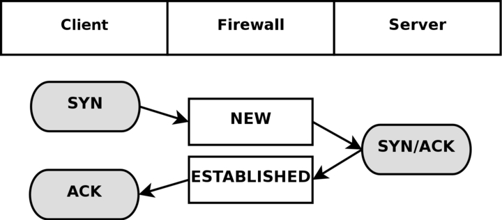
<js-ext-figcaption></js-ext-figcaption>

</js-ext-figure>

As you can see, it is really quite simple, seen from the user's point of view. However, looking at the whole construction from the kernel's point of view, it's a little more difficult. Let's look at an example. Consider exactly how the connection states change in the `/proc/net/ip_conntrack` table. The first state is reported upon receipt of the first SYN packet in a connection.

```txt
tcp      6 117 SYN_SENT src=192.168.1.5 dst=192.168.1.35 sport=1031 \
     dport=23 [UNREPLIED] src=192.168.1.35 dst=192.168.1.5 sport=23 \
     dport=1031 use=1
```

As you can see from the above entry, we have a precise state in which a SYN packet has been sent, (the SYN_SENT flag is set), and to which as yet no reply has been sent (witness the [UNREPLIED] flag). The next internal state will be reached when we see another packet in the other direction.

```txt
tcp      6 57 SYN_RECV src=192.168.1.5 dst=192.168.1.35 sport=1031 \
     dport=23 src=192.168.1.35 dst=192.168.1.5 sport=23 dport=1031 \
     use=1
```

Now we have received a corresponding SYN/ACK in return. As soon as this packet has been received, the state changes once again, this time to SYN_RECV. SYN_RECV tells us that the original SYN was delivered correctly and that the SYN/ACK return packet also got through the firewall properly. Moreover, this connection tracking entry has now seen traffic in both directions and is hence considered as having been replied to. This is not explicit, but rather assumed, as was the [UNREPLIED] flag above. The final step will be reached once we have seen the final ACK in the 3-way handshake.

```txt
tcp      6 431999 ESTABLISHED src=192.168.1.5 dst=192.168.1.35 \
     sport=1031 dport=23 src=192.168.1.35 dst=192.168.1.5 \
     sport=23 dport=1031 [ASSURED] use=1
```

In the last example, we have gotten the final ACK in the 3-way handshake and the connection has entered the ESTABLISHED state, as far as the internal mechanisms of iptables are aware. Normally, the stream will be ASSURED by now.

A connection may also enter the ESTABLISHED state, but not be[ASSURED]. This happens if we have connection pickup turned on (Requires the tcp-window-tracking patch, and the ip_conntrack_tcp_loose to be set to 1 or higher). The default, without the tcp-window-tracking patch, is to have this behaviour, and is not changeable.

When a TCP connection is closed down, it is done in the following way and takes the following states.

<js-ext-figure class="js-illustration">


<js-ext-figcaption></js-ext-figcaption>

</js-ext-figure>

As you can see, the connection is never really closed until the last ACK is sent. Do note that this picture only describes how it is closed down under normal circumstances. A connection may also, for example, be closed by sending a RST(reset), if the connection were to be refused. In this case, the connection would be closed down immediately.

When the TCP connection has been closed down, the connection enters the `TIME_WAIT` state, which is per default set to 2 minutes. This is used so that all packets that have gotten out of order can still get through our rule-set, even after the connection has already closed. This is used as a kind of buffer time so that packets that have gotten stuck in one or another congested router can still get to the firewall, or to the other end of the connection.

If the connection is reset by a RST packet, the state is changed to CLOSE. This means that the connection per default has 10 seconds before the whole connection is definitely closed down. RST packets are not acknowledged in any sense, and will break the connection directly. There are also other states than the ones we have told you about so far. Here is the complete list of possible states that a TCP stream may take, and their timeout values.

**Table 7-2. Internal states**

| State       | Timeout value |
| :---------- | :------------ |
| NONE        | 30 minutes    |
| ESTABLISHED | 5 days        |
| SYN_SENT    | 2 minutes     |
| SYN_RECV    | 60 seconds    |
| FIN_WAIT    | 2 minutes     |
| TIME_WAIT   | 2 minutes     |
| CLOSE       | 10 seconds    |
| CLOSE_WAIT  | 12 hours      |
| LAST_ACK    | 30 seconds    |
| LISTEN      | 2 minutes     |

These values are most definitely not absolute. They may change with kernel revisions, and they may also be changed via the proc file-system in the `/proc/sys/net/ipv4/netfilter/ip_ct_tcp_*` variables. The default values should, however, be fairly well established in practice. These values are set in seconds. Early versions of the patch used jiffies (which was a bug).

<js-ext-div class="" data-type="note">

Also note that the User-land side of the state machine does not look at TCP flags (i.e., RST, ACK, and SYN are flags) set in the TCP packets. This is generally bad, since you may want to allow packets in the NEW state to get through the firewall, but when you specify the NEW flag, you will in most cases mean SYN packets.

This is not what happens with the current state implementation; instead, even a packet with no bit set or an ACK flag, will count as NEW. This can be used for redundant firewalling and so on, but it is generally extremely bad on your home network, where you only have a single firewall.

To get around this behavior, you could use the command explained in the _State NEW packets but no SYN bit set_ section of the _Common problems and questions_ appendix. Another way is to install the tcp-window-tracking extension from patch-o-matic, and set the `/proc/sys/net/ipv4/netfilter/ip_conntrack_tcp_loose` to zero, which will make the firewall drop all NEW packets with anything but the SYN flag set.

</js-ext-div>

## UDP connections <a id="udp-connections" ></a>

UDP connections are in themselves not stateful connections, but rather stateless. There are several reasons why, mainly because they don't contain any connection establishment or connection closing; most of all they lack sequencing. Receiving two UDP datagrams in a specific order does not say anything about the order in which they were sent. It is, however, still possible to set states on the connections within the kernel. Let's have a look at how a connection can be tracked and how it might look in conntrack.

<js-ext-figure class="js-illustration">

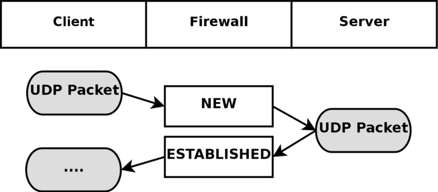
<js-ext-figcaption></js-ext-figcaption>

</js-ext-figure>

As you can see, the connection is brought up almost exactly in the same way as a TCP connection. That is, from the user-land point of view. Internally, conntrack information looks quite a bit different, but intrinsically the details are the same. First of all, let's have a look at the entry after the initial UDP packet has been sent.

```txt
udp      17 20 src=192.168.1.2 dst=192.168.1.5 sport=137 dport=1025 \
     [UNREPLIED] src=192.168.1.5 dst=192.168.1.2 sport=1025 \
     dport=137 use=1
```

As you can see from the first and second values, this is an UDP packet. The first is the protocol name, and the second is protocol number. This is just the same as for TCP connections. The third value marks how many seconds this state entry has to live. After this, we get the values of the packet that we have seen and the future expectations of packets over this connection reaching us from the initiating packet sender.

These are the source, destination, source port and destination port. At this point, the [UNREPLIED] flag tells us that there's so far been no response to the packet. Finally, we get a brief list of the expectations for returning packets. Do note that the latter entries are in reverse order to the first values. The timeout at this point is set to 30 seconds, as per default.

```txt
udp      17 170 src=192.168.1.2 dst=192.168.1.5 sport=137 \
     dport=1025 src=192.168.1.5 dst=192.168.1.2 sport=1025 \
     dport=137 [ASSURED] use=1
```

At this point the server has seen a reply to the first packet sent out and the connection is now considered as ESTABLISHED. This is not shown in the connection tracking, as you can see. The main difference is that the [UNREPLIED] flag has now gone.

Moreover, the default timeout has changed to 180 seconds - but in this example that's by now been decremented to 170 seconds - in 10 seconds' time, it will be 160 seconds. There's one thing that's missing, though, and can change a bit, and that is the [ASSURED] flag described above. For the [ASSURED] flag to be set on a tracked connection, there must have been a legitimate reply packet to the NEW packet.

```txt
udp      17 175 src=192.168.1.5 dst=195.22.79.2 sport=1025 \
     dport=53 src=195.22.79.2 dst=192.168.1.5 sport=53 \
     dport=1025 [ASSURED] use=1
```

At this point, the connection has become assured. The connection looks exactly the same as the previous example. If this connection is not used for 180 seconds, it times out. 180 Seconds is a comparatively low value, but should be sufficient for most use. This value is reset to its full value for each packet that matches the same entry and passes through the firewall, just the same as for all of the internal states.

## ICMP connections <a id="icmp-connections" ></a>

ICMP packets are far from a stateful stream, since they are only used for controlling and should never establish any connections. There are four ICMP types that will generate return packets however, and these have 2 different states. These ICMP messages can take the NEW and ESTABLISHED states. The ICMP types we are talking about are Echo request and reply, Timestamp request and reply, Information request and reply and finally Address mask request and reply. Out of these, the timestamp request and information request are obsolete and could most probably just be dropped. However, the Echo messages are used in several setups such as pinging hosts. Address mask requests are not used often, but could be useful at times and worth allowing. To get an idea of how this could look, have a look at the following image.

<js-ext-figure class="js-illustration">

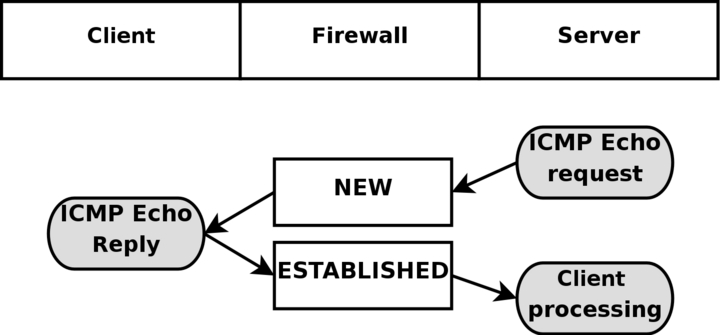
<js-ext-figcaption></js-ext-figcaption>

</js-ext-figure>

As you can see in the above picture, the host sends an echo request to the target, which is considered as NEW by the firewall. The target then responds with a echo reply which the firewall considers as state ESTABLISHED. When the first echo request has been seen, the following state entry goes into the `ip_conntrack`.

```bash
icmp     1 25 src=192.168.1.6 dst=192.168.1.10 type=8 code=0 \
     id=33029 [UNREPLIED] src=192.168.1.10 dst=192.168.1.6 \
     type=0 code=0 id=33029 use=1
```

This entry looks a little bit different from the standard states for TCP and UDP as you can see. The protocol is there, and the timeout, as well as source and destination addresses. The problem comes after that however. We now have 3 new fields called type, code and id. They are not special in any way, the type field contains the ICMP type and the code field contains the ICMP code. These are all available in _ICMP types_ appendix.

The final id field, contains the ICMP ID. Each ICMP packet gets an ID set to it when it is sent, and when the receiver gets the ICMP message, it sets the same ID within the new ICMP message so that the sender will recognize the reply and will be able to connect it with the correct ICMP request.

The next field, we once again recognize as the [UNREPLIED] flag, which we have seen before. Just as before, this flag tells us that we are currently looking at a connection tracking entry that has seen only traffic in one direction.

Finally, we see the reply expectation for the reply ICMP packet, which is the inversion of the original source and destination IP addresses. As for the type and code, these are changed to the correct values for the return packet, so an echo request is changed to echo reply and so on. The ICMP ID is preserved from the request packet.

The reply packet is considered as being ESTABLISHED, as we have already explained. However, we can know for sure that after the ICMP reply, there will be absolutely no more legal traffic in the same connection. For this reason, the connection tracking entry is destroyed once the reply has traveled all the way through the Netfilter structure.

In each of the above cases, the request is considered as NEW, while the reply is considered as ESTABLISHED. Let's consider this more closely. When the firewall sees a request packet, it considers it as NEW. When the host sends a reply packet to the request it is considered ESTABLISHED.

<js-ext-div class="" data-type="note">

Note that this means that the reply packet must match the criterion given by the connection tracking entry to be considered as established, just as with all other traffic types.

</js-ext-div>

ICMP requests has a default timeout of 30 seconds, which you can change in the `/proc/sys/net/ipv4/netfilter/ip_ct_icmp_timeout` entry. This should in general be a good timeout value, since it will be able to catch most packets in transit.

Another hugely important part of ICMP is the fact that it is used to tell the hosts what happened to specific UDP and TCP connections or connection attempts. For this simple reason, ICMP replies will very often be recognized as RELATED to original connections or connection attempts. A simple example would be the ICMP Host unreachable or ICMP Network unreachable.

These should always be spawned back to our host if it attempts an unsuccessful connection to some other host, but the network or host in question could be down, and hence the last router trying to reach the site in question will reply with an ICMP message telling us about it. In this case, the ICMP reply is considered as a RELATED packet. The following picture should explain how it would look.

<js-ext-figure class="js-illustration">


<js-ext-figcaption></js-ext-figcaption>

</js-ext-figure>

In the above example, we send out a SYN packet to a specific address. This is considered as a NEW connection by the firewall. However, the network the packet is trying to reach is unreachable, so a router returns a network unreachable ICMP error to us. The connection tracking code can recognize this packet as RELATED. thanks to the already added tracking entry, so the ICMP reply is correctly sent to the client which will then hopefully abort. Meanwhile, the firewall has destroyed the connection tracking entry since it knows this was an error message.

The same behavior as above is experienced with UDP connections if they run into any problem like the above. All ICMP messages sent in reply to UDP connections are considered as RELATED. Consider the following image.

<js-ext-figure class="js-illustration">


<js-ext-figcaption></js-ext-figcaption>

</js-ext-figure>

This time an UDP packet is sent to the host. This UDP connection is considered as NEW. However, the network is administratively prohibited by some firewall or router on the way over. Hence, our firewall receives a ICMP Network Prohibited in return. The firewall knows that this ICMP error message is related to the already opened UDP connection and sends it as a RELATED packet to the client. At this point, the firewall destroys the connection tracking entry, and the client receives the ICMP message and should hopefully abort.

## Default connections <a id="default-connections" ></a>

In certain cases, the conntrack machine does not know how to handle a specific protocol. This happens if it does not know about that protocol in particular, or doesn't know how it works. In these cases, it goes back to a default behavior. The default behavior is used on, for example, NETBLT, MUX and EGP. This behavior looks pretty much the same as the UDP connection tracking. The first packet is considered NEW, and reply traffic and so forth is considered ESTABLISHED.

When the default behavior is used, all of these packets will attain the same default timeout value. This can be set via the `/proc/sys/net/ipv4/netfilter/ip_ct_generic_timeout` variable. The default value here is 600 seconds, or 10 minutes. Depending on what traffic you are trying to send over a link that uses the default connection tracking behavior, this might need changing. Especially if you are bouncing traffic through satellites and such, which can take a long time.

## Untracked connections and the raw table <a id="untracked-connections-and-the-raw-table" ></a>

UNTRACKED is a rather special keyword when it comes to connection tracking in Linux. Basically, it is used to match packets that has been marked in the raw table not to be tracked.

The raw table was created specifically for this reason. In this table, you set a NOTRACK mark on packets that you do not wish to track in netfilter.

<js-ext-figure class="js-illustration">


<js-ext-figcaption></js-ext-figcaption>

</js-ext-figure>

Notice how I say packets, not connection, since the mark is actually set for each and every packet that enters. Otherwise, we would still have to do some kind of tracking of the connection to know that it should not be tracked.

As we have already stated in this chapter, conntrack and the state machine is rather resource hungry. For this reason, it might sometimes be a good idea to turn off connection tracking and the state machine.

One example would be if you have a heavily trafficked router that you want to firewall the incoming and outgoing traffic on, but not the routed traffic. You could then set the NOTRACK mark on all packets not destined for the firewall itself by ACCEPT'ing all packets with destination your host in the raw table, and then set the NOTRACK for all other traffic. This would then allow you to have stateful matching on incoming traffic for the router itself, but at the same time save processing power from not handling all the crossing traffic.

Another example when NOTRACK can be used is if you have a highly trafficked webserver and want to do stateful tracking, but don't want to waste processing power on tracking the web traffic. You could then set up a rule that turns of tracking for port 80 on all the locally owned IP addresses, or the ones that are actually serving web traffic. You could then enjoy statefull tracking on all other services, except for webtraffic which might save some processing power on an already overloaded system.

There is however some problems with NOTRACK that you must take into consideration. If a whole connection is set with NOTRACK, then you will not be able to track related connections either, conntrack and nat helpers will simply not work for untracked connections, nor will related ICMP errors do. You will have to open up for these manually in other words. When it comes to complex protocols such as FTP and SCTP et cetera, this can be very hard to manage. As long as you are aware of this, you should be able to handle this however.

## Complex protocols and connection tracking <a id="complex-protocols-and-connection-tracking" ></a>

Certain protocols are more complex than others. What this means when it comes to connection tracking, is that such protocols may be harder to track correctly. Good examples of these are the ICQ, IRC and FTP protocols. Each and every one of these protocols carries information within the actual data payload of the packets, and hence requires special connection tracking helpers to enable it to function correctly.

This is a list of the complex protocols that has support inside the linux kernel, and which kernel version it was introduced in.

**Table 7-3. Complex protocols support**

| Protocol | Kernel versions |
| :------- | :-------------- |
| FTP      | 2.3             |
| IRC      | 2.3             |
| TFTP     | 2.5             |
| Amanda   | 2.5             |

- FTP

- IRC

- TFTP

Let's take the FTP protocol as the first example. The FTP protocol first opens up a single connection that is called the FTP control session. When we issue commands through this session, other ports are opened to carry the rest of the data related to that specific command.

These connections can be done in two ways, either actively or passively. When a connection is done actively, the FTP client sends the server a port and IP address to connect to. After this, the FTP client opens up the port and the server connects to that specified port from a random unprivileged port (>1024) and sends the data over it.

The problem here is that the firewall will not know about these extra connections, since they were negotiated within the actual payload of the protocol data. Because of this, the firewall will be unable to know that it should let the server connect to the client over these specific ports.

The solution to this problem is to add a special helper to the connection tracking module which will scan through the data in the control connection for specific syntaxes and information. When it runs into the correct information, it will add that specific information as RELATED and the server will be able to track the connection, thanks to that RELATED entry. Consider the following picture to understand the states when the FTP server has made the connection back to the client.

<js-ext-figure class="js-illustration">


<js-ext-figcaption></js-ext-figcaption>

</js-ext-figure>

Passive FTP works the opposite way. The FTP client tells the server that it wants some specific data, upon which the server replies with an IP address to connect to and at what port. The client will, upon receipt of this data, connect to that specific port, from its own port 20(the FTP-data port), and get the data in question.

If you have an FTP server behind your firewall, you will in other words require this module in addition to your standard iptables modules to let clients on the Internet connect to the FTP server properly. The same goes if you are extremely restrictive to your users, and only want to let them reach HTTP and FTP servers on the Internet and block all other ports. Consider the following image and its bearing on Passive FTP.

<js-ext-figure class="js-illustration">

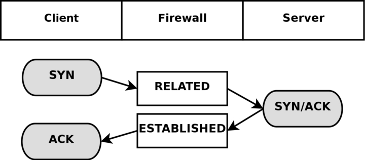
<js-ext-figcaption></js-ext-figcaption>

</js-ext-figure>

Some conntrack helpers are already available within the kernel itself. More specifically, the FTP and IRC protocols have conntrack helpers as of writing this. If you can not find the conntrack helpers that you need within the kernel itself, you should have a look at the patch-o-matic tree within user-land iptables. The patch-o-matic tree may contain more conntrack helpers, such as for the ntalk or H.323 protocols.

If they are not available in the patch-o-matic tree, you have a number of options. Either you can look at the CVS source of iptables, if it has recently gone into that tree, or you can contact the _Netfilter-devel_ mailing list and ask if it is available. If it is not, and there are no plans for adding it, you are left to your own devices and would most probably want to read the _Rusty Russell's Unreliable Netfilter Hacking HOW-TO_ which is linked from the _Other resources and links_ appendix.

Conntrack helpers may either be statically compiled into the kernel, or as modules. If they are compiled as modules, you can load them with the following command

```bash
modprobe ip_conntrack_ftp
modprobe ip_conntrack_irc
modprobe ip_conntrack_tftp
modprobe ip_conntrack_amanda
```

Do note that connection tracking has nothing to do with NAT, and hence you may require more modules if you are NAT'ing connections as well. For example, if you were to want to NAT and track FTP connections, you would need the NAT module as well. All NAT helpers starts with `ip_nat_` and follow that naming convention.

So for example the FTP NAT helper would be named `ip_nat_ftp` and the IRC module would be named ip_nat_irc. The conntrack helpers follow the same naming convention, and hence the IRC conntrack helper would be named `ip_conntrack_irc`, while the FTP conntrack helper would be named `ip_conntrack_ftp`.

## What's next? <a id="whats-next" ></a>

This chapter has discussed how the state machine in netfilter works and how it keeps state of different connections. The chapter has also discussed how it is represented toward you, the end user and what you can do to alter its behavior, as well as different protocols that are more complex to do connection tracking on, and how the different conntrack helpers come into the picture.

The next chapter will discuss how to save and restore rulesets using the `iptables-save` and `iptables-restore` programs distributed with the iptables applications. This has both pros and cons, and the chapter will discuss it in detail.

# Chapter 8. Saving and restoring large rule-sets

The iptables package comes with two more tools that are very useful, specially if you are dealing with larger rule-sets. These two tools are called `iptables-save` and iptables-restore and are used to save and restore rule-sets to a specific file-format that looks quite a bit different from the standard shell code that you will see in the rest of this tutorial.

<js-ext-div class="" data-type="note">

iptables-restore can be used together with scripting languages. The big problem is that you will need to output the results into the stdin of iptables-restore. If you are creating a very big ruleset (several thousand rules) this might be a very good idea, since it will be much faster to insert all the new rules. For example, you would then run `make_rules.sh | iptables-restore`.

</js-ext-div>

## Speed considerations <a id="speed-considerations" ></a>

One of the largest reasons for using the `iptables-save` and `iptables-restore` commands is that they will speed up the loading and saving of larger rule-sets considerably. The main problem with running a shell script that contains iptables rules is that each invocation of iptables within the script will first extract the whole rule-set from the Netfilter kernel space, and after this, it will insert or append rules, or do whatever change to the rule-set that is needed by this specific command.

Finally, it will insert the new rule-set from its own memory into kernel space. Using a shell script, this is done for each and every rule that we want to insert, and for each time we do this, it takes more time to extract and insert the rule-set.

To solve this problem, there is the `iptables-save` and restore commands. The `iptables-save` command is used to save the rule-set into a specially formatted text-file, and the `iptables-restore` command is used to load this text-file into kernel again. The best parts of these commands is that they will load and save the rule-set in one single request.

`iptables-save` will grab the whole rule-set from kernel and save it to a file in one single movement. iptables-restore will upload that specific rule-set to kernel in a single movement for each table. In other words, instead of dropping the rule-set out of kernel some 30,000 times, for really large rule-sets, and then upload it to kernel again that many times, we can now save the whole thing into a file in one movement and then upload the whole thing in as little as three movements depending on how many tables you use.

As you can understand, these tools are definitely something for you if you are working on a huge set of rules that needs to be inserted. However, they do have drawbacks that we will discuss more in the next section.

## Drawbacks with restore <a id="drawbacks-with-restore" ></a>

As you may have already wondered, can `iptables-restore` handle any kind of scripting? So far, no, it cannot and it will most probably never be able to. This is the main flaw in using `iptables-restore` since you will not be able to do a huge set of things with these files.

For example, what if you have a connection that has a dynamically assigned IP address and you want to grab this dynamic IP every-time the computer boots up and then use that value within your scripts? With `iptables-restore`, this is more or less impossible.

One possibility to get around this is to make a small script which grabs the values you would like to use in the script, then sed the `iptables-restore` file for specific keywords and replace them with the values collected via the small script.

At this point, you could save it to a temporary file, and then use `iptables-restore` to load the new values. This causes a lot of problems however, and you will be unable to use `iptables-save` properly since it would probably erase your manually added keywords in the restore script. It is, in other words, a clumsy solution.

A second possibility is to do as previously described. Make a script that outputs rules in `iptables-restore` format, and then feed them on standard input of `iptables-restore`. For very large rulesets this would be to be preferred over running iptables itself, since it has a bad habit of taking a lot of processing power on very large rulesets as previously described in this chapter.

Another solution is to load the `iptables-restore` scripts first, and then load a specific shell script that inserts more dynamic rules in their proper places. Of course, as you can understand, this is just as clumsy as the first solution. `iptables-restore` is simply not very well suited for configurations where IP addresses are dynamically assigned to your firewall or where you want different behaviors depending on configuration options and so on.

Another drawback with `iptables-restore` and `iptables-save` is that it is not fully functional as of writing this. The problem is simply that not a lot of people use it as of today and hence there are not a lot of people finding bugs, and in turn some matches and targets will simply be inserted badly, which may lead to some strange behaviors that you did not expect.

Even though these problems exist, I would highly recommend using these tools which should work extremely well for most rule-sets as long as they do not contain some of the new targets or matches that it does not know how to handle properly.

## `iptables-save` <a id="iptables-save" ></a>

The `iptables-save` command is, as we have already explained, a tool to save the current rule-set into a file that iptables-restore can use. This command is quite simple really, and takes only two arguments. Take a look at the following example to understand the syntax of the command.

```console
$ iptables-save [-c] [-t table]
```

The -c argument tells `iptables-save` to keep the values specified in the byte and packet counters. This could for example be useful if we would like to reboot our main firewall, but not lose byte and packet counters which we may use for statistical purposes.

Issuing a `iptables-save` command with the -c argument would then make it possible for us to reboot without breaking our statistical and accounting routines. The default value is, of course, to not keep the counters intact when issuing this command.

The -t argument tells the `iptables-save` command which tables to save. Without this argument the command will automatically save all tables available into the file. The following is an example on what output you can expect from the `iptables-save` command if you do not have any rule-set loaded.

```bash
# Generated by iptables-save v1.2.6a on Wed Apr 24 10:19:17 2002
*filter
:INPUT ACCEPT [404:19766]
:FORWARD ACCEPT [0:0]
:OUTPUT ACCEPT [530:43376]
COMMIT
# Completed on Wed Apr 24 10:19:17 2002
# Generated by iptables-save v1.2.6a on Wed Apr 24 10:19:17 2002
*mangle
:PREROUTING ACCEPT [451:22060]
:INPUT ACCEPT [451:22060]
:FORWARD ACCEPT [0:0]
:OUTPUT ACCEPT [594:47151]
:POSTROUTING ACCEPT [594:47151]
COMMIT
# Completed on Wed Apr 24 10:19:17 2002
# Generated by iptables-save v1.2.6a on Wed Apr 24 10:19:17 2002
*nat
:PREROUTING ACCEPT [0:0]
:POSTROUTING ACCEPT [3:450]
:OUTPUT ACCEPT [3:450]
COMMIT
# Completed on Wed Apr 24 10:19:17 2002
```

This contains a few comments starting with a # sign. Each table is marked like `*<table-name>`, for example `*mangle`.

Then within each table we have the chain specifications and rules. A chain specification looks like `:<chain-name> <chain-policy> [<packet-counter>:<byte-counter>]`. The chain-name may be for example PREROUTING, the policy is described previously and can, for example, be ACCEPT.

Finally the packet-counter and byte-counters are the same counters as in the output from iptables -L -v.

Finally, each table declaration ends in a COMMIT keyword. The COMMIT keyword tells us that at this point we should commit all rules currently in the pipeline to kernel.

The above example is pretty basic, and hence I believe it is nothing more than proper to show a brief example which contains a very small _`iptables-save` ruleset_. If we would run `iptables-save` on this, it would look something like this in the output:

```bash
# Generated by iptables-save v1.2.6a on Wed Apr 24 10:19:55 2002
*filter
:INPUT DROP [1:229]
:FORWARD DROP [0:0]
:OUTPUT DROP [0:0]
**-A INPUT -m state --state RELATED,ESTABLISHED** -j ACCEPT
**-A FORWARD -i eth0 -m state --state RELATED,ESTABLISHED** -j ACCEPT
**-A FORWARD -i eth1 -m state --state NEW,RELATED,ESTABLISHED** -j ACCEPT
**-A OUTPUT -m state --state NEW,RELATED,ESTABLISHED** -j ACCEPT
COMMIT
# Completed on Wed Apr 24 10:19:55 2002
# Generated by iptables-save v1.2.6a on Wed Apr 24 10:19:55 2002
*mangle
:PREROUTING ACCEPT [658:32445]
:INPUT ACCEPT [658:32445]
:FORWARD ACCEPT [0:0]
:OUTPUT ACCEPT [891:68234]
:POSTROUTING ACCEPT [891:68234]
COMMIT
# Completed on Wed Apr 24 10:19:55 2002
# Generated by iptables-save v1.2.6a on Wed Apr 24 10:19:55 2002
*nat
:PREROUTING ACCEPT [1:229]
:POSTROUTING ACCEPT [3:450]
:OUTPUT ACCEPT [3:450]
**-A POSTROUTING -o eth0 -j SNAT** --to-source 195.233.192.1
COMMIT
# Completed on Wed Apr 24 10:19:55 2002
```

As you can see, each command has now been prefixed with the byte and packet counters since we used the -c argument. Except for this, the command-line is quite intact from the script. The only problem now, is how to save the output to a file.

Quite simple, and you should already know how to do this if you have used linux at all before. It is only a matter of piping the command output on to the file that you would like to save it as. This could look like the following:

```console
$ iptables-save -c > /etc/iptables-save
```

The above command will in other words save the whole rule-set to a file called `/etc/iptables-save` with byte and packet counters still intact.

## iptables-restore <a id="iptables-restore" ></a>

The `iptables-restore` command is used to restore the iptables rule-set that was saved with the `iptables-save` command. It takes all the input from standard input and can't load from files as of writing this, unfortunately. This is the command syntax for `iptables-restore`:

```console
$ iptables-restore [-c] [-n]
```

The -c argument restores the byte and packet counters and must be used if you want to restore counters that were previously saved with `iptables-save`. This argument may also be written in its long form --counters.

The -n argument tells `iptables-restore` to not overwrite the previously written rules in the table, or tables, that it is writing to. The default behavior of `iptables-restore` is to flush and destroy all previously inserted rules. The short -n argument may also be replaced with the longer format --noflush.

To load a rule-set with the `iptables-restore` command, we could do this in several ways, but we will mainly look at the simplest and most common way here.

```console
$ cat /etc/iptables-save | iptables-restore -c
```

The following will also work:

```console
$ iptables-restore -c < /etc/iptables-save
```

This would cat the rule-set located within the `/etc/iptables-save` file and then pipe it to iptables-restore which takes the rule-set on the standard input and then restores it, including byte and packet counters. It is that simple to begin with. This command could be varied until oblivion and we could show different piping possibilities, however, this is a bit out of the scope of this chapter, and hence we will skip that part and leave it as an exercise for the reader to experiment with.

The rule-set should now be loaded properly to kernel and everything should work. If not, you may possibly have run into a bug in these commands.

## What's next? <a id="whats-next" ></a>

This chapter has discussed the `iptables-save` and iptables-restore programs to some extent and how they can be used. Both applications are distributed with the iptables package, and can be used to quickly save large rulesets and then inserting them into the kernel again.

The next chapter will take a look at the syntax of a iptables rule and how to write properly formatted rule-sets. It will also show some basic good coding styles to adhere to, as required.

# Chapter 9. How a rule is built

This chapter and the upcoming three chapters will discuss at length how to build your own rules. A rule could be described as the directions the firewall will adhere to when blocking or permitting different connections and packets in a specific chain. Each line you write that's inserted in a chain should be considered a rule. We will also discuss the basic matches that are available, and how to use them, as well as the different targets and how we can construct new targets of our own (i.e.,new sub chains).

This chapter will deal with the raw basics of how a rule is created and how you write it and enter it so that it will be accepted by the userspace program iptables, the different tables, as well as the commands that you can issue to iptables. After that we will in the next chapter look at all the matches that are available to iptables, and then get more into detail of each type of target and jump.

## Basics of the iptables command <a id="basics-of-the-iptables-command" ></a>

As we have already explained, each rule is a line that the kernel looks at to find out what to do with a packet. If all the criteria - or matches - are met, we perform the target - or jump - instruction. Normally we would write our rules in a syntax that looks something like this:

```console
$ iptables [-t table] command [match] [target/jump]
```

There is nothing that says that the target instruction has to be the last function in the line. However, you would usually adhere to this syntax to get the best readability. Anyway, most of the rules you'll see are written in this way. Hence, if you read someone else's script, you'll most likely recognize the syntax and easily understand the rule.

If you want to use a table other than the standard table, you could insert the table specification at the point at which [table] is specified. However, it is not necessary to state explicitly what table to use, since by default iptables uses the filter table on which to implement all commands.

Neither do you have to specify the table at just this point in the rule. It could be set pretty much anywhere along the line. However, it is more or less standard to put the table specification at the beginning.

One thing to think about though: The command should always come first, or alternatively directly after the table specification. We use 'command' to tell the program what to do, for example to insert a rule or to add a rule to the end of the chain, or to delete a rule. We shall take a further look at this below.

The match is the part of the rule that we send to the kernel that details the specific character of the packet, what makes it different from all other packets. Here we could specify what IP address the packet comes from, from which network interface, the intended IP address, port, protocol or whatever. There is a heap of different matches that we can use that we will look closer at further on in this chapter.

Finally we have the target of the packet. If all the matches are met for a packet, we tell the kernel what to do with it. We could, for example, tell the kernel to send the packet to another chain that we've created ourselves, and which is part of this particular table.

We could tell the kernel to drop the packet dead and do no further processing, or we could tell the kernel to send a specified reply to the sender. As with the rest of the content in this section, we'll look closer at it further on in the chapter.

## Tables <a id="tables" ></a>

**The -t option specifies which table to use. Per default, the filter table is used. We may specify one of the following tables with the** -t option. Do note that this is an extremely brief summary of some of the contents of the _Traversing of tables and chains_ chapter.

**Table 9-1. Tables**

| Table  | Explanation                                                                                                                                                                                                                                                                                                                                                                                                                                                                                                                                                                                                                                                                                                                                                                                                                                                                                                                                                                                                                                                                                                                                                                                                                                                                                                                     |
| :----- | :------------------------------------------------------------------------------------------------------------------------------------------------------------------------------------------------------------------------------------------------------------------------------------------------------------------------------------------------------------------------------------------------------------------------------------------------------------------------------------------------------------------------------------------------------------------------------------------------------------------------------------------------------------------------------------------------------------------------------------------------------------------------------------------------------------------------------------------------------------------------------------------------------------------------------------------------------------------------------------------------------------------------------------------------------------------------------------------------------------------------------------------------------------------------------------------------------------------------------------------------------------------------------------------------------------------------------ |
| nat    | The nat table is used mainly for Network Address Translation. "NAT"ed packets get their IP addresses altered, according to our rules. Packets in a stream only traverse this table once. We assume that the first packet of a stream is allowed. The rest of the packets in the same stream are automatically "NAT"ed or Masqueraded etc, and will be subject to the same actions as the first packet. These will, in other words, not go through this table again, but will nevertheless be treated like the first packet in the stream. This is the main reason why you should not do any filtering in this table, which we will discuss at greater length further on. The PREROUTING chain is used to alter packets as soon as they get in to the firewall. The OUTPUT chain is used for altering locally generated packets (i.e., on the firewall) before they get to the routing decision. Finally we have the POSTROUTING chain which is used to alter packets just as they are about to leave the firewall.                                                                                                                                                                                                                                                                                                              |
| mangle | This table is used mainly for mangling packets. Among other things, we can change the contents of different packets and that of their headers. Examples of this would be to change the TTL, TOS or MARK. Note that the MARK is not really a change to the packet, but a mark value for the packet is set in kernel space. Other rules or programs might use this mark further along in the firewall to filter or do advanced routing on; tc is one example. The table consists of five built in chains, the PREROUTING, POSTROUTING, OUTPUT, INPUT and FORWARD chains. PREROUTING is used for altering packets just as they enter the firewall and before they hit the routing decision. POSTROUTING is used to mangle packets just after all routing decisions have been made. OUTPUT is used for altering locally generated packets after they enter the routing decision. INPUT is used to alter packets after they have been routed to the local computer itself, but before the user space application actually sees the data. FORWARD is used to mangle packets after they have hit the first routing decision, but before they actually hit the last routing decision. Note that mangle can't be used for any kind of Network Address Translation or Masquerading, the nat table was made for these kinds of operations. |
| filter | The filter table should be used exclusively for filtering packets. For example, we could DROP, LOG, ACCEPT or REJECT packets without problems, as we can in the other tables. There are three chains built in to this table. The first one is named FORWARD and is used on all non-locally generated packets that are not destined for our local host (the firewall, in other words). INPUT is used on all packets that are destined for our local host (the firewall) and OUTPUT is finally used for all locally generated packets.                                                                                                                                                                                                                                                                                                                                                                                                                                                                                                                                                                                                                                                                                                                                                                                            |
| raw    | The raw table and its chains are used before any other tables in netfilter. It was introduced to use the NOTRACK target. This table is rather new and is only available, if compiled, with late 2.6 kernels and later. The raw table contains two chains. The PREROUTING and OUTPUT chain, where they will handle packets before they hit any of the other netfilter subsystems. The PREROUTING chain can be used for all incoming packets to this machine, or that are forwarded, while the OUTPUT chain can be used to alter the locally generated packets before they hit any of the other netfilter subsystems.                                                                                                                                                                                                                                                                                                                                                                                                                                                                                                                                                                                                                                                                                                             |

The above details should have explained the basics about the three different tables that are available. They should be used for totally different purposes, and you should know what to use each chain for. If you do not understand their usage, you may well dig a pit for yourself in your firewall, into which you will fall as soon as someone finds it and pushes you into it. We have already discussed the requisite tables and chains in more detail within the _Traversing of tables and chains_ chapter. If you do not understand this fully, I advise you to go back and read through it again.

## Commands <a id="commands" ></a>

In this section we will cover all the different commands and what can be done with them. The command tells iptables what to do with the rest of the rule that we send to the parser. Normally we would want either to add or delete something in some table or another. The following commands are available to iptables:

**Table 9-2. Commands**

| Command            | Example                                                     | Explanation                                                                                                                                                                                                                                                                                                                                                                                                                                                               |
| :----------------- | :---------------------------------------------------------- | :------------------------------------------------------------------------------------------------------------------------------------------------------------------------------------------------------------------------------------------------------------------------------------------------------------------------------------------------------------------------------------------------------------------------------------------------------------------------ |
| -A, --append       | `iptables -A INPUT ...`                                     | This command appends the rule to the end of the chain. The rule will in other words always be put last in the rule-set and hence be checked last, unless you append more rules later on.                                                                                                                                                                                                                                                                                  |
| -D, --delete       | `iptables -D INPUT --dport 80 -j DROP, iptables -D INPUT 1` | This command deletes a rule in a chain. This could be done in two ways; either by entering the whole rule to match (as in the first example), or by specifying the rule number that you want to match. If you use the first method, your entry must match the entry in the chain exactly. If you use the second method, you must match the number of the rule you want to delete. The rules are numbered from the top of each chain, starting with number 1.              |
| -R, --replace      | `iptables -R INPUT 1 -s 192.168.0.1 -j DROP`                | This command replaces the old entry at the specified line. It works in the same way as the --delete command, but instead of totally deleting the entry, it will replace it with a new entry. The main use for this might be while you're experimenting with iptables.                                                                                                                                                                                                     |
| -I, --insert       | `iptables -I INPUT 1 --dport 80 -j ACCEPT`                  | Insert a rule somewhere in a chain. The rule is inserted as the actual number that we specify. In other words, the above example would be inserted as rule 1 in the INPUT chain, and hence from now on it would be the very first rule in the chain.                                                                                                                                                                                                                      |
| -L, --list         | `iptables -L INPUT`                                         | This command lists all the entries in the specified chain. In the above case, we would list all the entries in the INPUT chain. It's also legal to not specify any chain at all. In the last case, the command would list all the chains in the specified table (To specify a table, see the _Tables_ section). The exact output is affected by other options sent to the parser, for example the -n and -v options, etc.                                                 |
| -F, --flush        | iptables -F INPUT                                           | This command flushes all rules from the specified chain and is equivalent to deleting each rule one by one, but is quite a bit faster. The command can be used without options, and will then delete all rules in all chains within the specified table.                                                                                                                                                                                                                  |
| -Z, --zero         | `iptables -Z INPUT`                                         | This command tells the program to zero all counters in a specific chain, or in all chains. If you have used the -v option with the -L command, you have probably seen the packet counter at the beginning of each field. To zero this packet counter, use the -Z option. This option works the same as -L, except that -Z won't list the rules. If -L and -Z is used together (which is legal), the chains will first be listed, and then the packet counters are zeroed. |
| -N, --new-chain    | `iptables -N allowed`                                       | This command tells the kernel to create a new chain of the specified name in the specified table. In the above example we create a chain called allowed. Note that there must not already be a chain or target of the same name.                                                                                                                                                                                                                                          |
| -X, --delete-chain | `iptables -X allowed`                                       | This command deletes the specified chain from the table. For this command to work, there must be no rules that refer to the chain that is to be deleted. In other words, you would have to replace or delete all rules referring to the chain before actually deleting the chain. If this command is used without any options, all chains but those built in to the specified table will be deleted.                                                                      |
| -P, --policy       | `iptables -P INPUT DROP`                                    | This command tells the kernel to set a specified default target, or policy, on a chain. All packets that don't match any rule will then be forced to use the policy of the chain. Legal targets are DROP and ACCEPT (There might be more, mail me if so).                                                                                                                                                                                                                 |
| -E, --rename-chain | `iptables -E allowed disallowed`                            | The -E command tells iptables to change the first name of a chain, to the second name. In the example above we would, in other words, change the name of the chain from `allowed` to `disallowed`. Note that this will not affect the actual way the table will work. It is, in other words, just a cosmetic change to the table.                                                                                                                                         |

You should always enter a complete command line, unless you just want to list the built-in help for iptables or get the version of the command. To get the version, use the -v option and to get the help message, use the -h option. As usual, in other words.

Next comes a few options that can be used with various different commands. Note that we tell you with which commands the options can be used and what effect they will have. Also note that we do not include any options here that affect rules or matches. Instead, we'll take a look at matches and targets in a later section of this chapter.

**Table 9-3. Options**

| Option             | Commands used with                              | Explanation                                                                                                                                                                                                                                                                                                                                                                                                                                                                                                                                                                                                                                                                                         |
| :----------------- | :---------------------------------------------- | :-------------------------------------------------------------------------------------------------------------------------------------------------------------------------------------------------------------------------------------------------------------------------------------------------------------------------------------------------------------------------------------------------------------------------------------------------------------------------------------------------------------------------------------------------------------------------------------------------------------------------------------------------------------------------------------------------- |
| -v, --verbose      | --list, --append, --insert, --delete, --replace | This command gives verbose output and is mainly used together with the --list command. If used together with the --list command, it outputs the interface address, rule options and TOS masks. The --list command will also include a bytes and packet counter for each rule, if the --verbose option is set. These counters uses the K (x1000), M (x1,000,000) and G (x1,000,000,000) multipliers. To overrule this and get exact output, you can use the -x option, described later. If this option is used with the --append, --insert, --delete or --replace commands, the program will output detailed information on how the rule was interpreted and whether it was inserted correctly, etc. |
| -x, --exact        | --list                                          | This option expands the numerics. The output from --list will in other words not contain the K, M or G multipliers. Instead we will get an exact output from the packet and byte counters of how many packets and bytes that have matched the rule in question. Note that this option is only usable in the --list command and isn't really relevant for any of the other commands.                                                                                                                                                                                                                                                                                                                 |
| -n, --numeric      | --list                                          | This option tells iptables to output numerical values. IP addresses and port numbers will be printed by using their numerical values and not host-names, network names or application names. This option is only applicable to the --list command. This option overrides the default of resolving all numerics to hosts and names, where this is possible.                                                                                                                                                                                                                                                                                                                                          |
| --line-numbers     | --list                                          | The --line-numbers command, together with the --list command, is used to output line numbers. Using this option, each rule is output with its number. It could be convenient to know which rule has which number when inserting rules. This option only works with the --list command.                                                                                                                                                                                                                                                                                                                                                                                                              |
| -c, --set-counters | --insert, --append, --replace                   | This option is used when creating a rule or modifying it in some way. We can then use the option to initialize the packet and byte counters for the rule. The syntax would be something like --set-counters 20 4000, which would tell the kernel to set the packet counter to 20 and byte counter to 4000.                                                                                                                                                                                                                                                                                                                                                                                          |
| --modprobe         | All                                             | The --modprobe option is used to tell iptables which module to use when probing for modules or adding them to the kernel. It could be used if your modprobe command is not somewhere in the search path etc. In such cases, it might be necessary to specify this option so the program knows what to do in case a needed module is not loaded. This option can be used with all commands.                                                                                                                                                                                                                                                                                                          |

## What's next? <a id="whats-next" ></a>

This chapter has discussed some of the basic commands for iptables and the tables very briefly that can be used in netfilter. The commands makes it possible to do quite a lot of different operations on the netfilter package loaded inside kernel as you have seen.

The next chapter will discuss all the available matches in iptables and netfilter. This is a very heavy and long chapter, and I humbly suggest that you don't need to actually learn every single match available in any detail, except the ones that you are going to use. A good idea might be to get a brief understanding of what each match does, and then get a better grasp on them as you need them.

# Chapter 10. Iptables matches

In this chapter we'll talk a bit more about matches. I've chosen to narrow down the matches into five different subcategories.

First of all we have the _generic matches_, which can be used in all rules. Then we have the _TCP matches_ which can only be applied to TCP packets. We have _UDP matches_ which can only be applied to UDP packets, and _ICMP matches_ which can only be used on ICMP packets. Finally we have special matches, such as the state, owner and limit matches and so on.

These final matches have in turn been narrowed down to even more subcategories, even though they might not necessarily be different matches at all. I hope this is a reasonable breakdown and that all people out there can understand it.

As you may already understand if you have read the previous chapters, a match is something that specifies a special condition within the packet that must be true (or false). A single rule can contain several matches of any kind. For example, we may want to match packets that come from a specific host on a our local area network, and on top of that only from specific ports on that host.

We could then use matches to tell the rule to only apply the target - or jump specification - on packets that have a specific source address, that come in on the interface that connects to the LAN and the packets must be one of the specified ports.

If any one of these matches fails (e.g., the source address isn't correct, but everything else is true), the whole rule fails and the next rule is tested on the packet. If all matches are true, however, the target specified by the rule is applied.

## Generic matches <a id="generic-matches" ></a>

This section will deal with _Generic matches_. A generic match is a kind of match that is always available, whatever kind of protocol we are working on, or whatever match extensions we have loaded. No special parameters at all are needed to use these matches; in other words. I have also included the --protocol match here, even though it is more specific to protocol matches.

For example, if we want to use a _TCP match_, we need to use the --protocol match and send TCP as an option to the match. However, --protocol is also a match in itself, since it can be used to match specific protocols. The following matches are always available.

**Table 10-1. Generic matches**

| Match                    | Kernel            | Example                            | Explanation                                                                                                                                                                                                                                                                                                                                                                                                                                                                                                                                                                                                                                                                                                                                                                                                                                                                                                                                                                                                                                                                                                                                                                                 |
| :----------------------- | :---------------- | :--------------------------------- | :------------------------------------------------------------------------------------------------------------------------------------------------------------------------------------------------------------------------------------------------------------------------------------------------------------------------------------------------------------------------------------------------------------------------------------------------------------------------------------------------------------------------------------------------------------------------------------------------------------------------------------------------------------------------------------------------------------------------------------------------------------------------------------------------------------------------------------------------------------------------------------------------------------------------------------------------------------------------------------------------------------------------------------------------------------------------------------------------------------------------------------------------------------------------------------------ |
| -p, --protocol           | 2.3, 2.4, 2.5/2.6 | `iptables -A INPUT -p tcp`         | This match is used to check for certain protocols. Examples of protocols are TCP, UDP and ICMP. The protocol must either be one of the internally specified TCP, UDP or ICMP. It may also take a value specified in the /etc/protocols file, and if it can't find the protocol there it will reply with an error. The protocl may also be an integer value. For example, the ICMP protocol is integer value 1, TCP is 6 and UDP is 17. Finally, it may also take the value ALL. _ALL_ means that it matches only TCP, UDP and ICMP. <p>If this match is given the integer value of zero (0), it means ALL protocols, which in turn is the default behavior, if the --protocol match is not used. This match can also be inversed with the ! sign, so --protocol ! tcp would mean to match UDP and ICMP.                                                                                                                                                                                                                                                                                                                                                                                     |
| -s, --src, --source      | 2.3, 2.4, 2.5/2.6 | `iptables -A INPUT -s 192.168.1.1` | This is the source match, which is used to match packets, based on their source IP address. The main form can be used to match single IP addresses, such as _192.168.1.1_. It could also be used with a netmask in a CIDR "bit" form, by specifying the number of ones (1's) on the left side of the network mask. This means that we could for example add _/24_ to use a _255.255.255.0_ netmask. We could then match whole IP ranges, such as our local networks or network segments behind the firewall. The line would then look something like _192.168.0.0/24_. This would match all packets in the _192.168.0.x_ range. <p>Another way is to do it with a regular netmask in the _255.255.255.255_ form (i.e., _192.168.0.0/255.255.255.0_). We could also invert the match with an ! just as before. If we were, in other words, to use a match in the form of --source ! 192.168.0.0/24, we would match all packets with a source address not coming from within the _192.168.0.x_ range. The default is to match all IP addresses.                                                                                                                                               |
| -d, --dst, --destination | 2.3, 2.4, 2.5/2.6 | `iptables -A INPUT -d 192.168.1.1` | The --destination match is used for packets based on their destination address or addresses. It works pretty much the same as the --source match and has the same syntax, except that the match is based on where the packets are going to. To match an IP range, we can add a netmask either in the exact netmask form, or in the number of ones (1's) counted from the left side of the netmask bits. <p>Examples are: _192.168.0.0/255.255.255.0_ and _192.168.0.0/24_. Both of these are equivalent. We could also invert the whole match with an ! sign, just as before. --destination ! 192.168.0.1 would in other words match all packets except those destined to the _192.168.0.1_ IP address.                                                                                                                                                                                                                                                                                                                                                                                                                                                                                     |
| -i, --in-interface       | 2.3, 2.4, 2.5/2.6 | `iptables -A INPUT -i eth0`        | This match is used for the interface the packet came in on. Note that this option is only legal in the INPUT, FORWARD and PREROUTING chains and will return an error message when used anywhere else. The default behavior of this match, if no particular interface is specified, is to assume a string value of +. The + value is used to match a string of letters and numbers. A single + would, in other words, tell the kernel to match all packets without considering which interface it came in on. <p>The + string can also be appended to the type of interface, so eth+ would be all Ethernet devices. We can also invert the meaning of this option with the help of the ! sign. The line would then have a syntax looking something like -i ! eth0, which would match all incoming interfaces, except eth0.                                                                                                                                                                                                                                                                                                                                                                   |
| -o, --out-interface      | 2.3, 2.4, 2.5/2.6 | `iptables -A FORWARD -o eth0`      | The --out-interface match is used for packets on the interface from which they are leaving. Note that this match is only available in the OUTPUT, FORWARD and POSTROUTING chains, the opposite in fact of the --in-interface match. Other than this, it works pretty much the same as the --in-interface match. <p>The + extension is understood as matching all devices of similar type, so eth+ would match all eth devices and so on. To invert the meaning of the match, you can use the ! sign in exactly the same way as for the --in-interface match. If no --out-interface is specified, the default behavior for this match is to match all devices, regardless of where the packet is going.                                                                                                                                                                                                                                                                                                                                                                                                                                                                                      |
| -f, --fragment           | 2.3, 2.4, 2.5/2.6 | `iptables -A INPUT -f`             | This match is used to match the second and third part of a fragmented packet. The reason for this is that in the case of fragmented packets, there is no way to tell the source or destination ports of the fragments, nor ICMP types, among other things. Also, fragmented packets might in rather special cases be used to compound attacks against other computers. Packet fragments like this will not be matched by other rules, and hence this match was created. This option can also be used in conjunction with the `!` sign; however, in this case the `!` sign must precede the match, i.e. `! -f`. When this match is inverted, we match all header fragments and/or unfragmented packets. <p>What this means, is that we match all the first fragments of fragmented packets, and not the second, third, and so on. We also match all packets that have not been fragmented during transfer. Note also that there are really good defragmentation options within the kernel that you can use instead. <p>As a secondary note, if you use connection tracking you will not see any fragmented packets, since they are dealt with before hitting any chain or table in iptables. |

## Implicit matches <a id="implicit-matches" ></a>

This section will describe the matches that are loaded implicitly. _Implicit matches_ are implied, taken for granted, automatic. For example when we match on --protocol tcp without any further criteria. There are currently three types of implicit matches for three different protocols. These are _TCP matches_, _UDP matches_ and _ICMP matches_.

The TCP based matches contain a set of unique criteria that are available only for TCP packets. UDP based matches contain another set of criteria that are available only for UDP packets. And the same thing for ICMP packets. On the other hand, there can be explicit matches that are loaded explicitly. _Explicit matches_ are not implied or automatic, you have to specify them specifically. For these you use the -m or --match option, which we will discuss in the next section.

### TCP matches <a id="tcp-matches" ></a>

These matches are protocol specific and are only available when working with TCP packets and streams. To use these matches, you need to specify --protocol tcp on the command line before trying to use them. Note that the --protocol tcp match must be to the left of the protocol specific matches. These matches are loaded implicitly in a sense, just as the _UDP_ and _ICMP matches_ are loaded implicitly. The other matches will be looked over in the continuation of this section, after the _TCP match_ section.

**Table 10-2. TCP matches**

| Match                       | Kernel            | Example                                       | Explanation                                                                                                                                                                                                                                                                                                                                                                                                                                                                                                                                                                                                                                                                                                                                                                                                                                                                                                                                                                                                                                                                                                                                                                                                                                                                                                                                                                                                                                                                                                                                                                                                                                                                                                                                                                                                                                                                                                                                                                                                                        |
| :-------------------------- | :---------------- | :-------------------------------------------- | :--------------------------------------------------------------------------------------------------------------------------------------------------------------------------------------------------------------------------------------------------------------------------------------------------------------------------------------------------------------------------------------------------------------------------------------------------------------------------------------------------------------------------------------------------------------------------------------------------------------------------------------------------------------------------------------------------------------------------------------------------------------------------------------------------------------------------------------------------------------------------------------------------------------------------------------------------------------------------------------------------------------------------------------------------------------------------------------------------------------------------------------------------------------------------------------------------------------------------------------------------------------------------------------------------------------------------------------------------------------------------------------------------------------------------------------------------------------------------------------------------------------------------------------------------------------------------------------------------------------------------------------------------------------------------------------------------------------------------------------------------------------------------------------------------------------------------------------------------------------------------------------------------------------------------------------------------------------------------------------------------------------------------------- |
| --sport, --source-port      | 2.3, 2.4, 2.5/2.6 | `iptables -A INPUT -p tcp --sport 22`         | The --source-port match is used to match packets based on their source port. Without it, we imply all source ports. This match can either take a service name or a port number. If you specify a service name, the service name must be in the /etc/services file, since iptables uses this file in which to find. If you specify the port by its number, the rule will load slightly faster, since iptables don't have to check up the service name. However, the match might be a little bit harder to read than if you use the service name. If you are writing a rule-set consisting of a 200 rules or more, you should definitely use port numbers, since the difference is really noticeable. (On a slow box, this could make as much as 10 seconds' difference, if you have configured a large rule-set containing 1000 rules or so). <p><p>You can also use the --source-port match to match any range of ports, `--source-port 22:80` for example. This example would match all source ports between 22 and 80. If you omit specifying the first port, port 0 is assumed (is implicit). `--source-port :80` would then match port 0 through 80. And if the last port specification is omitted, port 65535 is assumed. If you were to write `--source-port 22:`, you would have specified a match for all ports from port 22 through port 65535. If you invert the port range, iptables automatically reverses your inversion. If you write `--source-port 80:22`, it is simply interpreted as `--source-port 22:80`. <p><p>You can also invert a match by adding a ! sign. For example, `--source-port ! 22` means that you want to match all ports but port 22. The inversion could also be used together with a port range and would then look like `--source-port ! 22:80`, which in turn would mean that you want to match all ports but ports 22 through 80. Note that this match does not handle multiple separated ports and port ranges. For more information about those, look at the multiport match extension. |
| --dport, --destination-port | 2.3, 2.4, 2.5/2.6 | `iptables -A INPUT -p tcp --dport 22`         | This match is used to match TCP packets, according to their destination port. It uses exactly the same syntax as the --source-port match. It understands port and port range specifications, as well as inversions. It also reverses high and low ports in port range specifications, as above. The match will also assume values of 0 and 65535 if the high or low port is left out in a port range specification. <p><p>In other words, exactly the same as the --source-port syntax. Note that this match does not handle multiple separated ports and port ranges. For more information about those, look at the multiport match extension.                                                                                                                                                                                                                                                                                                                                                                                                                                                                                                                                                                                                                                                                                                                                                                                                                                                                                                                                                                                                                                                                                                                                                                                                                                                                                                                                                                                    |
| --tcp-flags                 | 2.3, 2.4, 2.5/2.6 | `iptables -p tcp --tcp-flags SYN,FIN,ACK SYN` | This match is used to match on the TCP flags in a packet. First of all, the match takes a list of flags to compare (a mask) and secondly it takes list of flags that should be set to 1, or turned on. Both lists should be comma-delimited. The match knows about the SYN, ACK, FIN, RST, URG, PSH flags, and it also recognizes the words ALL and NONE. <p><p>ALL and NONE is pretty much self describing: ALL means to use all flags and NONE means to use no flags for the option. --tcp-flags ALL NONE would in other words mean to check all of the TCP flags and match if none of the flags are set. This option can also be inverted with the ! sign. <p><p>For example, if we specify `! SYN,FIN,ACK SYN`, we would get a match that would match packets that had the ACK and FIN bits set, but not the SYN bit. Also note that the comma delimitation should not include spaces. You can see the correct syntax in the example above.                                                                                                                                                                                                                                                                                                                                                                                                                                                                                                                                                                                                                                                                                                                                                                                                                                                                                                                                                                                                                                                                                    |
| --syn                       | 2.3, 2.4, 2.5/2.6 | `iptables -p tcp --syn`                       | The --syn match is more or less an old relic from the ipchains days and is still there for backward compatibility and for and to make transition one to the other easier. It is used to match packets if they have the SYN bit set and the ACK and RST bits unset. <p><p>This command would in other words be exactly the same as the `--tcp-flags SYN,RST,ACK SYN` match. Such packets are mainly used to request new TCP connections from a server. If you block these packets, you should have effectively blocked all incoming connection attempts. <p><p>However, you will not have blocked the outgoing connections, which a lot of exploits today use (for example, hacking a legitimate service and then installing a program or suchlike that enables initiating an existing connection to your host, instead of opening up a new port on it). This match can also be inverted with the ! sign in this, `! --syn`, way. This would match all packets with the RST or the ACK bits set, in other words packets in an already established connection.                                                                                                                                                                                                                                                                                                                                                                                                                                                                                                                                                                                                                                                                                                                                                                                                                                                                                                                                                                       |
| --tcp-option                | 2.3, 2.4, 2.5/2.6 | `iptables -p tcp --tcp-option 16`             | This match is used to match packets depending on their TCP options. A TCP Option is a specific part of the header. This part consists of 3 different fields. The first one is 8 bits long and tells us which Options are used in this stream, the second one is also 8 bits long and tells us how long the options field is. The reason for this length field is that TCP options are, well, optional. <p><p>To be compliant with the standards, we do not need to implement all options, but instead we can just look at what kind of option it is, and if we do not support it, we just look at the length field and can then jump over this data. This match is used to match different TCP options depending on their decimal values. <p><p>It may also be inverted with the ! flag, so that the match matches all TCP options but the option given to the match. For a complete list of all options, take a closer look at the _Internet Engineering Task Force_ who maintains a list of all the standard numbers used on the Internet.                                                                                                                                                                                                                                                                                                                                                                                                                                                                                                                                                                                                                                                                                                                                                                                                                                                                                                                                                                                       |

### UDP matches <a id="udp-matches" ></a>

**This section describes matches that will only work together with UDP packets. These matches are implicitly loaded when you specify the** --protocol UDP match and will be available after this specification. Note that UDP packets are not connection oriented, and hence there is no such thing as different flags to set in the packet to give data on what the datagram is supposed to do, such as open or closing a connection, or if they are just simply supposed to send data. UDP packets do not require any kind of acknowledgment either. If they are lost, they are simply lost (Not taking ICMP error messaging etc into account). This means that there are quite a lot less matches to work with on a UDP packet than there is on TCP packets. Note that the state machine will work on all kinds of packets even though UDP or ICMP packets are counted as connectionless protocols. The state machine works pretty much the same on UDP packets as on TCP packets.

**Table 10-3. UDP matches**

| Match                  | Kernel                              | Example                             | Explanation                                                                                                                                                                                                                                                                                                                                                                                                                                                                                                                                                                                                                                                                                                                                                                                                                                                                                                                                                                                                                                                                                             |
| :--------------------- | :---------------------------------- | :---------------------------------- | :------------------------------------------------------------------------------------------------------------------------------------------------------------------------------------------------------------------------------------------------------------------------------------------------------------------------------------------------------------------------------------------------------------------------------------------------------------------------------------------------------------------------------------------------------------------------------------------------------------------------------------------------------------------------------------------------------------------------------------------------------------------------------------------------------------------------------------------------------------------------------------------------------------------------------------------------------------------------------------------------------------------------------------------------------------------------------------------------------ |
| --sport, --source-port | 2.3, 2.4, 2.5/2.6                   | iptables -A INPUT -p udp --sport 53 | This match works exactly the same as its TCP counterpart. It is used to perform matches on packets based on their source UDP ports. It has support for port ranges, single ports and port inversions with the same syntax. To specify a UDP port range, you could use 22:80 which would match UDP ports 22 through 80. If the first value is omitted, port 0 is assumed. If the last port is omitted, port 65535 is assumed. If the high port comes before the low port, the ports switch place with each other automatically. <p><p>Single UDP port matches look as in the example above. To invert the port match, add a ! sign, `--source-port ! 53`. This would match all ports but port 53. The match can understand service names, as long as they are available in the `/etc/services` file. Note that this match does not handle multiple separated ports and port ranges. For more information about this, look at the multiport match extension.                                                                                                                                              |
| Match                  | --dport, --destination-port         | Kernel                              | 2.3, 2.4, 2.5/2.6                                                                                                                                                                                                                                                                                                                                                                                                                                                                                                                                                                                                                                                                                                                                                                                                                                                                                                                                                                                                                                                                                       |
| Example                | iptables -A INPUT -p udp --dport 53 | Explanation                         | The same goes for this match as for --source-port above. It is exactly the same as for the equivalent TCP match, but here it applies to UDP packets. It matches packets based on their UDP destination port. The match handles port ranges, single ports and inversions. <p><p>To match a single port you use, for example, `--destination-port 53`, to invert this you would use `--destination-port ! 53`. The first would match all UDP packets going to port 53 while the second would match packets but those going to the destination port 53. To specify a port range, you would, for example, use `--destination-port 9:19`. This example would match all packets destined for UDP port 9 through 19. If the first port is omitted, port 0 is assumed. If the second port is omitted, port 65535 is assumed. If the high port is placed before the low port, they automatically switch place, so the low port winds up before the high port. <p><p>Note that this match does not handle multiple ports and port ranges. For more information about this, look at the multiport match extension. |

### ICMP matches <a id="icmp-matches" ></a>

These are the _ICMP matches_. These packets are even more ephemeral, that is to say short lived, than UDP packets, in the sense that they are connectionless. The ICMP protocol is mainly used for error reporting and for connection controlling and suchlike.

ICMP is not a protocol subordinated to the IP protocol, but more of a protocol that augments the IP protocol and helps in handling errors. The headers of ICMP packets are very similar to those of the IP headers, but differ in a number of ways. The main feature of this protocol is the type header, that tells us what the packet is for. One example is, if we try to access an unaccessible IP address, we would normally get an ICMP host unreachable in return.

For a complete listing of ICMP types, see the _ICMP types_ appendix. There is only one ICMP specific match available for ICMP packets, and hopefully this should suffice. This match is implicitly loaded when we use the --protocol ICMP match and we get access to it automatically. Note that all the generic matches can also be used, so that among other things we can match on the source and destination addresses.

**Table 10-4. ICMP matches**

| Match       | Kernel            | Example                                   | Explanation                                                                                                                                                                                                                                                                                                                                                                                                                                                                                                                                                                                                                                                                                                                                                                                                                                     |
| :---------- | :---------------- | :---------------------------------------- | :---------------------------------------------------------------------------------------------------------------------------------------------------------------------------------------------------------------------------------------------------------------------------------------------------------------------------------------------------------------------------------------------------------------------------------------------------------------------------------------------------------------------------------------------------------------------------------------------------------------------------------------------------------------------------------------------------------------------------------------------------------------------------------------------------------------------------------------------- |
| --icmp-type | 2.3, 2.4, 2.5/2.6 | `iptables -A INPUT -p icmp --icmp-type 8` | This match is used to specify the ICMP type to match. ICMP types can be specified either by their numeric values or by their names. Numerical values are specified in RFC 792. To find a complete listing of the ICMP name values, do an `iptables --protocol icmp --help`, or check the _ICMP types_ appendix. <p><p>This match can also be inverted with the ! sign in this, `--icmp-type ! 8`, fashion. Note that some ICMP types are obsolete, and others again may be "dangerous" for an unprotected host since they may, among other things, redirect packets to the wrong places. The type and code may also be specified by their typename, numeric type, and type/code as well. For example `--icmp-type network-redirect`, `--icmp-type 8` or `--icmp-type 8/0`. For a complete listing of the names, type `iptables -p icmp --help`. |

<js-ext-div class="" data-type="note">

Please note that netfilter uses ICMP type 255 to match all ICMP types. If you try to match this ICMP type, you will wind up with matching all ICMP types.

</js-ext-div>

### SCTP matches <a id="sctp-matches" ></a>

SCTP or Stream Control Transmission Protocol is a relatively new occurence in the networking domain in comparison to the TCP and UDP protocols. The _SCTP Characteristics_ chapter explains the protocol more in detail. The implicit SCTP matches are loaded through adding the -p sctp match to the command line of iptables.

The SCTP protocol was developed by some of the larger telecom and switch/network manufacturers out there, and the protocol is specifically well suited for large simultaneous transactions with high reliability and high throughput.

**Table 10-5. SCTP matches**

| Match                       | Kernel | Example                                                     | Explanation                                                                                                                                                                                                                                                                                                                                                                                                                                                                                                                                                                                                                                                                                                                                                                                                                                                                                                                                                |
| :-------------------------- | :----- | :---------------------------------------------------------- | :--------------------------------------------------------------------------------------------------------------------------------------------------------------------------------------------------------------------------------------------------------------------------------------------------------------------------------------------------------------------------------------------------------------------------------------------------------------------------------------------------------------------------------------------------------------------------------------------------------------------------------------------------------------------------------------------------------------------------------------------------------------------------------------------------------------------------------------------------------------------------------------------------------------------------------------------------------- |
| --source-port, --sport      | 2.6    | `iptables -A INPUT -p sctp --source-port 80`                | The --source-port match is used to match an SCTP packet based on the source port in the SCTP packet header. The port can either be a single port, as in the example above, or a range of ports specified as `--source-port 20:100`, or it can also be inverted with the `!` -sign. This looks, for example, like `--source-port ! 25`. The source port is an unsigned 16 bit integer, so the maximum value is 65535 and the lowest value is 0.                                                                                                                                                                                                                                                                                                                                                                                                                                                                                                             |
| --destination-port, --dport | 2.6    | `iptables -A INPUT -p sctp --destination-port 80`           | This match is used for the destination port of the SCTP packets. All SCTP packets contain a destination port, just as it does a source port, in the headers. The port can be either specified as in the example above, or with a port range such as `--destination-port 6660:6670`. <p><p>The command can also be inverted with the `!` -sign, for example, `--destination-port ! 80`. This example would match all packets but those to port 80. The same applies for destination ports as for source ports, the highest port is 65535 and the lowest is 0.                                                                                                                                                                                                                                                                                                                                                                                               |
| --chunk-types               | 2.6    | `iptables -A INPUT -p sctp --chunk-types any INIT,INIT_ACK` | This matches the chunk type of the SCTP packet. Currently there are a host of different chunk types available. For a complete list, see below. The match begins with the --chunk-types keyword, and then continues with a flag noting if we are to match all, any or none. After this, you specify the SCTP Chunk Types to match for. The Chunk Types are available in the separate list below. <p><p>Additionally, the flags can take some Chunk Flags as well. This is done for example in the form `--chunk-types any DATA:Be`. The flags are specific for each SCTP Chunk type and must be valid according to the separate list after this table. <p><p>If an upper case letter is used, the flag must be set, and if a lower case flag is set it must be unset to match. The whole match can be inversed by using an `!` sign just after the --chunk-types keyword. For example, `--chunk-types ! any DATA:Be` would match anything but this pattern. |

Below is the list of chunk types that the --chunk-types match will recognize. The list is quite extensive as you can see, but the mostly used packets are DATA and SACK packets. The rest are mostly used for controlling the association.

SCTP Chunk types as used in --chunk-types

- ABORT

- ASCONF

- ASCONF_ACK

- COOKIE_ACK

- COOKIE_ECHO

- DATA

- ECN_CWR

- ECN_ECNE

- ERROR

- HEARTBEAT

- HEARTBEAT_ACK

- INIT

- INIT_ACK

- SACK

- SHUTDOWN

- SHUTDOWN_ACK

- SHUTDOWN_COMPLETE

The following flags can be used with the --chunk-types match as seen above. According to the _RFC 2960 - Stream Control Transmission Protocol_ all the rest of the flags are reserved or not in use, and must be set to 0. Iptables does currently not contain any measures to enforce this, fortunately, since it begs to become another problem such as the one previously experienced when ECN was implemented in the IP protocol.

**SCTP Chunk flags as used in --chunk-types**

- **DATA** - U or u for [Unordered bit](#SCTPHEADERDATA), B or b for [Beginning fragment bit](#SCTPHEADERDATA) and E or e for [Ending fragment bit](#SCTPHEADERDATA).

- **ABORT** - T or t for [TCB destroy flag](#SCTPHEADERABORT).

- **SHUTDOWN_COMPLETE** - T or t for [TCB destroyed flag](#SCTPHEADERSHUTDOWNCOMPLETE).

## Explicit matches <a id="explicit-matches" ></a>

Explicit matches are those that have to be specifically loaded with the -m or --match option. State matches, for example, demand the directive -m state prior to entering the actual match that you want to use. Some of these matches may be protocol specific .

Some may be unconnected with any specific protocol - for example connection states. These might be NEW (the first packet of an as yet unestablished connection), ESTABLISHED (a connection that is already registered in the kernel), RELATED (a new connection that was created by an older, established one) etc.

A few may just have been evolved for testing or experimental purposes, or just to illustrate what iptables is capable of. This in turn means that not all of these matches may at first sight be of any use. Nevertheless, it may well be that you personally will find a use for specific explicit matches. And there are new ones coming along all the time, with each new iptables release.

Whether you find a use for them or not depends on your imagination and your needs. The difference between implicitly loaded matches and explicitly loaded ones, is that the implicitly loaded matches will automatically be loaded when, for example, you match on the properties of TCP packets, while explicitly loaded matches will never be loaded automatically - it is up to you to discover and activate explicit matches.

### Addrtype match <a id="addrtype-match" ></a>

The addrtype module matches packets based on the address type. The address type is used inside the kernel to put different packets into different categories. With this match you will be able to match all packets based on their address type according to the kernel. It should be noted that the exact meaning of the different address types varies between the layer 3 protocols.

I will give a brief general description here however, but for more information I suggest reading _Linux Advanced Routing and Traffic Control HOW-TO_ and _Policy Routing using Linux_. The available types are as follows:

**Table 10-6. Address types**

| Type        | Description                                                                                                                                                                                                                                                                                                                                     |
| :---------- | :---------------------------------------------------------------------------------------------------------------------------------------------------------------------------------------------------------------------------------------------------------------------------------------------------------------------------------------------- |
| ANYCAST     | This is a one-to-many associative connection type, where only one of the many receiver hosts actually receives the data. This is for example implemented in DNS. You have single address to a root server, but it actually has several locations and your packet will be directed to the closest working server. Not implemented in Linux IPv4. |
| BLACKHOLE   | A blackhole address will simply delete the packet and send no reply. It works as a black hole in space basically. This is configured in the routing tables of linux.                                                                                                                                                                            |
| BROADCAST   | A broadcast packet is a single packet sent to everyone in a specific network in a one-to-many relation. This is for example used in ARP resolution, where a single packet is sent out requesting information on how to reach a specific IP, and then the host that is authoritative replies with the proper MAC address of that host.           |
| LOCAL       | An address that is local to the host we are working on. 127.0.0.1 for example.                                                                                                                                                                                                                                                                  |
| MULTICAST   | A multicast packet is sent to several hosts using the shortest distance and only one packet is sent to each waypoint where it will be multiple copies for each host/router subscribing to the specific multicast address. Commonly used in one way streaming media such as video or sound.                                                      |
| NAT         | An address that has been NAT'ed by the kernel.                                                                                                                                                                                                                                                                                                  |
| PROHIBIT    | Same as blackhole except that a prohibited answer will be generated. In the IPv4 case, this means an _ICMP communication prohibited_ (type 3, code 13) answer will be generated.                                                                                                                                                                |
| THROW       | Special route in the Linux kernel. If a packet is thrown in a routing table it will behave as if no route was found in the table. In normal routing, this means that the packet will behave as if it had no route. In policy routing, another route might be found in another routing table.                                                    |
| UNICAST     | A real routable address for a single address. The most common type of route.                                                                                                                                                                                                                                                                    |
| UNREACHABLE | This signals an unreachable address that we do not know how to reach. The packets will be discarded and an _ICMP Host unreachable_ (type 3, code 1) will be generated.                                                                                                                                                                          |
| UNSPEC      | An unspecified address that has no real meaning.                                                                                                                                                                                                                                                                                                |
| XRESOLVE    | This address type is used to send route lookups to userland applications which will do the lookup for the kernel. This might be wanted to send ugly lookups to the outside of the kernel, or to have an application do lookups for you. Not implemented in Linux.                                                                               |

The addrtype match is loaded by using the -m addrtype keyword. When this is done, the extra match options in the following table will be available for usage.

**Table 10-7. Addrtype match options**

| Match      | Kernel | Example                                            | Explanation                                                                                                                                                                                                                                                                                                                               |
| :--------- | :----- | :------------------------------------------------- | :---------------------------------------------------------------------------------------------------------------------------------------------------------------------------------------------------------------------------------------------------------------------------------------------------------------------------------------- |
| --src-type | 2.6    | `iptables -A INPUT -m addrtype --src-type UNICAST` | The --src-type match option is used to match the source address type of the packet. It can either take a single address type or several separated by coma signs, for example --src-type BROADCAST,MULTICAST. The match option may also be inverted by adding an exclamation sign before it, for example ! --src-type BROADCAST,MULTICAST. |
| --dst-type | 2.6    | `iptables -A INPUT -m addrtype --dst-type UNICAST` | The --dst-type works exactly the same way as --src-type and has the same syntax. The only difference is that it will match packets based on their destination address type.                                                                                                                                                               |

### AH/ESP match <a id="ah-esp-match" ></a>

These matches are used for the IPSEC AH and ESP protocols. IPSEC is used to create secure tunnels over an insecure Internet connection. The AH and ESP protocols are used by IPSEC to create these secure connections. The AH and ESP matches are really two separate matches, but are both described here since they look very much alike, and both are used in the same function.

I will not go into detail to describe IPSEC here, instead look at the following pages and documents for more information:

- _RFC 2401 - Security Architecture for the Internet Protocol_

- _FreeS/WAN_

- _IPSEC Howto_

- _Linux Advanced Routing and Traffic Control HOW-TO_

There is also a ton more documentation on the Internet on this, but you are free to look it up as needed.

To use the AH/ESP matches, you need to use -m ah to load the AH matches, and -m esp to load the ESP matches.

<js-ext-div class="" data-type="note">

In 2.2 and 2.4 kernels, Linux used something called FreeS/WAN for the IPSEC implementation, but as of Linux kernel 2.5.47 and up, Linux kernels have a direct implementation of IPSEC that requires no patching of the kernel. This is a total rewrite of the IPSEC implementation on Linux.

</js-ext-div>

**Table 10-8. AH match options**

| Match   | Kernel  | Example                                     | Explanation                                                                                                                                                                                                                                                                                                                                                                                                                                                                                                                                                                                                                                                                                                                                                                                    |
| :------ | :------ | :------------------------------------------ | :--------------------------------------------------------------------------------------------------------------------------------------------------------------------------------------------------------------------------------------------------------------------------------------------------------------------------------------------------------------------------------------------------------------------------------------------------------------------------------------------------------------------------------------------------------------------------------------------------------------------------------------------------------------------------------------------------------------------------------------------------------------------------------------------- |
| --ahspi | 2.5/2.6 | `iptables -A INPUT -p 51 -m ah --ahspi 500` | This matches the AH Security Parameter Index (SPI) number of the AH packets. Please note that you must specify the protocol as well, since AH runs on a different protocol than the standard TCP, UDP or ICMP protocols. <p><p>The SPI number is used in conjunction with the source and destination address and the secret keys to create a security association (SA). <p><p>The SA uniquely identifies each and every one of the IPSEC tunnels to all hosts. <p><p>The SPI is used to uniquely distinguish each IPSEC tunnel connected between the same two peers. <p><p>Using the --ahspi match, we can match a packet based on the SPI of the packets. This match can match a whole range of SPI values by using a `:` sign, such as `500:520`, which will match the whole range of SPI's. |

**Table 10-9. ESP match options**

| Match    | Kernel  | Example                                       | Explanation                                                                                                                                                                                                                                                                                                                                  |
| :------- | :------ | :-------------------------------------------- | :------------------------------------------------------------------------------------------------------------------------------------------------------------------------------------------------------------------------------------------------------------------------------------------------------------------------------------------- |
| --espspi | 2.5/2.6 | `iptables -A INPUT -p 50 -m esp --espspi 500` | The ESP counterpart Security Parameter Index (SPI) is used exactly the same way as the AH variant. The match looks exactly the same, with the esp/ah difference. Of course, this match can match a whole range of SPI numbers as well as the AH variant of the SPI match, such as `--espspi 200:250` which matches the whole range of SPI's. |

### Comment match <a id="comment-match" ></a>

The comment match is used to add comments inside the iptables ruleset and the kernel. This can make it much easier to understand your ruleset and to ease debugging. For example, you could add comments documenting which bash function added specific sets of rules to netfilter, and why. It should be noted that this isn't actually a match. The comment match is loaded using the -m comment keywords. At this point the following options will be available.

**Table 10-10. Comment match options**

| Match     | Kernel | Example                                              | Explanation                                                                                                                       |
| :-------- | :----- | :--------------------------------------------------- | :-------------------------------------------------------------------------------------------------------------------------------- |
| --comment | 2.6    | `iptables -A INPUT -m comment --comment "A comment"` | The --comment option specifies the comment to actually add to the rule in kernel. The comment can be a maximum of 256 characters. |

### Connmark match <a id="connmark-match" ></a>

The connmark match is used very much the same way as the mark match is in the MARK/mark target and match combination. The connmark match is used to match marks that has been set on a connection with the CONNMARK target. It only takes one option.

<js-ext-div class="" data-type="important">

To match a mark on the same packet as is the first to create the connection marking, you must use the connmark match after the CONNMARK target has set the mark on the first packet.

</js-ext-div>

**Table 10-11. Connmark match options**

| Match  | Kernel | Example                                             | Explanation                                                                                                                                                                                                                                                                                                                                                                                                                                                                                                                                                                            |
| :----- | :----- | :-------------------------------------------------- | :------------------------------------------------------------------------------------------------------------------------------------------------------------------------------------------------------------------------------------------------------------------------------------------------------------------------------------------------------------------------------------------------------------------------------------------------------------------------------------------------------------------------------------------------------------------------------------- |
| --mark | 2.6    | `iptables -A INPUT -m connmark --mark 12 -j ACCEPT` | The mark option is used to match a specific mark associated with a connection. The mark match must be exact, and if you want to filter out unwanted flags from the connection mark before actually matching anything, you can specify a mask that will be anded to the connection mark. <p><p>For example, if you have a connection mark set to 33 (10001 in binary) on a connection, and want to match the first bit only, you would be able to run something like --mark 1/1. The mask (00001) would be masked to 10001, so 10001 && 00001 equals 1, and then matched against the 1. |

### Conntrack match <a id="conntrack-match" ></a>

The conntrack match is an extended version of the state match, which makes it possible to match packets in a much more granular way. It let's you look at information directly available in the connection tracking system, without any "frontend" systems, such as in the state match. For more information about the connection tracking system, take a look at the _The state machine_ chapter.

There are a number of different matches put together in the conntrack match, for several different fields in the connection tracking system. These are compiled together into the list below. To load these matches, you need to specify -m conntrack.

**Table 10-12. Conntrack match options**

| Match       | Kernel  | Example                                                            | Explanation                                                                                                                                                                                                                                                                                                                                                                                                                                                                                                                                                                                                                               |
| :---------- | :------ | :----------------------------------------------------------------- | :---------------------------------------------------------------------------------------------------------------------------------------------------------------------------------------------------------------------------------------------------------------------------------------------------------------------------------------------------------------------------------------------------------------------------------------------------------------------------------------------------------------------------------------------------------------------------------------------------------------------------------------- |
| --ctstate   | 2.5/2.6 | `iptables -A INPUT -p tcp -m conntrack --ctstate RELATED`          | This match is used to match the state of a packet, according to the conntrack state. It is used to match pretty much the same states as in the original state match. The valid entries for this match are:<p><p>- INVALID<br>- ESTABLISHED<br>- NEW<br>- RELATED<br>- SNAT<br>- DNAT<p><p>The entries can be used together with each other separated by a comma. For example, `-m conntrack --ctstate ESTABLISHED,RELATED`. It can also be inverted by putting a `!` in front of --ctstate. For example: `-m conntrack ! --ctstate ESTABLISHED,RELATED`, which matches all but the ESTABLISHED and RELATED states.                        |
| --ctproto   | 2.5/2.6 | `iptables -A INPUT -p tcp -m conntrack --ctproto TCP`              | This matches the protocol, the same as the --protocol does. It can take the same types of values, and is inverted using the ! sign. For example, -m conntrack ! --ctproto TCP matches all protocols but the TCP protocol.                                                                                                                                                                                                                                                                                                                                                                                                                 |
| --ctorigsrc | 2.5/2.6 | `iptables -A INPUT -p tcp -m conntrack --ctorigsrc 192.168.0.0/24` | --ctorigsrc matches based on the original source IP specification of the conntrack entry that the packet is related to. The match can be inverted by using a ! between the --ctorigsrc and IP specification, such as `--ctorigsrc ! 192.168.0.1`. It can also take a netmask of the CIDR form, such as `--ctorigsrc 192.168.0.0/24`.                                                                                                                                                                                                                                                                                                      |
| --ctorigdst | 2.5/2.6 | `iptables -A INPUT -p tcp -m conntrack --ctorigdst 192.168.0.0/24` | This match is used exactly as the --ctorigsrc, except that it matches on the destination field of the conntrack entry. It has the same syntax in all other respects.                                                                                                                                                                                                                                                                                                                                                                                                                                                                      |
| --ctreplsrc | 2.5/2.6 | `iptables -A INPUT -p tcp -m conntrack --ctreplsrc 192.168.0.0/24` | The --ctreplsrc match is used to match based on the original conntrack reply source of the packet. Basically, this is the same as the --ctorigsrc, but instead we match the reply source expected of the upcoming packets. This target can, of course, be inverted and address a whole range of addresses, just the same as the the previous targets in this class.                                                                                                                                                                                                                                                                       |
| --ctrepldst | 2.5/2.6 | `iptables -A INPUT -p tcp -m conntrack --ctrepldst 192.168.0.0/24` | The --ctrepldst match is the same as the --ctreplsrc match, with the exception that it matches the reply destination of the conntrack entry that matched the packet. It too can be inverted, and accept ranges, just as the --ctreplsrc match.                                                                                                                                                                                                                                                                                                                                                                                            |
| --ctstatus  | 2.5/2.6 | `iptables -A INPUT -p tcp -m conntrack --ctstatus RELATED`         | This matches the status of the connection, as described in the _The state machine_ chapter. It can match the following statuses.<p><p>- NONE - The connection has no status at all.<br>- EXPECTED - This connection is expected and was added by one of the expectation handlers.<br>- SEEN_REPLY - This connection has seen a reply but isn't assured yet.<br>- ASSURED - The connection is assured and will not be removed until it times out or the connection is closed by either end.<p><p>This can also be inverted by using the ! sign. For example -m conntrack ! --ctstatus ASSURED which will match all but the ASSURED status. |
| --ctexpire  | 2.5/2.6 | `iptables -A INPUT -p tcp -m conntrack --ctexpire 100:150`         | This match is used to match on packets based on how long is left on the expiration timer of the conntrack entry, measured in seconds. It can either take a single value and match against, or a range such as in the example above. It can also be inverted by using the `!` sign, such as this `-m conntrack ! --ctexpire 100`. This will match every expiration time, which does not have exactly 100 seconds left to it.                                                                                                                                                                                                               |

### Dscp match <a id="dscp-match" ></a>

This match is used to match on packets based on their DSCP (Differentiated Services Code Point) field. This is documented in the _RFC 2638 - A Two-bit Differentiated Services Architecture for the Internet_ RFC. The match is explicitly loaded by specifying -m dscp. The match can take two mutually exclusive options, described below.

**Table 10-13. Dscp match options**

| Match        | Kernel  | Example                                            | Explanation                                                                                                                                                                                                                                                                                           |
| :----------- | :------ | :------------------------------------------------- | :---------------------------------------------------------------------------------------------------------------------------------------------------------------------------------------------------------------------------------------------------------------------------------------------------- |
| --dscp       | 2.5/2.6 | `iptables -A INPUT -p tcp -m dscp --dscp 32`       | This option takes a DSCP value in either decimal or in hex. If the option value is in decimal, it would be written like 32 or 16, et cetera. If written in hex, it should be prefixed with 0x, like this: 0x20. It can also be inverted by using the `!` character, like this: `-m dscp ! --dscp 32`. |
| --dscp-class | 2.5/2.6 | `iptables -A INPUT -p tcp -m dscp --dscp-class BE` | The --dscp-class match is used to match on the DiffServ class of a packet. The values can be any of the BE, EF, AFxx or CSx classes as specified in the various RFC's. This match can be inverted just the same way as the --dscp option.                                                             |

<js-ext-div class="" data-type="note">

Please note that the --dscp and --dscp-class options are mutually exclusive and can not be used in conjunction with each other.

</js-ext-div>

### Ecn match <a id="ecn-match" ></a>

The ecn match is used to match on the different ECN fields in the TCP and IPv4 headers. ECN is described in detail in the _RFC 3168 - The Addition of Explicit Congestion Notification (ECN) to IP_ RFC. The match is explicitly loaded by using -m ecn in the command line. The ecn match takes three different options as described below.

**Table 10-14. Ecn match options**

| Match         | Kernel       | Example                                          | Explanation                                                                                                                                                                                                                                                                                                                                                                                                                                                                                                                                                                                                                                                                           |
| :------------ | :----------- | :----------------------------------------------- | :------------------------------------------------------------------------------------------------------------------------------------------------------------------------------------------------------------------------------------------------------------------------------------------------------------------------------------------------------------------------------------------------------------------------------------------------------------------------------------------------------------------------------------------------------------------------------------------------------------------------------------------------------------------------------------ |
| --ecn         | 2.4, 2.5/2.6 | `iptables -A INPUT -p tcp -m ecn --ecn-tcp-cwr`  | This match is used to match the CWR (Congestion Window Received) bit, if it has been set. The CWR flag is set to notify the other endpoint of the connection that they have received an ECE, and that they have reacted to it. Per default this matches if the CWR bit is set, but the match may also be inversed using an exclamation point.                                                                                                                                                                                                                                                                                                                                         |
| --ecn-tcp-ece | 2.4, 2.5/2.6 | `iptables -A INPUT -p tcp -m ecn --ecn-tcp-ece`  | This match can be used to match the ECE (ECN-Echo) bit. The ECE is set once one of the endpoints has received a packet with the CE bit set by a router. The endpoint then sets the ECE in the returning ACK packet, to notify the other endpoint that it needs to slow down. The other endpoint then sends a CWR packet as described in the --ecn-tcp-cwr explanation. This matches per default if the ECE bit is set, but may be inversed by using an exclamation point.                                                                                                                                                                                                             |
| --ecn-ip-ect  | 2.4, 2.5/2.6 | `iptables -A INPUT -p tcp -m ecn --ecn-ip-ect 1` | The --ecn-ip-ect match is used to match the ECT (ECN Capable Transport) codepoints. The ECT codepoints has several types of usage. Mainly, they are used to negotiate if the connection is ECN capable by setting one of the two bits to 1. The ECT is also used by routers to indicate that they are experiencing congestion, by setting both ECT codepoints to 1. The ECT values are all available in the in the _ECN Field in IP_ table below.<p><p>The match can be inversed using an exclamation point, for example `! --ecn-ip-ect 2` which will match all ECN values but the ECT(0) codepoint. The valid value range is 0-3 in iptables. See the above table for their values. |

**Table 10-15. ECN Field in IP**

| Iptables value | ECT | CE  | [Obsolete] RFC 2481 names for the ECN bits.                         |
| :------------- | :-- | :-- | :------------------------------------------------------------------ |
| 0              | 0   | 0   | Not-ECT, ie. non-ECN capable connection.                            |
| 1              | 0   | 1   | ECT(1), New naming convention of ECT codepoints in RFC 3168.        |
| 2              | 1   | 0   | ECT(0), New naming convention of ECT codepoints in RFC 3168.        |
| 3              | 1   | 1   | CE (Congestion Experienced), Used to notify endpoints of congestion |

### Hashlimit match <a id="hashlimit-match" ></a>

This is a modified version of the _Limit match_. Instead of just setting up a single token bucket, it sets up a hash table pointing to token buckets for each destination IP, source IP, destination port and source port tuple.

For example, you can set it up so that every IP address can receive a maximum of 1000 packets per second, or you can say that every service on a specific IP address may receive a maximum of 200 packets per second. The hashlimit match is loaded by specifying the -m hashlimit keywords.

Each rule that uses the hashlimit match creates a separate hashtable which in turn has a specific max size and a maximum number of buckets. This hash table contains a hash of either a single or multiple values. The values can be any and/or all of destination IP, source IP, destination port and source port. Each entry then points to a token bucket that works as the limit match.

**Table 10-16. Hashlimit match options**

| Match                         | Kernel | Example                                                                                                                                                             | Explanation                                                                                                                                                                                                                                                                                                                                                                                                                                                                                                                                                                                                                                               |
| :---------------------------- | :----- | :------------------------------------------------------------------------------------------------------------------------------------------------------------------ | :-------------------------------------------------------------------------------------------------------------------------------------------------------------------------------------------------------------------------------------------------------------------------------------------------------------------------------------------------------------------------------------------------------------------------------------------------------------------------------------------------------------------------------------------------------------------------------------------------------------------------------------------------------- |
| --hashlimit                   | 2.6    | `iptables -A INPUT -p tcp --dst 192.168.0.3 -m hashlimit --hashlimit 1000/sec --hashlimit-mode dstip,dstport --hashlimit-name hosts`                                | The --hashlimit specifies the limit of each bucket. In this example the hashlimit is set to 1000. In this example, we have set up the hashlimit-mode to be dstip,dstport and destination 192.168.0.3. Hence, for every port or service on the destination host, it can receive 1000 packets per second. <p><p>This is the same setting as the limit option for the limit match. The limit can take a /sec, /minute, /hour or /day postfix. If no postfix is specified, the default postfix is per second.<p><p>**This option is mandatory for all hashlimit matches**.                                                                                    |
| --hashlimit-mode              | 2.6    | `iptables -A INPUT -p tcp --dst 192.168.0.0/16 -m hashlimit --hashlimit 1000/sec --hashlimit-mode dstip --hashlimit-name hosts`                                     | The --hashlimit-mode option specifies which values we should use as the hash values. In this example, we use only the dstip (destination IP) as the hashvalue. So, each host in the 192.168.0.0/16 network will be limited to receiving a maximum of 1000 packets per second in this case. <p><p>The possible values for the --hashlimit-mode is dstip (Destination IP), srcip (Source IP), dstport (Destination port) and srcport (Source port). All of these can also be separated by a comma sign to include more than one hashvalue, such as for example --hashlimit-mode dstip,dstport.<p><p>**This option is mandatory for all hashlimit matches**. |
| --hashlimit-name              | 2.6    | `iptables -A INPUT -p tcp --dst 192.168.0.3 -m hashlimit --hashlimit 1000 --hashlimit-mode dstip,dstport --hashlimit-name hosts`                                    | This option specifies the name that this specific hash will be available as. It can be viewed inside the `/proc/net/ipt_hashlimit` directory. The example above would be viewable inside the `/proc/net/ipt_hashlimit/hosts` file. Only the filename should be specified.<p><p>**This option is mandatory for all hashlimit matches**.                                                                                                                                                                                                                                                                                                                    |
| --hashlimit-burst             | 2.6    | `iptables -A INPUT -p tcp --dst 192.168.0.3 -m hashlimit --hashlimit 1000 --hashlimit-mode dstip,dstport --hashlimit-name hosts --hashlimit-burst 2000`             | This match is the same as the --limit-burst in that it sets the maximum size of the bucket. Each bucket will have a burst limit, which is the maximum amount of packets that can be matched during a single time unit. For an example on how a token bucket works, take a look at the _Limit match_.                                                                                                                                                                                                                                                                                                                                                      |
| --hashlimit-htable-size       | 2.6    | `iptables -A INPUT -p tcp --dst 192.168.0.3 -m hashlimit --hashlimit 1000 --hashlimit-mode dstip,dstport --hashlimit-name hosts --hashlimit-htable-size 500`        | This sets the maximum available buckets to be used. In this example, it means that a maximum of 500 ports can be open and active at the same time.                                                                                                                                                                                                                                                                                                                                                                                                                                                                                                        |
| --hashlimit-htable-max        | 2.6    | `iptables -A INPUT -p tcp --dst 192.168.0.3 -m hashlimit --hashlimit 1000 --hashlimit-mode dstip,dstport --hashlimit-name hosts --hashlimit-htable-max 500`         | The --hashlimit-htable-max sets the maximum number of hashtable entries. This means all of the connections, including the inactive connections that doesn't require any token buckets for the moment.                                                                                                                                                                                                                                                                                                                                                                                                                                                     |
| --hashlimit-htable-gcinterval | 2.6    | `iptables -A INPUT -p tcp --dst 192.168.0.3 -m hashlimit --hashlimit 1000 --hashlimit-mode dstip,dstport --hashlimit-name hosts --hashlimit-htable-gcinterval 1000` | How often should the garbage collection function be run. Generally speaking this value should be lower than the expire value. The value is measured in milliseconds. If it is set too low it will be taking up unnecessary system resources and processing power, but if it's too high it can leave unused token buckets lying around for too long and leaving other connections impossible. In this example the garbage collector will run every second.                                                                                                                                                                                                 |
| --hashlimit-htable-expire     | 2.6    | `iptables -A INPUT -p tcp --dst 192.168.0.3 -m hashlimit --hashlimit 1000 --hashlimit-mode dstip,dstport --hashlimit-name hosts --hashlimit-htable-expire 10000`    | This value sets after how long time an idle hashtable entry should expire. If a bucket has been unused for longer than this, it will be expired and the next garbage collection run will remove it from the hashtable, as well as all of the information pertaining to it.                                                                                                                                                                                                                                                                                                                                                                                |

### Helper match <a id="helper-match" ></a>

This is a rather unorthodox match in comparison to the other matches, in the sense that it uses a little bit specific syntax. The match is used to match packets, based on which conntrack helper that the packet is related to.

For example, let's look at the FTP session. The Control session is opened up, and the ports/connection is negotiated for the Data session within the Control session. The `ip_conntrack_ftp` helper module will find this information, and create a related entry in the conntrack table.

Now, when a packet enters, we can see which protocol it was related to, and we can match the packet in our ruleset based on which helper was used. The match is loaded by using the -m helper keyword.

**Table 10-17. Helper match options**

| Match    | Kernel       | Example                                              | Explanation                                                                                                                                                                                                                                                                                                                                                                                                                                                                                                                                                                |
| :------- | :----------- | :--------------------------------------------------- | :------------------------------------------------------------------------------------------------------------------------------------------------------------------------------------------------------------------------------------------------------------------------------------------------------------------------------------------------------------------------------------------------------------------------------------------------------------------------------------------------------------------------------------------------------------------------- |
| --helper | 2.4, 2.5/2.6 | `iptables -A INPUT -p tcp -m helper --helper ftp-21` | The --helper option is used to specify a string value, telling the match which conntrack helper to match. In the basic form, it may look like --helper irc. This is where the syntax starts to change from the normal syntax. We can also choose to only match packets based on which port that the original expectation was caught on. <p><p>For example, the FTP Control session is normally transferred over port 21, but it may as well be port 954 or any other port. We may then specify upon which port the expectation should be caught on, like --helper ftp-954. |

### IP range match <a id="ip-range-match" ></a>

The IP range match is used to match IP ranges, just as the --source and --destination matches are able to do as well. However, this match adds a different kind of matching in the sense that it is able to match in the manner of from IP - to IP, which the --source and --destination matches are unable to.

This may be needed in some specific network setups, and it is rather a bit more flexible. The IP range match is loaded by using the -m iprange keyword.

**Table 10-18. IP range match options**

| Match       | Kernel       | Example                                                                     | Explanation                                                                                                                                                                                                                                                                                                                                                                                                         |
| :---------- | :----------- | :-------------------------------------------------------------------------- | :------------------------------------------------------------------------------------------------------------------------------------------------------------------------------------------------------------------------------------------------------------------------------------------------------------------------------------------------------------------------------------------------------------------ |
| --src-range | 2.4, 2.5/2.6 | `iptables -A INPUT -p tcp -m iprange --src-range 192.168.1.13-192.168.2.19` | This matches a range of source IP addresses. The range includes every single IP address from the first to the last, so the example above includes everything from 192.168.1.13 to 192.168.2.19. The match may also be inverted by adding an `!`. The above example would then look like `-m iprange ! --src-range 192.168.1.13-192.168.2.19`, which would match every single IP address, except the ones specified. |
| --dst-range | 2.4, 2.5/2.6 | `iptables -A INPUT -p tcp -m iprange --dst-range 192.168.1.13-192.168.2.19` | The --dst-range works exactly the same as the --src-range match, except that it matches destination IP's instead of source IP's.                                                                                                                                                                                                                                                                                    |

### Length match <a id="length-match" ></a>

The length match is used to match packets based on their length. It is very simple. If you want to limit packet length for some strange reason, or want to block ping-of-death-like behaviour, use the length match.

**Table 10-19. Length match options**

| Match    | Kernel       | Example                                                 | Explanation                                                                                                                                                                                                                                                                                                                                                                                                                                                |
| :------- | :----------- | :------------------------------------------------------ | :--------------------------------------------------------------------------------------------------------------------------------------------------------------------------------------------------------------------------------------------------------------------------------------------------------------------------------------------------------------------------------------------------------------------------------------------------------- |
| --length | 2.4, 2.5/2.6 | `iptables -A INPUT -p tcp -m length --length 1400:1500` | The example --length will match all packets with a length between 1400 and 1500 bytes. The match may also be inversed using the `!` sign, like this: `-m length ! --length 1400:1500`. It may also be used to match only a specific length, removing the `:` sign and onwards, like this: `-m length --length 1400`. <p><p>The range matching is, of course, inclusive, which means that it includes all packet lengths in between the values you specify. |

### Limit match <a id="limit-match" ></a>

The limit match extension must be loaded explicitly with the -m limit option. This match can, for example, be used to advantage to give limited logging of specific rules etc. For example, you could use this to match all packets that do not exceed a given value, and after this value has been exceeded, limit logging of the event in question.

Think of a time limit: You could limit how many times a certain rule may be matched in a certain time frame, for example to lessen the effects of _DoS_ syn flood attacks. This is its main usage, but there are more usages, of course.

The limit match may also be inverted by adding a `!` flag in front of the limit match. It would then be expressed as `-m limit ! --limit 5/s`.This means that all packets will be matched after they have broken the limit.

To further explain the limit match, it is basically a token bucket filter. Consider having a leaky bucket where the bucket leaks X packets per time-unit. X is defined depending on how many matching packets we get, so if we get 3 packets, the bucket leaks 3 packets per that time-unit.

The --limit option tells us how many packets to refill the bucket with per time-unit, while the --limit-burst option tells us how big the bucket is in the first place. So, setting `--limit 3/minute --limit-burst 5`, and then receiving 5 matches will empty the bucket. After 20 seconds, the bucket is refilled with another token, and so on until the --limit-burst is reached again or until they get used.

Consider the example below for further explanation of how this may look.

1. We set a rule with `-m limit --limit 5/second --limit-burst 10/second`. The limit-burst token bucket is set to 10 initially. Each packet that matches the rule uses a token.

2. We get packet that matches, `1-2-3-4-5-6-7-8-9-10`, all within a 1/1000 of a second.

3. The token bucket is now empty. Once the token bucket is empty, the packets that qualify for the rule otherwise no longer match the rule and proceed to the next rule if any, or hit the chain policy.

4. For each 1/5 s without a matching packet, the token count goes up by 1, upto a maximum of 10. 1 second after receiving the 10 packets, we will once again have 5 tokens left.

5. And of course, the bucket will be emptied by 1 token for each packet it receives.

**Table 10-20. Limit match options**

| Match         | Kernel            | Example                                      | Explanation                                                                                                                                                                                                                                                                                                                                                                                                                                                                                                                                                                                                                                                                                                                                                                                                                                     |
| :------------ | :---------------- | :------------------------------------------- | :---------------------------------------------------------------------------------------------------------------------------------------------------------------------------------------------------------------------------------------------------------------------------------------------------------------------------------------------------------------------------------------------------------------------------------------------------------------------------------------------------------------------------------------------------------------------------------------------------------------------------------------------------------------------------------------------------------------------------------------------------------------------------------------------------------------------------------------------- |
| --limit       | 2.3, 2.4, 2.5/2.6 | `iptables -A INPUT -m limit --limit 3/hour`  | This sets the maximum average match rate for the limit match. You specify it with a number and an optional time unit. The following time units are currently recognized: /second /minute /hour /day. The default value here is 3 per hour, or 3/hour. This tells the limit match how many times to allow the match to occur per time unit (e.g. per minute).                                                                                                                                                                                                                                                                                                                                                                                                                                                                                    |
| --limit-burst | 2.3, 2.4, 2.5/2.6 | `iptables -A INPUT -m limit --limit-burst 5` | This is the setting for the _burst limit_ of the limit match. It tells iptables the maximum number of tokens available in the bucket when we start, or when the bucket is full. This number gets decremented by one for every packet that arrives, down to the lowest possible value, 1. The bucket will be refilled by the limit value every time unit, as specified by the --limit option. The default --limit-burst value is 5. <p><p>For a simple way of checking out how this works, you can use the example _Limit-match.txt_ one-rule-script. Using this script, you can see for yourself how the limit rule works, by simply sending ping packets at different intervals and in different burst numbers. All echo replies will be blocked when the burst value has been exceeded, and then be refilled by the limit value every second. |

### Mac match <a id="mac-match" ></a>

The MAC (Ethernet Media Access Control) match can be used to match packets based on their MAC source address. As of writing this documentation, this match is a little bit limited, however, in the future this may be more evolved and may be more useful. This match can be used to match packets on the source MAC address only as previously said.

<js-ext-div class="" data-type="note">

Do note that to use this module we explicitly load it with the -m mac option. The reason that I am saying this is that a lot of people wonder if it should not be -m mac-source, which it should not.

</js-ext-div>

**Table 10-21. Mac match options**

| Match        | Kernel            | Example                                                   | Explanation                                                                                                                                                                                                                                                                                                                                                                                                                                                                                                                                                                                                                                            |
| :----------- | :---------------- | :-------------------------------------------------------- | :----------------------------------------------------------------------------------------------------------------------------------------------------------------------------------------------------------------------------------------------------------------------------------------------------------------------------------------------------------------------------------------------------------------------------------------------------------------------------------------------------------------------------------------------------------------------------------------------------------------------------------------------------- |
| --mac-source | 2.3, 2.4, 2.5/2.6 | `iptables -A INPUT -m mac --mac-source 00:00:00:00:00:01` | This match is used to match packets based on their MAC source address. The MAC address specified must be in the form _XX:XX:XX:XX:XX:XX_, else it will not be legal. The match may be reversed with an `!` sign and would look like `--mac-source ! 00:00:00:00:00:01`. This would in other words reverse the meaning of the match, so that all packets except packets from this MAC address would be matched. <p><p>Note that since MAC addresses are only used on Ethernet type networks, this match will only be possible to use for Ethernet interfaces. The MAC match is only valid in the PREROUTING, FORWARD and INPUT chains and nowhere else. |

### Mark match <a id="mark-match" ></a>

The mark match extension is used to match packets based on the marks they have set. A mark is a special field, only maintained within the kernel, that is associated with the packets as they travel through the computer. Marks may be used by different kernel routines for such tasks as traffic shaping and filtering.

As of today, there is only one way of setting a mark in Linux, namely the MARK target in iptables. This was previously done with the FWMARK target in ipchains, and this is why people still refer to FWMARK in advanced routing areas. The mark field is currently set to an unsigned integer, or 4294967296 possible values on a 32 bit system. In other words, you are probably not going to run into this limit for quite some time.

**Table 10-22. Mark match options**

| Match  | Kernel            | Example                                        | Explanation                                                                                                                                                                                                                                                                                                                                                                                                                                                                                                                                                                                                                                                                                                                                                          |
| :----- | :---------------- | :--------------------------------------------- | :------------------------------------------------------------------------------------------------------------------------------------------------------------------------------------------------------------------------------------------------------------------------------------------------------------------------------------------------------------------------------------------------------------------------------------------------------------------------------------------------------------------------------------------------------------------------------------------------------------------------------------------------------------------------------------------------------------------------------------------------------------------- |
| --mark | 2.3, 2.4, 2.5/2.6 | `iptables -t mangle -A INPUT -m mark --mark 1` | This match is used to match packets that have previously been marked. Marks can be set with the MARK target which we will discuss in the next section. All packets traveling through Netfilter get a special mark field associated with them. <p><p>Note that this mark field is not in any way propagated, within or outside the packet. It stays inside the computer that made it. If the mark field matches the mark, it is a match. The mark field is an unsigned integer, hence there can be a maximum of 4294967296 different marks. <p><p>You may also use a mask with the mark. The mark specification would then look like, for example, `--mark 1/1`. If a mask is specified, it is logically AND ed with the mark specified before the actual comparison. |

### Multiport match <a id="multiport-match" ></a>

The multiport match extension can be used to specify multiple destination ports and port ranges. Without the possibility this match gives, you would have to use multiple rules of the same type, just to match different ports.

<js-ext-div class="" data-type="note">

You can not use both standard port matching and multiport matching at the same time, for example you can't write: `--sport 1024:63353 -m multiport --dport 21,23,80`. This will simply not work.

What in fact happens, if you do, is that iptables honors the first element in the rule, and ignores the multiport instruction.

</js-ext-div>

**Table 10-23. Multiport match options**

| Match              | Kernel            | Example                                                                 | Explanation                                                                                                                                                                                                                                                                                                                                                                                                                                                       |
| :----------------- | :---------------- | :---------------------------------------------------------------------- | :---------------------------------------------------------------------------------------------------------------------------------------------------------------------------------------------------------------------------------------------------------------------------------------------------------------------------------------------------------------------------------------------------------------------------------------------------------------- |
| --source-port      | 2.3, 2.4, 2.5/2.6 | `iptables -A INPUT -p tcp -m multiport --source-port 22,53,80,110`      | This match matches multiple source ports. A maximum of 15 separate ports may be specified. The ports must be comma delimited, as in the above example. The match may only be used in conjunction with the -p tcp or -p udp matches. It is mainly an enhanced version of the normal --source-port match.                                                                                                                                                           |
| --destination-port | 2.3, 2.4, 2.5/2.6 | `iptables -A INPUT -p tcp -m multiport --destination-port 22,53,80,110` | This match is used to match multiple destination ports. It works exactly the same way as the above mentioned source port match, except that it matches destination ports. It too has a limit of 15 ports and may only be used in conjunction with -p tcp and -p udp.                                                                                                                                                                                              |
| --port             | 2.3, 2.4, 2.5/2.6 | `iptables -A INPUT -p tcp -m multiport --port 22,53,80,110`             | This match extension can be used to match packets based both on their destination port and their source port. It works the same way as the --source-port and --destination-port matches above. It can take a maximum of 15 ports and can only be used in conjunction with -p tcp and -p udp. <p><p>Note that the --port match will only match packets coming in from and going to the same port, for example, port 80 to port 80, port 110 to port 110 and so on. |

### Owner match <a id="owner-match" ></a>

The owner match extension is used to match packets based on the identity of the process that created them. The owner can be specified as the process ID either of the user who issued the command in question, that of the group, the process, the session, or that of the command itself. This extension was originally written as an example of what iptables could be used for.

The owner match only works within the OUTPUT chain, for obvious reasons: It is pretty much impossible to find out any information about the identity of the instance that sent a packet from the other end, or where there is an intermediate hop to the real destination. Even within the OUTPUT chain it is not very reliable, since certain packets may not have an owner. Notorious packets of that sort are (among other things) the different ICMP responses. ICMP responses will never match.

**Table 10-24. Owner match options**

| Match       | Kernel            | Example                                         | Explanation                                                                                                                                                                                                                                                                                                                                                                                                                                                                                                                                                                                                                                                                                                                                                                                                              |
| :---------- | :---------------- | :---------------------------------------------- | :----------------------------------------------------------------------------------------------------------------------------------------------------------------------------------------------------------------------------------------------------------------------------------------------------------------------------------------------------------------------------------------------------------------------------------------------------------------------------------------------------------------------------------------------------------------------------------------------------------------------------------------------------------------------------------------------------------------------------------------------------------------------------------------------------------------------- |
| --cmd-owner | 2.3, 2.4, 2.5/2.6 | `iptables -A OUTPUT -m owner --cmd-owner httpd` | This is the command owner match, and is used to match based on the command name of the process that is sending the packet. In the example, httpd is matched. This match may also be inverted by using an exclamation sign, for example `-m owner ! --cmd-owner ssh`.                                                                                                                                                                                                                                                                                                                                                                                                                                                                                                                                                     |
| --uid-owner | 2.3, 2.4, 2.5/2.6 | `iptables -A OUTPUT -m owner --uid-owner 500`   | This packet match will match if the packet was created by the given User ID (UID). This could be used to match outgoing packets based on who created them. One possible use would be to block any other user than root from opening new connections outside your firewall. Another possible use could be to block everyone but the http user from sending packets from the HTTP port.                                                                                                                                                                                                                                                                                                                                                                                                                                    |
| --gid-owner | 2.3, 2.4, 2.5/2.6 | `iptables -A OUTPUT -m owner --gid-owner 0`     | This match is used to match all packets based on their Group ID (GID). This means that we match all packets based on what group the user creating the packets is in. This could be used to block all but the users in the network group from getting out onto the Internet or, as described above, only to allow members of the http group to create packets going out from the HTTP port.                                                                                                                                                                                                                                                                                                                                                                                                                               |
| --pid-owner | 2.3, 2.4, 2.5/2.6 | `iptables -A OUTPUT -m owner --pid-owner 78`    | This match is used to match packets based on the Process ID (PID) that was responsible for them. This match is a bit harder to use, but one example would be only to allow PID 94 to send packets from the HTTP port (if the HTTP process is not threaded, of course). Alternatively we could write a small script that grabs the PID from a ps output for a specific daemon and then adds a rule for it. For an example, you could have a rule as shown in the _Pid-owner.txt_ example.                                                                                                                                                                                                                                                                                                                                 |
| --sid-owner | 2.3, 2.4, 2.5/2.6 | `iptables -A OUTPUT -m owner --sid-owner 100`   | This match is used to match packets based on the Session ID used by the program in question. The value of the SID, or Session ID of a process, is that of the process itself and all processes resulting from the originating process. These latter could be threads, or a child of the original process. So, for example, all of our HTTPD processes should have the same SID as their parent process (the originating HTTPD process), if our HTTPD is threaded (most HTTPDs are, Apache and Roxen for instance). <p><p>To show this in example, we have created a small script called _Sid-owner.txt_. This script could possibly be run every hour or so together with some extra code to check if the HTTPD is actually running and start it again if necessary, then flush and re-enter our OUTPUT chain if needed. |

<js-ext-div class="" data-type="note">

The pid, sid and command matching is broken in SMP kernels since they use different process lists for each processor. It might be fixed in the future however

</js-ext-div>

### Packet type match <a id="packet-type-match" ></a>

The packet type match is used to match packets based on their type. I.e., are they destined to a specific person, to everyone or to a specific group of machines or users. These three groups are generally called unicast, broadcast and multicast, as discussed in the _TCP/IP repetition_ chapter. The match is loaded by using -m pkttype.

**Table 10-25. Packet type match options**

| Match      | Kernel            | Example                                          | Explanation                                                                                                                                                                                                                                                                                                   |
| :--------- | :---------------- | :----------------------------------------------- | :------------------------------------------------------------------------------------------------------------------------------------------------------------------------------------------------------------------------------------------------------------------------------------------------------------ |
| --pkt-type | 2.3, 2.4, 2.5/2.6 | iptables -A OUTPUT -m pkttype --pkt-type unicast | The --pkt-type match is used to tell the packet type match which packet type to match. It can either take unicast , broadcast or multicast as an argument, as in the example. It can also be inverted by using a `!` like this: `-m pkttype --pkt-type ! broadcast`, which will match all other packet types. |

### Realm match <a id="realm-match" ></a>

The realm match is used to match packets based on the routing realm that they are part of. Routing realms are used in Linux for complex routing scenarios and setups such as when using BGP et cetera. The realm match is loaded by adding the -m realm keyword to the commandline.

A routing realm is used in Linux to classify routes into logical groups of routes. In most dedicated routers today, the Routing Information Base (RIB) and the forwarding engine are very close to eachother. Inside the kernel for example. Since Linux isn't really a dedicated routing system, it has been forced to separate its RIB and Forwarding Information Base (FIB). The RIB lives in userspace and the FIB lives inside kernelspace. Because of this separation, it becomes quite resourceheavy to do quick searches in the RIB. The routing realm is the Linux solution to this, and actually makes the system more flexible and richer.

The Linux realms can be used together with BGP and other routing protocols that delivers huge amounts of routes. The routing daemon can then sort the routes by their prefix, aspath, or source for example, and put them in different realms. The realm is numeric, but can also be named through the `/etc/iproute2/rt_realms` file.

**Table 10-26. Realm match options**

| Match   | Kernel | Example                                 | Explanation                                                                                                                                                                                                                                                                                                             |
| :------ | :----- | :-------------------------------------- | :---------------------------------------------------------------------------------------------------------------------------------------------------------------------------------------------------------------------------------------------------------------------------------------------------------------------- |
| --realm | 2.6    | `iptables -A OUTPUT -m realm --realm 4` | This option matches the realm number and optionally a mask. If this is not a number, it will also try and resolve the realm from the `/etc/iproute2/rt_realms` file also. If a named realm is used, no mask may be used. The match may also be inverted by setting an exclamation sign, for example `--realm ! cosmos`. |

### Recent match <a id="recent-match" ></a>

The recent match is a rather large and complex matching system, which allows us to match packets based on recent events that we have previously matched. For example, if we would see an outgoing IRC connection, we could set the IP addresses into a list of hosts, and have another rule that allows identd requests back from the IRC server within 15 seconds of seeing the original packet.

Before we can take a closer look at the match options, let's try and explain a little bit how it works. First of all, we use several different rules to accomplish the use of the recent match. The recent match uses several different lists of recent events. The default list being used is the DEFAULT list. We create a new entry in a list with the set option, so once a rule is entirely matched (the set option is always a match), we also add an entry in the recent list specified. The list entry contains a timestamp, and the source IP address used in the packet that triggered the set option. Once this has happened, we can use a series of different recent options to match on this information, as well as update the entries timestamp, et cetera.

Finally, if we would for some reason want to remove a list entry, we would do this using the --remove match option from the recent match. All rules using the recent match, must load the recent module (-m recent) as usual. Before we go on with an example of the recent match, let's take a look at all the options.

**Table 10-27. Recent match options**

| Match      | Kernel       | Example                                                            | Explanation                                                                                                                                                                                                                                                                                                                                                                                                                                                                                                                                                                                                                                                                                                |
| :--------- | :----------- | :----------------------------------------------------------------- | :--------------------------------------------------------------------------------------------------------------------------------------------------------------------------------------------------------------------------------------------------------------------------------------------------------------------------------------------------------------------------------------------------------------------------------------------------------------------------------------------------------------------------------------------------------------------------------------------------------------------------------------------------------------------------------------------------------- |
| --name     | 2.4, 2.5/2.6 | `iptables -A OUTPUT -m recent --name examplelist`                  | The name option gives the name of the list to use. Per default the DEFAULT list is used, which is probably not what we want if we are using more than one list.                                                                                                                                                                                                                                                                                                                                                                                                                                                                                                                                            |
| --set      | 2.4, 2.5/2.6 | `iptables -A OUTPUT -m recent --set`                               | This creates a new list entry in the named recent list, which contains a timestamp and the source IP address of the host that triggered the rule. This match will always return success, unless it is preceded by a ! sign, in which case it will return failure.                                                                                                                                                                                                                                                                                                                                                                                                                                          |
| --rcheck   | 2.4, 2.5/2.6 | `iptables -A OUTPUT -m recent --name examplelist --rcheck`         | The --rcheck option will check if the source IP address of the packet is in the named list. If it is, the match will return true, otherwise it returns false. The option may be inverted by using the ! sign. In the later case, it will return true if the source IP address is not in the list, and false if it is in the list.                                                                                                                                                                                                                                                                                                                                                                          |
| --update   | 2.4, 2.5/2.6 | `iptables -A OUTPUT -m recent --name examplelist --update`         | This match is true if the source combination is available in the specified list and it also updates the last-seen time in the list. This match may also be reversed by setting the `!` mark in front of the match. For example, `! --update`.                                                                                                                                                                                                                                                                                                                                                                                                                                                              |
| --remove   | 2.4, 2.5/2.6 | `iptables -A INPUT -m recent --name example --remove`              | This match will try to find the source address of the packet in the list, and returns true if the packet is there. It will also remove the corresponding list entry from the list. The command is also possible to inverse with the ! sign.                                                                                                                                                                                                                                                                                                                                                                                                                                                                |
| --seconds  | 2.4, 2.5/2.6 | `iptables -A INPUT -m recent --name example --check --seconds 60`  | This match is only valid together with the --check and --update matches. The --seconds match is used to specify how long since the "last seen" column was updated in the recent list. If the last seen column was older than this amount in seconds, the match returns false. Other than this the recent match works as normal, so the source address must still be in the list for a true return of the match.                                                                                                                                                                                                                                                                                            |
| --hitcount | 2.4, 2.5/2.6 | `iptables -A INPUT -m recent --name example --check --hitcount 20` | The --hitcount match must be used together with the --check or --update matches and it will limit the match to only include packets that have seen at least the hitcount amount of packets. If this match is used together with the --seconds match, it will require the specified hitcount packets to be seen in the specific timeframe. <p><p>This match may also be reversed by adding a `!` sign in front of the match. Together with the --seconds match, this means that a maximum of this amount of packets may have been seen during the specified timeframe. If both of the matches are inversed, then a maximum of this amount of packets may have been seen during the last minumum of seconds. |
| --rttl     | 2.4, 2.5/2.6 | `iptables -A INPUT -m recent --name example --check --rttl`        | The --rttl match is used to verify that the TTL value of the current packet is the same as the original packet that was used to set the original entry in the recent list. This can be used to verify that people are not spoofing their source address to deny others access to your servers by making use of the recent match.                                                                                                                                                                                                                                                                                                                                                                           |
| --rsource  | 2.4, 2.5/2.6 | `iptables -A INPUT -m recent --name example --rsource`             | The --rsource match is used to tell the recent match to save the source address and port in the recent list. This is the default behavior of the recent match.                                                                                                                                                                                                                                                                                                                                                                                                                                                                                                                                             |
| --rdest    | 2.4, 2.5/2.6 | `iptables -A INPUT -m recent --name example --rdest`               | The --rdest match is the opposite of the --rsource match in that it tells the recent match to save the destination address and port to the recent list.                                                                                                                                                                                                                                                                                                                                                                                                                                                                                                                                                    |

I have created a small sample script of how the recent match can be used, which you can find in the _Recent-match.txt_ section.

Briefly, this is a poor replacement for the state engine available in netfilter. This version was created with a http server in mind, but will work with any TCP connection. First we have created two chains named http-recent and http-recent-final. The http-recent chain is used in the starting stages of the connection, and for the actual data transmission, while the http-recent-final chain is used for the last and final FIN/ACK, FIN handshake.

<js-ext-div class="" data-type="warning">

This is a very bad replacement for the built in state engine and can not handle all of the possibilities that the state engine can handle. However, it is a good example of what can be done with the recent match without being too specific. Do not use this example in a real world environment. It is slow, handles special cases badly, and should generally never be used more than as an example.

For example, it does not handle closed ports on connection, asyncronuous FIN handshake (where one of the connected parties closes down, while the other continues to send data), etc.

</js-ext-div>

Let's follow a packet through the example ruleset. First a packet enters the INPUT chain, and we send it to the http-recent chain.

1. The first packet should be a SYN packet, and should not have the ACK,FIN or RST bits set. Hence it is matched using the --tcp-flags SYN,ACK,FIN,RST SYN line. At this point we add the connection to the httplist using `-m recent --name httplist --set line`. Finally we accept the packet.

2. After the first packet we should receive a SYN/ACK packet to acknowledge that the SYN packet was received. This can be matched using the --tcp-flags SYN,ACK,FIN,RST SYN,ACK line. FIN and RST should be illegal at this point as well. At this point we update the entry in the httplist using `-m recent --name httplist --update` and finally we ACCEPT the packet.

3. By now we should get a final ACK packet, from the original creater of the connection, to acknowledge the SYN/ACK sent by the server. SYN, FIN and RST are illegal at this point of the connection, so the line should look like --tcp-flags SYN,ACK,FIN,RST ACK. We update the list in exactly the same way as in the previous step, and ACCEPT it.

4. At this point the data transmission can start. The connection should never contain any SYN packet now, but it will contain ACK packets to acknowledge the data packets that are sent. Each time we see any packet like this, we update the list and ACCEPT the packets.

5. The transmission can be ended in two ways, the simplest is the RST packet. RST will simply reset the connection and it will die. With FIN/ACK, the other endpoint answers with a FIN, and this closes down the connection so that the original source of the FIN/ACK can no longer send any data. The receiver of the FIN, will still be able to send data, hence we send the connection to a "final" stage chain to handle the rest.

6. In the http-recent-final chain we check if the packet is still in the httplist, and if so, we send it to the http-recent-final1 chain. In that chain we remove the connection from the httplist and add it to the http-recent-final list instead. If the connection has already been removed and moved over to the http-recent-final list, we send te packet to the http-recent-final2 chain.

7. In the final http-recent-final2 chain, we wait for the non-closed side to finish sending its data, and to close the connection from their side as well. Once this is done, the connection is completely removed.

As you can see the recent list can become quite complex, but it will give you a huge set of possibilities if need be. Still, try and remember not to reinvent the wheel. If the ability you need is already implemented, try and use it instead of trying to create your own solution.

### State match <a id="state-match" ></a>

The state match extension is used in conjunction with the connection tracking code in the kernel. The state match accesses the connection tracking state of the packets from the conntracking machine. This allows us to know in what state the connection is, and works for pretty much all protocols, including stateless protocols such as ICMP and UDP. In all cases, there will be a default timeout for the connection and it will then be dropped from the connection tracking database. This match needs to be loaded explicitly by adding a -m state statement to the rule. You will then have access to one new match called state. The concept of state matching is covered more fully in the _The state machine_ chapter, since it is such a large topic.

**Table 10-28. State match options**

| Match   | Kernel            | Example                                                  | Explanation                                                                                                                                                                                                                                                                                                                                                                                                                                                                                                                                                                                                                                                                                                                                                                                                                                                                                                                                                                                                                                                                                                                                                                                                                                                                      |
| :------ | :---------------- | :------------------------------------------------------- | :------------------------------------------------------------------------------------------------------------------------------------------------------------------------------------------------------------------------------------------------------------------------------------------------------------------------------------------------------------------------------------------------------------------------------------------------------------------------------------------------------------------------------------------------------------------------------------------------------------------------------------------------------------------------------------------------------------------------------------------------------------------------------------------------------------------------------------------------------------------------------------------------------------------------------------------------------------------------------------------------------------------------------------------------------------------------------------------------------------------------------------------------------------------------------------------------------------------------------------------------------------------------------- |
| --state | 2.3, 2.4, 2.5/2.6 | `iptables -A INPUT -m state --state RELATED,ESTABLISHED` | This match option tells the state match what states the packets must be in to be matched. There are currently 4 states that can be used. INVALID, ESTABLISHED, NEW and RELATED. <p><p>INVALID means that the packet is associated with no known stream or connection and that it may contain faulty data or headers. <p><p>ESTABLISHED means that the packet is part of an already established connection that has seen packets in both directions and is fully valid. <p><p>NEW means that the packet has or will start a new connection, or that it is associated with a connection that has not seen packets in both directions. <p><p>Finally, RELATED means that the packet is starting a new connection and is associated with an already established connection. <p><p>This could for example mean an FTP data transfer, or an ICMP error associated with a TCP or UDP connection. Note that the NEW state does not look for SYN bits in TCP packets trying to start a new connection and should, hence, not be used unmodified in cases where we have only one firewall and no load balancing between different firewalls. However, there may be times where this could be useful. For more information on how this could be used, read the _The state machine_ chapter. |

### Tcpmss match <a id="tcpmss-match" ></a>

The tcpmss match is used to match a packet based on the Maximum Segment Size in TCP. This match is only valid for SYN and SYN/ACK packets. For a more complete explanation of the MSS value, see the _TCP options_ appendix, the _RFC 793 - Transmission Control Protocol_ and the _RFC 1122 - Requirements for Internet Hosts - Communication Layers_ documents. This match is loaded using -m tcpmss and takes only one option.

**Table 10-29. Tcpmss match options**

| Match | Kernel            | Example                                                                          | Explanation                                                                                                                                                                                                                                                                                                                                                                                        |
| :---- | :---------------- | :------------------------------------------------------------------------------- | :------------------------------------------------------------------------------------------------------------------------------------------------------------------------------------------------------------------------------------------------------------------------------------------------------------------------------------------------------------------------------------------------- |
| --mss | 2.3, 2.4, 2.5/2.6 | `iptables -A INPUT -p tcp --tcp-flags SYN,ACK,RST SYN -m tcpmss --mss 2000:2500` | The --mss option tells the tcpmss match which Maximum Segment Sizes to match. This can either be a single specific MSS value, or a range of MSS values separated by a :. <p><p>The value may also be inverted as usual using the ! sign, as in the following example: `-m tcpmss ! --mss 2000:2500`<p><p>This example will match all MSS values, except for values in the range 2000 through 2500. |

### Tos match <a id="tos-match" ></a>

The TOS match can be used to match packets based on their TOS field. TOS stands for Type Of Service, consists of 8 bits, and is located in the IP header. This match is loaded explicitly by adding -m tos to the rule. TOS is normally used to inform intermediate hosts of the precedence of the stream and its content (it doesn't really, but it informs of any specific requirements for the stream, such as it having to be sent as fast as possible, or it needing to be able to send as much payload as possible).

How different routers and administrators deal with these values depends. Most do not care at all, while others try their best to do something good with the packets in question and the data they provide.

**Table 10-30. Tos match options**

| Match | Kernel            | Example                                      | Explanation                                                                                                                                                                                                                                                                                                                                                                                                                                                                                                                                                                                                                                                                                                                                                                                                                                                                                                                                                                                                                                                                                                                                                                                                                                                                                                                                                                                                                                                                                                          |
| :---- | :---------------- | :------------------------------------------- | :------------------------------------------------------------------------------------------------------------------------------------------------------------------------------------------------------------------------------------------------------------------------------------------------------------------------------------------------------------------------------------------------------------------------------------------------------------------------------------------------------------------------------------------------------------------------------------------------------------------------------------------------------------------------------------------------------------------------------------------------------------------------------------------------------------------------------------------------------------------------------------------------------------------------------------------------------------------------------------------------------------------------------------------------------------------------------------------------------------------------------------------------------------------------------------------------------------------------------------------------------------------------------------------------------------------------------------------------------------------------------------------------------------------------------------------------------------------------------------------------------------------- |
| --tos | 2.3, 2.4, 2.5/2.6 | `iptables -A INPUT -p tcp -m tos --tos 0x16` | This match is used as described above. It can match packets based on their TOS field and their value. This could be used, among other things together with the iproute2 and advanced routing functions in Linux, to mark packets for later usage. The match takes a hex or numeric value as an option, or possibly one of the names resulting from `iptables -m tos -h`. <p><p>At the time of writing it contained the following named values: Minimize-Delay 16 (0x10), Maximize-Throughput 8 (0x08), Maximize-Reliability 4 (0x04), Minimize-Cost 2 (0x02), and Normal-Service 0 (0x00). <p><p>Minimize-Delay means to minimize the delay in putting the packets through - example of standard services that would require this include telnet, SSH and FTP-control. <p><p>Maximize-Throughput means to find a path that allows as big a throughput as possible - a standard protocol would be FTP-data. <p><p>Maximize-Reliability means to maximize the reliability of the connection and to use lines that are as reliable as possible - a couple of typical examples are BOOTP and TFTP. <p><p>Minimize-Cost means minimizing the cost of packets getting through each link to the client or server; for example finding the route that costs the least to travel along. Examples of normal protocols that would use this would be RTSP (Real Time Stream Control Protocol) and other streaming video/radio protocols. <p><p>Finally, Normal-Service would mean any normal protocol that has no special needs. |

### Ttl match <a id="ttl-match" ></a>

The TTL match is used to match packets based on their TTL (Time To Live) field residing in the IP headers. The TTL field contains 8 bits of data and is decremented once every time it is processed by an intermediate host between the client and recipient host.

If the TTL reaches 0, an ICMP type 11 code 0 (TTL equals 0 during transit) or code 1 (TTL equals 0 during reassembly) is transmitted to the party sending the packet and informing it of the problem.

This match is only used to match packets based on their TTL, and not to change anything. The latter, incidentally, applies to all kinds of matches. To load this match, you need to add an -m ttl to the rule.

**Table 10-31. Ttl match options**

| Match    | Kernel            | Example                                 | Explanation                                                                                                                                                                                                                                                                                                                                                                                                                                                                                                                                                                                                                                                       |
| :------- | :---------------- | :-------------------------------------- | :---------------------------------------------------------------------------------------------------------------------------------------------------------------------------------------------------------------------------------------------------------------------------------------------------------------------------------------------------------------------------------------------------------------------------------------------------------------------------------------------------------------------------------------------------------------------------------------------------------------------------------------------------------------- |
| --ttl-eq | 2.3, 2.4, 2.5/2.6 | `iptables -A OUTPUT -m ttl --ttl-eq 60` | This match option is used to specify the TTL value to match exactly. It takes a numeric value and matches this value within the packet. There is no inversion and there are no other specifics to match. <p><p>It could, for example, be used for debugging your local network - e.g. LAN hosts that seem to have problems connecting to hosts on the Internet - or to find possible ingress by Trojans etc. <p><p>The usage is relatively limited, however; its usefulness really depends on your imagination. One example would be to find hosts with bad default TTL values (could be due to a badly implemented TCP/IP stack, or simply to misconfiguration). |
| --ttl-gt | 2.3, 2.4, 2.5/2.6 | `iptables -A OUTPUT -m ttl --ttl-gt 64` | This match option is used to match any TTL greater than the specified value. The value can be between 0 and 255 and the match can not be inverted. <p><p>It could, for example, be used for matching any TTL greater than a specific value and then force them to a standardized value. This could be used to overcome some simple forms of spying by ISP's to find out if you are running multiple machines behind a firewall, against their policies.                                                                                                                                                                                                           |
| --ttl-lt | 2.3, 2.4, 2.5/2.6 | `iptables -A OUTPUT -m ttl --ttl-lt 64` | The --ttl-lt match is used to match any TTL smaller than the specified value. It is pretty much the same as the --ttl-gt match, but as already stated; it matches smaller TTL's. <p><p>It could also be used in the same way as the --ttl-gt match, or to simply homogenize the packets leaving your network in general.                                                                                                                                                                                                                                                                                                                                          |

### Unclean match <a id="unclean-match" ></a>

The unclean match takes no options and requires no more than explicitly loading it when you want to use it. Note that this option is regarded as experimental and may not work at all times, nor will it take care of all unclean packages or problems. The unclean match tries to match packets that seem malformed or unusual, such as packets with bad headers or checksums and so on. This could be used to DROP connections and to check for bad streams, for example; however you should be aware that it could possibly break legal connections.

## What's next? <a id="whats-next" ></a>

The last chapter has been about the matches that can be used in iptables and what they are capable of doing. The matching capability of iptables and netfilter is extremely well developed and very flexible as you have seen. The next chapter will discuss the targets in detail and what they are able to do. You will notice in that chapter as well the capabilities of Linux firewalling.

# Chapter 11. Iptables targets and jumps

The target/jumps tells the rule what to do with a packet that is a perfect match with the match section of the rule. There are a couple of basic targets, the ACCEPT and DROP targets, which we will deal with first. However, before we do that, let us have a brief look at how a jump is done.

The jump specification is done in exactly the same way as in the target definition, except that it requires a chain within the same table to jump to. To jump to a specific chain, it is of course a prerequisite that that chain exists. As we have already explained, a user-defined chain is created with the -N command.

For example, let's say we create a chain in the filter table called `tcp_packets`, like this:

```console
$ iptables -N tcp_packets
```

We could then add a jump target to it like this:

```console
$ iptables -A INPUT -p tcp -j tcp_packets
```

We would then jump from the INPUT chain to the `tcp_packets` chain and start traversing that chain. When/If we reach the end of that chain, we get dropped back to the INPUT chain and the packet starts traversing from the rule one step below where it jumped to the other chain (`tcp_packets` in this case).

If a packet is `ACCEPTed` within one of the sub chains, it will be ACCEPT'ed in the superset chain also and it will not traverse any of the superset chains any further. However, do note that the packet will traverse all other chains in the other tables in a normal fashion. For more information on table and chain traversing, see the _Traversing of tables and chains_ chapter.

Targets on the other hand specify an action to take on the packet in question. We could for example, DROP or ACCEPT the packet depending on what we want to do. There are also a number of other actions we may want to take, which we will describe further on in this section.

Jumping to targets may incur different results, as it were. Some targets will cause the packet to stop traversing that specific chain and superior chains as described above. Good examples of such rules are DROP and ACCEPT. Rules that are stopped, will not pass through any of the rules further on in the chain or in superior chains. Other targets, may take an action on the packet, after which the packet will continue passing through the rest of the rules. A good example of this would be the LOG, ULOG and TOS targets.

These targets can log the packets, mangle them and then pass them on to the other rules in the same set of chains. We might, for example, want this so that we in addition can mangle both the TTL and the TOS values of a specific packet/stream. Some targets will accept extra options (What TOS value to use etc), while others don't necessarily need any options - but we can include them if we want to (log prefixes, masquerade-to ports and so on). We will try to cover all of these points as we go through the target descriptions. Let us have a look at what kinds of targets there are.

## ACCEPT target <a id="accept-target" ></a>

This target needs no further options. As soon as the match specification for a packet has been fully satisfied, and we specify ACCEPT as the target, the rule is accepted and will not continue traversing the current chain or any other ones in the same table.

Note however, that a packet that was accepted in one chain might still travel through chains within other tables, and could still be dropped there. There is nothing special about this target whatsoever, and it does not require, nor have the possibility of, adding options to the target. To use this target, we simply specify -j ACCEPT.

<js-ext-div class="" data-type="note">

Works under Linux kernel 2.3, 2.4, 2.5/2.6.

</js-ext-div>

## CLASSIFY target <a id="classify-target" ></a>

The CLASSIFY target can be used to classify packets in such a way that can be used by a couple of different qdiscs (Queue Disciplines). For example, atm, cbq, dsmark, `pfifo_fast`, htb and the prio qdiscs. For more information about qdiscs and traffic controlling, visit the _Linux Advanced Routing and Traffic Control HOW-TO_ webpage.

The CLASSIFY target is only valid in the POSTROUTING chain of the mangle table.

**Table 11-1. CLASSIFY target options**

| Match       | Kernel                                                                              | Example                                                                                                                                                                                                                                                                                                         | Explanation |
| :---------- | :---------------------------------------------------------------------------------- | :-------------------------------------------------------------------------------------------------------------------------------------------------------------------------------------------------------------------------------------------------------------------------------------------------------------- | :---------- |
| --set-class | `iptables -t mangle -A POSTROUTING -p tcp --dport 80 -j CLASSIFY --set-class 20:10` | The CLASSIFY target only takes one argument, the --set-class. This tells the target how to class the packet. The class takes 2 values separated by a coma sign, like this MAJOR:MINOR. Once again, if you want more information on this, check the _Linux Advanced Routing and Traffic Control HOW-TO_ webpage. |             |

<js-ext-div class="" data-type="note">

Works under Linux kernel 2.5/2.6.

</js-ext-div>

## CLUSTERIP target <a id="clusterip-target" ></a>

The CLUSTERIP target is used to create simple clusters of nodes answering to the same IP and MAC address in a round robin fashion. This is a simple form of clustering where you set up a Virtual IP (VIP) on all hosts participating in the cluster, and then use the CLUSTERIP on each host that is supposed to answer the requests.

The CLUSTERIP match requires no special load balancing hardware or machines, it simply does its work on each host part of the cluster of machines. It is a very simple clustering solution and not suited for large and complex clusters, neither does it have built in heartbeat handling, but it should be easily implemented as a simple script.

All servers in the cluster uses a common Multicast MAC for a VIP, and then a special hash algorithm is used within the CLUSTERIP target to figure out who of the cluster participants should respond to each connection. A Multicast MAC is a MAC address starting with 01:00:5e as the first 24 bits. an example of a Multicast MAC would be 01:00:5e:00:00:20. The VIP can be any IP address, but must be the same on all hosts as well.

<js-ext-div class="" data-type="important">

Remember that the CLUSTERIP might break protocols such as SSH et cetera. The connection will go through properly, but if you try the same time again to the same host, you might be connected to another machine in the cluster, with a different keyset, and hence your ssh client might refuse to connect or give you errors.

For this reason, this will not work very well with some protocols, and it might be a good idea to add separate addresses that can be used for maintenance and administration. Another solution is to use the same SSH keys on all hosts participating in the cluster.

</js-ext-div>

The cluster can be loadbalanced with three kinds of hashmodes. The first one is only source IP (sourceip), the second is source IP and source port (sourceip-sourceport) and the third one is source IP, source port and destination port (sourceip-sourceport-destport).

The first one might be a good idea where you need to remember states between connections, for example a webserver with a shopping cart that keeps state between connections, this load-balancing might become a little bit uneven -- different machines might get a higher loads than others, et cetera -- since connections from the same source IP will go to the same server.

The sourceip-sourceport hash might be a good idea where you want to get the load-balancing a little bit more even, and where state does not have to be kept between connections on each server. For example, a large informational webpage with perhaps a simple search engine might be a good idea here.

The third and last hashmode, sourceip-sourceport-destport, might be a good idea where you have a host with several services running that does not require any state to be preserved between connections. This might for example be a simple ntp, dns and www server on the same host.

Each connection to each new destination would hence be "renegotiated" -- actually no negotiation goes on, it is basically just a round robin system and each host receives one connection each.

Each CLUSTERIP cluster gets a separate file in the `/proc/net/ipt_CLUSTERIP` directory, based on the VIP of the cluster.

If the VIP is `192.168.0.5` for example, you could `cat /proc/net/ipt_CLUSTERIP/192.168.0.5` to see which nodes this machine is answering for.

To make the machine answer for another machine, lets say node 2, add it using `echo "+2" >> /proc/net/ipt_CLUSTERIP/192.168.0.5`.

To remove it, run `echo "-2" >> /proc/net/ipt_CLUSTERIP/192.168.0.5`.

**Table 11-2. CLUSTERIP target options**

| Option        | Example                                                                                                                                                   | Explanation                                                                                                                                                                                                                                                                                                                                                                                                                                                                                                                                                                                                                                                                                                                                            |
| :------------ | :-------------------------------------------------------------------------------------------------------------------------------------------------------- | :----------------------------------------------------------------------------------------------------------------------------------------------------------------------------------------------------------------------------------------------------------------------------------------------------------------------------------------------------------------------------------------------------------------------------------------------------------------------------------------------------------------------------------------------------------------------------------------------------------------------------------------------------------------------------------------------------------------------------------------------------- |
| --new         | `iptables -A INPUT -p tcp -d 192.168.0.5 --dport 80 -j CLUSTERIP --new ...`                                                                               | This creates a new CLUSTERIP entry. It must be set on the first rule for a VIP, and is used to create a new cluster. If you have several rules connecting to the same CLUSTERIP you can omit the --new keyword in any secondary references to the same VIP.                                                                                                                                                                                                                                                                                                                                                                                                                                                                                            |
| --hashmode    | `iptables -A INPUT -p tcp -d 192.168.0.5 --dport 443 -j CLUSTERIP --new --hashmode sourceip ...`                                                          | The --hashmode keyword specifies the kind of hash that should be created. The hashmode can be any of the following three.<p><p>- sourceip<p><p>- sourceip-sourceport<p><p>- sourceip-sourceport-destport<p><p>The hashmodes has been extensively explained above. <p><p>Basically, sourceip will give better performance and simpler states between connections, but not as good load-balancing between the machines. <p><p>sourceip-sourceport will give a slightly slower hashing and not as good to maintain states between connections, but will give better load-balancing properties. <p><p>The last one may create very slow hashing that consumes a lot of memory, but will on the other hand also create very good load-balancing properties. |
| --clustermac  | `iptables -A INPUT -p tcp -d 192.168.0.5 --dport 80 -j CLUSTERIP --new --hashmode sourceip --clustermac 01:00:5e:00:00:20 ...`                            | The MAC address that the cluster is listening to for new connections. This is a shared Multicast MAC address that all the hosts are listening to. See above for a deeper explanation of this.                                                                                                                                                                                                                                                                                                                                                                                                                                                                                                                                                          |
| --total-nodes | `iptables -A INPUT -p tcp -d 192.168.0.5 --dport 80 -j CLUSTERIP --new --hashmode sourceip --clustermac 01:00:5e:00:00:20 --total-nodes 2 ...`            | The --total-nodes keyword specifies how many hosts are participating in the cluster and that will answer to requests. See above for a deeper explanation.                                                                                                                                                                                                                                                                                                                                                                                                                                                                                                                                                                                              |
| --local-node  | `iptables -A INPUT -p tcp -d 192.168.0.5 --dport 80 -j CLUSTERIP --new --hashmode sourceip --clustermac 01:00:5e:00:00:20 --total-nodes 2 --local-node 1` | This is the number that this machine has in the cluster. The cluster answers in a round-robin fashion, so once a new connection is made to the cluster, the next machine answers, and then the next after that, and so on.                                                                                                                                                                                                                                                                                                                                                                                                                                                                                                                             |
| --hash-init   | `iptables -A INPUT -p tcp -d 192.168.0.5 --dport 80 -j CLUSTERIP --new --hashmode sourceip --clustermac 01:00:5e:00:00:20 --hash-init 1234`               | Specifies a random seed for hash initialization.                                                                                                                                                                                                                                                                                                                                                                                                                                                                                                                                                                                                                                                                                                       |

<js-ext-div class="" data-type="warning">

This target is in violation of the _RFC 1812 - Requirements for IP Version 4 Routers_ RFC, so be wary of any problems that may arise. Specifically, section 3.3.2 which specifies that a router must never trust another host or router that says that it is using a multicast mac.

</js-ext-div>

<js-ext-div class="" data-type="note">

Works under late Linux 2.6 kernels, marked experimental.

</js-ext-div>

## CONNMARK target <a id="connmark-target" ></a>

The CONNMARK target is used to set a mark on a whole connection, much the same way as the MARK target does. It can then be used together with the connmark match to match the connection in the future. For example, say we see a specific pattern in a header, and we don't want to mark just that packet, but the whole connection. The CONNMARK target is a perfect solution in that case.

The CONNMARK target is available in all chains and all tables, but remember that the nat table is only traversed by the first packet in a connection, so the CONNMARK target will have no effect if you try to use it for subsequent packets after the first one in here. It can take one of four different options as seen below.

**Table 11-3. CONNMARK target options**

| Option         | Example                                                                            | Explanation                                                                                                                                                                                                                                                                                                                                                                                                                                                                                                             |
| :------------- | :--------------------------------------------------------------------------------- | :---------------------------------------------------------------------------------------------------------------------------------------------------------------------------------------------------------------------------------------------------------------------------------------------------------------------------------------------------------------------------------------------------------------------------------------------------------------------------------------------------------------------- |
| --set-mark     | `iptables -t nat -A PREROUTING -p tcp --dport 80 -j CONNMARK --set-mark 4`         | This option sets a mark on the connection. The mark can be an unsigned long int, which means values between 0 and 4294967295l is valid. Each bit can also be masked by doing --set-mark 12/8. This will only allow the bits in the mask to be set out of all the bits in the mark. <p><p>In this example, only the 4th bit will be set, not the 3rd. 12 translates to 1100 in binary, and 8 to 1000, and only the bits set in the mask are allowed to be set. Hence, only the 4th bit, or 8, is set in the actual mark. |
| --save-mark    | `iptables -t mangle -A PREROUTING --dport 80 -j CONNMARK --save-mark`              | The --save-mark target option is used to save the packet mark into the connection mark. For example, if you have set a packet mark with the MARK target, you can then move this mark to mark the whole connection with the --save-mark match. The mark can also be masked by using the --mask option described further down.                                                                                                                                                                                            |
| --restore-mark | `iptables -t mangle -A PREROUTING --dport 80 -j CONNMARK --restore-mark`           | This target option restores the packet mark from the connection mark as defined by the CONNMARK. A mask can also be defined using the --mask option as seen below. If a mask is set, only the masked options will be set. Note that this target option is only valid for use in the mangle table.                                                                                                                                                                                                                       |
| --mask         | `iptables -t mangle -A PREROUTING --dport 80 -j CONNMARK --restore-mark --mask 12` | The --mask option must be used in unison with the --save-mark and --restore-mark options. The --mask option specifies an and-mask that should be applied to the mark values that the other two options will give. <p><p>For example, if the restored mark from the above example would be 15, it would mean that the mark was 1111 in binary, while the mask is 1100. 1111 and 1100 equals 1100.                                                                                                                        |

<js-ext-div class="" data-type="note">

Works under Linux kernel 2.6.

</js-ext-div>

## CONNSECMARK target <a id="connsecmark-target" ></a>

The CONNSECMARK target sets a SELinux security context mark to or from a packet mark. For further information on SELinux, read more at the _Security-Enhanced Linux_ homepage. The target is only valid in the mangle table and is used together with the SECMARK target, where the SECMARK target is used to set the original mark, and then the CONNSECMARK is used to set the mark on the whole connection.

SELinux is beyond the scope of this document, but basically it is an addition of Mandatory Access Control to Linux. This is more finegrained than the original security systems of most Linux and Unix security controls. Each object can have security attributes, or security context, connected to it, and these attributes are then matched to eachother before allowing or denying a specific task to be performed. This target will allow a security context to be set on a connection.

**Table 11-4. CONNSECMARK target options**

| Option    | Example                                                                       | Explanation                                                                                                                                                 |
| :-------- | :---------------------------------------------------------------------------- | :---------------------------------------------------------------------------------------------------------------------------------------------------------- |
| --save    | `iptables -t mangle -A PREROUTING -p tcp --dport 80 -j CONNSECMARK --save`    | Save the security context mark from the packet to the connection if the connection is not marked since before.                                              |
| --restore | `iptables -t mangle -A PREROUTING -p tcp --dport 80 -j CONNSECMARK --restore` | If the packet has no security context mark set on it, the --restore option will set the security context mark associated with the connection on the packet. |

## DNAT target <a id="dnat-target" ></a>

The DNAT target is used to do Destination Network Address Translation, which means that it is used to rewrite the `Destination IP` address of a packet. If a packet is matched, and this is the target of the rule, the packet, and all subsequent packets in the same stream will be translated, and then routed on to the correct device, host or network. This target can be extremely useful, for example,when you have a host running your web server inside a _LAN_, but no real IP to give it that will work on the Internet.

You could then tell the firewall to forward all packets going to its own HTTP port, on to the real web server within the _LAN_. We may also specify a whole range of destination IP addresses, and the DNAT mechanism will choose the destination IP address at random for each stream. Hence, we will be able to deal with a kind of load balancing by doing this.

Note that the DNAT target is only available within the PREROUTING and OUTPUT chains in the nat table, and any of the chains called upon from any of those listed chains. Note that chains containing DNAT targets may not be used from any other chains, such as the POSTROUTING chain.

**Table 11-5. DNAT target options**

| Option           | Example                                                                                                            | Explanation                                                                                                                                                                                                                                                                                                                                                                                                                                                                                                                                                                                                                                                                                                                                                                                                                                                                                                                                                                                                                                                                                                                                                                                                                                                                                        |
| :--------------- | :----------------------------------------------------------------------------------------------------------------- | :------------------------------------------------------------------------------------------------------------------------------------------------------------------------------------------------------------------------------------------------------------------------------------------------------------------------------------------------------------------------------------------------------------------------------------------------------------------------------------------------------------------------------------------------------------------------------------------------------------------------------------------------------------------------------------------------------------------------------------------------------------------------------------------------------------------------------------------------------------------------------------------------------------------------------------------------------------------------------------------------------------------------------------------------------------------------------------------------------------------------------------------------------------------------------------------------------------------------------------------------------------------------------------------------- |
| --to-destination | `iptables -t nat -A PREROUTING -p tcp -d 15.45.23.67 --dport 80 -j DNAT --to-destination 192.168.1.1-192.168.1.10` | The --to-destination option tells the DNAT mechanism which Destination IP to set in the IP header, and where to send packets that are matched. The above example would send on all packets destined for IP address 15.45.23.67 to a range of _LAN_ IP's, namely 192.168.1.1 through 10. <p><p>Note, as described previously, that a single stream will always use the same host, and that each stream will randomly be given an IP address that it will always be Destined for, within that stream. <p><p>We could also have specified only one IP address, in which case we would always be connected to the same host. <p><p>Also note that we may add a port or port range to which the traffic would be redirected to. This is done by adding, for example, an :80 statement to the IP addresses to which we want to DNAT the packets. <p><p>A rule could then look like `--to-destination 192.168.1.1:80` for example, or like `--to-destination 192.168.1.1:80-100` if we wanted to specify a port range. <p><p>As you can see, the syntax is pretty much the same for the DNAT target, as for the SNAT target even though they do two totally different things. Do note that port specifications are only valid for rules that specify the TCP or UDP protocols with the --protocol option. |

Since DNAT requires quite a lot of work to work properly, I have decided to add a larger explanation on how to work with it. Let's take a brief example on how things would be done normally. We want to publish our website via our Internet connection. We only have one IP address, and the HTTP server is located on our internal network.

Our firewall has the external IP address `$INET_IP`, and our HTTP server has the internal IP address `$HTTP_IP` and finally the firewall has the internal IP address `$LAN_IP`. The first thing to do is to add the following simple rule to the PREROUTING chain in the nat table:

```console
$ iptables -t nat -A PREROUTING --dst $INET_IP -p tcp --dport 80 -j DNAT \
--to-destination $HTTP_IP
```

Now, all packets from the Internet going to port 80 on our firewall are redirected (or DNAT'ed) to our internal HTTP server. If you test this from the Internet, everything should work just perfect. So, what happens if you try connecting from a host on the same local network as the HTTP server?

It will simply not work. This is a problem with routing really. We start out by dissecting what happens in a normal case. The external box has IP address `$EXT_BOX`, to maintain readability.

1. Packet leaves the connecting host going to `$INET_IP` and source `$EXT_BOX`.

2. Packet reaches the firewall.

3. Firewall DNAT's the packet and runs the packet through all different chains etcetera.

4. Packet leaves the firewall and travels to the `$HTTP_IP`.

5. Packet reaches the HTTP server, and the HTTP box replies back through the firewall, if that is the box that the routing database has entered as the gateway for `$EXT_BOX`. Normally, this would be the default gateway of the HTTP server.

6. Firewall Un-DNAT's the packet again, so the packet looks as if it was replied to from the firewall itself.

7. Reply packet travels as usual back to the client `$EXT_BOX`.

Now, we will consider what happens if the packet was instead generated by a client on the same network as the HTTP server itself. The client has the IP address `$LAN_BOX`, while the rest of the machines maintain the same settings.

1. Packet leaves `$LAN_BOX` to `$INET_IP`.

2. The packet reaches the firewall.

3. The packet gets DNAT'ed, and all other required actions are taken, however, the packet is not SNAT'ed, so the same source IP address is used on the packet.

4. The packet leaves the firewall and reaches the HTTP server.

5. The HTTP server tries to respond to the packet, and sees in the routing databases that the packet came from a local box on the same network, and hence tries to send the packet directly to the original source IP address (which now becomes the destination IP address).

6. The packet reaches the client, and the client gets confused since the return packet does not come from the host that it sent the original request to. Hence, the client drops the reply packet, and waits for the "real" reply.

The simple solution to this problem is to SNAT all packets entering the firewall and leaving for a host or IP that we know we do DNAT to.

For example, consider the above rule. We SNAT the packets entering our firewall that are destined for `$HTTP_IP` port 80 so that they look as if they came from `$LAN_IP`. This will force the HTTP server to send the packets back to our firewall, which Un-DNAT's the packets and sends them on to the client. The rule would look something like this:

```console
$ iptables -t nat -A POSTROUTING -p tcp --dst $HTTP_IP --dport 80 -j SNAT \
--to-source $LAN_IP
```

Remember that the POSTROUTING chain is processed last of the chains, and hence the packet will already be DNAT'ed once it reaches that specific chain. This is the reason that we match the packets based on the internal address.

<js-ext-div class="" data-type="warning">

This last rule will seriously harm your logging, so it is really advisable not to use this method, but the whole example is still a valid one. What will happen is this, packet comes from the Internet, gets SNAT'ed and DNAT'ed, and finally hits the HTTP server (for example). The HTTP server now only sees the request as if it was coming from the firewall, and hence logs _all_ requests from the internet as if they came from the firewall.

This can also have even more severe implications. Take an SMTP server on the LAN, that allows requests from the internal network, and you have your firewall set up to forward SMTP traffic to it. You have now effectively created an open relay SMTP server, with horrenduously bad logging!

One solution to this problem is to simply make the SNAT rule even more specific in the match part, and to only work on packets that come in from our LAN interface.

In other words, add a `--src $LAN_IP_RANGE` to the whole command as well. This will make the rule only work on streams that come in from the LAN, and hence will not affect the Source IP, so the logs will look correct, except for streams coming from our LAN.

You will, in other words, be better off solving these problems by either setting up a separate DNS server for your LAN, or to actually set up a separate DMZ, the latter being preferred if you have the money.

</js-ext-div>

You think this should be enough by now, and it really is, unless considering one final aspect to this whole scenario. What if the firewall itself tries to access the HTTP server, where will it go? As it looks now, it will unfortunately try to get to its own HTTP server, and not the server residing on $HTTP_IP. To get around this, we need to add a DNAT rule in the OUTPUT chain as well. Following the above example, this should look something like the following:

```console
$ iptables -t nat -A OUTPUT --dst $INET_IP -p tcp --dport 80 -j DNAT \
--to-destination $HTTP_IP
```

Adding this final rule should get everything up and running. All separate networks that do not sit on the same net as the HTTP server will run smoothly, all hosts on the same network as the HTTP server will be able to connect and finally, the firewall will be able to do proper connections as well. Now everything works and no problems should arise.

<js-ext-div class="" data-type="note">

Everyone should realize that these rules only affect how the packet is DNAT'ed and SNAT'ed properly. In addition to these rules, you may also need extra rules in the filter table (FORWARD chain) to allow the packets to traverse through those chains as well.

Don't forget that all packets have already gone through the PREROUTING chain, and should hence have their destination addresses rewritten already by DNAT.

Works under Linux kernel 2.3, 2.4, 2.5/2.6.

</js-ext-div>

## DROP target <a id="drop-target" ></a>

The DROP target does just what it says, it drops packets dead and will not carry out any further processing. A packet that matches a rule perfectly and is then Dropped will be blocked. Note that this action might in certain cases have an unwanted effect, since it could leave dead sockets around on either host. A better solution in cases where this is likely would be to use the REJECT target, especially when you want to block port scanners from getting too much information, such as on filtered ports and so on. Also note that if a packet has the DROP action taken on it in a subchain, the packet will not be processed in any of the main chains either in the present or in any other table. The packet is in other words totally dead. As we've seen previously, the target will not send any kind of information in either direction, nor to intermediaries such as routers.

<js-ext-div class="" data-type="note">

Works under Linux kernel 2.3, 2.4, 2.5/2.6.

</js-ext-div>

## DSCP target <a id="dscp-target" ></a>

This is a target that changes the DSCP(Differentiated Services Field) marks inside a packet. The DSCP target is able to set any DSCP value inside a TCP packet, which is a way of telling routers the priority of the packet in question. For more information about DSCP, look at the _RFC 2474 - Definition of the Differentiated Services Field (DS Field) in the IPv4 and IPv6 Headers_ RFC document.

Basically, DSCP is a way of differentiating different services into separate categories, and based on this, give them different priority through the routers. This way, you can give interactive TCP sessions (such as telnet, SSH, POP3) a very high fast connection, that may not be very suitable for large bulk transfers.

If on the other hand the connection is one of low importance (SMTP, or whatever you classify as low priority), you could send it over a large bulky network with worse latency than the other network, that is cheaper to utilize than the faster and lower latency connections.

**Table 11-6. DSCP target options**

| Option           | Example                                                                       | Explanation                                                                                                                                                                                                                                                                                                                                                                                   |
| :--------------- | :---------------------------------------------------------------------------- | :-------------------------------------------------------------------------------------------------------------------------------------------------------------------------------------------------------------------------------------------------------------------------------------------------------------------------------------------------------------------------------------------- |
| --set-dscp       | `iptables -t mangle -A FORWARD -p tcp --dport 80 -j DSCP --set-dscp 1`        | This sets the DSCP value to the specified value. The values can be set either via class, see below, or with the --set-dscp, which takes either an integer value, or a hex value.                                                                                                                                                                                                              |
| --set-dscp-class | `iptables -t mangle -A FORWARD -p tcp --dport 80 -j DSCP --set-dscp-class EF` | This sets the DSCP field according to a predefined DiffServ class. Some of the possible values are EF, BE and the CSxx and AFxx values available. You can find more information at _Implementing Quality of Service Policies with DSCP_ site. Do note that the --set-dscp-class and --set-dscp commands are mutually exclusive, which means you can not use both of them in the same command! |

<js-ext-div class="" data-type="note">

Works under Linux kernel 2.3, 2.4, 2.5/2.6.

</js-ext-div>

## ECN target <a id="ecn-target" ></a>

This target can be great, used in the correct way. Simply put, the ECN target can be used to reset the ECN bits from the IPv4 header, or to put it correctly, reset them to 0 at least. Since ECN is a relatively new thing on the net, there are problems with it. For example, it uses 2 bits that are defined in the original RFC for the TCP protocol to be 0. Some routers and other internet appliances will not forward packets that have these bits set to 1. If you want to make use of at least parts of the ECN functionality from your hosts, you could for example reset the ECN bits to 0 for specific networks that you know you are having troubles reaching because of ECN.

<js-ext-div class="" data-type="note">

Please do note that it isn't possible to turn ECN on in the middle of a stream. It isn't allowed according to the RFC's, and it isn't possible anyways. Both endpoints of the stream must negotiate ECN. If we turn it on, then one of the hosts is not aware of it, and can't respond properly to the ECN notifications.

</js-ext-div>

**Table 11-7. ECN target options**

| Option           | Example                                                                   | Explanation                                                                                                                                                                  |
| :--------------- | :------------------------------------------------------------------------ | :--------------------------------------------------------------------------------------------------------------------------------------------------------------------------- |
| --ecn-tcp-remove | `iptables -t mangle -A FORWARD -p tcp --dport 80 -j ECN --ecn-tcp-remove` | The ECN target only takes one argument, the --ecn-tcp-remove argument. This tells the target to remove the ECN bits inside the TCP headers. Read above for more information. |

<js-ext-div class="" data-type="note">

Works under Linux kernel 2.5/2.6.

</js-ext-div>

## LOG target options <a id="log-target-options" ></a>

The LOG target is specially designed for logging detailed information about packets. These could, for example, be considered as illegal. Or, logging can be used purely for bug hunting and error finding. The LOG target will return specific information on packets, such as most of the IP headers and other information considered interesting. It does this via the kernel logging facility, normally syslogd.

This information may then be read directly with dmesg, or from the syslogd logs, or with other programs or applications. This is an excellent target to use to debug your rule-sets, so that you can see what packets go where and what rules are applied on what packets.

Note as well that it could be a really great idea to use the LOG target instead of the DROP target while you are testing a rule you are not 100% sure about on a production firewall, since a syntax error in the rule-sets could otherwise cause severe connectivity problems for your users.

Also note that the ULOG target may be interesting if you are using really extensive logging, since the ULOG target has support for direct logging to MySQL databases and suchlike.

<js-ext-div class="" data-type="note">

Note that if you get undesired logging direct to consoles, this is not an iptables or Netfilter problem, but rather a problem caused by your syslogd configuration - most probably `/etc/syslog.conf`. Read more in man syslog.conf for information about this kind of problem.

You may also need to tweak your dmesg settings. dmesg is the command that changes which errors from the kernel that should be shown on the console. `dmesg -n 1` should prevent all messages from showing up on the console, except panic messages.

The dmesg message levels matches exactly the syslogd levels, and it only works on log messages from the kernel facility. For more information, see man dmesg.

</js-ext-div>

The LOG target currently takes five options that could be of interest if you have specific information needs, or want to set different options to specific values. They are all listed below.

**Table 11-8. LOG target options**

| Option             | Example                                                        | Explanation                                                                                                                                                                                                                                                                                                                                                                                                                                                                                                                                                                                                                                                                                                                                                                                                                                                                                                                                                                                                                                                                                                                  |
| :----------------- | :------------------------------------------------------------- | :--------------------------------------------------------------------------------------------------------------------------------------------------------------------------------------------------------------------------------------------------------------------------------------------------------------------------------------------------------------------------------------------------------------------------------------------------------------------------------------------------------------------------------------------------------------------------------------------------------------------------------------------------------------------------------------------------------------------------------------------------------------------------------------------------------------------------------------------------------------------------------------------------------------------------------------------------------------------------------------------------------------------------------------------------------------------------------------------------------------------------- |
| --log-level        | `iptables -A FORWARD -p tcp -j LOG --log-level debug`          | This is the option to tell iptables and syslog which log level to use. For a complete list of log levels read the `syslog.conf` manual. Normally there are the following log levels, or priorities as they are normally referred to: debug, info, notice, warning, warn, err, error, crit, alert, emerg and panic. <p><p>The keyword error is the same as err, warn is the same as warning and panic is the same as emerg. Note that all three of these are deprecated, in other words do not use error, warn and panic. <p><p>The priority defines the severity of the message being logged. All messages are logged through the kernel facility. In other words, setting `kern.=info /var/log/iptables` in your `syslog.conf` file and then letting all your LOG messages in iptables use log level info, would make all messages appear in the `/var/log/iptables` file. <p><p>Note that there may be other messages here as well from other parts of the kernel that uses the info priority. For more information on logging I recommend you to read the syslog and `syslog.conf` man-pages as well as other HOWTOs etc. |
| --log-prefix       | `iptables -A INPUT -p tcp -j LOG --log-prefix "INPUT packets"` | This option tells iptables to prefix all log messages with a specific prefix, which can then easily be combined with grep or other tools to track specific problems and output from different rules. The prefix may be up to 29 letters long, including white-spaces and other special symbols.                                                                                                                                                                                                                                                                                                                                                                                                                                                                                                                                                                                                                                                                                                                                                                                                                              |
| --log-tcp-sequence | `iptables -A INPUT -p tcp -j LOG --log-tcp-sequence`           | This option will log the TCP Sequence numbers, together with the log message. The TCP Sequence numbers are special numbers that identify each packet and where it fits into a TCP sequence, as well as how the stream should be reassembled. Note that this option constitutes a security risk if the logs are readable by unauthorized users, or by the world for that matter. As does any log that contains output from iptables.                                                                                                                                                                                                                                                                                                                                                                                                                                                                                                                                                                                                                                                                                          |
| --log-tcp-options  | `iptables -A FORWARD -p tcp -j LOG --log-tcp-options`          | The --log-tcp-options option logs the different options from the TCP packet headers and can be valuable when trying to debug what could go wrong, or what has actually gone wrong. This option does not take any variable fields or anything like that, just as most of the LOG options don't.                                                                                                                                                                                                                                                                                                                                                                                                                                                                                                                                                                                                                                                                                                                                                                                                                               |
| --log-ip-options   | `iptables -A FORWARD -p tcp -j LOG --log-ip-options`           | The --log-ip-options option will log most of the IP packet header options. This works exactly the same as the --log-tcp-options option, but instead works on the IP options. These logging messages may be valuable when trying to debug or track specific culprits, as well as for debugging - in just the same way as the previous option.                                                                                                                                                                                                                                                                                                                                                                                                                                                                                                                                                                                                                                                                                                                                                                                 |

<js-ext-div class="" data-type="note">

Works under Linux kernel 2.3, 2.4, 2.5/2.6.

</js-ext-div>

## MARK target <a id="mark-target" ></a>

The MARK target is used to set Netfilter mark values that are associated with specific packets. This target is only valid in the mangle table, and will not work outside there. The MARK values may be used in conjunction with the advanced routing capabilities in Linux to send different packets through different routes and to tell them to use different queue disciplines (qdisc), etc.

For more information on advanced routing, check out the _Linux Advanced Routing and Traffic Control HOW-TO_. Note that the mark value is not set within the actual packet, but is a value that is associated within the kernel with the packet.

In other words, you can not set a MARK for a packet and then expect the MARK still to be there on another host. If this is what you want, you will be better off with the TOS target which will mangle the TOS value in the IP header.

**Table 11-9. MARK target options**

| Option     | Example                                                                   | Explanation                                                                                                                                                                                                                                                                                         |
| :--------- | :------------------------------------------------------------------------ | :-------------------------------------------------------------------------------------------------------------------------------------------------------------------------------------------------------------------------------------------------------------------------------------------------- |
| --set-mark | `iptables -t mangle -A PREROUTING -p tcp --dport 22 -j MARK --set-mark 2` | The --set-mark option is required to set a mark. The --set-mark match takes an integer value. For example, we may set mark 2 on a specific stream of packets, or on all packets from a specific host and then do advanced routing on that host, to decrease or increase the network bandwidth, etc. |

<js-ext-div class="" data-type="note">

Works under Linux kernel 2.3, 2.4, 2.5/2.6.

</js-ext-div>

## MASQUERADE target <a id="masquerade-target" ></a>

The MASQUERADE target is used basically the same as the SNAT target, but it does not require any\*\* --to-source option. The reason for this is that the MASQUERADE target was made to work with, for example, dial-up connections, or DHCP connections, which gets dynamic IP addresses when connecting to the network in question.

This means that you should only use the MASQUERADE target with dynamically assigned IP connections, which we don't know the actual address of at all times. If you have a static IP connection, you should instead use the SNAT target.

When you masquerade a connection, it means that we set the IP address used on a specific network interface instead of the --to-source option, and the IP address is automatically grabbed from the information about the specific interface. The MASQUERADE target also has the effect that connections are forgotten when an interface goes down, which is extremely good if we, for example, kill a specific interface.

If we would have used the SNAT target, we may have been left with a lot of old connection tracking data, which would be lying around for days, swallowing up useful connection tracking memory. This is, in general, the correct behavior when dealing with dial-up lines that are probably assigned a different IP every time they are brought up. In case we are assigned a different IP, the connection is lost anyways, and it is more or less idiotic to keep the entry around.

It is still possible to use the MASQUERADE target instead of SNAT even though you do have a static IP, however, it is not favorable since it will add extra overhead, and there may be inconsistencies in the future which will thwart your existing scripts and render them "unusable".

Note that the MASQUERADE target is only valid within the POSTROUTING chain in the nat table, just as the SNAT target. The MASQUERADE target takes one option specified below, which is optional.

**Table 11-10. MASQUERADE target options**

| Option     | Example                                                                     | Explanation                                                                                                                                                                                                                                                                                                                                                                                                                                                                                                                                      |
| :--------- | :-------------------------------------------------------------------------- | :----------------------------------------------------------------------------------------------------------------------------------------------------------------------------------------------------------------------------------------------------------------------------------------------------------------------------------------------------------------------------------------------------------------------------------------------------------------------------------------------------------------------------------------------- |
| --to-ports | `iptables -t nat -A POSTROUTING -p TCP -j MASQUERADE --to-ports 1024-31000` | The --to-ports option is used to set the source port or ports to use on outgoing packets. Either you can specify a single port like --to-ports 1025 or you may specify a port range as --to-ports 1024-3000. In other words, the lower port range delimiter and the upper port range delimiter separated with a hyphen. This alters the default SNAT port-selection as described in the _SNAT target_ section. <p><p>The --to-ports option is only valid if the rule match section specifies the TCP or UDP protocols with the --protocol match. |

<js-ext-div class="" data-type="note">

Works under Linux kernel 2.3, 2.4, 2.5/2.6.

</js-ext-div>

## MIRROR target <a id="mirror-target" ></a>

<js-ext-div class="" data-type="warning">

Be warned, the MIRROR is dangerous and was only developed as an example code of the new conntrack and NAT code. It can cause dangerous things to happen, and very serious DDoS/DoS will be possible if used improperly.

Avoid using it at all costs! It was removed from 2.5/2.6 kernels due to it's bad security implications!

</js-ext-div>

The MIRROR target is an experimental and demonstration target only, and you are warned against using it, since it may result in really bad loops hence, among other things, resulting in serious Denial of Service. The MIRROR target is used to invert the source and destination fields in the IP header, and then to retransmit the packet. This can cause some really funny effects, and I'll bet that, thanks to this target, not just one red faced cracker has cracked his own box by now. The effect of using this target is stark, to say the least.

Let's say we set up a MIRROR target for port 80 at computer A. If host B were to come from yahoo.com, and try to access the HTTP server at host A, the MIRROR target would return the yahoo host's own web page (since this is where the request came from).

Note that the MIRROR target is only valid within the INPUT, FORWARD and PREROUTING chains, and any user-defined chains which are called from those chains. Also note that outgoing packets resulting from the MIRROR target are not seen by any of the normal chains in the filter, nat or mangle tables, which could give rise to loops and other problems.

This could make the target the cause of unforeseen headaches. For example, a host might send a spoofed packet to another host that uses the MIRROR command with a TTL of 255, at the same time spoofing its own packet, so as to seem as if it comes from a third host that uses the MIRROR command.

The packet will then bounce back and forth incessantly, for the number of hops there are to be completed. If there is only 1 hop, the packet will jump back and forth 240-255 times. Not bad for a cracker, in other words, to send 1500 bytes of data and eat up 380 kbyte of your connection. Note that this is a best case scenario for the cracker or script kiddie, whatever we want to call them.

## NETMAP target <a id="netmap-target" ></a>

NETMAP is a new implementation of the SNAT and DNAT targets where the host part of the IP address isn't changed. It provides a 1:1 NAT function for whole networks which isn't available in the standard SNAT and DNAT functions.

For example, lets say we have a network containing 254 hosts using private IP addresses (a /24 network), and we just got a new /24 network of public IP's. Instead of walking around and changing the IP of each and every one of the hosts, we would be able to simply use the NETMAP target like `-j NETMAP -to 10.5.6.0/24` and voila, all the hosts are seen as 10.5.6.x when they leave the firewall. For example, 192.168.0.26 would become 10.5.6.26.

**Table 11-11. NETMAP target options**

| Option | Example                                                                         | Explanation                                                                                                                          |
| :----- | :------------------------------------------------------------------------------ | :----------------------------------------------------------------------------------------------------------------------------------- |
| --to   | `iptables -t mangle -A PREROUTING -s 192.168.1.0/24 -j NETMAP --to 10.5.6.0/24` | This is the only option of the NETMAP target. In the above example, the 192.168.1.x hosts will be directly translated into 10.5.6.x. |

<js-ext-div class="" data-type="note">

Works under Linux kernel 2.5/2.6.

</js-ext-div>

## NFQUEUE target <a id="nfqueue-target" ></a>

The NFQUEUE target is used much the same way as the QUEUE target, and is basically an extension of it. The NFQUEUE target allows for sending packets for separate and specific queues. The queue is identified by a 16-bit id.

This target requires the `nfnetlink_queue` kernel support to run. For more information on what you can do with the NFQUEUE target, see the _QUEUE target_.

**Table 11-12. NFQUEUE target options**

| Option      | Example                                                                     | Explanation                                                                                                                                                                                                                                                                                              |
| :---------- | :-------------------------------------------------------------------------- | :------------------------------------------------------------------------------------------------------------------------------------------------------------------------------------------------------------------------------------------------------------------------------------------------------- |
| --queue-num | `iptables -t nat -A PREROUTING -p tcp --dport 80 -j NFQUEUE --queue-num 30` | The --queue-num option specifies which queue to use and to send the queue'd data to. If this option is skipped, the default queue 0 is used. The queue number is a 16 bit unsigned integer, which means it can take any value between 0 and 65535. The default 0 queue is also used by the QUEUE target. |

<js-ext-div class="" data-type="note">

Works under Linux kernel 2.6.14 and later.

</js-ext-div>

## NOTRACK target <a id="notrack-target" ></a>

This target is used to turn off connection tracking for all packets matching this rule. The target has been discussed at some length in the _Untracked connections and the raw table_ section of the _The state machine_ chapter.

The target takes no options and is very easy to use. Match the packets you wish to not track, and then set the NOTRACK target on the rules matching the packets you don't wish to track.

<js-ext-div class="" data-type="note">

The target is only valid inside the raw table.

Works under late Linux 2.6 kernels.

</js-ext-div>

## QUEUE target <a id="queue-target" ></a>

The QUEUE target is used to queue packets to User-land programs and applications. It is used in conjunction with programs or utilities that are extraneous to iptables and may be used, for example, with network accounting, or for specific and advanced applications which proxy or filter packets. We will not discuss this target in depth, since the coding of such applications is out of the scope of this tutorial.

First of all it would simply take too much time, and secondly such documentation does not have anything to do with the programming side of Netfilter and iptables. All of this should be fairly well covered in the _Netfilter Hacking HOW-TO_.

<js-ext-div class="" data-type="important">

As of kernel 2.6.14 the behavior of netfilter has changed. A new system for talking to the QUEUE has been deviced, called the nfnetlink_queue. The QUEUE target is basically a pointer to the NFQUEUE 0 nowadays. For programming questions, still see the above link. This requires the `nfnetlink_queue.ko` module.

</js-ext-div>

<js-ext-div class="" data-type="note">

Works under Linux kernel 2.3, 2.4, 2.5/2.6.

</js-ext-div>

## REDIRECT target <a id="redirect-target" ></a>

The REDIRECT target is used to redirect packets and streams to the machine itself. This means that we could for example REDIRECT all packets destined for the HTTP ports to an HTTP proxy like squid, on our own host. Locally generated packets are mapped to the 127.0.0.1 address.

In other words, this rewrites the destination address to our own host for packets that are forwarded, or something alike. The REDIRECT target is extremely good to use when we want, for example, transparent proxying, where the _LAN_ hosts do not know about the proxy at all.

Note that the REDIRECT target is only valid within the PREROUTING and OUTPUT chains of the nat table. It is also valid within user-defined chains that are only called from those chains, and nowhere else. The REDIRECT target takes only one option, as described below.

**Table 11-13. REDIRECT target options**

| Option     | Example                                                                       | Explanation                                                                                                                                                                                                                                                                                                                                                                                                                                                                                                                                                                                  |
| :--------- | :---------------------------------------------------------------------------- | :------------------------------------------------------------------------------------------------------------------------------------------------------------------------------------------------------------------------------------------------------------------------------------------------------------------------------------------------------------------------------------------------------------------------------------------------------------------------------------------------------------------------------------------------------------------------------------------- |
| --to-ports | `iptables -t nat -A PREROUTING -p tcp --dport 80 -j REDIRECT --to-ports 8080` | The --to-ports option specifies the destination port, or port range, to use. Without the --to-ports option, the destination port is never altered. This is specified, as above, --to-ports 8080 in case we only want to specify one port. If we would want to specify a port range, we would do it like --to-ports 8080-8090, which tells the REDIRECT target to redirect the packets to the ports 8080 through 8090. <p><p>Note that this option is only available in rules specifying the TCP or UDP protocol with the --protocol matcher, since it wouldn't make any sense anywhere else. |

<js-ext-div class="" data-type="note">

Works under Linux kernel 2.3, 2.4, 2.5/2.6.

</js-ext-div>

## REJECT target <a id="reject-target" ></a>

The REJECT target works basically the same as the DROP target, but it also sends back an error message to the host sending the packet that was blocked. The REJECT target is as of today only valid in the INPUT, FORWARD and OUTPUT chains or their sub chains. After all, these would be the only chains in which it would make any sense to put this target.

Note that all chains that use the REJECT target may only be called by the INPUT, FORWARD, and OUTPUT chains, else they won't work. There is currently only one option which controls the nature of how this target works, though this may in turn take a huge set of variables. Most of them are fairly easy to understand, if you have a basic knowledge of TCP/IP.

**Table 11-14. REJECT target options**

| Option        | Example                                                                   | Explanation                                                                                                                                                                                                                                                                                                                                                                                                                                                                                                                                                                                                                                                                                                                                                                                                                                                                                                                                                                                                                                                                                                                                                                                                                                                                                                                                                |
| :------------ | :------------------------------------------------------------------------ | :--------------------------------------------------------------------------------------------------------------------------------------------------------------------------------------------------------------------------------------------------------------------------------------------------------------------------------------------------------------------------------------------------------------------------------------------------------------------------------------------------------------------------------------------------------------------------------------------------------------------------------------------------------------------------------------------------------------------------------------------------------------------------------------------------------------------------------------------------------------------------------------------------------------------------------------------------------------------------------------------------------------------------------------------------------------------------------------------------------------------------------------------------------------------------------------------------------------------------------------------------------------------------------------------------------------------------------------------------------- |
| --reject-with | `iptables -A FORWARD -p TCP --dport 22 -j REJECT --reject-with tcp-reset` | This option tells the REJECT target what response to send to the host that sent the packet that we are rejecting. Once we get a packet that matches a rule in which we have specified this target, our host will first of all send the associated reply, and the packet will then be dropped dead, just as the DROP target would drop it. <p><p>The following reject types are currently valid: icmp-net-unreachable, icmp-host-unreachable, icmp-port-unreachable, icmp-proto-unreachable, icmp-net-prohibited and icmp-host-prohibited. <p><p>The default error message is to send a port-unreachable to the host. All of the above are ICMP error messages and may be set as you wish. You can find further information on their various purposes in the appendix _ICMP types_. <p><p>Finally, there is one more option called tcp-reset, which may only be used together with the TCP protocol. The tcp-reset option will tell REJECT to send a TCP RST packet in reply to the sending host. <p><p>TCP RST packets are used to close open TCP connections gracefully. For more information about the TCP RST read _RFC 793 - Transmission Control Protocol_. As stated in the iptables man page, this is mainly useful for blocking ident probes which frequently occur when sending mail to broken mail hosts, that won't otherwise accept your mail. |

<js-ext-div class="" data-type="note">

Works under Linux kernel 2.3, 2.4, 2.5/2.6.

</js-ext-div>

## RETURN target <a id="return-target" ></a>

The RETURN target will cause the current packet to stop traveling through the chain where it hit the rule. If it is the subchain of another chain, the packet will continue to travel through the superior chains as if nothing had happened. If the chain is the main chain, for example the INPUT chain, the packet will have the default policy taken on it. The default policy is normally set to ACCEPT, DROP or similar.

For example, let's say a packet enters the INPUT chain and then hits a rule that it matches and that tells it to --jump EXAMPLE_CHAIN. The packet will then start traversing the EXAMPLE_CHAIN, and all of a sudden it matches a specific rule which has the --jump RETURN target set. It will then jump back to the INPUT chain.

Another example would be if the packet hit a --jump RETURN rule in the INPUT chain. It would then be dropped to the default policy as previously described, and no more actions would be taken in this chain.

<js-ext-div class="" data-type="note">

Works under Linux kernel 2.3, 2.4, 2.5/2.6.

</js-ext-div>

## SAME target <a id="same-target" ></a>

The SAME target works almost in the same fashion as the SNAT target, but it still differs. Basically, the SAME target will try to always use the same outgoing IP address for all connections initiated by a single host on your network.

For example, say you have one /24 network (192.168.1.0) and 3 IP addresses (10.5.6.7-9). Now, if 192.168.1.20 went out through the .7 address the first time, the firewall will try to keep that machine always going out through that IP address.

**Table 11-15. SAME target options**

| Option  | Example                                                                                     | Explanation                                                                                                                                                                                                                                                                                                                                                                |
| :------ | :------------------------------------------------------------------------------------------ | :------------------------------------------------------------------------------------------------------------------------------------------------------------------------------------------------------------------------------------------------------------------------------------------------------------------------------------------------------------------------- |
| --to    | `iptables -t mangle -A PREROUTING -s 192.168.1.0/24 -j SAME --to 10.5.6.7-10.5.6.9`         | As you can see, the --to argument takes 2 IP addresses bound together by a - sign. These IP addresses, and all in between, are the IP addresses that we NAT to using the SAME algorithm.                                                                                                                                                                                   |
| --nodst | `iptables -t mangle -A PREROUTING -s 192.168.1.0/24 -j SAME --to 10.5.6.7-10.5.6.9 --nodst` | Under normal action, the SAME target is calculating the followup connections based on both destination and source IP addresses. Using the --nodst option, it uses only the source IP address to find out which outgoing IP the NAT function should use for the specific connection. Without this argument, it uses a combination of the destination and source IP address. |

<js-ext-div class="" data-type="note">

Works under Linux kernel 2.5/2.6.

</js-ext-div>

## SECMARK target <a id="secmark-target" ></a>

The SECMARK target is used to set a security context mark on a single packet, as defined by SELinux and security systems. This is still somewhat in it's infancy in Linux, but should pick up more and more in the future. Since SELinux is out of the scope of this document, I suggest going to the _Security-Enhanced Linux_ webpage for more information.

In brief, SELinux is a new and improved security system to add Mandatory Access Control (MAC) to Linux, implemented by NSA as a proof of concept. SELinux basically sets security attributes for different objects and then matches them into security contexts. The SECMARK target is used to set a security context on a packet which can then be used within the security subsystems to match on.

<js-ext-div class="" data-type="note">

The SECMARK target is only valid in the mangle table.

</js-ext-div>

**Table 11-16. SECMARK target options**

| Option   | Example                                                                              | Explanation                                                                                                                                                       |
| :------- | :----------------------------------------------------------------------------------- | :---------------------------------------------------------------------------------------------------------------------------------------------------------------- |
| --selctx | `iptables -t mangle -A PREROUTING -p tcp --dport 80 -j SECMARK --selctx httpcontext` | The --selctx option is used to specify which security context to set on a packet. The context can then be used for matching inside the security systems of linux. |

## SNAT target <a id="snat-target" ></a>

The SNAT target is used to do Source Network Address Translation, which means that this target will rewrite the Source IP address in the IP header of the packet. This is what we want, for example, when several hosts have to share an Internet connection.

We can then turn on ip forwarding in the kernel, and write an SNAT rule which will translate all packets going out from our local network to the source IP of our own Internet connection. Without doing this, the outside world would not know where to send reply packets, since our local networks mostly use the IANA specified IP addresses which are allocated for LAN networks.

If we forwarded these packets as is, no one on the Internet would know that they were actually from us. The SNAT target does all the translation needed to do this kind of work, letting all packets leaving our LAN look as if they came from a single host, which would be our firewall.

The SNAT target is only valid within the nat table, within the POSTROUTING chain. This is in other words the only chain in which you may use SNAT. Only the first packet in a connection is mangled by SNAT, and after that all future packets using the same connection will also be SNATted. Furthermore, the initial rules in the POSTROUTING chain will be applied to all the packets in the same stream.

**Table 11-17. SNAT target options**

Option: --to-source

Example: `iptables -t nat -A POSTROUTING -p tcp -o eth0 -j SNAT --to-source 194.236.50.155-194.236.50.160:1024-32000 `

Explanation:

The --to-source option is used to specify which source the packet should use. This option, at its simplest, takes one IP address which we want to use for the source IP address in the IP header. If we want to balance between several IP addresses, we can use a range of IP addresses, separated by a hyphen.

The --to--source IP numbers could then, for instance, be something like in the above example: 194.236.50.155-194.236.50.160. The source IP for each stream that we open would then be allocated randomly from these, and a single stream would always use the same IP address for all packets within that stream.

We can also specify a range of ports to be used by SNAT. All the source ports would then be confined to the ports specified. The port bit of the rule would then look like in the example above, :1024-32000. This is only valid if -p tcp or -p udp was specified somewhere in the match of the rule in question.

iptables will always try to avoid making any port alterations if possible, but if two hosts try to use the same ports, iptables will map one of them to another port. If no port range is specified, then if they're needed, all source ports below 512 will be mapped to other ports below 512.

Those between source ports 512 and 1023 will be mapped to ports below 1024. All other ports will be mapped to 1024 or above. As previously stated, iptables will always try to maintain the source ports used by the actual workstation making the connection. Note that this has nothing to do with destination ports, so if a client tries to make contact with an HTTP server outside the firewall, it will not be mapped to the FTP control port.

<js-ext-div class="" data-type="note">

Works under Linux kernel 2.3, 2.4, 2.5/2.6.

</js-ext-div>

## TCPMSS target <a id="tcpmss-target" ></a>

The TCPMSS target can be used to alter the MSS (Maximum Segment Size) value of TCP SYN packets that the firewall sees. The MSS value is used to control the maximum size of packets for specific connections.

Under normal circumstances, this means the size of the MTU (Maximum Transfer Unit) value, minus 40 bytes. This is used to overcome some ISP's and servers that block ICMP fragmentation needed packets, which can result in really weird problems which can mainly be described such that everything works perfectly from your firewall/router, but your local hosts behind the firewall can't exchange large packets.

This could mean such things as mail servers being able to send small mails, but not large ones, web browsers that connect but then hang with no data received, and ssh connecting properly, but scp hangs after the initial handshake. In other words, everything that uses any large packets will be unable to work.

The TCPMSS target is able to solve these problems, by changing the size of the packets going out through a connection. Please note that we only need to set the MSS on the SYN packet since the hosts take care of the MSS after that. The target takes two arguments.

**Table 11-18. TCPMSS target options**

| Option              | Example                                                                                                  | Explanation                                                                                                                                                                                                                                                                                                                                                                         |
| :------------------ | :------------------------------------------------------------------------------------------------------- | :---------------------------------------------------------------------------------------------------------------------------------------------------------------------------------------------------------------------------------------------------------------------------------------------------------------------------------------------------------------------------------- |
| --set-mss           | `iptables -t mangle -A POSTROUTING -p tcp --tcp-flags SYN,RST SYN -o eth0 -j TCPMSS --set-mss 1460`      | The --set-mss argument explicitly sets a specific MSS value of all outgoing packets. In the example above, we set the MSS of all SYN packets going out over the eth0 interface to 1460 bytes -- normal MTU for ethernet is 1500 bytes, minus 40 bytes is 1460 bytes. MSS only has to be set properly in the SYN packet, and then the peer hosts take care of the MSS automatically. |
| --clamp-mss-to-pmtu | `iptables -t mangle -A POSTROUTING -p tcp --tcp-flags SYN,RST SYN -o eth0 -j TCPMSS --clamp-mss-to-pmtu` | The --clamp-mss-to-pmtu automatically sets the MSS to the proper value, hence you don't need to explicitly set it. It is automatically set to PMTU (Path Maximum Transfer Unit) minus 40 bytes, which should be a reasonable value for most applications.                                                                                                                           |

<js-ext-div class="" data-type="note">

Works under Linux kernel 2.5/2.6.

</js-ext-div>

## TOS target <a id="tos-target" ></a>

The TOS target is used to set the Type of Service field within the IP header. The TOS field consists of 8 bits which are used to help in routing packets. This is one of the fields that can be used directly within iproute2 and its subsystem for routing policies.

Worth noting, is that if you handle several separate firewalls and routers, this is the only way to propagate routing information within the actual packet between these routers and firewalls. As previously noted, the MARK target - which sets a MARK associated with a specific packet - is only available within the kernel, and can't be propagated with the packet. If you feel a need to propagate routing information for a specific packet or stream, you should therefore set the TOS field, which was developed for this.

There are currently a lot of routers on the Internet which do a pretty bad job at this, so as of now it may prove to be a bit useless to attempt TOS mangling before sending the packets on to the Internet. At best the routers will not pay any attention to the TOS field. At worst, they will look at the TOS field and do the wrong thing.

However, as stated above, the TOS field can most definitely be put to good use if you have a large WAN or LAN with multiple routers. You then in fact have the possibility of giving packets different routes and preferences, based on their TOS value - even though this might be confined to your own network.

<js-ext-div class="" data-type="note">

The TOS target is only capable of setting specific values, or named values on packets. These predefined TOS values can be found in the kernel include files, or more precisely, the `Linux/ip.h` file. The reasons are many, and you should actually never need to set any other values; however, there are ways around this limitation.

To get around the limitation of only being able to set the named values on packets, you can use the FTOS patch available at the _Paksecured Linux Kernel patches_ site maintained by Matthew G. Marsh. However, be cautious with this patch! You should not need to use any other than the default values, except in extreme cases.

Note that this target is only valid within the mangle table and can't be used outside it.

Also note that some old versions (1.2.2 or below) of iptables provided a broken implementation of this target which did not fix the packet checksum upon mangling, hence rendering the packets bad and in need of retransmission. That in turn would most probably lead to further mangling and the connection never working.

</js-ext-div>

The TOS target only takes one option as described below.

**Table 11-19. TOS target options**

Option: --set-tos

Example: `iptables -t mangle -A PREROUTING -p TCP --dport 22 -j TOS --set-tos 0x10`

Explanation:

The --set-tos option tells the TOS mangler what TOS value to set onpackets that are matched. The option takes a numeric value, either in hex or in decimal value. As the TOS value consists of 8 bits, the value may be 0-255, or in hex 0x00-0xFF.

Note that in the standard TOS target you are limited to using the named values available (which should be more or less standardized), as mentioned in the previous warning.

These values are:

- Minimize-Delay (decimal value 16, hex value 0x10)
- Maximize-Throughput (decimal value 8, hex value 0x08)
- Maximize-Reliability (decimal value 4, hex value 0x04)
- Minimize-Cost (decimal value 2, hex 0x02)
- Normal-Service (decimal value 0, hex value 0x00).

The default value on most packets is Normal-Service, or 0. Note that you can, of course, use the actual names instead of the actual hex values to set the TOS value; in fact this is generally to be recommended, since the values associated with the names may be changed in future. For a complete listing of the "descriptive values", do an `iptables -j TOS -h`.

<js-ext-div class="" data-type="note">

Works under Linux kernel 2.3, 2.4, 2.5/2.6.

</js-ext-div>

## TTL target <a id="ttl-target" ></a>

The TTL target is used to modify the Time To Live field in the IP header. One useful application of this is to change all Time To Live values to the same value on all outgoing packets. One reason for doing this is if you have a bully _ISP_ which don't allow you to have more than one machine connected to the same Internet connection, and who actively pursues this.

Setting all TTL values to the same value, will effectively make it a little bit harder for them to notice that you are doing this. We may then reset the TTL value for all outgoing packets to a standardized value, such as 64 as specified in the Linux kernel.

For more information on how to set the default value used in Linux, read the _ip-sysctl.txt_, which you may find within the _Other resources and links_ appendix.

The TTL target is only valid within the mangle table, and nowhere else. It takes 3 options as of writing this, all of them described below in the table.

**Table 11-20. TTL target options**

| Option    | Example                                                        | Explanation                                                                                                                                                                                                                                                                                                                                                                                                                                                                                                                                                                                                                                                                                                                                                                                                                                                                                                                                                                                                                                                                                               |
| :-------- | :------------------------------------------------------------- | :-------------------------------------------------------------------------------------------------------------------------------------------------------------------------------------------------------------------------------------------------------------------------------------------------------------------------------------------------------------------------------------------------------------------------------------------------------------------------------------------------------------------------------------------------------------------------------------------------------------------------------------------------------------------------------------------------------------------------------------------------------------------------------------------------------------------------------------------------------------------------------------------------------------------------------------------------------------------------------------------------------------------------------------------------------------------------------------------------------- |
| --ttl-set | `iptables -t mangle -A PREROUTING -i eth0 -j TTL --ttl-set 64` | The --ttl-set option tells the TTL target which TTL value to set on the packet in question. A good value would be around 64 somewhere. It's not too long, and it is not too short. Do not set this value too high, since it may affect your network and it is a bit immoral to set this value to high, since the packet may start bouncing back and forth between two mis-configured routers, and the higher the TTL, the more bandwidth will be eaten unnecessarily in such a case. This target could be used to limit how far away our clients are. A good case of this could be DNS servers, where we don't want the clients to be too far away.                                                                                                                                                                                                                                                                                                                                                                                                                                                       |
| --ttl-dec | `iptables -t mangle -A PREROUTING -i eth0 -j TTL --ttl-dec 1`  | The --ttl-dec option tells the TTL target to decrement the Time To Live value by the amount specified after the --ttl-dec option. In other words, if the TTL for an incoming packet was 53 and we had set --ttl-dec 3, the packet would leave our host with a TTL value of 49. <p><p>The reason for this is that the networking code will automatically decrement the TTL value by 1, hence the packet will be decremented by 4 steps, from 53 to 49. This could for example be used when we want to limit how far away the people using our services are. <p><p>For example, users should always use a close-by DNS, and hence we could match all packets leaving our DNS server and then decrease it by several steps. Of course, the --set-ttl may be a better idea for this usage.                                                                                                                                                                                                                                                                                                                    |
| --ttl-inc | `iptables -t mangle -A PREROUTING -i eth0 -j TTL --ttl-inc 1`  | The --ttl-inc option tells the TTL target to increment the Time To Live value with the value specified to the --ttl-inc option. This means that we should raise the TTL value with the value specified in the --ttl-inc option, and if we specified --ttl-inc 4, a packet entering with a TTL of 53 would leave the host with TTL 56. <p><p>Note that the same thing goes here, as for the previous example of the --ttl-dec option, where the network code will automatically decrement the TTL value by 1, which it always does. This may be used to make our firewall a bit more stealthy to trace-routes among other things. <p><p>By setting the TTL one value higher for all incoming packets, we effectively make the firewall hidden from trace-routes. Trace-routes are a loved and hated thing, since they provide excellent information on problems with connections and where it happens, but at the same time, it gives the hacker/cracker some good information about your upstreams if they have targeted you. For a good example on how this could be used, see the _Ttl-inc.txt_ script. |

<js-ext-div class="" data-type="note">

Works under Linux kernel 2.3, 2.4, 2.5/2.6.

</js-ext-div>

## ULOG target <a id="ulog-target" ></a>

The ULOG target is used to provide user-space logging of matching packets. If a packet is matched and the ULOG target is set, the packet information is multicasted together with the whole packet through a netlink socket. One or more user-space processes may then subscribe to various multicast groups and receive the packet.

This is in other words a more complete and more sophisticated logging facility that is only used by iptables and Netfilter so far, and it contains much better facilities for logging packets. This target enables us to log information to MySQL databases, and other databases, making it much simpler to search for specific packets, and to group log entries. You can find the ULOGD user-land applications at the _ULOGD project page_.

**Table 11-21. ULOG target options**

| Option            | Example                                                                                | Explanation                                                                                                                                                                                                                                                                                                                                                                                                                                                                                                        |
| :---------------- | :------------------------------------------------------------------------------------- | :----------------------------------------------------------------------------------------------------------------------------------------------------------------------------------------------------------------------------------------------------------------------------------------------------------------------------------------------------------------------------------------------------------------------------------------------------------------------------------------------------------------- |
| --ulog-nlgroup    | `iptables -A INPUT -p TCP --dport 22 -j ULOG --ulog-nlgroup 2`                         | The --ulog-nlgroup option tells the ULOG target which netlink group to send the packet to. There are 32 netlink groups, which are simply specified as 1-32. If we would like to reach netlink group 5, we would simply write --ulog-nlgroup 5. The default netlink group used is 1.                                                                                                                                                                                                                                |
| --ulog-prefix     | `iptables -A INPUT -p TCP --dport 22 -j ULOG --ulog-prefix "SSH connection attempt: "` | The --ulog-prefix option works just the same as the prefix value for the standard LOG target. This option prefixes all log entries with a user-specified log prefix. It can be 32 characters long, and is definitely most useful to distinguish different log-messages and where they came from.                                                                                                                                                                                                                   |
| --ulog-cprange    | `iptables -A INPUT -p TCP --dport 22 -j ULOG --ulog-cprange 100`                       | The --ulog-cprange option tells the ULOG target how many bytes of the packet to send to the user-space daemon of ULOG. If we specify 100 as above, we would copy 100 bytes of the whole packet to user-space, which would include the whole header hopefully, plus some leading data within the actual packet. <p><p>If we specify 0, the whole packet will be copied to user-space, regardless of the packets size. The default value is 0, so the whole packet will be copied to user-space.                     |
| --ulog-qthreshold | `iptables -A INPUT -p TCP --dport 22 -j ULOG --ulog-qthreshold 10`                     | The --ulog-qthreshold option tells the ULOG target how many packets to queue inside the kernel before actually sending the data to user-space. For example, if we set the threshold to 10 as above, the kernel would first accumulate 10 packets inside the kernel, and then transmit it outside to the user-space as one single netlink multi part message. <p><p>The default value here is 1 because of backward compatibility, the user-space daemon did not know how to handle multi-part messages previously. |

<js-ext-div class="" data-type="note">

Works under Linux kernel 2.3, 2.4, 2.5/2.6.

</js-ext-div>

## What's next? <a id="whats-next" ></a>

This chapter has discussed in detail each and every target that is available in Linux. This list is still growing as people write more and more target extensions for iptables and netfilter, and it is already quite extensive as you have seen. The chapter has also discussed the different target options available for each target.

The next chapter will delve into debugging your firewall scripts and what techniques are available for doing this. It will both show you moderate debugging techniques such as using bash and echo, to some more advanced tools such as nmap and nessus.

# Chapter 12. Debugging your scripts

One large and rather overlooked sides of writing your own rulesets is how to debug the rulesets on your own, and how to find where you have done your mistakes in the rulesets. This chapter will show you a few basic steps you can take to debug your scripts and find out what is wrong with them, as well as some more elaborate things to look for and what can be done to avoid being unable to connect to your firewall in case you accidentally run a bad ruleset on it.

Most of what is taught here is based upon the assumption that the ruleset was written in bash shell scripts, but they should be easy to apply in other environments as well. Rulesets that have been saved with `iptables-save` are another piece of code alltogether unfortunately, and pretty much none of these debugging methods will give you much luck. On the other hand, `iptables-save` files are much simpler and since they can't contain any scripting code that will create specific rules either, they are much simpler to debug as well.

## Debugging, a necessity <a id="debugging-a-necessity" ></a>

Debugging is more or less a necessity when it comes to iptables and netfilter and most firewalls in general. The problem with 99% of all firewalls is that in the end there is a human being that decides upon the policies and how the rulesets are created, and I can promise you, it is easy to make a mistake while writing your rulesets.

Sometimes, these errors are very hard to see with the naked eye, or to see the holes that they are creating through the firewall. Holes that you don't know of or didn't intend to happen in your scripts can create havoc on your networks, and create an easy entry for your attackers. Most of these holes can be found rather easily with a few good tools.

Other than this, you may write bugs into your scripts in other ways as well, which can create the problem of being unable to login to the firewall. This can also be solved by using a little bit of cleverness before running the scripts at all. Using the full power of both the scripting language as well as the system environment can prove incredibly powerful, which almost all experienced Unix administrators should already have noticed from before, and this is basically all we do when debugging our scripts as well.

## Bash debugging tips <a id="bash-debugging-tips" ></a>

There are quite a few things that can be done with bash to help debugging your scripts containing the rulesets. One of the first problems with finding a bug is to know on which line the problem appears. This can be solved in two different ways, either using the bash -x flag, or by simply entering some echo statements to find the place where the problem happens. Ideally, you would, with the echo statement, add something like the following echo statement at regular intervals in the code:

```bash
  ...
  echo "Debugging message 1."
  ...
  echo "Debugging message 2."
  ...
```

In my case, I generally use pretty much worthless messages, as long as they have something in them that is unique so I can find the error message by a simple grep or search in the script file.

Now, if the error message shows up after the "Debugging message 1." message, but before "Debugging message 2.", then we know that the erroneous line of code is somewhere in between the two debugging messages. As you can understand, bash has the not really bad, but at least peculiar, idea of continuing to execute commands even if there is an error in one of the commands before.

In netfilter, this can cause some very interesting problems for you. The above idea of simply using echo statements to find the errors is extremely simple, but it is at the same time very nice since you can narrow the whole problem down to a single line of code and see what the problem is directly.

The second possibility to find the above problem is to use the -x variable to bash, as we spoke of before. This can of course be a minor problem, especially if your script is large, and if your console buffer isn't large enough.

What the -x variable means is quite simple, it tells the script to just echo every single line of code in the script to the standard output of the shell (generally your console). What you do is to change your normal start line of the script from this:

```bash
#!/bin/bash
```

Into the line below:

```bash
#!/bin/bash -x
```

As you will see, this changes your output from perhaps a couple of lines, to copious amounts of data on the output. The code shows you every single command line that is executed, and with the values of all the variables et cetera, so that you don't have to try and figure out exactly what the code is doing.

Simply put, each line that gets executed is output to your screen as well. One thing that may be nice to see, is that all of the lines that bash outputs are prefixed by a + sign. This makes it a little bit easier to discern error or warning messages from the actual script, rather than just one big mesh of output.

The -x option is also very interesting for debugging a couple of other rather common problems that you may run into with a little bit more complex rulesets. The first of them is to find out exactly what happens with what you thought was a simple loop, such as an for, if or while statement?

For example, let's look at an example.

```bash
#!/bin/bash
iptables="/sbin/iptables"
$iptables -N output_int_iface
cat /etc/configs/machines | while read host; do
  $iptables -N output-$host
  $iptables -A output_int_iface -p tcp -d $host -j output-$host

  cat /etc/configs/${host}/ports | while read row2; do
    $iptables -A output-$host -p tcp --dport $row2 -d $host -j ACCEPT
  done
done
```

This set of rules may look simple enough, but we continue to run into a problem with it. We get the following error messages that we know come from the above code by using the simple echo debugging method.

```console
# ./test.sh
Bad argument `output-'
Try `iptables -h' or 'iptables --help' for more information.
cat: /etc/configs//ports: No such file or directory
```

So we turn on the -x option to bash and look at the output. The output is shown below, and as you can see there is something very weird going on in it. There are a couple of commands where the `$host` and `$row2` variables are replaced by nothing.

Looking closer, we see that it is only the last iteration of code that causes the trouble. Either we have done a programmatical error, or there is something strange with the data. In this case, it is a simple error with the data, which contains a single extra linebreak at the end of the file. This causes the loop to iterate one last time, which it shouldn't. Simply remove the trailing linebreak of the file, and the problem is solved. This may not be a very elegant solution, but for private work it should be enough. Otherwise, you could add code that looks to see that there is actually some data in the `$host` and `$row2` variables.

```console
# ./test.sh
+ iptables=/sbin/iptables
+ /sbin/iptables -N output_int_iface
+ cat /etc/configs/machines
+ read host
+ /sbin/iptables -N output-sto-as-101
+ /sbin/iptables -A output_int_iface -p tcp -d sto-as-101 -j output-sto-as-101
+ cat /etc/configs/sto-as-101/ports
+ read row2
+ /sbin/iptables -A output-sto-as-101 -p tcp --dport 21 -d sto-as-101 -j ACCEPT
+ read row2
+ /sbin/iptables -A output-sto-as-101 -p tcp --dport 22 -d sto-as-101 -j ACCEPT
+ read row2
+ /sbin/iptables -A output-sto-as-101 -p tcp --dport 23 -d sto-as-101 -j ACCEPT
+ read row2
+ read host
+ /sbin/iptables -N output-sto-as-102
+ /sbin/iptables -A output_int_iface -p tcp -d sto-as-102 -j output-sto-as-102
+ cat /etc/configs/sto-as-102/ports
+ read row2
+ /sbin/iptables -A output-sto-as-102 -p tcp --dport 21 -d sto-as-102 -j ACCEPT
+ read row2
+ /sbin/iptables -A output-sto-as-102 -p tcp --dport 22 -d sto-as-102 -j ACCEPT
+ read row2
+ /sbin/iptables -A output-sto-as-102 -p tcp --dport 23 -d sto-as-102 -j ACCEPT
+ read row2
+ read host
+ /sbin/iptables -N output-sto-as-103
+ /sbin/iptables -A output_int_iface -p tcp -d sto-as-103 -j output-sto-as-103
+ cat /etc/configs/sto-as-103/ports
+ read row2
+ /sbin/iptables -A output-sto-as-103 -p tcp --dport 21 -d sto-as-103 -j ACCEPT
+ read row2
+ /sbin/iptables -A output-sto-as-103 -p tcp --dport 22 -d sto-as-103 -j ACCEPT
+ read row2
+ /sbin/iptables -A output-sto-as-103 -p tcp --dport 23 -d sto-as-103 -j ACCEPT
+ read row2
+ read host
+ /sbin/iptables -N output-
+ /sbin/iptables -A output_int_iface -p tcp -d -j output-
Bad argument `output-'
Try `iptables -h' or 'iptables --help' for more information.
+ cat /etc/configs//ports
cat: /etc/configs//ports: No such file or directory
+ read row2
+ read host
```

The third and final problem you run into that can be partially solved with the help of the -x option is if you are executing the firewall script via SSH, and the console hangs in the middle of executing the script, and the console simply won't come back, nor are you able to connect via SSH again.

In 99.9% of the cases, this means there is some kind of problem inside the script with a couple of the rules. By turning on the -x option, you will see exactly at which line the script locks dead, hopefully at least. There are a couple of circumstances where this is not true, unfortunately.

For example, what if the script sets up a rule that blocks incoming traffic, but since the ssh/telnet server sends the echo first as outgoing traffic, netfilter will remember the connection, and hence allow the incoming traffic anyways if you have a rule above that handles connection states.

As you can see, it can become quite complex to debug your ruleset to its full extent in the end. However, it is not impossible at all. You may also have noticed, if you have worked remotely on your firewalls via SSH, for example, that the firewall may hang when you load bad rulesets.

There is one more thing that can be done to save the day in these circumstances. Cron is an excellent way of saving your day. For example, say you are working on a firewall 50 kilometers away, you add some rules, delete some others, and then delete and insert the new updated ruleset. The firewall locks dead, and you can't reach it. The only way of fixing this is to go to the firewall's physical location and fix the problem from there, unless you have taken precautions that is!

## System tools used for debugging <a id="system-tools-used-for-debugging" ></a>

One of the best precautions you may take against a locked down firewall is to simply use cron to add a script that is run every 5 minutes or so that resets the firewall, and then remove that cron line once you are sure the installation works fine. The cron line may look something like the one below and be entered with the command `crontab -e`.

```txt
*/5 * * * * /etc/init.d/rc.flush-iptables.sh stop
```

Make absolutely sure, that the line will actually work and do what you expect it to do before you start doing something you expect will or may freeze the server you are working on.

Another tool that is constantly used to debug your scripts is the syslog facility. This is the facility that logs all log-messages created by a ton of different programs. In fact, almost all large programs support syslog logging, including the kernel. All messages sent to syslog have two basic variables set to them that are very important to remember, the facility and the log level/priority.

The facility tells the syslog server from which facility the log entry came from, and where to log it. There are several specified facilities, but the one in question right now is the Kern facility, or kernel facility as it may also be called. All netfilter generated messages are sent using this facility.

The log level tells syslog how high priority the log messages have. There are several priorities that can be used, listed below.

1. debug

2. info

3. notice

4. warning

5. err

6. crit

7. alert

8. emerg

Depending on these priorities, we can send them to different log files using the syslog.conf. For example, to send all messages from the kern facility with warning priority to a file called `/var/log/kernwarnings`, we could do as shown below. The line should go into the `/etc/syslog.conf`.

```txt
kern.warning                       /var/log/kernwarnings
```

As you can see, it's quite simple. Now you will hopefully find your netfilter logs in the file `/var/log/kernwarnings` (after restarting, or HUP'ing the syslog server). Of course, this also depends on what log levels you set in your netfilter logging rules. The log level can be set there with the --log-level option.

The logs entered into this file will give you information about all the packets that you wish to log via specific log rules in the ruleset. With these, you can see if there is anything specific that goes wrong. For example, you can set logrules in the end of all the chains to see if there are any packets that are carried over the boundary of the chains. A log entry may look something like the example below, and include quite a lot of information as you can see.

```console
  Oct 23 17:09:34 localhost kernel: IPT INPUT packet died: IN=eth1 OUT=
MAC=08:00:09:cd:f2:27:00:20:1a:11:3d:73:08:00 SRC=200.81.8.14 DST=217.215.68.146
LEN=78 TOS=0x00 PREC=0x00 TTL=110 ID=12818 PROTO=UDP SPT=1027 DPT=137 LEN=58
```

As you can understand, syslog can really help you out when debugging your rulesets. Looking at these logs may help you understand why some port that you wanted to open doesn't work.

## Iptables debugging <a id="iptables-debugging" ></a>

Iptables can be rough to debug sometimes, since the error messages from iptables itself aren't very user friendly at all times. For this reason, it may be a good idea to take a look at the most common error messages you can get from iptables, and why you may have gotten them.

One of the first error messages to look at is the "Unknown arg" error. This may show up for several reasons. For example, look below.

```console
# iptables -A INPUT --dport 67 -j ACCEPT
iptables v1.2.9: Unknown arg `--dport'
Try `iptables -h' or 'iptables --help' for more information.
```

This error is simpler than normal to solve, since we have only used a single argument. Normally, you may have used a long, long command and get this error message. The problem in the above scenario is that we have forgotten to use the --protocol match, and because of that, the --dport match isn't available to us.

Adding the --protocol match would also solve the problem in this match. Make absolutely certain that you are not missing any special preconditions that are required to use a specific match.

Another very common error is if you miss a dash (-) somewhere in the command line, like below. The proper solution is to simply add the dash, and the command will work.

```console
# iptables -A INPUT --protocol tcp -dport 67 -j ACCEPT
Bad argument `67'
Try `iptables -h' or 'iptables --help' for more information.
```

And finally, there is the simple misspelling, which is rather common as well. This is shown below. The error message, as you will notice, is exactly the same as when you forget to add another prerequisite match to the rule, so it needs to be carefully looked into.

```console
# iptables -A INPUT --protocol tcp --destination-ports 67 -j ACCEPT
iptables v1.2.9: Unknown arg `--destination-ports'
Try `iptables -h' or 'iptables --help' for more information.
```

There is also one more possible cause for the "Unknown arg" error shown above. If you can see that the argument is perfectly written, and no possible errors in the prerequisites, there is a possibility that the target/match/table was simply not compiled into the kernel. For example, let's say we forgot to compile the filter table support into the kernel, this would then look something like this:

```console
# iptables -A INPUT -j ACCEPT
iptables v1.2.9: can't initialize iptables table `filter': Table does not exist
(do you need to insmod?)
Perhaps iptables or your kernel needs to be upgraded.
```

Normally, iptables should be able to automatically modprobe a specific module that isn't already inside the kernel, so this is generally a sign of either not having done a proper depmod after restarting with the new kernel, or you may simply have forgotten about the module(s). If the problematic module would be a match instead, the error message would be a little bit more cryptic and hard to understand. For example, look at this error message.

```console
# iptables -A INPUT -m state
--state ESTABLISHED -j ACCEPT
iptables: No chain/target/match by that name
```

In this case, we forgot to compile the state module, and as you can see the error message isn't very nice and easy to understand. But it does give you a hint at what is wrong. Finally, we have the same error again, but this time, the target is missing. As you understand from looking at the error message, it get's rather complicated since it is the exact same error message for both errors (missing match and/or target).

```console
# iptables -A INPUT -m state
--state ESTABLISHED -j REJECT
iptables: No chain/target/match by that name
```

The easiest way to see if we have simply forgotten to depmod, or if the module is actually missing is to look in the directory where the modules should be. This is the `/lib/modules/2.6.4/kernel/net/ipv4/netfilter` directory.

All `ipt_*` files that are written in uppercase letters are targets, while all the ones with lowercase letters are matches. For example, `ipt_REJECT.ko` is a target, while the `ipt_state.ko` is a match.

<js-ext-div class="" data-type="note">

In 2.4 kernels and older, the file extension for all kernel modules was .o, which changed to .ko for files in the 2.6 kernels.

</js-ext-div>

Another way of getting help from iptables itself is to simply comment out a whole chain from your script to see if that fixes the problem. This is kind of a last resort problem solver, that may be very effective if you don't even know which chain is causing the problem. By removing the whole chain and simply setting a default policy of ACCEPT, and then testing, if it works better, then this is the chain that is causing the problems. If it doesn't work better, then it is another chain, and you can go on to find the problem elsewhere.

## Other debugging tools <a id="other-debugging-tools" ></a>

There are of course other tools that may be extremely useful when debugging your firewall scripts. This section will briefly touch the most common tools used to find out fast how your firewall looks from all sides of it (inside, outside, etc). The tools I have chosen here are the nmap and nessus tools.

### Nmap <a id="nmap" ></a>

Nmap is an excellent tool for looking at the pure firewall perspective, and to find out which ports are open and more low level information. It has support for OS fingerprinting, several different port scanning methods, IPv6 and IPv4 support and network scanning.

The basic form of scanning is done with a very simple commandline syntax. Don't forget to specify which ports to scan through with the -p option, for example `-p 1-1024`. As an example, take a look below.

```console
$ nmap -p 1-1024 192.168.0.1

Starting nmap 3.50 ( http://www.insecure.org/nmap/ ) at 2004-03-18 17:19 CET
Interesting ports on firewall (192.168.0.1):
(The 1021 ports scanned but not shown below are in state: closed)
PORT    STATE SERVICE
22/tcp  open  ssh
25/tcp  open  smtp
587/tcp open  submission

Nmap run completed -- 1 IP address (1 host up) scanned in 3.877 seconds
```

It is also able to automatically guess the operating system of the scanned host by doing OS fingerprinting. Fingerprinting requires root privileges though, but it may also be very interesting to use to find out what most people will think of the host. Using OS fingerprinting may look something like the example listing below.

```console
# nmap -O -p 1-1024 192.168.0.1

Starting nmap 3.50 ( http://www.insecure.org/nmap/ ) at 2004-03-18 17:38 CET
Interesting ports on firewall (192.168.0.1):
(The 1021 ports scanned but not shown below are in state: closed)
PORT    STATE SERVICE
22/tcp  open  ssh
25/tcp  open  smtp
587/tcp open  submission
Device type: general purpose
Running: Linux 2.4.X|2.5.X
OS details: Linux Kernel 2.4.0 - 2.5.20
Uptime 6.201 days (since Fri Mar 12 12:49:18 2004)

Nmap run completed -- 1 IP address (1 host up) scanned in 14.303 seconds
```

OS fingerprinting isn't perfect, as you can see, but it will help narrow it down, both for you, and for the attacker. Hence, it is interesting for you to know as well. The best thing to do, is to give as little material as possible for the attacker to get a proper fingerprint on, and with this information you will know fairly well what the attacker knows about your OS as well.

Nmap also comes with a graphical user interface that can be used, called the nmapfe (Nmap Front End). It is an excellent frontend of the nmap program, and if you know that you will need a little bit more complicated searches, you may wish to use it.

Of course, the nmap tool has more usages than this, which you can find out more about on the nmap homepage. For more information, take a look at the _Nmap_ resources.

As you may understand, this is an excellent tool to test your host with, and to find out which ports are actually open and which are not. For example, after finishing your setup, use nmap to see if you have actually succeeded in doing what you wanted to do. Do you get the correct responses from the correct ports, and so on.

## What's next? <a id="whats-next" ></a>

In this chapter we have looked in detail at different techniques you can use to debug your firewall scripts. Debugging of firewall scripts can become rather tedious and longwinded, however it is a necessity. If you use some small simple steps while doing this, it can become very easy in the end as well. We have looked at the following techniques in particular:

- Bash help in debugging

- System tools fit for debugging

- Iptables debugging

- Other tools for debugging

# Chapter 13. rc.firewall file

This chapter will deal with an example firewall setup and how the script file could look. We have used one of the basic setups and dug deeper into how it works and what we do in it. This should be used to get a basic idea on how to solve different problems and what you may need to think about before actually putting your scripts to work. It could be used as is with some changes to the variables, but is not suggested since it may not work perfectly together with your network setup. As long as you have a very basic setup however, it will very likely run quite smooth with just a few fixes to it.

<js-ext-div class="" data-type="note">

note that there might be more efficient ways of making the rule-set, however, the script has been written for readability so that everyone can understand it without having to know too much BASH scripting before reading this

</js-ext-div>

## example rc.firewall <a id="example-rc-firewall" ></a>

OK, so you have everything set up and are ready to check out an example configuration script. You should at least be if you have come this far. This example _rc.firewall.txt_ (also included in the _Example scripts code-base_ appendix) is fairly large but not a lot of comments in it. Instead of looking for comments, I suggest you read through the script file to get a basic hum about how it looks, and then you return here to get the nitty gritty about the whole script.

## explanation of rc.firewall <a id="explanation-of-rc-firewall" ></a>

### Configuration options <a id="configuration-options" ></a>

The first section you should note within the example _rc.firewall.txt_ is the configuration section. This should always be changed since it contains the information that is vital to your actual configuration. For example, your IP address will always change, hence it is available here. The `$INET_IP` should always be a fully valid IP address, if you got one (if not, then you should probably look closer at the _rc.DHCP.firewall.txt_, however, read on since this script will introduce a lot of interesting stuff anyways).

Also, the `$INET_IFACE` variable should point to the actual device used for your Internet connection. This could be eth0, eth1, ppp0, tr0, etc just to name a few possible device names.

This script does not contain any special configuration options for DHCP or PPPoE, hence these sections are empty. The same goes for all sections that are empty, they are, however, left there so you can spot the differences between the scripts in a more efficient way. If you need these parts, then you could always create a mix of the different scripts, or (brace yourself) create your own from scratch.

The Local Area Network section contains most of the configuration options for your LAN, which are necessary. For example, you need to specify the IP address of the physical interface connected to the LAN as well as the IP range which the LAN uses and the interface that the box is connected to the LAN through.

Also, as you may see there is a Localhost configuration section. We do provide it, however you will with 99% certainty not change any of the values within this section since you will almost always use the 127.0.0.1 IP address and the interface will almost certainly be named lo. Also, just below the Localhost configuration, you will find a brief section that pertains to the iptables.

Mainly, this section only consists of the $IPTABLES variable, which will point the script to the exact location of the iptables application. This may vary a bit, and the default location when compiling the iptables package by hand is `/usr/local/sbin/iptables`. However, many distributions put the actual application in another location such as `/usr/sbin/iptables` and so on.

### Initial loading of extra modules <a id="initial-loading-of-extra-modules" ></a>

First, we see to it that the module dependencies files are up to date by issuing a `/sbin/depmod -a` command. After this we load the modules that we will require for this script. Always avoid loading modules that you do not need, and if possible try to avoid having modules lying around at all unless you will be using them. This is for security reasons, since it will take some extra effort to make additional rules this way.

Now, for example, if you want to have support for the LOG, REJECT and MASQUERADE targets and don't have this compiled statically into your kernel, we load these modules as follows:

```bash
/sbin/insmod ipt_LOG
/sbin/insmod ipt_REJECT
/sbin/insmod ipt_MASQUERADE
```

<js-ext-div class="" data-type="note">

In these scripts we forcedly load the modules, which could lead to failures of loading the modules. If a module fails to load, it could depend upon a lot of factors, and it will generate an error message. If some of the more basic modules fail to load, its biggest probable error is that the module, or functionality, is statically compiled into the kernel.

For further information on this subject, read the _Problems loading modules_ section in the _Common problems and questions_ appendix.

</js-ext-div>

Next is the option to load `ipt_owner` module, which could for example be used to only allow certain users to make certain connections, etc. I will not use that module in this example but basically, you could allow only root to do FTP and HTTP connections to redhat.com and DROP all the others. You could also disallow all users but your own user and root to connect from your box to the Internet.

Might be boring for others, but you will be a bit more secure to bouncing hacker attacks and attacks where the hacker will only use your host as an intermediate host. For more information about the `ipt_owner` match, look at the _Owner match_ section within the _How a rule is built_ chapter.

We may also load extra modules for the state matching code here. All modules that extend the state matching code and connection tracking code are called `ip_conntrack_*` and `ip_nat_*`. Connection tracking helpers are special modules that tell the kernel how to properly track the specific connections. Without these so called helpers, the kernel would not know what to look for when it tries to track specific connections.

The NAT helpers on the other hand, are extensions of the connection tracking helpers that tell the kernel what to look for in specific packets and how to translate these so the connections will actually work. For example, FTP is a complex protocol by definition, and it sends connection information within the actual payload of the packet.

So, if one of your NATed boxes connect to a FTP server on the Internet, it will send its own local network IP address within the payload of the packet, and tell the FTP server to connect to that IP address. Since this local network address is not valid outside your own network, the FTP server will not know what to do with it and hence the connection will break down.

The FTP NAT helpers do all of the translations within these connections so the FTP server will actually know where to connect. The same thing applies for DCC file transfers (sends) and chats. Creating these kind of connections requires the IP address and ports to be sent within the IRC protocol, which in turn requires some translation to be done. Without these helpers, some FTP and IRC stuff will work no doubt, however, some other things will not work. For example, you may be able to receive files over DCC, but not be able to send files.

This is due to how the DCC starts a connection. First off, you tell the receiver that you want to send a file and where he should connect to. Without the helpers, the DCC connection will look as if it wants the receiver to connect to some host on the receiver's own local network.

In other words, the whole connection will be broken. However, the other way around, it will work flawlessly since the sender will (most probably) give you the correct address to connect to.

<js-ext-div class="" data-type="note">

If you are experiencing problems with mIRC DCCs over your firewall and everything works properly with other IRC clients, read the _mIRC DCC problems_ section in the _Common problems and questions_ appendix.

</js-ext-div>

As of this writing, there is only the option to load modules which add support for the FTP and IRC protocols. For a long explanation of these conntrack and nat modules, read the _Common problems and questions_ appendix. There are also H.323 conntrack helpers within the patch-o-matic, as well as some other conntrack as well as NAT helpers.

To be able to use these helpers, you need to use the patch-o-matic and compile your own kernel. For a better explanation on how this is done, read the _Preparations_ chapter.

<js-ext-div class="" data-type="note">

Note that you need to load the `ip_nat_irc` and `ip_nat_ftp` if you want Network Address Translation to work properly on any of the FTP and IRC protocols. You will also need to load the `ip_conntrack_irc` and `ip_conntrack_ftp` modules before actually loading the NAT modules. They are used the same way as the conntrack modules, but it will make it possible for the computer to do NAT on these two protocols.

</js-ext-div>

### proc set up <a id="proc-set-up" ></a>

At this point we start the IP forwarding by echoing a 1 to `/proc/sys/net/ipv4/ip_forward` in this fashion:

```console
$ echo "1" > /proc/sys/net/ipv4/ip_forward
```

<js-ext-div class="" data-type="warning">

It may be worth a thought where and when we turn on the IP forwarding. In this script and all others within the tutorial, we turn it on before actually creating any kind of IP filters (i.e., iptables rule-sets). This will lead to a brief period of time where the firewall will accept forwarding of any kind of traffic for everything between a millisecond to a minute depending on what script we are running and on what box.

This may give malicious people a small time-frame to actually get through our firewall. In other words, this option should really be turned on _after_ creating all firewall rules, however, I have chosen to turn it on before loading any rules to maintain consistency with the script breakdown currently used in all scripts.

</js-ext-div>

In case you need dynamic IP support, for example if you use SLIP, PPP or DHCP you may enable the next option, `ip_dynaddr` by doing the following :

```console
$ echo "1" > /proc/sys/net/ipv4/ip_dynaddr
```

If there is any other options you might need to turn on you should follow that style. There's other documentation on how to do these things and this is out of the scope of this documentation. There is a good but rather brief document about the proc system available within the kernel, which is also available within the _Other resources and links_ appendix.

The _Other resources and links_ appendix is generally a good place to start looking when you have specific areas that you are looking for information on, that you do not find here.

<js-ext-div class="" data-type="note">

The `rc.firewall.txt` script, and all other scripts contained within this tutorial, do contain a small section of non-required proc settings. These may be a good primer to look at when something is not working exactly as you want it to, however, do not change these values before actually knowing what they mean.

</js-ext-div>

### Displacement of rules to different chains <a id="displacement-of-rules-to-different-chains" ></a>

This section will briefly describe my choices within the tutorial regarding user specified chains and some choices specific to the `rc.firewall.txt` script. Some of the paths I have chosen to go here may be wrong from one or another aspect.

I hope to point these aspects and possible problems out to you when and where they occur. Also, this section contains a brief look back to the _Traversing of tables and chains_ chapter. Hopefully, this will remind you a little bit of how the specific tables and chains are traversed in a real live example.

I have displaced all the different user-chains in the fashion I have to save as much CPU as possible but at the same time put the main weight on security and readability. Instead of letting a TCP packet traverse ICMP, UDP and TCP rules, I simply match all TCP packets and then let the TCP packets traverse a user specified chain. This way we do not get too much overhead out of it all.

The following picture will try to explain the basics of how an incoming packet traverses Netfilter. With these pictures and explanations, I wish to explain and clarify the goals of this script. We will not discuss any specific details yet, but instead further on in the chapter.

This is a really trivial picture in comparison to the one in the _Traversing of tables and chains_ chapter where we discussed the whole traversal of chains and tables in depth.

<js-ext-figure class="js-illustration">

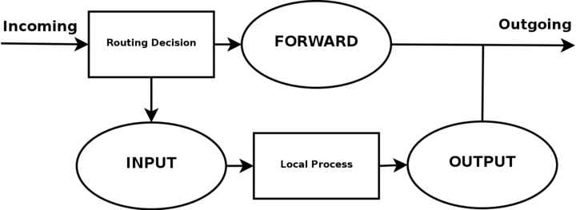
<js-ext-figcaption></js-ext-figcaption>

</js-ext-figure>

Based upon this picture, let us make clear what our goals are. This whole example script is based upon the assumption that we are looking at a scenario containing one local network, one firewall and an Internet connection connected to the firewall. This example is also based upon the assumption that we have a static IP to the Internet (as opposed to DHCP, PPP and SLIP and others).

In this case, we also want to allow the firewall to act as a server for certain services on the Internet, and we trust our local network fully and hence we will not block any of the traffic from the local network. Also, this script has as a main priority to only allow traffic that we explicitly want to allow.

To do this, we want to set default policies within the chains to DROP. This will effectively kill all connections and all packets that we do not explicitly allow inside our network or our firewall.

In the case of this scenario, we would also like to let our local network do connections to the Internet. Since the local network is fully trusted, we want to allow all kinds of traffic from the local network to the Internet. However, the Internet is most definitely not a trusted network and hence we want to block them from getting to our local network. Based upon these general assumptions, let's look at what we need to do and what we do not need and want to do.

<js-ext-figure class="js-illustration">

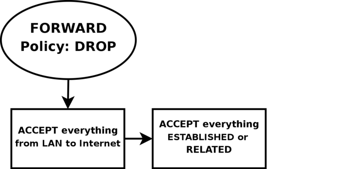
<js-ext-figcaption></js-ext-figcaption>

</js-ext-figure>

First of all, we want the local network to be able to connect to the Internet, of course. To do this, we will need to SNAT all packets since none of the local computers have real IP addresses. All of this is done within the POSTROUTING chain, which is created last in this script. This means that we will also have to do some filtering within the FORWARD chain since we will otherwise allow outsiders full access to our local network.

We trust our local network to the fullest, and because of that we specifically allow all traffic from our local network to the Internet. Since no one on the Internet should be allowed to contact our local network computers, we will want to block all traffic from the Internet to our local network except already established and related connections, which in turn will allow all return traffic from the Internet to our local network.

<js-ext-figure class="js-illustration">

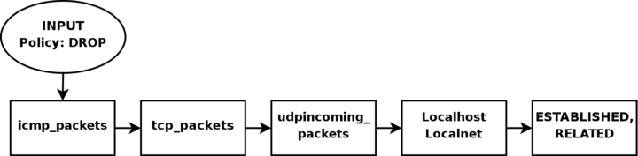
<js-ext-figcaption></js-ext-figcaption>

</js-ext-figure>

As for our firewall, we may be a bit low on funds perhaps, or we just want to offer a few services to people on the Internet. Therefore, we have decided to allow HTTP, FTP, SSH and IDENTD access to the actual firewall. All of these protocols are available on the actual firewall, and hence it should be allowed through the INPUT chain, and we need to allow the return traffic through the OUTPUT chain.

However, we also trust the local network fully, and the loopback device and IP address are also trusted. Because of this, we want to add special rules to allow all traffic from the local network as well as the loopback network interface. Also, we do not want to allow specific packets or packet headers in specific conjunctions, nor do we want to allow some IP ranges to reach the firewall from the Internet.

For instance, the 10.0.0.0/8 address range is reserved for local networks and hence we would normally not want to allow packets from such a address range since they would with 90% certainty be spoofed. However, before we implement this, we must note that certain Internet Service Providers actually use these address ranges within their own networks. For a closer discussion of this, read the _Common problems and questions_ chapter.

Since we have an FTP server running on the server, as well as the fact we want to traverse as few rules as possible, we add a rule which lets all established and related traffic through at the top of the INPUT chain. For the same reason, we want to split the rules down into sub-chains.

By doing this, our packets will hopefully only need to traverse as few rules as possible. By traversing less rules, we make the rule-set less time-consuming for each packet, and reduce latency within the network.

In this script, we choose to split the different packets down by their protocol family, for example TCP, UDP or ICMP. All TCP packets traverse a specific chain named `tcp_packets`, which will contain rules for all TCP ports and protocols that we want to allow.

Also, we want to do some extra checking on the TCP packets, so we would like to create one more subchain for all packets that are accepted for using valid port numbers to the firewall. This chain we choose to call the allowed chain, and should contain a few extra checks before finally accepting the packet.

As for ICMP packets, these will traverse the `icmp_packets` chain. When we decided on how to create this chain, we could not see any specific needs for extra checks before allowing the ICMP packets through if we agree with the type and code of the ICMP packet, and hence we accept them directly.

Finally, we have the UDP packets which need to be dealt with. These packets, we send to the udp_packets chain which handles all incoming UDP packets. All incoming UDP packets should be sent to this chain, and if they are of an allowed type we should accept them immediately without any further checking.

Since we are running on a relatively small network, this box is also used as a secondary workstation and to give some extra leeway for this, we want to allow certain specific protocols to make contact with the firewall itself, such as speak freely and ICQ.

<js-ext-figure class="js-illustration">

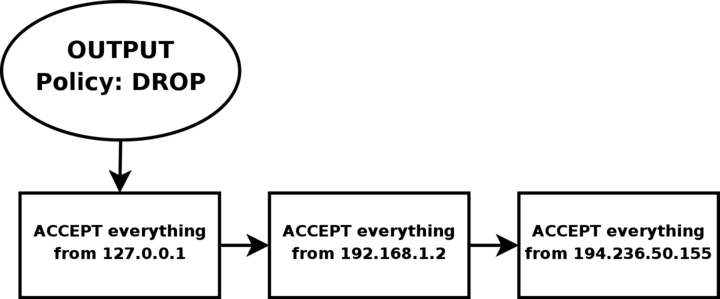
<js-ext-figcaption></js-ext-figcaption>

</js-ext-figure>

Finally, we have the firewalls OUTPUT chain. Since we actually trust the firewall quite a lot, we allow pretty much all traffic leaving the firewall. We do not do any specific user blocking, nor do we do any blocking of specific protocols. However, we do not want people to use this box to spoof packets leaving the firewall itself, and hence we only want to allow traffic from the IP addresses assigned to the firewall itself.

We would most likely implement this by adding rules that ACCEPT all packets leaving the firewall in case they come from one of the IP addresses assigned to the firewall, and if not they will be dropped by the default policy in the OUTPUT chain.

### Setting up default policies <a id="setting-up-default-policies" ></a>

Quite early on in the process of creating our rule-set, we set up the default policies. We set up the default policies on the different chains with a fairly simple command, as described below.

```console
$ iptables [-P {chain} {policy}]
```

The default policy is used every time the packets do not match a rule in the chain. For example, let's say we get a packet that matches no single rule in our whole rule-set. If this happens, we must decide what should happen to the packet in question, and this is where the default policy comes into the picture. The default policy is used on all packets that does not match with any other rule in our rule-set.

<js-ext-div class="" data-type="note">

Do be cautious with what default policy you set on chains in other tables since they are simply not made for filtering, and it may lead to very strange behaviors.

</js-ext-div>

### Setting up user specified chains in the filter table <a id="setting-up-user-specified-chains-in-the-filter-table" ></a>

Now you have a good picture of what we want to accomplish with this firewall, so let us get on to the actual implementation of the rule-set. It is now high time that we take care of setting up all the rules and chains that we wish to create and to use, as well as all of the rule-sets within the chains.

After this, we create the different special chains that we want to use with the -N command. The new chains are created and set up with no rules inside of them. The chains we will use are, as previously described, `icmp_packets`, `tcp_packets`, `udp_packets` and the allowed chain, which is used by the `tcp_packets` chain. Incoming packets on `$INET_IFACE`, of ICMP type, will be redirected to the chain `icmp_packets`.

Packets of TCP type, will be redirected to the `tcp_packets` chain and incoming packets of UDP type from `$INET_IFACE` go to `udp_packets` chain. All of this will be explained more in detail in the _INPUT chain_ section below. To create a chain is quite simple and only consists of a short declaration of the chain as this:

```console
$ iptables [-N `_chain_`]
```

In the upcoming sections we will have a closer look at each of the user defined chains that we have by now created. Let us have a closer look at how they look and what rules they contain and what we will accomplish within them.

#### The `bad_tcp_packets` chain <a id="the-bad-tcp-packets-chain" ></a>

The `bad_tcp_packets` chain is devoted to contain rules that inspect incoming packets for malformed headers or other problems. As it is, we have only chosen to include a packet filter which blocks all incoming TCP packets that are considered as NEW but do not have the SYN bit set, as well as a rule that blocks SYN/ACK packets that are considered NEW. This chain could be used to check for all possible inconsistencies, such as above or _XMAS_ port-scans etc. We could also add rules that looks for state INVALID.

If you want to fully understand the NEW not SYN, you need to look at the _State NEW packets but no SYN bit set_ section in the _Common problems and questions_ appendix regarding state NEW and non-SYN packets getting through other rules. These packets could be allowed under certain circumstances but in 99% of the cases we wouldn't want these packets to get through. Hence, we log them to our logs and then we DROP them.

The reason that we REJECT SYN/ACK packets that are considered NEW is also very simple. It is described in more depth in the _SYN/ACK and NEW packets_ section in the _Common problems and questions_ appendix. Basically, we do this out of courtesy to other hosts, since we will prevent them from being attacked in a sequence number prediction attack.

#### The allowed chain <a id="the-allowed-chain" ></a>

If a packet comes in on `$INET_IFACE` and is of TCP type, it travels through the tcp_packets chain and if the connection is against a port that we want to allow traffic on, we want to do some final checks on it to see if we actually do want to allow it or not. All of these final checks are done within the allowed chain.

First of all, we check if the packet is a SYN packet. If it is a SYN packet, it is most likely to be the first packet in a new connection so, of course, we allow this. Then we check if the packet comes from an ESTABLISHED or RELATED connection, if it does, then we, again of course, allow it.

An ESTABLISHED connection is a connection that has seen traffic in both directions, and since we have seen a SYN packet, the connection then must be in state ESTABLISHED, according to the state machine. The last rule in this chain will DROP everything else. In this case this pretty much means everything that has not seen traffic in both directions, i.e., we didn't reply to the SYN packet, or they are trying to start the connection with a non SYN packet.

There is _no_ practical use of not starting a connection with a SYN packet, except to port scan people pretty much. There is no currently available TCP/IP implementation that supports opening a TCP connection with something else than a SYN packet to my knowledge, hence, DROP it since it is 99% sure to be a port scan.

<js-ext-div class="" data-type="note">

The rule regarding ESTABLISHED,RELATED packets is actually redundant in this script and will not be used, but has been included for the sake of being complete. The rule that will be used is placed at the top of the INPUT chain, and contains ESTABLISHED,RELATED as well.

</js-ext-div>

#### The TCP chain <a id="the-tcp-chain" ></a>

The `tcp_packets` chain specifies what ports are allowed to use on the firewall from the Internet. There is, however, even more checks to do, hence we send each and every one of the packets on to the allowed chain, which we described previously.

A `tcp_packets` tells iptables in which chain to add the new rule, the rule will be added to the end of the chain. -p TCP tells it to match TCP packets and `-s 0/0` matches all source addresses from 0.0.0.0 with netmask 0.0.0.0, in other words _all_ source addresses.

This is actually the default behavior but I am using it just to make everything as clear as possible. `--dport 21` means destination port 21, in other words if the packet is destined for port 21 they also match. If all the criteria are matched, then the packet will be targeted for the allowed chain. If it doesn't match any of the rules, they will be passed back to the original chain that sent the packet to the `tcp_packets` chain.

As it is now, I allow TCP port 21, or FTP control port, which is used to control FTP connections and later on I also allow all RELATED connections, and that way we allow PASSIVE and ACTIVE connections since the `ip_conntrack_ftp` module is, hopefully, loaded. If we do not want to allow FTP at all, we can unload the `ip_conntrack_ftp` module and delete the `$IPTABLES -A tcp_packets -p TCP -s 0/0 --dport 21 -j allowed` line from the `rc.firewall.txt` file.

Port 22 is SSH, which is much better than allowing telnet on port 23 if you want to allow anyone from the outside to use a shell on your box at all. Note that you are dealing with a firewall. It is always a bad idea to give others than yourself any kind of access to a firewall box. Firewalls should always be kept to a bare minimum and no more.

Port 80 is HTTP, in other words your web server, delete it if you do not want to run a web server directly on your firewall.

And finally we allow port 113, which is IDENTD and might be necessary for some protocols like IRC, etc to work properly. Do note that it may be worth it to use the oidentd package if you NAT several hosts on your local network. oidentd has support for relaying IDENTD requests on to the correct boxes within your local network.

If you feel like adding more open ports with this script, well, it should be quite obvious how to do that by now. Just cut and paste one of the other lines in the `tcp_packets` chain and change it to the port you want to open.

#### The UDP chain <a id="the-udp-chain" ></a>

If we do get a UDP packet on the INPUT chain, we send them on to udp_packets where we once again do a match for the UDP protocol with -p UDP and then match everything with a source address of 0.0.0.0 and netmask 0.0.0.0, in other words everything again. Except this time, we only accept specific UDP ports that we want to be open for hosts on the Internet. Do note that we do not need to open up holes depending on the sending hosts source port, since this should be taken care of by the state machine.

We only need to open up ports on our host if we are to run a server on any UDP port, such as DNS etc. Packets that are entering the firewall and that are part of an already established connection (by our local network) will automatically be accepted back in by the `--state ESTABLISHED,RELATED` rules at the top of the INPUT chain.

As it is, we do not ACCEPT incoming UDP packets from port 53, which is what we use to do DNS lookups. The rule is there, but it is per default commented out. If you want your firewall to act as a DNS server, uncomment this line.

I personally also allow port 123, which is NTP or network time protocol. This protocol is used to set your computer clock to the same time as certain other time servers which have _very_ accurate clocks. Most of you probably do not use this protocol and hence I am not allowing it per default. The same thing applies here, however, the rule is there and it is simple to uncomment to get it working.

We do not currently allow port 2074, which is used for certain real-time _multimedia_ applications like speak freely which you can use to talk to other people in real-time by using speakers and a microphone, or even better, a headset. If you would like to use this, you could turn it on quite simply by removing the comment.

Port 4000 is the ICQ protocol. This should be an extremely well known protocol that is used by the Mirabilis application named ICQ. There are at least 2-3 different ICQ clones for Linux and it is one of the most widely used chat programs in the world. I doubt there is any further need to explain what it is.

At this point, two extra rules are available if you are experiencing a lot of log entries due to different circumstances.

The first rule will block broadcast packets to destination ports 135 through 139. These are used by NetBIOS, or SMB for most Microsoft users. This will block all log entries we may get from iptables logging Microsoft network activity on the outside of our firewall.

The second rule was also created to take care of excessive logging problems, but instead takes care of DHCP queries from the outside. This is specifically true if your outside network consists of a non-switched Ethernet type of network, where the clients receive their IP addresses by DHCP. During these circumstances, you could wind up with a lot of logs from just that.

<js-ext-div class="" data-type="note">

Do note that the last two rules are specifically opted out since some people may be interested in these kind of logs.

If you are experiencing problems with excessive legit logging, try to drop these types of packages at this point. There are also more rules of this type just before the log rules in the INPUT chain.

</js-ext-div>

#### The ICMP chain <a id="the-icmp-chain" ></a>

This is where we decide what ICMP types to allow. If a packet of ICMP type comes in on eth0 on the INPUT chain, we then redirect it to the icmp_packets chain as explained before. Here we check what kind of ICMP types to allow. For now, I only allow incoming ICMP Echo requests, TTL equals 0 during transit and TTL equals 0 during reassembly.

The reason that we do not allow any other ICMP types per default here, is that almost all other ICMP types should be covered by the RELATED state rules.

<js-ext-div class="" data-type="note">

If an ICMP packet is sent as a reply to an already existing packet or packet stream it is considered RELATED to the original stream.

For more information on the states, read the _The state machine_ chapter.

</js-ext-div>

The reason that I allow these ICMP packets is as follows, Echo Requests are used to request an echo reply, which in turn is used to mainly ping other hosts to see if they are available on any of the networks. Without this rule, other hosts will not be able to ping us to see if we are available on any network connection.

Do note that some people would tend to erase this rule, since they simply do not want to be seen on the Internet. Deleting this rule will effectively render any pings to our firewall totally useless from the Internet since the firewall will simply not respond to them.

Time Exceeded (i.e., TTL equals 0 during transit and TTL equals 0 during reassembly), is allowed in the case we want to trace-route some host or if a packet gets its Time To Live set to 0, we will get a reply about this. For example, when you trace-route someone, you start out with `TTL = 1`, and it gets down to 0 at the first hop on the way out, and a Time Exceeded is sent back from the first gateway en route to the host we are trying to trace-route, then `TTL = 2` and the second gateway sends Time Exceeded, and so on until we get an actual reply from the host we finally want to get to. This way, we will get a reply from each host on our way to the actual host we want to reach, and we can see every host in between and find out what host is broken.

For a complete listing of all ICMP types, see the _ICMP types_ appendix . For more information on ICMP types and their usage, i suggest reading: _RFC 792 - Internet Control Message Protocol_ by J. Postel.

<js-ext-div class="" data-type="note">

As a side-note, I might be wrong in blocking some of these ICMP types for you, but in my case, everything works perfectly while blocking all the ICMP types that I do not allow.

</js-ext-div>

### INPUT chain <a id="input-chain" ></a>

The INPUT chain, as I have written it, uses mostly other chains to do the hard work. This way we do not get too much load from iptables, and it will work much better on slow machines which might otherwise drop packets at high loads.

This is done by checking for specific details that should be the same for a lot of different packets, and then sending those packets into specific user specified chains. By doing this, we can split down our rule-set to contain much less rules that need to be traversed by each packet and hence the firewall will be put through a lot less overhead by packet filtering.

First of all we do certain checks for bad packets. This is done by sending all TCP packets to the `bad_tcp_packets` chain. This chain contains a few rules that will check for badly formed packets or other anomalies that we do not want to accept. For a full explanation of the `bad_tcp_packets` chain, take a look in the _The `bad_tcp_packets` chain_ section in this chapter.

At this point we start looking for traffic from generally trusted networks. These include the local network adapter and all traffic coming from there, all traffic to and from our loopback interface, including all our currently assigned IP addresses (this means all of them, including our Internet IP address).

As it is, we have chosen to put the rule that allows LAN activity to the firewall at the top, since our local network generates more traffic than the Internet connection. This allows for less overhead used to try and match each packet with each rule and it is always a good idea to look through what kind of traffic mostly traverses the firewall. By doing this, we can shuffle around the rules to be more efficient, leading to less overhead on the firewall and less congestion on your network.

Before we start touching the "real" rules which decide what we allow from the Internet interface and not, we have a related rule set up to reduce our overhead. This is a state rule which allows all packets part of an already ESTABLISHED or RELATED stream to the Internet IP address.

This rule has an equivalent rule in the allowed chain, which are made rather redundant by this rule, which will be evaluated before the allowed ones are. However, the --state ESTABLISHED,RELATED rule in the allowed chain has been retained for several reasons, such as people wanting to cut and paste the function.

After this, we match all TCP packets in the INPUT chain that comes in on the `$INET_IFACE` interface, and send those to the `tcp_packets`, which was previously described. Now we do the same match for UDP packets on the `$INET_IFACE` and send those to the `udp_packets` chain, and after this all ICMP packets are sent to the icmp_packets chain.

Normally, a firewall would be hardest hit by TCP packets, than UDP and last of them all ICMP packets. This is in normal case, mind you, and it may be wrong for you. The absolute same thing should be looked upon here, as with the network specific rules.

Which causes the most traffic? Should the rules be thrown around to generate less overhead? On networks sending huge amounts of data, this is an absolute necessity since a Pentium III equivalent machine may be brought to its knees by a simple rule-set containing 100 rules and a single 100mbit Ethernet card running at full capacity if the rule-set is badly written. This is an important piece to look at when writing a rule-set for your own local network.

At this point we have one extra rule, that is per default opted out, that can be used to get rid of some excessive logging in case we have some Microsoft network on the outside of our Linux firewall. Microsoft clients have a bad habit of sending out tons of multicast packets to the 224.0.0.0/8 range, and hence we have the opportunity to block those packets here so we don't fill our logs with them. There are also two more rules doing something similar to tasks in the `udp_packets` chain described in the _The UDP chain_.

Before we hit the default policy of the INPUT chain, we log it so we may be able to find out about possible problems and/or bugs. Either it might be a packet that we just do not want to allow or it might be someone who is doing something bad to us, or finally it might be a problem in our firewall not allowing traffic that should be allowed.

In either case we want to know about it so it can be dealt with. Though, we do not log more than 3 packets per minute as we do not want to flood our logs with crap which in turn may fill up our whole logging partition, also we set a prefix to all log entries so we know where it came from.

Everything that has not yet been caught will be DROPed by the default policy on the INPUT chain. The default policy was set quite some time back, in the _Setting up default policies_ section, in this chapter.

### FORWARD chain <a id="forward-chain" ></a>

The FORWARD chain contains quite a few rules in this scenario. We have a single rule which sends all packets to the `bad_tcp_packets` chain, which was also used in the INPUT chain as described previously. The `bad_tcp_packets` chain is constructed in such a fashion that it can be used recycled in several calling chains, regardless of what packet traverses it.

After this first check for bad TCP packets, we have the main rules in the FORWARD chain.

The first rule will allow all traffic from our `$LAN_IFACE` to any other interface to flow freely, without restrictions. This rule will in other words allow all traffic from our LAN to the Internet.

The second rule will allow ESTABLISHED and RELATED traffic back through the firewall. This will in other words allow packets belonging to connections that were initiated from our internal network to flow freely back to our local network.

These rules are required for our local network to be able to access the Internet, since the default policy of the FORWARD chain was previously set to DROP.

This is quite clever, since it will allow hosts on our local network to connect to hosts on the Internet, but at the same time block hosts on the Internet from connecting to the hosts on our internal network.

Finally we also have a logging rule which will log packets that are not allowed in one or another way to pass through the FORWARD chain. This will most likely show one or another occurrence of a badly formed packet or other problem. One cause may be hacker attacks, and others may be malformed packets.

This is exactly the same rule as the one used in the INPUT chain except for the logging prefix, "IPT FORWARD packet died: ". The logging prefix is mainly used to separate log entries, and may be used to distinguish log entries to find out where the packet was logged from and some header options.

### OUTPUT chain <a id="output-chain" ></a>

Since I know that there is pretty much no one but me using this box which is partially used as a Firewall and a workstation currently, I allow almost everything that goes out from it that has a source address `$LOCALHOST_IP`, `$LAN_IP` or `$STATIC_IP`. Everything else might be spoofed in some fashion, even though I doubt anyone that I know would do it on my box.

Last of all we log everything that gets dropped. If it does get dropped, we will most definitely want to know about it so we may take action against the problem. Either it is a nasty error, or it is a weird packet that is spoofed. Finally we DROP the packet in the default policy.

### PREROUTING chain of the nat table <a id="prerouting-chain-of-the-nat-table" ></a>

The PREROUTING chain is pretty much what it says, it does network address translation on packets before they actually hit the routing decision that sends them onward to the INPUT or FORWARD chains in the filter table. The only reason that we talk about this chain in this script is that we once again feel obliged to point out that you should not do any filtering in it.

The PREROUTING chain is only traversed by the first packet in a stream, which means that all subsequent packets will go totally unchecked in this chain. As it is with this script, we do not use the PREROUTING chain at all, however, this is the place we would be working in right now if we wanted to do DNAT on any specific packets, for example if you want to host your web server within your local network.

For more information about the PREROUTING chain, read the _Traversing of tables and chains_ chapter.

<js-ext-div class="" data-type="note">

The PREROUTING chain should not be used for any filtering since, among other things, this chain is only traversed by the first packet in a stream.

The PREROUTING chain should be used for network address translation only, unless you really know what you are doing.

</js-ext-div>

### Starting SNAT and the POSTROUTING chain <a id="starting-snat-and-the-postrouting-chain" ></a>

So, our final mission would be to get the Network Address Translation up, correct? At least to me.

First of all we add a rule to the nat table, in the POSTROUTING chain that will NAT all packets going out on our interface connected to the Internet. For me this would be eth0. However, there are specific variables added to all of the example scripts that may be used to automatically configure these settings.

The -t option tells iptables which table to insert the rule in, in this case the nat table. The -A command tells us that we want to Append a new rule to an existing chain named POSTROUTING and `-o $INET_IFACE` tells us to match all outgoing packets on the `INET_IFACE` interface (or eth0, per default settings in this script) and finally we set the target to SNAT the packets.

So all packets that match this rule will be SNAT'ed to look as if they came from your Internet interface. Do note that you must set which IP address to give outgoing packets with the --to-source option sent to the SNAT target.

In this script we have chosen to use the SNAT target instead of MASQUERADE for a couple of reasons. The first one is that this script was supposed to run on a firewall that has a static IP address.

A follow up reason to the first one, would hence be that it is faster and more efficient to use the SNAT target if possible. Of course, it was also used to show how it would work and how it would be used in a real live example.

If you do not have a static IP address, you should definitely give thought to use the MASQUERADE target instead which provides a simple and easy facility that will also do NAT for you, but that will automatically grab the IP address that it should use. This takes a little bit extra computing power, but it may most definitely be worth it if you use DHCP for instance.

If you would like to have a closer look at how the MASQUERADE target may look, you should look at the _rc.DHCP.firewall.txt_ script.

## What's next? <a id="whats-next" ></a>

This chapter has explained some of the layout of the different scripts, but specifically the `rc.firewall.txt` script. The layout and inner workings of scripts described here and those found in other places can differ tremenduously. Everyone has their own coding style and how we write rulesets or code or scripts differ from person to person, and the style you've seen here is my style.

The next chapter will give some brief introductions to the different scripts available within this document. They will give you some basic idea what scenarios the scripts where written for, and then you should hopefully have taught yourself enough to grasp the rest of the scripts on your own. All of these scripts are also available for download on the main site of this document.

# Chapter 14. Example scripts

The objective of this chapter is to give a fairly brief and short explanation of each script available with this tutorial, and to provide an overview of the scripts and what services they provide. These scripts are not in any way perfect, and they may not fit your exact intentions perfectly. It is, in other words, up to you to make these scripts suitable for your needs.

The rest of this tutorial should most probably be helpful in making this feat. The first section of this tutorial deals with the actual structure that I have established in each script so we may find our way within the script a bit easier.

## rc.firewall.txt script structure <a id="rc-firewall-txt-script-structure" ></a>

All scripts written for this tutorial have been written after a specific structure. The reason for this is that they should be fairly similar to each other and to make it easier to find the differences between the scripts. This structure should be fairly well documented in this brief chapter.

This chapter should hopefully give a short understanding to why all the scripts have been written as they have, and why I have chosen to maintain this structure.

<js-ext-div class="" data-type="note">

Even though this is the structure I have chosen, do note that this may not be the best structure for your scripts. It is only a structure that I have chosen to use since it fits the need of being easy to read and follow the best according to my logic.

</js-ext-div>

### The structure <a id="the-structure" ></a>

This is the structure that all scripts in this tutorial should follow. If they differ in some way it is probably an error on my part, unless it is specifically explained why I have broken this structure.

1. **_Configuration_** - First of all we have the configuration options which the rest of the script should use. Configuration options should pretty much always be the first thing in any shell-script.

   1. **_Internet_** - This is the configuration section which pertains to the Internet connection. This could be skipped if we do not have any Internet connection. Note that there may be more subsections than those listed here, but only such that pertain to our Internet connection.

      1. **_DHCP_** - If there are possibly any special DHCP requirements with this specific script, we will add the DHCP specific configuration options here.

      2. **_PPPoE_** - If there is a possibility that the user that wants to use this specific script, and if there are any special circumstances that raises the chances that he is using a PPPoE connection, we will add specific options for those here.

   2. **_LAN_** - If there is any LAN available behind the firewall, we will add options pertaining to that in this section. This is most likely, hence this section will almost always be available.

   3. **_DMZ_** - If there is any reason to it, we will add a DMZ zone configuration at this point. Most scripts lacks this section, mainly because any normal home network, or small corporate network, will not have one.

   4. **_Localhost_** - These options pertain to our localhost. These variables are highly unlikely to change, but we have put most of it into variables anyway. Hopefully, there should be no reason to change these variables.

   5. **_iptables_** - This section contains iptables specific configuration. In most scripts and situations this should only require one variable which tells us where the iptables binary is located.

   6. **_Other_** - If there are any other specific options and variables, they should first of all be fitted into the correct subsection (If it pertains to the Internet connection, it should be sub-sectioned there, etc). If it does not fit in anywhere, it should be sub-sectioned directly to the configuration options somewhere.

2. **_Module loading_** - This section of the scripts should maintain a list of modules. The first part should contain the required modules, while the second part should contain the non-required modules.
<p>
   Note that some modules that may raise security, or add certain services or possibilities, may have been added even though they are not required. This should normally be noted in such cases within the example scripts.
<p>
   As of the later iptables versions, modules are automatically loaded and most module loading should not be required, but from a control perspective, it is better to load the modules on your own. For example, the conntrack helpers are never automatically loaded.
<p>
    1. **_Required modules_** - This section should contain the required modules, and possibly special modules that add to the security or add special services to the administrator or clients.
    
    2. **_Non-required modules_** - This section contains modules that are not required for normal operations. All of these modules should be commented out per default, and if you want to add the service it provides, it is up to you.

3. **_proc configuration_** - This section should take care of any special configuration needed in the proc file system. If some of these options are required, they will be listed as such, if not, they should be commented out per default, and listed under the non-required proc configurations. Most of the useful proc configurations will be listed here, but far from all of them.

   1. **_Required proc configuration_** - This section should contain all of the required proc configurations for the script in question to work. It could possibly also contain configurations that raise security, and possibly which add special services or possibilities for the administrator or clients.

   2. **_Non-required proc configuration_** - This section should contain non-required proc configurations that may prove useful. All of them should be commented out, since they are not actually necessary to get the script to work. This list will contain far from all of the proc configurations or nodes.

4. **_Rules set up_** - By now the scripts should most probably be ready to insert the rule-set. I have chosen to split all the rules down after table and then chain names in the rule-sets, to make them easier to follow and read. All user specified chains are created before we do anything to the system built in chains. I have also chosen to set the chains and their rule specifications in the same order as they are output by the iptables -L command.

   1. **_Filter table_** - First of all we go through the filter table and its content. First of all we should set up all the policies in the table.

      1. **_Set policies_** - Set up all the default policies for the system chains. Normally I will set DROP policies on the chainsa in the filter table, and specifically ACCEPT services and streams that I want to allow inside. This way we will get rid of all ports that we do not want to let people use.

      2. **_Create user specified chains_** - At this point we create all the user specified chains that we want to use later on within this table. We will not be able to use these chains in the system chains anyway if they are not already created so we might as well get to it as soon as possible.

      3. **_Create content in user specified chains_** - After creating the user specified chains we may as well enter all the rules within these chains. The only reason I have to enter this data at this point already is that you may as well put it close to the creation of the user specified chains. You may as well put this later on in your script, it is totally up to you.

      4. **_INPUT chain_** - When we have come this far, we do not have a lot of things left to do within the filter table so we get onto the INPUT chain. At this point we should add all rules within the INPUT chain.
      <p>
      At this point we start following the output from the iptables** -L command as you may see. There is no reason for you to stay with this structure, however, do try to avoid mixing up data from different tables and chains since it will become much harder to read such rule-sets and to fix possible problems.

      5. **_FORWARD chain_** - At this point we go on to add the rules within the FORWARD chain. Nothing special about this decision.

      6. **_OUTPUT chain_** - Last of all in the filter table, we add the rules dealing with the OUTPUT chain. There should, hopefully, not be too much to do at this point.

   2. **_nat table_** - After the filter table we take care of the nat table. This is done after the filter table because of a number of reasons within these scripts. First of all we do not want to turn the whole forwarding mechanism and NAT function on at too early a stage, which could possibly lead to packets getting through the firewall at just the wrong time point (i.e., when the NAT has been turned on, but none of the filter rules has been run). Also, I look upon the nat table as a sort of layer that lies just outside the filter table and kind of surrounds it. The filter table would hence be the core, while the nat table acts as a layer lying around the filter table, and finally the mangle table lies around the nat table as a second layer. This may be wrong in some perspectives, but not too far from reality.

      1. **_Set policies_** - First of all we set up all the default policies within the nat table. Normally, I will be satisfied with the default policy set from the beginning, namely the ACCEPT policy. This table should not be used for filtering anyways, and we should not let packets be dropped here since there are some really nasty things that may happen in such cases due to our own presumptions. I let these chains be set to ACCEPT since there is no reason not to do so.

      2. **_Create user specified chains_** - At this point we create any user specified chains that we want within the nat table. Normally I do not have any of these, but I have added this section anyways, just in case. Note that the user specified chains must be created before they can actually be used within the system chains.

      3. **_Create content in user specified chains_** - By now it should be time to add all the rules to the user specified chains in the nat table. The same thing goes here as for the user specified chains in the filter table. We add this material here since I do not see any reason not to.

      4. **_PREROUTING chain_** - The PREROUTING chain is used to do DNAT on packets in case we have a need for it. In most scripts this feature is not used, or at the very least commented out. The reason being that we do not want to open up big holes to our local network without knowing about it. Within some scripts we have this turned on by default since the sole purpose of those scripts is to provide such services.

      5. **_POSTROUTING chain_** - The POSTROUTING chain should be fairly well used by the scripts I have written since most of them depend upon the fact that you have one or more local networks that we want to firewall against the Internet. Mainly we will try to use the SNAT target, but in certain cases we are forced to use the MASQUERADE target instead.

      6. **_OUTPUT chain_** - The OUTPUT chain is barely used at all in any of the scripts. As it looks now, it is not broken, but I have been unable to find any good reasons to use this chain so far. If anyone has a reason to use this chain, send me a line and I will add it to the tutorial.

   3. **_mangle table_** - The last table to do anything about is the mangle table. Normally I will not use this table at all, since it should normally not be used for anyone, unless they have specific needs, such as masking all boxes to use the exact same TTL or to change TOS fields etc. I have in other words chosen to leave these parts of the scripts more or less blank, with a few exceptions where I have added a few examples of what it may be used for.

      1. **_Set policies_** - Set the default policies within the chain. The same thing goes here as for the nat table, pretty much. The table was not made for filtering, and hence you should avoid it alltogether. I have not set any policies in any of the scripts in the mangle table one way or the other, and you are encouraged not to do so either.

      2. **_Create user specified chains_** - Create all the user specified chains. Since I have barely used the mangle table at all in the scripts, I have neither created any chains here since it is fairly unusable without any data to use within it. However, this section was added just in case someone, or I, would have the need for it in the future.

      3. **_Create content in user specified chains_** - If you have any user specified chains within this table, you may at this point add the rules that you want within them here.

      4. **_PREROUTING_** - At this point there is barely any information in any of the scripts in this tutorial that contains any rules here. Basically, the PREROUTING chain can be used to set netfilter, routing and SEC marks, both on a per packet basis and on a per connection basis.

      5. **_INPUT chain_** - The INPUT chain is barely used in the current scripts of the tutorial, but it could be used for mark handling for example.

      6. **_FORWARD chain_** - The FORWARD chain of the mangle table can be used for mark handling and for mangling packet headers of packets that are traveling across the firewall in question. Changing TTL and TOS for example.

      7. **_OUTPUT chain_** - The OUTPUT chain could be used to mangle the packets leaving the firewall or host itself, for example setting different marks or setting TTL or TOS values. This is not done in most of the scripts here, but the section has been added however.

      8. **_POSTROUTING chain_** - This chain is basically not in use by any of the scripts in the tutorial as of writing this, but it could be used to setting values for all packets leaving both the host or firewall itself, and traffic traversing the machine. For example, it could be used to reset the MTU of packets, set TTL or TOS et cetera.

Hopefully this should explain more in detail how each script is structured and why they are structured in such a way.

<js-ext-div class="" data-type="note">

Do note that these descriptions are extremely brief, and should mainly just be seen as a brief explanation to what and why the scripts have been split down as they have. There is nothing that says that this is the only and best way to go.

</js-ext-div>

## rc.firewall.txt <a id="rc-firewall-txt" ></a>

<js-ext-figure class="js-illustration">


<js-ext-figcaption></js-ext-figcaption>

</js-ext-figure>

The [rc.firewall.txt](./rc.firewall.sh) script is the main core on which the rest of the scripts are based upon. The _rc.firewall file_ chapter should explain every detail in the script most thoroughly. Mainly it was written for a dual homed network. For example, where you have one LAN and one Internet Connection. This script also makes the assumption that you have a static IP to the Internet, and hence don't use DHCP, PPP, SLIP or some other protocol that assigns you an IP automatically. If you are looking for a script that will work with those setups, please take a closer look at the _rc.DHCP.firewall.txt_ script.

The `rc.firewall.txt` script requires the following options to be compiled statically to the kernel, or as modules. Without one or more of these, the script will become more or less flawed since parts of the script's required functionalities will be unusable. As you change the script you use, you could possibly need more options to be compiled into your kernel depending on what you want to use.

- `CONFIG_NETFILTER`

- `CONFIG_IP_NF_CONNTRACK`

- `CONFIG_IP_NF_IPTABLES`

- `CONFIG_IP_NF_MATCH_LIMIT`

- `CONFIG_IP_NF_MATCH_STATE`

- `CONFIG_IP_NF_FILTER`

- `CONFIG_IP_NF_NAT`

- `CONFIG_IP_NF_TARGET_LOG`

## rc.DMZ.firewall.txt <a id="rc-dmz-firewall-txt" ></a>

<js-ext-figure class="js-illustration">


<js-ext-figcaption></js-ext-figcaption>

</js-ext-figure>

The [rc.DMZ.firewall.txt](./rc.DMZ.firewall.sh) script was written for those people out there that have one Trusted Internal Network, one De-Militarized Zone and one Internet Connection. The De-Militarized Zone is in this case 1-to-1 NATed and requires you to do some IP aliasing on your firewall, i.e., you must make the box recognize packets for more than one IP.

There are several ways to get this to work, one is to set 1-to-1 NAT, another one if you have a whole subnet is to create a subnetwork, giving the firewall one IP both internally and externally. You could then set the IP's to the DMZed boxes as you wish. Do note that this will "steal" two IP's for you, one for the broadcast address and one for the network address. This is pretty much up to you to decide and to implement.

This tutorial will give you the tools to actually accomplish the firewalling and NATing part, but it will not tell you exactly what you need to do since it is out of the scope of the tutorial.

The `rc.DMZ.firewall.txt` script requires these options to be compiled into your kernel, either statically or as modules. Without these options, at the very least, available in your kernel, you will not be able to use this scripts functionality. You may in other words get a lot of errors complaining about modules and targets/jumps or matches missing.

If you are planning to do traffic control or any other things like that, you should see to it that you have all the required options compiled into your kernel there as well.

- `CONFIG_NETFILTER`

- `CONFIG_IP_NF_CONNTRACK`

- `CONFIG_IP_NF_IPTABLES`

- `CONFIG_IP_NF_MATCH_LIMIT`

- `CONFIG_IP_NF_MATCH_STATE`

- `CONFIG_IP_NF_FILTER`

- `CONFIG_IP_NF_NAT`

- `CONFIG_IP_NF_TARGET_LOG`

You need to have two internal networks with this script as you can see from the picture. One uses IP range 192.168.0.0/24 and consists of a Trusted Internal Network. The other one uses IP range 192.168.1.0/24 and consists of the De-Militarized Zone which we will do 1-to-1 NAT to.

For example, if someone from the Internet sends a packet to our `DNS_IP`, then we use DNAT to send the packet on to our DNS on the DMZ network. When the DNS sees our packet, the packet will be destined for the actual DNS internal network IP, and not to our external DNS IP. If the packet would not have been translated, the DNS wouldn't have answered the packet. We will show a short example of how the DNAT code looks:

```bash
$IPTABLES -t nat -A PREROUTING -p TCP -i $INET_IFACE -d $DNS_IP \
--dport 53 -j DNAT --to-destination $DMZ_DNS_IP
```

First of all, DNAT can only be performed in the PREROUTING chain of the nat table. Then we look for TCP protocol on our `$INET_IFACE` with destination IP that matches our `$DNS_IP`, and is directed to port 53, which is the TCP port for zone transfers between name servers.

If we actually get such a packet we give a target of DNAT. After that we specify where we want the packet to go with the --to-destination option and give it the value of `$DMZ_DNS_IP`, in other words the IP of the DNS on our DMZ network. This is how basic DNAT works. When the reply to the DNATed packet is sent through the firewall, it automatically gets un-DNATed.

By now you should have enough understanding of how everything works to be able to understand this script pretty well without any huge complications. If there is something you don't understand that hasn't been gone through in the rest of the tutorial, mail me since it is probably a fault on my side.

## rc.DHCP.firewall.txt <a id="rc-dhcp-firewall-txt" ></a>

<js-ext-figure class="js-illustration">

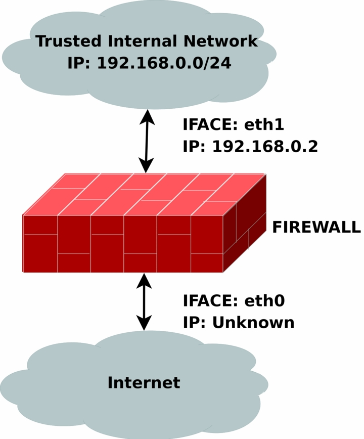
<js-ext-figcaption></js-ext-figcaption>

</js-ext-figure>

The [rc.DHCP.firewall.txt](./rc.DHCP.firewall.sh) script is pretty much identical to the original _rc.firewall.txt_. However, this script no longer uses the STATIC_IP variable, which is the main change to the original rc.firewall.txt script. The reason is that this won't work together with a dynamic IP connection. The actual changes needed to be done to the original script are minimal, however, I've had some people mail me and ask about the problem so this script will be a good solution for you. This script will allow people who uses DHCP, PPP and SLIP connections to connect to the Internet.

The `rc.DHCP.firewall.txt` script requires the following options to be compiled statically to the kernel, or as modules, as a bare minimum to run properly.

- `CONFIG_NETFILTER`

- `CONFIG_IP_NF_CONNTRACK`

- `CONFIG_IP_NF_IPTABLES`

- `CONFIG_IP_NF_MATCH_LIMIT`

- `CONFIG_IP_NF_MATCH_STATE`

- `CONFIG_IP_NF_FILTER`

- `CONFIG_IP_NF_NAT`

- `CONFIG_IP_NF_TARGET_MASQUERADE`

- `CONFIG_IP_NF_TARGET_LOG`

The main changes done to the script consist of erasing the `STATIC_IP` variable as I already said and deleting all references to this variable.

Instead of using this variable the script now does its main filtering on the variable `INET_IFACE`. In other words `-d $STATIC_IP` has been changed to -i `$INET_IFACE`. This is pretty much the only change made and that's all that's needed really.

There are some more things to think about though. We can no longer filter in the INPUT chain depending on, for example, `--in-interface $LAN_IFACE --dst $INET_IP`. This in turn forces us to filter only based on interfaces in such cases where the internal machines must access the Internet addressable IP.

One great example is if we are running an HTTP on our firewall. If we go to the main page (i.e., http://192.168.0.1/), which contains static links back to the same host (i.e., http://foobar.dyndns.net/fuubar.html), which could be some dyndns solution, we would get a minor problem. The NATed box would ask the DNS for the IP of the HTTP server, then try to access that IP.

In case we filter based on interface and IP, the NATed box would be unable to get to the HTTP because the INPUT chain would DROP the packets flat to the ground. This also applies in a sense to the case where we got a static IP, but in such cases it could be gotten around by adding rules which check the LAN interface packets for our `INET_IP`, and if so ACCEPT them.

As you may read from above, it may be a good idea to get a script, or write one, that handles dynamic IP in a better sense. We could for example make a script that grabs the IP from ifconfig and adds it to a variable, upon boot-up of the Internet connection.

A good way to do this, would be to use, for example, the `ip-up` scripts provided with pppd and some other programs. For a good site, check out the linuxguruz.org iptables site which has a huge collection of scripts available to download. You will find a link to the linuxguruz.org site from the _Other resources and links_ appendix.

<js-ext-div class="" data-type="note">

This script might be a bit less secure than the `rc.firewall.txt` script. I would definitely advise you to use that script if at all possible since this script is more open to attacks from the outside.

</js-ext-div>

Also, there is the possibility to add something like this to your scripts:

```bash
INET_IP=`ifconfig $INET_IFACE | grep inet | cut -d : -f 2 | cut -d ' ' -f 1`
```

The above would automatically grab the IP address of the $INET_IFACE variable, grep the correct line which contains the IP address and then cuts it down to a manageable IP address. For a more elaborate way of doing this, you could apply the snippets of code available within the [retreiveip.txt](./retrieveip.sh) script, which will automatically grab your Internet IP address when you run the script.

Do note that this may in turn lead to a little bit of "weird" behavior, such as stalling connections to and from the firewall on the internal side. The most common strange behaviors are described in the following list.

1. If the script is run from within a script which in turn is executed by, for example, the PPP daemon, it will hang all currently active connections due to the NEW not SYN rules (see the _State NEW packets but no SYN bit set_ section). It is possible to get by, if you get rid of the NEW not SYN rules for example, but it is questionable.

2. If you got rules that are static and always want to be around, it is rather harsh to add and erase rules all the time, without hurting the already existing ones. For example, if you want to block hosts on your LAN to connect to the firewall, but at the same time operate a script from the PPP daemon, how would you do it without erasing your already active rules blocking the LAN?

3. It may get unnecessarily complicated, as seen above which, in turn, could lead to security compromises. If the script is kept simple, it is easier to spot problems, and to keep order in it.

## rc.UTIN.firewall.txt <a id="rc-utin-firewall-txt" ></a>

<js-ext-figure class="js-illustration">


<js-ext-figcaption></js-ext-figcaption>

</js-ext-figure>

The [rc.UTIN.firewall.txt](./rc.UTIN.firewall.sh) script will in contrast to the other scripts block the LAN that is sitting behind us. In other words, we don't trust anyone on any networks we are connected to. We also disallow people on our LAN to do anything but specific tasks on the Internet. The only things we actually allow are POP3, HTTP and FTP access to the Internet. We also don't trust the internal users to access the firewall more than we trust users on the Internet.

The `rc.UTIN.firewall.txt` script requires the following options to be compiled statically to the kernel, or as modules. Without one or more of these, the script will become more or less flawed since parts of the script's required functionalities will be unusable. As you change the script you use, you could possibly need more options to be compiled into your kernel depending on what you want to use.

- `CONFIG_NETFILTER`

- `CONFIG_IP_NF_CONNTRACK`

- `CONFIG_IP_NF_IPTABLES`

- `CONFIG_IP_NF_MATCH_LIMIT`

- `CONFIG_IP_NF_MATCH_STATE`

- `CONFIG_IP_NF_FILTER`

- `CONFIG_IP_NF_NAT`

- `CONFIG_IP_NF_TARGET_LOG`

This script follows the golden rule to not trust anyone, not even our own employees. This is a sad fact, but a large part of the hacks and cracks that a company gets hit by are a matter of people from their own staff perpetrating the hit.

This script will hopefully give you some clues as to what you can do with your firewall to strengthen it. It's not very different from the original `rc.firewall.txt` script, but it does give a few hints at what we would normally let through etc.

## rc.test-iptables.txt <a id="rc-test-iptables-txt" ></a>

The [rc.test-iptables.txt](./rc.test-iptables.sh) script can be used to test all the different chains, but it might need some tweaking depending on your configuration, such as turning on ip_forwarding, and setting up masquerading etc. It will work for most everyone who has all the basic set up and all the basic tables loaded into kernel.

All it really does is set some LOG targets which will log ping replies and ping requests. This way, you will get information on which chain was traversed and in which order. For example, run this script and then do:

```bash
ping -c 1 host.on.the.internet
```

And `tail -n 0 -f /var/log/messages` while doing the first command. This should show you all the different chains used, and in which order, unless the log entries are swapped around for some reason.

<js-ext-div class="" data-type="note">

This script was written for testing purposes only. In other words, it's not a good idea to have rules like this that log everything of one sort since your log partitions might get filled up quickly and it would be an effective Denial of Service attack against you and might lead to real attacks on you that would be unlogged after the initial Denial of Service attack.

</js-ext-div>

## rc.flush-iptables.txt <a id="rc-flush-iptables-txt" ></a>

The [rc.flush-iptables.txt](./rc.flush-iptables.sh) script should not really be called a script in itself. The script will reset and flush all your tables and chains. The script starts by setting the default policies to ACCEPT on the INPUT, OUTPUT and FORWARD chains of the filter table. After this we reset the default policies of the PREROUTING, POSTROUTING and OUTPUT chains of the nat table. We do this first so we won't have to bother about closed connections and packets not getting through.

This script is intended for actually setting up and troubleshooting your firewall, and hence we only care about opening the whole thing up and resetting it to default values.

After this we flush all chains first in the filter table and then in the NAT table. This way we know there are no redundant rules lying around anywhere. When all of this is done, we jump down to the next section where we erase all the user specified chains in the NAT and filter tables. When this step is done, we consider the script done. You may consider adding rules to flush your mangle table if you use it.

<js-ext-div class="" data-type="note">

One final word on this issue. Certain people have mailed me asking me to put this script into the original `rc.firewall` script using Red Hat Linux syntax where you type something like `rc.firewall` start and the script starts.

However, I will not do that since this is a tutorial and should be used as a place to fetch ideas mainly and it shouldn't be filled up with shell scripts and strange syntax.

Adding shell script syntax and other things makes the script harder to read as far as I am concerned and the tutorial was written with readability in mind and will continue being so.

</js-ext-div>

## Limit-match.txt <a id="limit-match-txt" ></a>

The [limit-match.txt](./limit-match.sh) script is a minor test script which will let you test the limit match and see how it works. Load the script up, and then send ping packets at different intervals to see which gets through, and how often they get through. All echo replies will be blocked until the threshold for the burst limit has again been reached.

## Pid-owner.txt <a id="pid-owner-txt" ></a>

The [pid-owner.txt](./pid-owner.sh) is a small example script that shows how we could use the PID owner match. It does nothing real, but you should be able to run the script, and then from the output of `iptables -L -v` be able to tell that the rule actually matches.

## Recent-match.txt <a id="recent-match-txt" ></a>

The [recent-match.txt](./recent-match.sh) script is a small example of how the recent match can be used. For a complete explanation of this script take a look at the _Recent match_ section in the _Iptables matches_ chapter.

## Sid-owner.txt <a id="sid-owner-txt" ></a>

The [sid-owner.txt](./sid-owner.sh) is a small example script that shows how we could use the SID owner match. It does nothing real, but you should be able to run the script, and then from the output of `iptables -L -v` be able to tell that the rule actually matches.

## Ttl-inc.txt <a id="ttl-inc-txt" ></a>

A small example [ttl-inc.txt](./ttl-inc.sh) script. This script shows how we could make the firewall/router invisible to traceroutes, which would otherwise reveal much information to possible attackers.

## `iptables-save` ruleset <a id="iptables-save-ruleset" ></a>

A small [example script](./iptsave-ruleset.sh) used in the _Saving and restoring large rule-sets_ chapter to illustrate how `iptables-save` may be used. This script is non-working, and should hence not be used for anything else than a reference.

## What's next? <a id="whats-next" ></a>

The chapter you have just read basically gave you a brief overlook of all the different scripts that are available with this tutorial and the basic idea that they are trying to bring across to you. Hopefully it has been able to explain something at the very least.

The next chapter will discuss some different graphical user interfaces that are available for iptables and netfilter. This is far from a complete listing of all the different interfaces available, but as you can see, there are quite a lot of them.

These interfaces mostly tries to simplify creating iptables scripts for you, and for simple setups they are more than enough most of the time. At other times, you may have higher and more complex needs and you must have to write your own script none the less.

# Appendix A. Detailed explanations of special commands

## Listing your active rule-set <a id="listing-your-active-rule-set" ></a>

To list your currently active rule-set you run a special option to the iptables command, which we have discussed briefly previously in the _How a rule is built_ chapter. This would look like the following:

```console
$ iptables -L
```

This command should list your currently active rule-set, and translate everything possible to a more readable form. For example, it will translate all the different ports according to the `/etc/services` file as well as DNS all the IP addresses to get DNS records instead. The latter can be a bit of a problem though. For example, it will try to resolve LAN IP addresses, i.e. 192.168.1.1, to something useful. 192.168.0.0/16 is a private range though and should not resolve to anything and the command will seem to hang while resolving the IP. To get around this problem we would do something like the following:

```console
$ iptables -L -n
```

Another thing that might be interesting is to see a few statistics about each policy, rule and chain. We could get this by adding the verbose flag. It would then look something like this:

```console
$ iptables -L -n -v
```

Don't forget that it is also possible to list the nat and mangle tables. This is done with the -t switch, like this:

```console
$ iptables -L -t nat
```

There are also a few files that might be interesting to look at in the `/proc` file system. For example, it might be interesting to know what connections are currently in the conntrack table. This table contains all the different connections currently tracked and serves as a basic table so we always know what state a connection currently is in.

This table can't be edited and even if it was possible, it would be a bad idea. To see the table you can run the following command:

```console
$ cat /proc/net/ip_conntrack | less
```

The above command will show all currently tracked connections even though it might be a bit hard to understand everything.

## Updating and flushing your tables <a id="updating-and-flushing-your-tables" ></a>

If at some point you screw up your iptables, there are actually commands to flush them, so you don't have to reboot. I've actually gotten this question a couple times by now so I thought I'd answer it right here.

If you added a rule in error, you might just change the -A parameter to -D in the line you added in error. iptables will find the erroneous line and erase it for you, in case you've got multiple lines looking exactly the same in the chain, it erases the first instance it finds matching your rule.

If this is not the wanted behavior you might try to use the -D option as iptables -D INPUT 10 which will erase the 10th rule in the INPUT chain.

There are also instances where you want to flush a whole chain, in this case you might want to run the -F option. For example, iptables -F INPUT will erase the whole INPUT chain, though, this will not change the default policy, so if this is set to DROP you'll block the whole INPUT chain if used as above. To reset the chain policy, do as you did to set it to DROP, for example `iptables -P INPUT ACCEPT`.

I have made a _rc.flush-iptables.txt_ (available as an appendix as well) that will flush and reset your iptables that you might consider using while setting up your `rc.firewall.txt` file properly. One thing though; if you start mucking around in the mangle table, this script will not erase those, it is rather simple to add the few lines needed to erase those but I have not added those here since the mangle table is not used in my `rc.firewall.txt` script so far.

# Appendix B. Common problems and questions

## Problems loading modules <a id="problems-loading-modules" ></a>

You may run into a few problems with loading modules. For example, you could get errors claiming that there is no module by such a name and so on. This may, for example look like the following.

```bash
insmod: iptable_filter: no module by that name found
```

This is no reason for concern yet. This or these modules may possibly have been statically compiled into your kernel. This is the first thing you should look at when trying to solve this problem. The simplest way to see if these modules have been loaded already or if they are statically compiled into the kernel, is to simply try and run a command that uses the specific functionality. In the above case, we could not load the filter table. If this functionality is not there, we should be unable to use the filter table at all. To check if the filter table is there, we do the following.

```console
$ iptables -t filter -L
```

This should either output all of the chains in the filter table properly, or it should fail. If everything is o.k., then it should look something like this depending on if you have rules inserted or not.

```bash
Chain INPUT (policy ACCEPT)
target     prot opt source               destination

Chain FORWARD (policy ACCEPT)
target     prot opt source               destination

Chain OUTPUT (policy ACCEPT)
target     prot opt source               destination
```

If you do not have the filter table loaded, you would get an error that looks something like this instead.

```bash
iptables v1.2.5: can't initialize iptables table `filter': Table \
     does not exist (do you need to insmod?)
Perhaps iptables or your kernel needs to be upgraded.
```

This is a bit more serious since it points out that we, first of all, do not have the functionality compiled into the kernel, and second, that the module is not possible to find in our normal module paths. This may either mean that you have forgotten to install your modules, you have forgotten to run depmod -a to update your module databases, or you have not compiled the functionality as either module or statically into the kernel. There may of course be other reasons for the module not to be loaded, but these are the main reasons.

Most of these problems are easily solved. The first problem would simply be solved by running `make modules_install` in the kernel source directory (if the source has already been compiled and the modules have already been built).

The second problem is solved by simply running depmod -a once and see if it works afterward. The third problem is a bit out of the league for this explanation, and you are more or less left to your own wits here. You will most probably find more information about this on the _Linux Documentation Project_ homepage.

Another error that you may get when running iptables is the following error.

```bash
iptables: No chain/target/match by that name
```

This error tells us that there is no such chain, target or match. This could depend upon a huge set of factors, the most common being that you have misspelled the chain, target or match in question. Also, this could be generated in case you are trying to use a match that is not available, either because you did not load the proper module, it was not compiled into the kernel, or iptables failed to automatically load the module.

In general, you should look for all of the above solutions but also look for misspelled targets of some sort or another in your rule.

## State NEW packets but no SYN bit set <a id="state-new-packets-but-no-syn-bit-set" ></a>

There is a certain _feature_ in iptables that is not so well documented and may therefore be overlooked by a lot of people (yes, including me). If you use state NEW, packets with the SYN bit unset will get through your firewall. This feature is there because in certain cases we want to consider that a packet may be part of an already ESTABLISHED connection on, for instance, another firewall.

This feature makes it possible to have two or more firewalls, and for one of the firewalls to go down without any loss of data. The firewalling of the subnet could then be taken over by our secondary firewall. This does however lead to the fact that state NEW will allow pretty much any kind of TCP connection, regardless if this is the initial 3-way handshake or not. To take care of this problem we add the following rules to our firewalls INPUT, OUTPUT and FORWARD chain:

```bash
$IPTABLES -A INPUT -p tcp ! --syn -m state --state NEW -j LOG \
     --log-prefix "New not syn:"
$IPTABLES -A INPUT -p tcp ! --syn -m state --state NEW -j DROP
```

<js-ext-div class="" data-type="note">

The above rules will take care of this problem. This is a badly documented behavior of the Netfilter/iptables project and should definitely be more highlighted. In other words, a huge warning is in its place for this kind of behavior on your firewall.

</js-ext-div>

Note that there are some troubles with the above rules and bad Microsoft TCP/IP implementations. The above rules will lead to certain conditions where packets generated by Microsoft product gets labeled as state NEW and hence get logged and dropped. It will however not lead to broken connections to my knowledge.

The problem occurs when a connection gets closed, the final FIN/ACK is sent, the state machine of Netfilter closes the connection and it is no longer in the conntrack table. At this point the faulty Microsoft implementation sends another packet which is considered as state NEW but lacks the SYN bit and hence gets matched by the above rules.

In other words, don't worry to much about this rule, or if you are worried anyways, set the --log-headers option to the rule and log the headers too and you'll get a better look at what the packet looks like.

There is one more known problem with these rules. If someone is currently connected to the firewall, let's say from the LAN, and you have the script set to be activated when running a PPP connection. In this case, when you start the PPP connection, the person previously connected through the LAN will be more or less killed.

This only applies when you are running with the conntrack and nat code bases as modules, and the modules are loaded and unloaded each time you run the script. Another way to get this problem is to run the `rc.firewall.txt` script from a telnet connection from a host not on the actual firewall.

To put it simply, you connect with telnet or some other stream connection. Start the connection tracking modules, then load the NEW not SYN packet rules.

Finally, the telnet client or daemon tries to send something. the connection tracking code will not recognize this connection as a legal connection since it has not seen packets in any direction on this connection before, also there will be no SYN bits set since it is not actually the first packet in the connection. Hence, the packet will match to the rules and be logged and after-wards dropped to the ground.

## SYN/ACK and NEW packets <a id="syn-ack-and-new-packets" ></a>

Certain TCP spoofing attacks uses a technique called Sequence Number Prediction. In this type of attack, the attacker spoofs some other hosts IP address, while attacking someone, and tries to predict the Sequence number used by that host.

Let's look on typical TCP spoofing by sequence number prediction. Players: "attacker" [A], trying to send packets to a "victim" [V], pretending to be some "other host" [O].

1. [A] sends SYN to [V] with source IP of [O].

2. [V] replies to [O] by SYN/ACK.

3. now [O] should reply to an unknown SYN/ACK by RST and the attack is unsuccesful, but let's assume [O] is down (flooded, turned off or behind firewall that has dropped the packets).

4. if [O] didn't mess it up, [A] now can talk to [V] pretending to be [O] as long as it predicts correct sequence numbers.

As long as we do not send the RST packet to the unknown SYN/ACK in step 3, we will allow [V] to be attacked, and ourselves to be incriminated. Common courtesy, would hence be to send the RST to [V] in a proper way. If we use the NEW not SYN rules specified in the ruleset, SYN/ACK packets will be dropped. Hence, we have the following rules in the bad_tcp_packets chain, just above the NEW not SYN rules:

```console
$ iptables -A bad_tcp_packets -p tcp --tcp-flags SYN,ACK SYN,ACK \
-m state --state NEW -j REJECT --reject-with tcp-reset
```

The chance of being [O] in this scenario should be relatively small, but these rules should be safe in almost all cases. Except when you run several redundant firewalls which will often take over packets or streams from each other. In such case, some connections may be blocked, even though they are legit.

This rule may actually also allow a few portscans to see our firewall as well, but they should not be able to tell much more than that.

## Internet Service Providers who use assigned IP addresses <a id="internet-service-providers-who-use-assigned-ip-addresses" ></a>

I have added this since a friend of mine told me something I have totally forgotten. Certain stupid Internet Service Providers use IP addresses assigned by _IANA_ for their local networks on which you connect to.

For example, the Swedish Internet Service Provider and phone monopoly Telia uses this approach for example on their DNS servers, which uses the 10.x.x.x IP address range. A common problem that you may run into when writing your scripts, is that you do not allow connections from any IP addresses in the 10.x.x.x range to yourself, because of spoofing possibilities.

Well, here is unfortunately an example where you actually might have to lift a bit on those rules. You might just insert an ACCEPT rule above the spoof section to allow traffic from those DNS servers, or you could just comment out that part of the script. This is how it might look:

```console
$ /usr/local/sbin/iptables -t nat -I PREROUTING -i eth1 -s 10.0.0.1/32 -j ACCEPT
```

I would like to take my moment to bitch at these Internet Service Providers. These IP address ranges are not assigned for you to use for dumb stuff like this, at least not to my knowledge.

For large corporate sites it is more than o.k., or your own home network, but you are not supposed to force us to open up ourselves just because of some whim of yours. You are large Internet providers, and if you can't afford buying some 3-4 IP addresses for your DNS servers, I have a very hard time trusting you.

## Letting DHCP requests through iptables <a id="letting-dhcp-requests-through-iptables" ></a>

This is a fairly simple task really, once you get to know how DHCP works, however, you must be a little bit cautious with what you do let in and what you do not let in.

First of all, we should know that DHCP works over the UDP protocol. Hence, this is the first thing to look for. Second, we should check which interface we get and send the request from. For example, if our eth0 interface is set up with DHCP, we should not allow DHCP requests on eth1.

To make the rule a bit more specific, we only allow the actual UDP ports used by DHCP, which should be ports 67 and 68. These are the criteria that we choose to match packets on, and that we allow. The rule would now look like this:

```bash
$IPTABLES  -I INPUT -i $LAN_IFACE -p udp --dport 67:68 --sport 67:68 -j ACCEPT
```

Do note that we allow all traffic to and from UDP port 67 and 68 now, however, this should not be such a huge problem since it only allows requests from hosts doing the connection from port 67 or 68 as well.

This rule could, of course, be even more restrictive, but it should be enough to actually accept all DHCP requests and updates without opening up too large of holes. If you are concerned, this rule could of course be made even more restrictive.

## mIRC DCC problems <a id="mirc-dcc-problems" ></a>

mIRC uses a special setting which allows it to connect through a firewall and to make DCC connections work properly without the firewall knowing about it. If this option is used together with iptables and specifically the `ip_conntrack_irc` and `ip_nat_irc` modules, it will simply not work.

The problem is that mIRC will automatically NAT the inside of the packets for you, and when the packet reaches the firewall, the firewall will simply not know how and what to do with it. mIRC does not expect the firewall to be smart enough to take care of this by itself by simply querying the IRC server for its IP address and sending DCC requests with that address instead.

Turning on the "I am behind a firewall" configuration option and using the `ip_conntrack_irc` and `ip_nat_irc` modules will result in Netfilter creating log entries with the following content "Forged DCC send packet".

The simplest possible solution is to just uncheck that configuration option in mIRC and let iptables do the work. This means, that you should tell mIRC specifically that it is _not_ behind a firewall.

# Appendix C. ICMP types

This is a complete listing of all ICMP types. Note the reference pointing to the RFC or person who introduced the type and code. For a complete and absolute up to date listing of all ICMP types and codes, look at the [icmp-parameters](http://www.iana.org/assignments/icmp-parameters) document at _Internet Assigned Numbers Authority_.

<js-ext-div class="" data-type="note">

Iptables and netfilter uses ICMP type 255 internally since it is not reserved for any real usage, and most likely will never have any real usage.

If you set a rule to match `iptables -A INPUT -p icmp --icmp-type 255 -j DROP`, this will DROP all ICMP packets. It is in other words used to match all ICMP types.

</js-ext-div>

**Table C-1. ICMP types**

| TYPE  | CODE | Description                                            | Query | Error | Reference     |
| :---- | :--- | :----------------------------------------------------- | :---- | :---- | :------------ |
| 0     | 0    | Echo Reply                                             | x     | NA    | RFC792        |
| 3     | 0    | Network Unreachable                                    | NA    | x     | RFC792        |
| 3     | 1    | Host Unreachable                                       | NA    | x     | RFC792        |
| 3     | 2    | Protocol Unreachable                                   | NA    | x     | RFC792        |
| 3     | 3    | Port Unreachable                                       | NA    | x     | RFC792        |
| 3     | 4    | Fragmentation needed but no frag. bit set              | NA    | x     | RFC792        |
| 3     | 5    | Source routing failed                                  | NA    | x     | RFC792        |
| 3     | 6    | Destination network unknown                            | NA    | x     | RFC792        |
| 3     | 7    | Destination host unknown                               | NA    | x     | RFC792        |
| 3     | 8    | Source host isolated (obsolete)                        | NA    | x     | RFC792        |
| 3     | 9    | Destination network administratively prohibited        | NA    | x     | RFC792        |
| 3     | 10   | Destination host administratively prohibited           | NA    | x     | RFC792        |
| 3     | 11   | Network unreachable for TOS                            | NA    | x     | RFC792        |
| 3     | 12   | Host unreachable for TOS                               | NA    | x     | RFC792        |
| 3     | 13   | Communication administratively prohibited by filtering | NA    | x     | RFC1812       |
| 3     | 14   | Host precedence violation                              | NA    | x     | RFC1812       |
| 3     | 15   | Precedence cutoff in effect                            | NA    | x     | RFC1812       |
| 4     | 0    | Source quench                                          | NA    | NA    | RFC792        |
| 5     | 0    | Redirect for network                                   | NA    | NA    | RFC792        |
| 5     | 1    | Redirect for host                                      | NA    | NA    | NA            |
| 5     | 2    | Redirect for TOS and network                           | NA    | NA    | RFC792        |
| 5     | 3    | Redirect for TOS and host                              | NA    | NA    | RFC792        |
| 8     | 0    | Echo request                                           | x     | NA    | RFC792        |
| 9     | 0    | Router advertisement - Normal router advertisement     | NA    | NA    | RFC1256       |
| 9     | 16   | Router advertisement - Does not route common traffic   | NA    | NA    | RFC2002       |
| 10    | 0    | Route selection                                        | NA    | NA    | RFC1256       |
| 11    | 0    | TTL equals 0 during transit                            | NA    | x     | RFC792        |
| 11    | 1    | TTL equals 0 during reassembly                         | NA    | x     | RFC792        |
| 12    | 0    | IP header bad (catchall error)                         | NA    | x     | RFC792        |
| 12    | 1    | Required options missing                               | NA    | x     | RFC1108       |
| 12    | 2    | IP Header bad length                                   | NA    | x     | RFC792        |
| 13    | 0    | Timestamp request (obsolete)                           | x     | NA    | RFC792        |
| 14    | NA   | Timestamp reply (obsolete)                             | x     | NA    | RFC792        |
| 15    | 0    | Information request (obsolete)                         | x     | NA    | RFC792        |
| 16    | 0    | Information reply (obsolete)                           | x     | NA    | RFC792        |
| 17    | 0    | Address mask request                                   | x     | NA    | RFC950        |
| 18    | 0    | Address mask reply                                     | x     | NA    | RFC950        |
| 20-29 | NA   | Reserved for robustness experiment                     | NA    | NA    | Zaw-Sing Su   |
| 30    | 0    | Traceroute                                             | x     | NA    | RFC1393       |
| 31    | 0    | Datagram Conversion Error                              | NA    | x     | RFC1475       |
| 32    | 0    | Mobile Host Redirect                                   | NA    | NA    | David Johnson |
| 33    | 0    | IPv6 Where-Are-You                                     | x     | NA    | Bill Simpson  |
| 34    | 0    | IPv6 I-Am-Here                                         | x     | NA    | Bill Simpson  |
| 35    | 0    | Mobile Registration Request                            | x     | NA    | Bill Simpson  |
| 36    | 0    | Mobile Registration Reply                              | x     | NA    | Bill Simpson  |
| 39    | 0    | SKIP                                                   | NA    | NA    | Tom Markson   |
| 40    | 0    | Photuris                                               | NA    | NA    | RFC2521       |

# Appendix D. TCP options

This appendix is a simple and brief list of all the TCP options that are officially recognized. These references and numbers were all retreived from the _Internet Assigned Numbers Authority_ website. The master file can be found at [this location](http://www.iana.org/assignments/tcp-parameters). The full contact details of the people referenced in this document has been removed, so to create less workload for them hopefully.

**Table D-1. TCP Options**

| Copy | Class | Number | Value | Name                               | Reference      |
| :--- | :---- | :----- | :---- | :--------------------------------- | :------------- |
| 0    | 0     | 0      | 0     | EOOL - End of Options List         | [RFC791, JBP]  |
| 0    | 0     | 1      | 1     | NOP - No Operation                 | [RFC791, JBP]  |
| 1    | 0     | 2      | 130   | SEC - Security                     | [RFC1108]      |
| 1    | 0     | 3      | 131   | LSR - Loose Source Route           | [RFC791, JBP]  |
| 0    | 2     | 4      | 68    | TS - Time Stamp                    | [RFC791, JBP]  |
| 1    | 0     | 5      | 133   | E-SEC - Extended Security          | [RFC1108]      |
| 1    | 0     | 6      | 134   | CIPSO - Commercial Security        | [???]          |
| 0    | 0     | 7      | 7     | RR - Record Route                  | [RFC791, JBP]  |
| 1    | 0     | 8      | 136   | SID - Stream ID                    | [RFC791, JBP]  |
| 1    | 0     | 9      | 137   | SSR - Strict Source Route          | [RFC791, JBP]  |
| 0    | 0     | 10     | 10    | ZSU - Experimental Measurement     | [ZSu]          |
| 0    | 0     | 11     | 11    | MTUP - MTU Probe                   | [RFC1191]\*    |
| 0    | 0     | 12     | 12    | MTUR - MTU Reply                   | [RFC1191]\*    |
| 1    | 2     | 13     | 205   | FINN - Experimental Flow Control   | [Finn]         |
| 1    | 0     | 14     | 142   | VISA - Experimental Access Control | [Estrin]       |
| 0    | 0     | 15     | 15    | ENCODE - ???                       | [VerSteeg]     |
| 1    | 0     | 16     | 144   | IMITD - IMI Traffic Descriptor     | [Lee]          |
| 1    | 0     | 17     | 145   | EIP - Extended Internet Protocol   | [RFC1385]      |
| 0    | 2     | 18     | 82    | TR - Traceroute                    | [RFC1393]      |
| 1    | 0     | 19     | 147   | ADDEXT - Address Extension         | [Ullmann IPv7] |
| 1    | 0     | 20     | 148   | RTRALT - Router Alert              | [RFC2113]      |
| 1    | 0     | 21     | 149   | SDB - Selective Directed Broadcast | [Graff]        |
| 1    | 0     | 22     | 150   | NSAPA - NSAP Addresses             | [Carpenter]    |
| 1    | 0     | 23     | 151   | DPS - Dynamic Packet State         | [Malis]        |
| 1    | 0     | 24     | 152   | UMP - Upstream Multicast Pkt.      | [Farinacci]    |

# Appendix E. Other resources and links

Here is a list of links to resources and where I have gotten information from, etc :

- **[ip-sysctl.txt](https://www.frozentux.net/iptables-tutorial/other/ip-sysctl.txt)** - from the 2.4.14 kernel. A little bit short but a good reference for the IP networking controls and what they do to the kernel.

- **[InGate](http://www.ingate.com)** - InGate is a commercial firewall producer that uses Linux as the base for their firewall products. Their productrange goes from basic firewalls to SIP gateways and QoS machines.

- **[RFC 768 - User Datagram Protocol](https://www.frozentux.net/iptables-tutorial/other/rfc768.txt)** - This is the official RFC describing how the UDP protocol should be used, in detail, and all of it's headers.

- **[RFC 791 - Internet Protocol](https://www.frozentux.net/iptables-tutorial/other/rfc791.txt)** - The IP specification as still used on the Internet, with additions and updates. The basic is still the same for IPv4.

- **[RFC 792 - Internet Control Message Protocol](https://www.frozentux.net/iptables-tutorial/other/rfc792.txt)** - The definitive resource for all information about ICMP packets. Whatever technical information you need about the ICMP protocol, this is where you should turn first. Written by J. Postel.

- **[RFC 793 - Transmission Control Protocol](https://www.frozentux.net/iptables-tutorial/other/rfc793.txt)** - This is the original resource on how TCP should behave on all hosts. This document has been the standard on how TCP should work since 1981 and forward. Extremely technical, but a must read for anyone who wants to learn TCP in every detail. This was originally a Department of Defense standard written by J. Postel.

- **[RFC 1122 - Requirements for Internet Hosts - Communication Layers](https://www.frozentux.net/iptables-tutorial/other/rfc1122.txt)** - This RFC defines the requirements of the software running on a Internet host, specifically the communication layers.

- **[RFC 1349 - Type of Service in the Internet Protocol Suite](https://www.frozentux.net/iptables-tutorial/other/rfc1349.txt)** - RFC describing some changes and clarifications of the TOS field in the IP header.

- **[RFC 1812 - Requirements for IP Version 4 Routers](https://www.frozentux.net/iptables-tutorial/other/rfc1812.txt)** - This RFC specifies how routers on the Internet should behave and how they are expected to handle different situations. Very interesting reading.

- **[RFC 2401 - Security Architecture for the Internet Protocol](https://www.frozentux.net/iptables-tutorial/other/rfc2401.txt)** - This is an RFC talking about the IPSEC implementation and standardisation. Well worth reading if you are working with IPSEC.

- **[RFC 2474 - Definition of the Differentiated Services Field (DS Field) in the IPv4 and IPv6 Headers](https://www.frozentux.net/iptables-tutorial/other/rfc2474.txt)** - In this document you will find out how the DiffServ works, and you will find much needed information about the TCP/IP protocol additions/changes needed for the DiffServ protocol to work.

- **[RFC 2638 - A Two-bit Differentiated Services Architecture for the Internet](https://www.frozentux.net/iptables-tutorial/other/rfc2638.txt)** - This RFC describes a method of implementing two different differentiated service architecture into one. Both where described originally by D. Clark and van Jacobsen at the Munich IETH meeting 1997.

- **[RFC 2960 - Stream Control Transmission Protocol](https://www.frozentux.net/iptables-tutorial/other/rfc2960.txt)** - This is a relatively new protocol developed by several large telecoms companies to complement UDP and TCP as a layer 3 protocol with higher reliability and resilience.

- **[RFC 3168 - The Addition of Explicit Congestion Notification (ECN) to IP](https://www.frozentux.net/iptables-tutorial/other/rfc3168.txt)** - This RFC defines how ECN is to be used on a technical level and how it should be implemented in the TCP and IP protocols. Written by K. Ramakrishnan, S. Floyd and D. Black.

- **[RFC 3260 - New Terminology and Clarifications for Diffserv](https://www.frozentux.net/iptables-tutorial/other/rfc3260.txt)** - This memo captures Diffserv working group agreements concerning new and improved terminology, and provides minor technical clarifications.

- **[RFC 3286 - An Introduction to the Stream Control Transmission Protocol](https://www.frozentux.net/iptables-tutorial/other/rfc3286.txt)** - RFC introducing the Stream Control Transmission Protocol, a relatively new layer 3 protocol in the TCP/IP stack. Developed by several large telecom companies.

- **[ip_dynaddr.txt](https://www.frozentux.net/iptables-tutorial/other/ip_dynaddr.txt)** - from the 2.4.14 kernel. A really short reference to the ip_dynaddr settings available via sysctl and the proc file system.

- **[iptables.8](https://www.frozentux.net/iptables-tutorial/other/iptables.html)** - The iptables 1.3.1 man page. This is an HTMLized version of the man page which is an excellent reference when reading/writing iptables rule-sets. Always have it at hand.

- **[Ipsysctl tutorial](http://ipsysctl-tutorial.frozentux.net)** - Another tutorial I have written about the IP System Control in Linux. A try to make a complete listing of all the IP variables that can be set on the fly in Linux.

- **[Policy Routing Using Linux](http://www.policyrouting.org/PolicyRoutingBook/)** - This is an excellent book that has now been opened up on the Internet regarding Policy routing in Linux. It is well written and most definitely worth buying. Written by Matthew G. Marsh.

- **[Security-Enhanced Linux](http://www.nsa.gov/selinux/)** - The official site of the Security-Enhanced Linux (SELinux) system developed as a proof of concept by the National Security Agency (NSA). SELinux is a fine grained Mandatory Access Control system, which lets you have a much higher control on who can do what and what processes has what privileges, et cetera.

- **[Firewall rules table](https://www.frozentux.net/iptables-tutorial/other/firewall_rules_table_final.pdf)** - A small PDF document gracefully given to this project by Stuart Clark, which gives a reference form where you can write all of the information needed for your firewall, in a simple manner.

- **<http://l7-filter.sourceforge.net/>** - The l7-filter project is basically a set of patches and files to make iptables and netfilter able to handle layer 7 filtering, mainly for QoS and traffic accounting. It works less reliably for filtering however, since it will allow the first couple of packets through before actually blocking traffic.

- **<http://www.netfilter.org/>** - The official Netfilter and iptables site. It is a must for everyone wanting to set up iptables and Netfilter in linux.

- **<http://www.insecure.org/nmap/>** - Nmap is one of the best, and most known, port scanners available. It is very useful when debugging your firewall scripts. Take a closer look at it.

- **<http://www.netfilter.org/documentation/index.html#FAQ>** - The official Netfilter _Frequently Asked Questions_. Also a good place to start at when wondering what iptables and Netfilter is about.

- **<http://www.netfilter.org/unreliable-guides/packet-filtering-HOWTO/index.html>** - Rusty Russells Unreliable Guide to packet filtering. Excellent documentation about basic packet filtering with iptables written by one of the core developers of iptables and Netfilter.

- **<http://www.netfilter.org/unreliable-guides/NAT-HOWTO/index.html>** - Rusty Russells Unreliable Guide to Network Address Translation. Excellent documentation about Network Address Translation in iptables and Netfilter written by one of the core developers, Rusty Russell.

- **<http://www.netfilter.org/unreliable-guides/netfilter-hacking-HOWTO/index.html>** - Rusty Russells Unreliable Netfilter Hacking HOW-TO. One of the few documentations on how to write code in the Netfilter and iptables user-space and kernel space code-base. This was also written by Rusty Russell.

- **<http://www.linuxguruz.org/iptables/>** - Excellent link-page with links to most of the pages on the Internet about iptables and Netfilter. Also maintains a list of iptables scripts for different purposes.

- **[Policy Routing using Linux](http://www.policyrouting.org)** - The best book I have ever read on Policy routing nad linux. This is an absolute must when it comes to routing in linux. Written by Matthew G. Marsh.

- **[Implementing Quality of Service Policies with DSCP](http://www.cisco.com/warp/public/105/dscpvalues.html)** - A link about the cisco implementation of DSCP. This shows some classes used in DSCP, and so on.

- **[IETF SIP Working Group](http://www.ietf.org/html.charters/sip-charter.html)** - SIP is one of the "next big things" it seems. Basically it is the defacto standards for Internet telephony today. It is horribly complex as you can see from the amount of documentation on the working groups homepage, and should hopefully be able to cope with pretty much any needs of session initiation in the future. It is used mainly to setup peer to peer connections between known users, for example to connect to user@example.org and setup a phone connection to that user. This is the IETF Working group handling all SIP work.

- **[IETF TLS Working Group](http://www.ietf.org/html.charters/tls-charter.html)** - TLS is a transport layer security model that is one of the most common host to server based security mechanisms. The current version is running is 1.1 and work is ongoing to get 1.2 out the door with support for newer and better cryptos as of this writing. This is a standardized way of sending and receiving public keys for servers and handling trusted certificate agents etc. For more information, read the RFC's on this page.

- **[IPSEC Howto](http://www.ipsec-howto.org)** - This is the official IPSEC howto for Linux 2.6 kernels. It describes how IPSEC works in the 2.6 kernels and up, however, it is not the place to find out exactly how the Linux 2.2 and 2.4 kernels worked when it comes to IPSEC. Go to the _FreeS/WAN_ site for that information.

- **[FreeS/WAN](http://www.freeswan.org)** - This is the official site for FreeS/WAN, an IPSEC implementation for the Linux 2.2 and 2.4 kernel series. This site contains documentation and all necessary downloads for the IPSEC implementation. This effort has been discontinued due to several reasons discussed on the page, but efforts will still be put into bugfixes, documentation and the forums. For an IPSEC implementation for Linux 2.6 kernels, please look at the _IPSEC Howto_ site and the information there.

- **[http://www.islandsoft.net/veerapen .html](http://www.islandsoft.net/veerapen.html)** -Excellent discussion on automatic hardening of iptables and how to make small changes that will make your computer automatically add hostile sites to a special ban list in iptables .

- **[`/etc/protocols`](https://www.frozentux.net/iptables-tutorial/other/protocols.txt)** - An example protocols file taken from the Slackware distribution. This can be used to find out what protocol number different protocols have, such as the IP, ICMP or TCP protocols have.

- **[`/etc/services`](https://www.frozentux.net/iptables-tutorial/other/services.txt)** - An example services file taken from the Slackware distribution. This is extremely good to get used to reading once in a while, specifically if you want to get a basic look at what protocols runs on different ports.

- **[Internet Assigned Numbers Authority](http://www.iana.org)** - The IANA is the organisation that is responsible for fixing all numbers in the different protocols in an orderly fashion. If anyone has a specific addition to make to a protocol (for example, adding a new TCP option), they need to contact the IANA, which will assign the numbers requested. In other words, extremely important site to keep an eye on.

- **[RFC-editor.org](http://www.rfc-editor.org)** - This is an excellent site for finding RFC documents in a fast and orderly way. Functions for searching RFC documents, and general information about the RFC community (I.e., errata, news, et cetera).

- **[Internet Engineering Task Force](http://www.ietf.org)** - This is one of the biggest groups when it comes to setting and maintaining Internet standards. They are the ones maintaining the RFC repository, and consist of a large group of companies and individuals that work together to ensure the interoperability of the Internet.

- **[Linux Advanced Routing and Traffic Control HOW-TO](http://www.lartc.org)** - This site hosts the Linux Advanced Routing and Traffic Control HOWTO. It is one of the biggest and best documents regarding Linux advanced routing. Maintained by Bert Hubert.

- **[Paksecured Linux Kernel patches](http://www.paksecured.com/patches/)** - A site containing all of the kernel patches written by Matthew G. Marsh. Among others, the FTOS patch is available here.

- **[ULOGD project page](http://www.gnumonks.org/gnumonks/projects/project_details?p_id=1)** - The homepage of the ULOGD site.

- The [Linux Documentation Project](http://www.linuxdoc.org) is a great site for documentation. Most big documents for Linux is available here, and if not in the TLDP, you will have to search the net very carefully. If there is anything you want to know more about, check this site out.

- **[Snort](http://www.snort.org)** - this is an excellent open source "network intrusion detection system" (NIDS) which looks for signatures in the packets that it sees, and if it sees a signature of some kind of attack or break-in it can do different actions that can be defined (notifying the administrator, or take action, or simply logging it).

- **[Tripwire](http://www.tripwire.org)** - tripwire is an excellent security tool which can be used to find out about host intrusions. It makes checksums of all the files specified in a configuration file, and then it tells the administrator about any files that has been tampered with in an illegit way every time it is run.

- **[Squid](http://www.squid.org)** - This is one of the most known webproxies available on the market. It is open source, and free. It can do several of the filtering tasks that should be done before the traffic actually hits your webserver, as well as doing the standard webcaching functions for your networks.

- **<http://kalamazoolinux.org/presentations/20010417/conntrack.html>** - This presentation contains an excellent explanation of the conntrack modules and their work in Netfilter. If you are interested in more documentation on conntrack, this is a "must read".

- **<http://www.docum.org>** - Excellent information about the CBQ, tc and the ip commands in Linux. One of the few sites that has any information at all about these programs. Maintained by Stef Coene.

- [http://lists.samba.org/m ailman/listinfo/netfilter](http://lists.samba.org/mailman/listinfo/netfilter)- The official Netfilter mailing-list. Extremely useful in case you have questions about something not covered in this document or any of the other links here.
