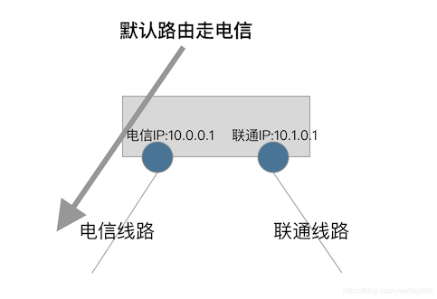

# Linux 内核 Policy Routing 和 iptables 的不完美实现

以下的描述仅仅针对于 Linux 内核实现的 TCP/IP 协议栈。

首先，让我们明确一个事实，即：

- **1. iptables 的 OUTPUT 链在标准 IP 路由之后起作用**

其次，让我们再明确另一个关于 IP 路由的事实，即：

- **2. 对于本地始发的流量，IP 路由除了确定下一跳之外，对于没有指定源 IP 的数据包，还将会为其选择源 IP 地址**

我们把上述经过 iptables OUTPUT 之前的标准 IP 路由行为简单称为 _**第一次路由**_。

当数据包经过了 iptables OUTPUT 链，某条 rule 为其打上了 fwmark 或者改变了其目标地址后，由于数据包属性已经改变，需要重新路由，我们将其称作
_**第二次路由**_。

Linux 内核协议栈在实现第一次路由和第二次路由时，其逻辑是一样的。

结合上述的第 1 点和第 2 点事实，将会出现一个问题：

- **由于第一次路由时会为 skb 选择 source 地址，那么第二次路由时的命中路由条目的 source 属性将永远不会生效**

这里的问题在于，_**最终数据包被发送出去时，其源地址可能并不是期望的源地址**_，以至于 _**不得不在出网卡上做一个 masquerading 才可以**_，
而我们知道，这个 masquerading 是饱受诟病的，因为它依赖于 `nf_conntrack`，而 `nf_conntrack` 多年以来被人云亦云地喷了个无地自容！

总结一下，数据包的源地址取决于第一次路由的查询结果！这问题在多运营商线路接入的主机上非常显而易见：

<js-ext-figure class="js-illustration">

</js-ext-figure>

请看上图，我们的配置如下：

```bash
# 默认路由走电信
ip route add 0.0.0.0/0 via 10.0.0.254 src 10.0.0.1

# 为特殊的数据包打标签，走联通策略路由
iptables -t mangle -A OUTPUT XXXX -j MARK --set-mark 100
ip rule add fwmark 100 table vtab

# 联通的默认路由
ip route add 0.0.0.0/0 via 10.1.0.254 src 10.1.0.1 table vtab
```

很遗憾，由于所有的数据包在第一次路由时均匹配到了到电信的默认路由，从而获得了 10.0.0.1 这个源 IP 地址，那么即便策略路由将其导向了联通的线路，
其源地址由于已经存在了，就不会再使用联通的源地址了。

这就会导致：

- 运营商的 Reverse Route Filter 策略会丢弃这个不属于自家 AS 的数据包
- 即便不会被 RP 丢弃，也可能会被热土豆策略乱扔(标准正常的数据包都是冷土豆策略)

那么怎么办？必须加上 masquerading 才可以：

```bash
iptable -t nat -A POSTROUTING -o $联通网卡 -j MASQUERADE
```

然而不是大家都不喜欢 `nf_conntrack` 吗？所以这并不是一个完美的方案！

所以说，我把上面的问题看作是一个 Linux 内核协议栈实现的问题！它并不完美！

---

不完美就改呗，于是我想做一个不依赖 `nf_conntrack` 的 NAT。找到 reroute 那一段，即重新第二次路由的那段，在
`net/ipv4/netfilter/iptable_mangle.c` 中：

```c
/* Reroute for ANY change. */
if (ret != NF_DROP && ret != NF_STOLEN) {
  iph = ip_hdr(skb);

  if (iph->saddr != saddr || iph->daddr != daddr || skb->mark != mark || iph->tos != tos) {
    err = ip_route_me_harder(skb, RTN_UNSPEC);
    if (err < 0) ret = NF_DROP_ERR(err);
  }
}
```

简单至极，几行代码搞定：

```c
...
/* Reroute for ANY change. */
if (ret != NF_DROP && ret != NF_STOLEN) {
  iph = ip_hdr(skb);

  if (iph->saddr != saddr || iph->daddr != daddr || skb->mark != mark || iph->tos != tos) {
    if (sk) {
      inet = inet_sk(sk);

      if (inet && !inet->inet_saddr) {
        struct flowi4 fl4 = {};
        // 为了重新选择源IP地址，所以flowi4的saddr清零！
        fl4.saddr        = 0;
        fl4.daddr        = iph->daddr;
        fl4.flowi4_tos   = RT_TOS(iph->tos);
        fl4.flowi4_oif   = sk->sk_bound_dev_if;
        fl4.flowi4_mark  = skb->mark;
        fl4.flowi4_flags = inet_sk_flowi_flags(sk);

        // 新函数，改自ip_route_me_harder，接受flowi4结构体参数
        err = ip_route_reroute(skb, &fl4);
        if (err < 0)
          ret = NF_DROP_ERR(err);
        else
          recheck = 1;
        if (saddr != fl4.saddr) {
          iph->saddr       = fl4.saddr;
          inet->inet_saddr = fl4.saddr;
          ip_send_check(iph);  // 重新计算校验码
        }
      }
    }
    if (!recheck) {
      err = ip_route_me_harder(skb, RTN_UNSPEC);
      if (err < 0) ret = NF_DROP_ERR(err);
    }
  }
}
```

用 ping 测试，结果 OK，不需要 NAT 的 masquerading 规则也是可以在第二次路由的时候重新选择源 IP 地址。

当我用 TCP 测试时，没有达到预期，它没有在上述的修改后的 reroute 逻辑中将源 IP 地址改掉，依然使用的是第一次路由时确定的源 IP…

Why？！

这是 TCP 的连接特性所决定的。

TCP 在发送第一个 SYN 连接包之前，必须完全确定四元组，这四个元素一个也不能少，所以在 connect 调用发 SYN 包之前，必须查一遍路由，以确定
源 IP 地址以及获取一个路由属性。

这里有点特殊的是，这次连接前的路由查找并不属于上述的 _**第一次路由**_ 或者 _**第二次路由**_ 中的任何一个，而只是一个纯粹的路由查找，查找过程
全程是没有数据包 skb 参与的！

所以，即便修改了 OUTPUT 链上的 reroute 逻辑，也根本无法起作用，数据包根本就不过 Netfilter，甚至根本就没有数据包！

那么怎么办？

也不是没有办法，我依然在 OUTPUT 链的 reroute 处拦截数据包。在拦截到第一个 SYN 包后，此时它已经经过了第一次路由，在第二次路由前，按照上面的
patch 将其源 IP 在必要的时候清零。

完成以上这些步骤后，我必须将 TCP socket 层面的元数据也一并修改，以将新的四元组体现在这个 TCP 连接里保持住。

代码如下：

```c
int ip_route_reroute(struct sk_buff *skb, struct flowi4 *fl4) {
  struct net *net = dev_net(skb_dst(skb)->dev);
  struct rtable *rt;
  unsigned int hh_len;

  rt = ip_route_output_key(net, fl4);
  if (IS_ERR(rt)) return PTR_ERR(rt);

  /* Drop old route. */
  skb_dst_drop(skb);
  skb_dst_set(skb, &rt->dst);

  if (skb_dst(skb)->error) return skb_dst(skb)->error;

  hh_len = skb_dst(skb)->dev->hard_header_len;
  if (skb_headroom(skb) < hh_len && pskb_expand_head(skb, HH_DATA_ALIGN(hh_len - skb_headroom(skb)), 0, GFP_ATOMIC)) return -ENOMEM;

  return 0;
}
static unsigned int ipt_mangle_out(struct sk_buff *skb, const struct nf_hook_state *state) {
  struct net_device *out = state->out;
  unsigned int ret;
  struct sock *sk = skb->sk;
  struct inet_sock *inet;
  struct iphdr *iph;
  u_int8_t tos;
  __be32 saddr, daddr;
  u_int32_t mark;
  int err;

  /* root is playing with raw sockets. */
  if (skb->len < sizeof(struct iphdr) || ip_hdrlen(skb) < sizeof(struct iphdr)) return NF_ACCEPT;

  /* Save things which could affect route */
  mark  = skb->mark;
  iph   = ip_hdr(skb);
  saddr = iph->saddr;
  daddr = iph->daddr;
  tos   = iph->tos;

  ret = ipt_do_table(skb, NF_INET_LOCAL_OUT, state, dev_net(out)->ipv4.iptable_mangle);
  /* Reroute for ANY change. */
  if (ret != NF_DROP && ret != NF_STOLEN) {
    int recheck = 0;

    iph = ip_hdr(skb);

    if (iph->saddr != saddr || iph->daddr != daddr || skb->mark != mark || iph->tos != tos) {
      struct tcphdr *th = NULL;

      if (sk) {
        inet = inet_sk(sk);
        if (inet && iph->protocol == IPPROTO_TCP) {
          struct tcp_sock *tp = tcp_sk(sk);

          th = tcp_hdr(skb);
          // 只NAT第一个SYN包
          if ((tcp_flag_word(th) & TCP_FLAG_SYN) && !(tcp_flag_word(th) & TCP_FLAG_ACK) &&
              // 这里的本意是想过滤FastOpen的，但没有成功...
              1 /*tp->tcp_header_len == skb->len*/) {
            goto doit;
          }
        }

        if (inet && !inet->inet_saddr) {
          struct flowi4 fl4 = {};
        doit:
          fl4.saddr        = 0;
          fl4.daddr        = iph->daddr;
          fl4.flowi4_tos   = RT_TOS(iph->tos);
          fl4.flowi4_oif   = sk->sk_bound_dev_if;
          fl4.flowi4_mark  = skb->mark;
          fl4.flowi4_flags = inet_sk_flowi_flags(sk);

          err = ip_route_reroute(skb, &fl4);
          if (err < 0) ret = NF_DROP_ERR(err);
          if (saddr != fl4.saddr) {
            iph->saddr       = fl4.saddr;
            inet->inet_saddr = fl4.saddr;
            ip_send_check(iph);  // 此以上对应三层的NAT修正
            if (th) {
              // 下面为TCP的NAT修正
              __be16 oldport = th->source;
              // 转换源IP地址
              inet->inet_rcv_saddr = inet->inet_saddr;
              // 为保证四元组的唯一性，必要时，需要重新选择sport，重新hash
              inet_unhash(sk);
              inet_put_port(sk);
              err = inet_hash_connect(&tcp_death_row, sk);
              // 转换源端口
              th->source = inet->inet_sport = htons(inet->inet_num);
              if (err) {
                ret = -err;
                goto out;
              }
              // 重新计算校验码！
              inet_proto_csum_replace2(&th->check, skb, oldport, th->source, 0);
              inet_proto_csum_replace4(&th->check, skb, saddr, fl4.saddr, 1);
            }
          }
          recheck = 1;
        }
      }
      if (!recheck) {
        err = ip_route_me_harder(skb, RTN_UNSPEC);
        if (err < 0) ret = NF_DROP_ERR(err);
      }
    }
  }
out:

  return ret;
}
```

用 Netcat 进行 TCP 测试，结果是 OK 的。

想说点形而上的理解。对于本地始发以及本地终结的流量的数据包，我认为在 socket 层面做 NAT 效率会更高，因为 socket 本身就是一个连接跟踪，
本地始发或者本地终结数据包没有必要再来一层 `nf_conntrack` 了。
但是这样做的不合理性是对 _**特殊逻辑进行了特殊处理**_ ，这并不是一种良好的作风。

_**尽可能用统一的方法处理所有的问题**_ 才是好的，但是没有万金油…

有时候万金油有，但起到的作用却是麻药的作用，大卫米勒(没错，就是 Linux 内核社区的 David Miller)就老是提供这种万金油，而几乎他每一次提供的
万金油都是一剂毒药，最终造成各种各样的 CPU 飙高，Soft lockup 等常规问题。

不要试图针对特殊场景做特殊处理，也不要企图获得万金油。
