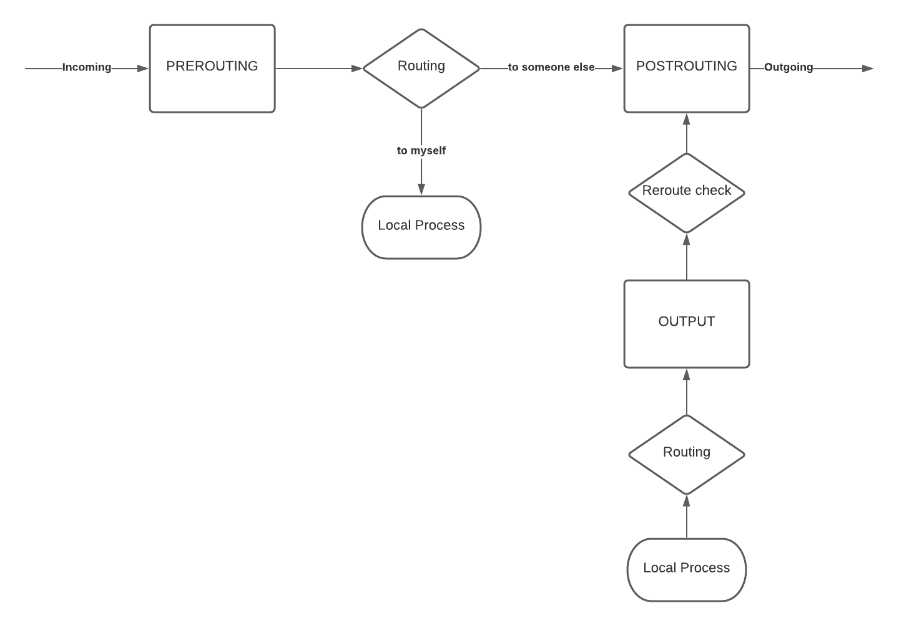
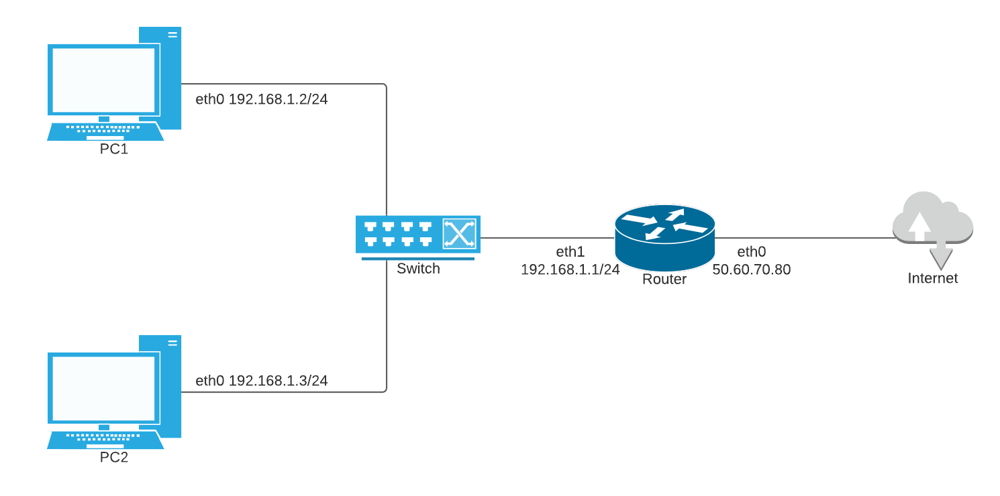
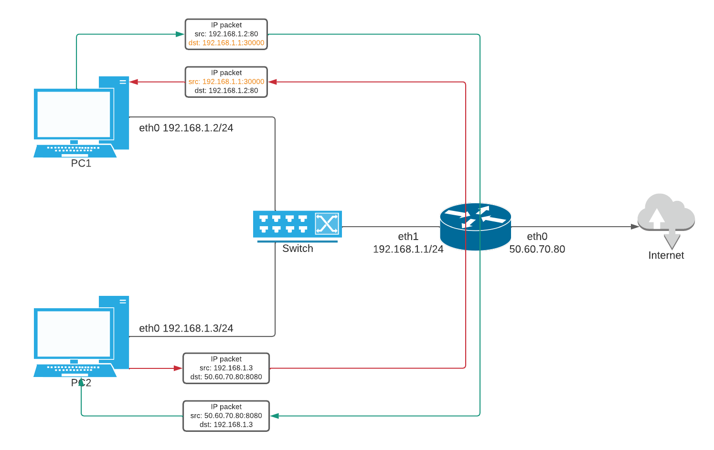
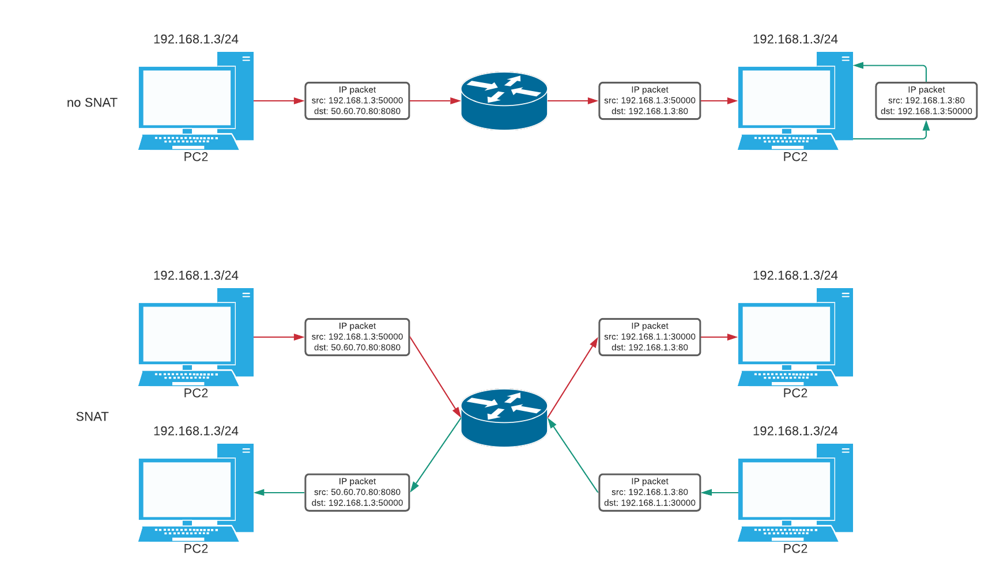

<!-- from: https://stackunderflow.dev/p/iptables-for-routing/ -->

# Iptables for Routing

Iptables provide five tables (filter, nat, mangle, security, raw), but the most commonly used are the _filter_ table and the _nat_ table. Tables are organized as _chains_, and there are five predefined chains, `PREROUTING`, `POSTROUTING`, `INPUT`, `FORWARD`, and `OUTPUT`.

Here we focus only on the _nat_ table. The _filter_ table is also essential, but it's mainly used for firewalls, so we do not discuss it here. The _nat_ tables are used for network address translation, and it's available in `PREROUTING`, `POSTROUTING`, and `OUTPUT` chains.

Below is the general diagram of the nat table in iptables.

<js-ext-figure class="js-illustration">


<js-ext-figcaption>iptables</js-ext-figcaption>

</js-ext-figure>

It helps to break the diagram down. An incoming packet goes through the `PREROUTING` chain, and then the kernel makes the routing decision based on the routing table. If the packet is destined for the machine itself, it's put into a local process listening on the machine. If it's destined for another machine (so this machine serves as a router), the kernel will put it through the `POSTROUTING` chain and then send it to an output interface.

A packet generated from a local process will be routed and then put into the `OUTPUT` chain. The _reroute check_ step is a little bit complicated, so we will explain it afterwards. The packet then goes to `POSTROUTING` and then goes to an output interface.

In this article, we will continue to use the home network setup below.

<js-ext-figure class="js-illustration">


<js-ext-figcaption>home network</js-ext-figcaption>

</js-ext-figure>

You might find it's hard to experiment with what I described in this article since your router might not have `iptables`. You need more advanced router firmware to use `iptables`, like OpenWrt or ASUS-Merlin. Don't worry, in the article [Network Namespaces and Docker](../../../container-k8s/container/network-namespaces-and-docker/), you will learn how to simulate this setup on your Linux machine.

## SNAT in iptables <a id="snat-in-iptables" ></a>

To access the Internet from the two computers in the local network, the following SNAT (S stands for _source_) rule has to be added to the router:

```console
# iptables-t nat -A POSTROUTING -o eth0 -s 192.168.1.0/24 -j SNAT --to-source 50.60.70.80
```

Here `-t` stands for _table_, `-A` stands for _append_, `-s` stands for _source_, `-o` stands for _output interface_ and `-j` stands for _jump_. This rule will replace the source address of any IP packets going to the Internet through interface eth0 whose source address is in our local subnet with `50.60.70.80`, the public IP address of the router. For any response packets, the reverse operation that sets the destination address to the private address of the connecting device (e.g., `192.168.1.2`) is automatically applied, so we do not need to worry about configuring it. The network address translation process works like the diagram below.

<js-ext-figure class="js-illustration">


<js-ext-figcaption>snat</js-ext-figcaption>

</js-ext-figure>

Note that SNAT rules have to be configured in the `POSTROUTING` chain. Sometimes this requirement is reasonable. For example, in our case, the matching condition includes the output interface (`eth0`), so it can only be used when the routing decision has been made. But sometimes we do not match against output interfaces, and it's still a requirement that SNAT can only be in the `POSTROUTING` chain.

However, our router may be allocated a dynamic address by DHCP instead of being configured a static one. In this case, we could use the `MASQUERADE` target, which is similar to SNAT except that we do not need to specify `--to-source` address. Instead, the IP address of the output interface (here, eth0) will be used automatically.

```console
# iptables-t nat -A POSTROUTING -s 192.168.1.0/24 -o eth0 -j MASQUERADE
```

`MASQUERADE` can only be used in the POSTROUTING chain because the source IP address of the packet will be obtained from the network interface it gets routed to, so it should be placed after the routing decision.

## Port forwarding <a id="port-forwarding" ></a>

Another use case of NAT is _port forwarding_. When we are running a service on one of our computers, say, PC1, and would like to access it from the Internet. Port forwarding is usually implemented using DNAT (D stands for _destination_) rules

### DNAT in iptables <a id="dnat-in-iptables" ></a>

Suppose the service is opened on port `80` and we want to access it on port `8080` of the router. We will add the following DNAT rule.

```console
# iptables-t nat -A PREROUTING -p tcp -m tcp --dport 8080 -j DNAT --to-destination 192.168.1.2:80
```

The option `-p tcp` (`p` stands for _protocol_) matches for TCP connections (so this rule doesn't apply to UDP), while `--dport 8080` (`--dport` stands for _destination port_) matches for TCP traffic destining port `8080`. This rule will replace the destination address of any IP packets going to port `8080` with `192.168.1.2`, the IP address of the service. The port is also replaced with 80, the port of the service. For any response packets, the reverse operation is also automatically applied, just like in SNAT. The process works like the diagram below.

<js-ext-figure class="js-illustration">


<js-ext-figcaption>dnat</js-ext-figcaption>

</js-ext-figure>

You might wonder why iptables, a layer 3 (network layer) tool, could modify port information, which is on layer 4 (transport layer). In fact, although iptables mainly work on layer 3, it has been extended to work on layer 4 as well, so working with ports is also possible for iptables. In our case, the option `-m tcp` (`m` stands for "match" an extension) loads an extension called `tcp` to work on ports, and the `--dport` option is provided by this extension. Actually, the option `-p tcp` implicitly loads the `tcp` extension so `-m tcp` is redundant.

[Here](https://manpages.ubuntu.com/manpages/xenial/man8/iptables-extensions.8.html) is the documentation for all standard extensions on Ubuntu. Also note that DNAT rules must be configured on the `PREROUTING` or `OUTPUT` chain because it's useless to modify the destination IP address after the routing decision has been made.

### Router access <a id="router-access" ></a>

If you try to access the service from the router itself using `127.0.0.1:8080`, you will find that it doesn't work. Note that our command puts the DNAT rule into the PREROUTING chain, but packets generated by local processes go to the `OUTPUT` chain instead of `PREROUTING`. As a result, we have to also configure DNAT on the `OUTPUT` chain for a local process to access the service.

```console
# iptables-t nat -A OUTPUT -p tcp --dport 8080 -j DNAT --to-destination 192.168.1.2:80
```

Note that `-m tcp` is removed in the command above. It's also valid since the `tcp` extension is loaded automatically by `-p tcp`. However, now we can access the service only by the IP address `192.168.1.1:8080`, and if we use `127.0.0.1:8080` or `50.60.70.80:8080` it still fails. Let me explain why.

#### How locally-generated packets are processed <a id="how-locally-generated-packets-are-processed" ></a>

A machine has more than one IP address. For example, the host PC1 has `127.0.0.1/8` for the loopback interface and `192.168.1.2/24` for interface `eth0`. The router has three IP addresses because it has two physical interfaces and a loopback interface. The local process generating packets must specify the destination address, but the source address is usually not specified. Here is the question: How do we determine the source IP address of a locally generated packet? Which IP address for which interface should we choose? The answer is: by looking at the route table.

For a packet generated by a local process, it goes to the routing step first. The kernel matches the destination address against the route table, selects an output interface, and takes the IP address of the chosen interface as its source address.

For example, when PC1 sends a packet to `127.0.0.1` (or other localhost addresses), the packet will be routed to the loopback interface and thus take the IP address 127.0.0.1. In contrast, if the packet is sent to the Internet, it will be routed by the routing rule `default via 192.168.1.1 dev eth0` to interface `eth0` and take the IP address `192.168.1.2`. After the routing process, the packet is then put into the `OUTPUT` chain. As a result, we have access to both the packet's source and destination address in the `OUTPUT` chain.

However, as is shown above, we might do NAT in the output chain, which might change the destination address. In this case, we need to re-select an output interface by doing another routing process, and this is what the "reroute check" step does.

<js-ext-figure class="js-illustration">


<js-ext-figcaption>reroute check</js-ext-figcaption>

</js-ext-figure>

For example, suppose we send a packet to `127.0.0.1:8080` from the router. The steps it will go through are:

1. Its destination address is `127.0.0.1`, so it's routed to the loopback interface, and its source IP address is set to `127.0.0.1`.
2. The DNAT rule in the `OUTPUT` chain gets applied, which modifies its destination IP address to `192.168.1.2`.
3. The packet is rerouted to the `eth1` interface by reroute-check, and then sent to PC1, but PC1 does not know where to reply: its source IP is `127.0.0.1`!

The caveat here is that reroute check does not touch the source address, which brings us the problem with local access.

On most routers, the output interface will drop the request packet without sending them out, since `127.0.0.1` is not a valid source address for interface `eth1`. The same goes for the case where we access `50.60.70.80:8080` from the router: The packet gets dropped before being sent out since `50.60.70.80` is invalid for `eth1`.

What if the packet is sent to `192.168.1.1:8080`? It will go through the following steps:

1. Its destination address is `192.168.1.1`, so it's routed to the `eth1` interface, and its source IP address is set to `192.168.1.1`.
2. The DNAT rule in the `OUTPUT` chain gets applied, which modifies its destination IP address to `192.168.1.2`.
3. The packet goes through reroute-check, but the output interface doesn't get modified. It is then sent to PC1, with a correct source IP address so PC1 knows where to reply

This explains why `192.168.1.1:8080` works: The source IP address happens to be correct!

#### MASQUERADE rule for router access <a id="masquerade-rule-for-router-access" ></a>

It turns out that we must add another SNAT rule to correct the source address of the packet.

```console
# iptables-t nat -A POSTROUTING -m addrtype --src-type LOCAL -o eth1 -j MASQUERADE
```

The option `src-type` is provided by extension `addrtype`, which matches against all IP addresses on the machine, including:

- all addresses in `127.0.0.0/8`
- `192.168.1.1` since it's the address on `eth1`
- `50.60.70.80` since it's the address on `eth0`

This SNAT rule applies after the reroute-check step since it's in the `POSTROUTING` chain. In this way, the packet sent to the local network will always have the source address `192.168.1.1`, so PC1 knows where to send the response.

#### Kernel option for routing localhost addresses <a id="kernel-option-for-routing-localhost-addresses" ></a>

However, the SNAT rule above alone is not sufficient. At this time, accessing the service via `50.60.70.80:8080` succeeds, but `127.0.0.1:8080` still fails. It turns out that the reroute check step will deny packets with a localhost source address, for security reasons. For packets to pass reroute-check, we need to turn on `route_localnet` for the interface `eth1` using the Linux kernel parameter `net.ipv4.conf.eth1.route_localnet` by doing

```console
# sysctl -w net.ipv4.conf.eth1.route_localnet=1
```

The command above only sets the parameter temporarily. To set kernel parameters permanently, see [Hosts as routers](https://stackunderflow.dev/p/network-namespaces-and-docker/#hosts-as-routers)

#### Summary <a id="summary" ></a>

In summary, for the router to access the exposed port locally, we need to

- add the port forwarding rule to the `OUTPUT` chain
- add a SNAT rule to correct the source address of packets going to the local network
- set the option `route_localnet` to enable access through `127.0.0.0/8` addresses

### Load balancing <a id="load-balancing" ></a>

What if the service is running on both PC1 and PC2? In this case, the router has to do load balancing by randomly distributing traffic to PC1 and PC2. We use an extension called `statistic` to implement it. Again, `statistic` is also a [standard extension](https://manpages.ubuntu.com/manpages/xenial/man8/iptables-extensions.8.html) on Ubuntu.

```console
# iptables-t nat -A PREROUTING -p tcp --dport 8080 -m statistic --mode random --probability 0.5 -j DNAT --to-destination 192.168.1.2:80
# iptables-t nat -A PREROUTING -p tcp --dport 8080 -j DNAT --to-destination 192.168.1.3:80
```

The first rule sends TCP traffic destining port `8080` to `192.168.1.2:80` with a 50% probability, while the second rule sends all (remaining) traffic to `192.168.1.3:80`. You might be wondering why the second rule is not configured to use `statistic`. In fact, iptables match rules linearly. 50% of the traffic matches the first rule and the second rule only matches the remaining 50%, so just sending all of them to PC2 is sufficient for it. Thus, the effective probability of sending traffic to PC2 is `(1 - 50%) * 100% = 50%`.

Note that the two commands above only configure load balancing for packets sending to the router from elsewhere. To also configure load balancing for local processes, we need to add them to the `OUTPUT` chain.

```console
# iptables-t nat -A OUTPUT -p tcp --dport 8080 -m statistic --mode random --probability 0.5 -j DNAT --to-destination 192.168.1.2:80
# iptables-t nat -A OUTPUT -p tcp --dport 8080 -j DNAT --to-destination 192.168.1.3:80
```

### Hairpin NAT <a id="hairpin-nat" ></a>

Let's go back to the scenario that the service is running only on PC1. What happens when, say, PC2 accesses `50.60.70.80:8080` and gets redirected to PC1? The process is illustrated in the diagram below. Red lines stand for request packets, and green lines stand for response packets. Here in the example, we are accessing `50.60.70.80:8080`, but we can also access `192.168.1.1:8080`. The results are similar.

<js-ext-figure class="js-illustration">


<js-ext-figcaption>hairpin not working</js-ext-figcaption>

</js-ext-figure>

First, note that the packet received by the router arrives at the `eth1` interface in this scenario, while public network packets arrive at the `eth0` interface. That is why we do not specify any input interface in [DNAT in iptables](#dnat-in-iptables). It provides a chance for all machines, including local machines and machines on the public network, to access the service via its `8080` port.

The destination address of the request packet gets translated to `192.168.1.2:80`, which is the IP address and port for the service running on PC1. Thus, the request packet arrives at PC1 successfully. However, the response packet will not go to the router since the source address of the request packet is `192.168.1.3`, and it's in the local network. As a result, the response packet arrives at PC2 through the switch without going to the router.

What is the problem here? From the perspective of PC2, it sends a packet to `50.60.70.80:8080` but receives a packet from `192.168.1.2:80`. In this case, it will not think of the received packet as the response for the request packet, so the upper layer (the transport layer) will not put them into the same connection. For example, if the request packet is a TCP handshake SYN and the response is a TCP handshake SYN/ACK, the handshake will not succeed.

The reverse rule of DNAT which sets the source address to `50.60.70.80:80` applies automatically for response IP packets going through the router, but here the response packets never go to the router. So what is the solution for this issue? It turns out we must add a `MASQUERADE` rule.

```console
# iptables-t nat -A POSTROUTING -s 192.168.1.0/24 -o eth1 -p tcp --dport 80 -j MASQUERADE
```

Note that we use the port number `80` here because the port number has already been translated from `8080` to `80` by the DNAT rule in `PREROUTING` chain.

The whole process after `MASQUERADE` is added looks like the diagram below.

<js-ext-figure class="js-illustration">


<js-ext-figcaption>hairpin working</js-ext-figcaption>

</js-ext-figure>

When the request packet goes through the router, its destination address is translated to `192.168.1.2:80` by the DNAT rule. In addition to this, its source address is translated to `192.168.1.1`, the address of the gateway, by the `MASQUERADE` rule. Because of the translation of the source address, the response packet will be sent to the router, which gives the reverse rule of DNAT a chance to apply, so the source address of the response packet is translated to `50.60.70.80:8080`. PC2 now sees the source address of the response packet to match the destination address of the request packet so that the upper layer can put them into one connection.

The situation that a machine in the internal network access a service exposed through DNAT is called _hairpin NAT_, since the packet is forwarded back, just like a hairpin.

<js-ext-figure class="js-illustration">


<js-ext-figcaption>hairpin</js-ext-figcaption>

</js-ext-figure>

The case where a machine access itself through hairpin NAT is similar, but a little bit harder to reason. I include a diagram below. You might be wondering why a machine may access itself through hairpin NAT. One situation is when a group of machines is providing a service that is load-balanced by the router. If one of the machines access the service and the router routes the request back to the machine itself, a hairpin NAT looping back to the same machine will happen.

<js-ext-figure class="js-illustration">


<js-ext-figcaption>hairpin same machine</js-ext-figcaption>

</js-ext-figure>

## Recommended resources <a id="recommended-resources" ></a>

The video series below explains iptables and other networking-related topics in great detail.

- [金枪鱼之夜：坏人的 iptables 小讲堂](https://youtu.be/w_vGD-96O54)
- [金枪鱼之夜：坏人的 iptables 小讲堂第二弹](https://youtu.be/Vnh8hYk6wZE)
