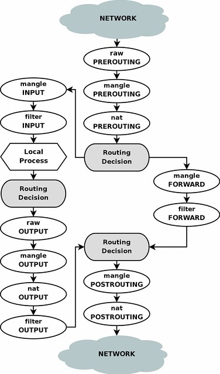

<!-- from: https://terrywang.net/2016/02/02/new-iptables-gotchas.html -->

# New iptables Gotchas - SNAT VS MASQUERADE

## Story

As a heavy user of `iptables` NAT rules, (advanced home networking, various VPNs on EC2 and other IaaS providers), I feel it's time for me to better understand how NAT works under the hood with the help of `iptables`.

That's why I started reading [`iptables` tutorial](https://www.frozentux.net/iptables-tutorial/iptables-tutorial.html) for the second time.

<js-ext-div class="" data-type="note">

NOTE: I personally think it is the best `iptables` tutorial freely available (even better than some published books). Look at no others ;-D

The first time I read [`iptables` tutorial](https://www.frozentux.net/iptables-tutorial/iptables-tutorial.html) back in 2012, I was frustrated because my networking knowledge and skills were not up to the level the tutorial requires. So I ended up cherry-picking the useful parts only ;-(

</js-ext-div>

Now it's totally different, many thanks to **XenServer** and **continuously learning**.

I'd like to share some gotchas after reading [`iptables` tutorial](https://www.frozentux.net/iptables-tutorial/iptables-tutorial.html) for the 2nd time ;-D

## Gotchas

### SNAT Target VS MASQUERADE Target <a id="snat-target-vs-masquerade-target" ></a>

Both targets do source NAT (or SNAT) in the `POSTROUTING` chain in the `nat` table.

**Differences**

- `MASQUERADE` does NOT require `--to-source` as it was made to work with dynamically assigned IP addresses.

- `SNAT` works with static IP addresses.

- `MASQUERADE` has extra overhead and is slower than `SNAT` because each time the `MASQUERADE` target gets hit by a packet, it has to check for the IP address to use.

**IMPORTANT**: It is still possible to use `MASQUERADE` target with static IP. Be aware that it will add extra overhead (to compute).

For example, network `192.168.100.0/24` is used for IPsec (strongSwan) clients, so-called right subnet which is the private subnet behind the left participant (IPsec Server). VPN Clients will be assigned IP addresses within the `rightsubnet` as defined in its connection.

For IPsec VPN clients to be able to access the Internet, NAT MUST be done by using `iptables`. Outgoing packets need to have their source IP address rewritten to the router (gateway) IP address in their IP header.

Match packets from the `192.168.100.0/24` network and are leaving from `eth0` (interface name can vary based on different hypervisors or Linux distributions - systemd VS sysv init).

```bash
# stick to SNAT for static IP
iptables -t nat -A POSTROUTING -s 192.168.100.0/24 -o eth0 -j SNAT --to-source ELASTIC_IP

# don't be lazy, simple but slower due to more overhead
iptables -t nat -A POSTROUTING -s 192.168.100.0/24 -o eth0 -j MASQUERADE
```

<js-ext-div class="" data-type="note">

Don't have to do DNAT for incoming packets within the `PREROUTING` chain in the `nat` table if we turn on ip forwarding in the kernel by `echo 1 | sudo tee /proc/sys/net/ipv4/ip_forward` so as to forward packets between interfaces, cool!

BTW: DO NOT use `sudo echo 1 >` to make changes to `procfs`, it won't work, why? RTFM ;-D

</js-ext-div>

### Security Group Implementation in CloudStack / CloudPlatform <a id="security-group-implementation-in-cloudstack-cloudplatform" ></a>

Recently I've been looking into CloudStack / CloudPlatform Networking, especially the Virtual Private Cloud (VPC) implementation compared with AWS VPC.

The Hypervisor Configuration Guide it explicitly requires Linux Bridge as network backend plus the following kernel parameters:

```bash
# switch from ovs to bridge
xe-switch-network-backend bridge

# persistent the values properly :-`)
# control whether or not packets traversing the bridge are sent to iptables for processing
echo 1 > /proc/sys/net/bridge/bridge-nf-call-iptables
echo 1 > /proc/sys/net/bridge/bridge-nf-call-arptables
```

Above indicates that basic zone networking uses Linux Bridge, the Security Group implementation is based on Linux Bridge and `iptables`.

NOTE: I reckon AWS EC2 / VPC Security Group is the same.

### Owner match <a id="owner-match" ></a>

Use to match packets based on the identity of the process that created them.

The owner can be specified as the process ID either of the user who issued the command in question, that of the group, the process, the session, or that of the command itself.

<js-ext-div class="" data-type="note">

NOTE: The owner match only works within the OUTPUT chain, for obvious reasons: It is pretty much impossible to find out any information about the identity of the instance that sent a packet from the other end, or where there is an intermediate hop to the real destination.

Even within the OUTPUT chain it is not very reliable, since certain packets may not have an owner. Notorious packets of that sort are (among other things) the different ICMP responses. ICMP responses will never match.

</js-ext-div>

match options:

- `--cmd-owner`

- `--uid-owner`

- `--gid-owner`

- `--pid-owner`

- `--sid-owner`

Examples:

```bash
iptables -A OUTPUT -m owner --cmd-owner nginx
iptables -A OUTPUT -m owner --uid-owner 500
```

## Last but not least

I started learning `iptables` systematically in 2012, soon addicted to it and kept sucking everything that I didn't know or understand. Countless hours spent…

Plus over 2 years field experience with XenServer (Cloud Infrastructure), I can claim that my Linux networking skill has leaped to a new level ;-D

The leap all started from in-depth learning of `iptables`, it's worth it ;-D

Below is the Traversing of tables and chains diagram, just to pay tribute to the author of [`iptables` tutorial](../iptables-tutorial) - Oskar Andreasson ;-D

**NOTE: Oskar wrote the excellent in-depth tutorial 10 years ago, imagine how good he (his networking) is now ;-D**

<js-ext-figure class="js-illustration">


<js-ext-figcaption>iptables - Traversing of tables and chains</js-ext-figcaption>

</js-ext-figure>

References

- [iptables tutorial](../iptables-tutorial)
- [NAT Tutorial](http://www.karlrupp.net/en/computer/nat_tutorial)
